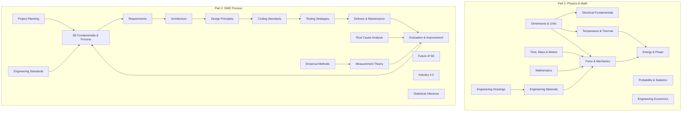

# Engineering Foundation — Overview

> **Sources:**
> - *Engineering Fundamentals: An Introduction to Engineering* by Saeed Moaveni, 4th Edition (2011) — Physics & math foundations
> - *Software Engineering: Theory and Practice* by Pfleeger & Atlee, 4th Edition — SE process & engineering foundations

## What Is This?

This vault combines two complementary foundations:
1. **Part 1: Engineering Fundamentals** — the physical sciences and math every engineer needs
2. **Part 2: SWE Process** — the software engineering process, design, testing, and improvement methods that fill SWEBOK's Engineering Foundations KA

Together they cover both the *physics* and the *process* of engineering.

---

## Part 1: Engineering Fundamentals (Physics & Math)

📁 `01 Physics and Math/`

| File | Topics | Source |
|---|---|---|
| [[01 Physics and Math/01_Dimensions_and_Measurement\|01_Dimensions_and_Measurement]] | Fundamental dimensions, SI/USCS, unit conversion, length, area, volume | Moaveni Ch 6–7 |
| [[01 Physics and Math/02_Time_Mass_and_Motion\|02_Time_Mass_and_Motion]] | Time, frequency, angular motion, density, mass flow, momentum | Moaveni Ch 8–9 |
| [[01 Physics and Math/03_Force_and_Mechanics\|03_Force_and_Mechanics]] | Force, Newton's laws, torque, work, pressure, stress, elastic modulus | Moaveni Ch 10 |
| [[01 Physics and Math/04_Temperature_and_Thermal\|04_Temperature_and_Thermal]] | Temperature scales, heat transfer, thermal comfort, material properties | Moaveni Ch 11 |
| [[01 Physics and Math/05_Electrical_Fundamentals\|05_Electrical_Fundamentals]] | Current, voltage, DC/AC, circuits, motors, lighting | Moaveni Ch 12 |
| [[01 Physics and Math/06_Energy_and_Power\|06_Energy_and_Power]] | Work, energy conservation, power, efficiency, energy sources | Moaveni Ch 13 |
| [[01 Physics and Math/07_Engineering_Drawings_and_CAD\|07_Engineering_Drawings_and_CAD]] | Orthographic views, dimensioning, isometric, solid modeling, symbols | Moaveni Ch 16 |
| [[01 Physics and Math/08_Engineering_Materials\|08_Engineering_Materials]] | Material selection, mechanical/thermal/electrical properties, common materials | Moaveni Ch 17 |
| [[01 Physics and Math/09_Math_Stats_and_Economics\|09_Math_Stats_and_Economics]] | Math models, matrix algebra, calculus, probability, statistics, engineering economics | Moaveni Ch 18–20 |

---

## Part 2: SWE Process (Engineering Foundations)

📁 `02 SWE Process/`

| File | Topics | Source |
|---|---|---|
| [[02 SWE Process/10_SE_Fundamentals_and_Process\|10_SE_Fundamentals_and_Process]] | Why SE, software quality, systems/engineering approach, process models, life cycle | Pfleeger Ch 1–2 |
| [[02 SWE Process/11_Project_Planning_and_Management\|11_Project_Planning_and_Management]] | Tracking progress, personnel, effort estimation, risk management, project plan | Pfleeger Ch 3 |
| [[02 SWE Process/12_Requirements_Engineering\|12_Requirements_Engineering]] | Requirements process, elicitation, types, modeling notations, prototyping, validation | Pfleeger Ch 4 |
| [[02 SWE Process/13_Software_Architecture\|13_Software_Architecture]] | Architecture design, styles, quality attributes, evaluation, documentation, product lines | Pfleeger Ch 5 |
| [[02 SWE Process/14_Design_Principles_and_Patterns\|14_Design_Principles_and_Patterns]] | Design methodology, OO design, UML, design patterns, OO measurement | Pfleeger Ch 6 |
| [[02 SWE Process/15_Coding_Standards_and_Practices\|15_Coding_Standards_and_Practices]] | Programming standards, guidelines, documentation, programming process | Pfleeger Ch 7 |
| [[02 SWE Process/16_Testing_Strategies\|16_Testing_Strategies]] | Unit testing, integration testing, system testing, performance, reliability, safety-critical | Pfleeger Ch 8–9 |
| [[02 SWE Process/17_Delivery_and_Maintenance\|17_Delivery_and_Maintenance]] | Training, documentation, delivery, maintenance types, measurement, rejuvenation | Pfleeger Ch 10–11 |
| [[02 SWE Process/18_Evaluation_and_Improvement\|18_Evaluation_and_Improvement]] | Evaluation techniques, metrics, process improvement, prediction models | Pfleeger Ch 12–13 |
| [[02 SWE Process/19_Future_of_Software_Engineering\|19_Future_of_Software_Engineering]] | Technology transfer, professionalization, licensing, ethics | Pfleeger Ch 14 |
| [[02 SWE Process/20_Root_Cause_Analysis\|20_Root_Cause_Analysis]] | 5-whys, Ishikawa, FTA, FMEA, cause maps, Pareto | Web/SWEBOK |
| [[02 SWE Process/21_Measurement_Theory\|21_Measurement_Theory]] | Operational definitions, measurement scales, GQM paradigm | Web/SWEBOK |
| [[02 SWE Process/22_Empirical_Methods\|22_Empirical_Methods]] | Designed experiments, observational studies, retrospective studies | Web/SWEBOK |
| [[02 SWE Process/23_Industry_4_and_Continuous_SE\|23_Industry_4_and_Continuous_SE]] | IoT, AI/ML, Big Data, CSE, continuous practices | Web/SWEBOK |
| [[02 SWE Process/24_Statistical_Inference\|24_Statistical_Inference]] | Hypothesis testing, confidence intervals, correlation, regression | Web/SWEBOK |
| [[02 SWE Process/25_Engineering_Standards_and_Process\|25_Engineering_Standards_and_Process]] | ISO/IEC/IEEE organizations, 5-step engineering framework | Web/SWEBOK |

---

## How These Topics Relate

## Reading Paths

| Your Goal | Start Here |
|---|---|
| **Physical fundamentals** | [[01 Physics and Math/01_Dimensions_and_Measurement]] → [[01 Physics and Math/03_Force_and_Mechanics]] → [[01 Physics and Math/06_Energy_and_Power]] |
| **SE process overview** | [[02 SWE Process/10_SE_Fundamentals_and_Process]] → [[02 SWE Process/12_Requirements_Engineering]] → [[02 SWE Process/13_Software_Architecture]] |
| **Design & patterns** | [[02 SWE Process/14_Design_Principles_and_Patterns]] → [[02 SWE Process/13_Software_Architecture]] |
| **Testing** | [[02 SWE Process/16_Testing_Strategies]] |
| **Process improvement** | [[02 SWE Process/18_Evaluation_and_Improvement]] → [[02 SWE Process/17_Delivery_and_Maintenance]] |
| **Quality & measurement** | [[02 SWE Process/21_Measurement_Theory]] → [[02 SWE Process/20_Root_Cause_Analysis]] |
| **Math & analysis** | [[01 Physics and Math/09_Math_Stats_and_Economics]] |
| **SWEBOK Engineering Foundations** | [[02 SWE Process/10_SE_Fundamentals_and_Process]] through [[02 SWE Process/25_Engineering_Standards_and_Process]] |

## Related

- [[../../body-of-knowledge/SWEBOK/18_Engineering_Foundations|SWEBOK Engineering Foundations]] — The KA these notes fill
- [[../../software-engineering-note/Software Design/Software Design - Overview|Software Design]] — Design process and patterns
- [[../../math-for-software-engineering-note/|Math for Software Engineering]] — Mathematical foundations
