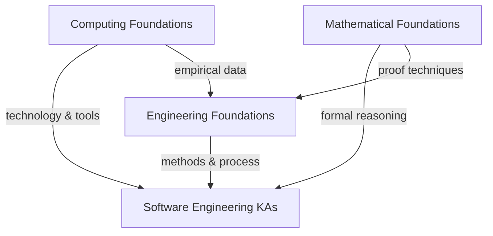

---
tags:
  - engineering
  - foundations
  - swebok
  - overview
  - engineering-methods
---

# Engineering Foundations — Overview

> **Source:** [[SWEBOK v4 - Overview|SWEBOK v4]] Chapter 18 — Engineering Foundations
> **Purpose:** The engineering mindset — iterative problem-solving, abstraction, empirical methods, measurement theory, standards, and root cause analysis.

## What Is This?

Engineering Foundations covers the engineering thinking and methods that distinguish software *engineering* from mere programming. Engineering is about disciplined problem-solving under constraints — making trade-offs, measuring outcomes, iterating toward solutions, and applying scientific methods to build reliable systems. These foundations apply across all engineering disciplines; software engineering inherits and adapts them.

## The 8 Topic Areas

### 1. [[01_Engineering_Problem_Solving]]

- The engineering problem-solving process: define → analyze → synthesize → evaluate → iterate
- Decomposition and modularization of complex problems
- Trade-off analysis (cost vs. quality vs. time vs. risk)
- Decision-making under uncertainty
- **Book:** *Engineering Fundamentals: An Introduction to Engineering, 6th Ed.* (2021) — Saeed Moaveni

### 2. [[02_Abstraction_and_Encapsulation]]

- Abstraction as the core engineering mechanism for managing complexity
- Levels of abstraction (requirements → architecture → design → code)
- Encapsulation and information hiding
- Modular design principles
- **Book:** *Software Engineering: Theory and Practice, 4th Ed.* (2010) — Shari Pfleeger & Joanne Atlee

### 3. [[03_Iterative_and_Incremental_Development]]

- Why iteration is fundamental to engineering (not just Agile)
- Prototyping and evolutionary development
- Spiral models and risk-driven iteration
- Feedback loops and course correction
- **Book:** *The Engineering Design of Systems: Models and Methods, 3rd Ed.* (2016) — Dennis Buede & William Miller

### 4. [[04_Empirical_and_Statistical_Methods]]

- Hypothesis formulation and testing
- Experimental design (controlled experiments, A/B testing)
- Statistical inference: confidence intervals, significance, correlation vs. causation
- Data collection, cleaning, and analysis
- **Book:** *An Introduction to Statistical Methods and Data Analysis, 7th Ed.* (2018) — Ott & Longnecker

### 5. [[05_Measurement_Theory]]

- What makes a good measure (validity, reliability, sensitivity)
- Direct vs. indirect measurement
- Measurement scales (nominal, ordinal, interval, ratio)
- GQM (Goal-Question-Metric) approach
- Software metrics: LOC, function points, cyclomatic complexity, DORA metrics
- **Book:** *Software Engineering: Theory and Practice* — Pfleeger & Atlee
- **Book:** *Software Metrics: A Rigorous and Practical Approach, 3rd Ed.* (2014) — Fenton & Bieman

### 6. [[06_Standards_and_Standards_Bodies]]

- Why standards matter in engineering
- Key standards organizations: ISO, IEEE, IEC, W3C, IETF
- Software engineering standards: ISO/IEC/IEEE 12207 (processes), ISO/IEC 25010 (quality), ISO/IEC 27001 (security)
- Standards vs. guidelines vs. best practices
- **Book:** *The Engineering Design of Systems* — Buede & Miller

### 7. [[07_Root_Cause_Analysis]]

- 5 Whys technique
- Fishbone (Ishikawa) diagrams
- Fault tree analysis (FTA)
- Failure mode and effects analysis (FMEA)
- Post-mortems and blameless retrospectives
- **Book:** *Engineering Fundamentals* — Moaveni

### 8. [[08_Design_Thinking_and_Creativity]]

- The design thinking process: empathize → define → ideate → prototype → test
- Divergent vs. convergent thinking
- Lateral thinking and brainstorming techniques
- Constraints as creative catalysts
- **Book:** *The Engineering Design of Systems* — Buede & Miller

---

## Recommended Books (Priority Order)

| # | Book | Author(s) | Pages | Priority |
|---|------|-----------|:-----:|:--------:|
| 1 | Engineering Fundamentals: An Introduction to Engineering, 6th Ed. (2021) | Saeed Moaveni | 576 | 🔴 Core |
| 2 | Software Engineering: Theory and Practice, 4th Ed. (2010) | Shari Pfleeger & Joanne Atlee | 560 | 🔴 Core |
| 3 | The Engineering Design of Systems: Models and Methods, 3rd Ed. (2016) | Dennis Buede & William Miller | 560 | 🟡 Supplementary |
| 4 | An Introduction to Statistical Methods and Data Analysis, 7th Ed. (2018) | Ott & Longnecker | 1248 | 🟢 Deep Dive |

---

## Relationship to Other Foundations

- **Mathematical Foundations** provides the formal reasoning (logic, proofs, discrete structures)
- **Computing Foundations** provides the technology base (architecture, algorithms, systems)
- **Engineering Foundations** provides the *methodology* — how to apply science to build things

---

## Related

- [[SWEBOK v4 - Overview]]
- [[Computing Foundation Overview]]
- [[Math For SE Note Overview]]
