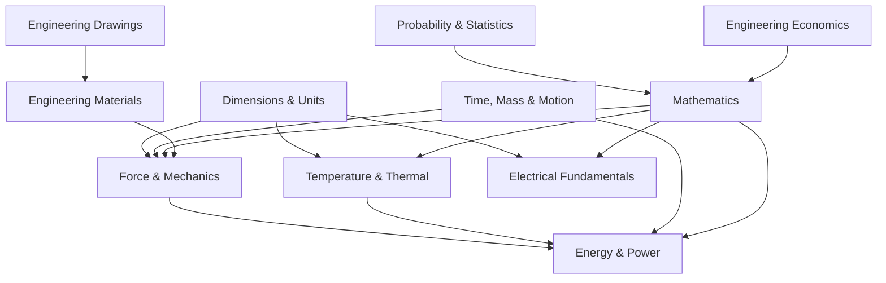

# Engineering Foundation — Overview

> **Source:** *Engineering Fundamentals: An Introduction to Engineering* by Saeed Moaveni, 4th Edition (Cengage Learning, 2011)
> Selected chapters covering substantive engineering concepts — skips introductory profession chapters and tool-specific chapters (Excel/MATLAB).

## What Is This?

This vault distills the **engineering fundamentals** that every engineer should know — the physical laws, measurement systems, material properties, and mathematical tools that underpin all engineering disciplines. Where the software engineering notes cover the *process*, this covers the *physics and math*.

## Files

| File | Topics | Chapters |
|---|---|---|
| [[01_Dimensions_and_Measurement]] | Fundamental dimensions, SI/USCS, unit conversion, length, area, volume | Ch 6–7 |
| [[02_Time_Mass_and_Motion]] | Time, frequency, angular motion, density, mass flow, momentum | Ch 8–9 |
| [[03_Force_and_Mechanics]] | Force, Newton's laws, torque, work, pressure, stress, elastic modulus | Ch 10 |
| [[04_Temperature_and_Thermal]] | Temperature scales, heat transfer, thermal comfort, material properties | Ch 11 |
| [[05_Electrical_Fundamentals]] | Current, voltage, DC/AC, circuits, motors, lighting | Ch 12 |
| [[06_Energy_and_Power]] | Work, energy conservation, power, efficiency, energy sources | Ch 13 |
| [[07_Engineering_Drawings_and_CAD]] | Orthographic views, dimensioning, isometric, solid modeling, symbols | Ch 16 |
| [[08_Engineering_Materials]] | Material selection, mechanical/thermal/electrical properties, common materials | Ch 17 |
| [[09_Math_Stats_and_Economics]] | Math models, matrix algebra, calculus, probability, statistics, engineering economics | Ch 18–20 |

## How These Topics Relate

## Reading Paths

| Your Goal | Start Here |
|---|---|
| **Understand physical fundamentals** | [[01_Dimensions_and_Measurement]] → [[03_Force_and_Mechanics]] → [[06_Energy_and_Power]] |
| **Material selection** | [[08_Engineering_Materials]] → [[03_Force_and_Mechanics]] → [[04_Temperature_and_Thermal]] |
| **Math & analysis tools** | [[09_Math_Stats_and_Economics]] |
| **Engineering drawings** | [[07_Engineering_Drawings_and_CAD]] |
| **Electrical basics** | [[05_Electrical_Fundamentals]] → [[06_Energy_and_Power]] |

## Related

- [[../software-engineering-note/Software Design/Software Design - Overview|Software Design]] — Design process and patterns
- [[../math-for-software-engineering-note/|Math for Software Engineering]] — Mathematical foundations
