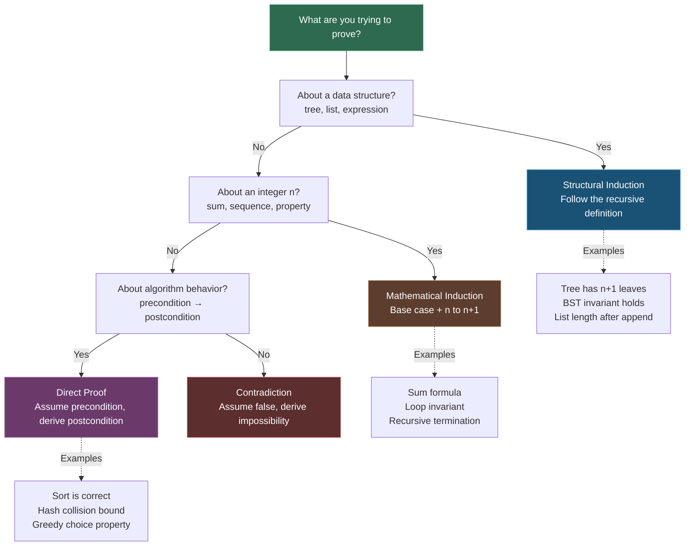

---
tags:
- discrete-math
- math
- proofs
- software-engineering
---

# Topic 2: Proof Techniques

A proof is a logical argument that establishes the truth of a mathematical statement. Proofs are built from **axioms** (statements assumed true), and produce **theorems** (proven true), **lemmas** (helper theorems), **corollaries** (immediate consequences), and **conjectures** (unproven claims).

In software engineering, proofs validate algorithm correctness, verify loop invariants, and ensure recursive functions terminate.

---

## 1. Direct Proof

The most straightforward technique: assume the hypothesis $P$ is true, then use logical deduction to show the conclusion $Q$ must also be true.

**Structure:** $P \rightarrow Q$ — "If $P$, then $Q$"

**Example:** Prove that the sum of two even integers is even.

> Let $a = 2m$ and $b = 2n$ where $m, n \in \mathbb{Z}$ (definition of even).
> Then $a + b = 2m + 2n = 2(m + n)$.
> Since $m + n$ is an integer, $a + b$ is even. ∎

**In code:** Every `if` statement is a direct proof: "if the condition holds, this branch executes."

---

## 2. Proof by Contradiction

Assume the statement is **false**, then derive a logical contradiction. Since contradictions are impossible, the original statement must be true.

**Structure:** Assume $\neg P$, deduce a contradiction (like $1 = 0$), therefore $P$ is true.

**Example:** Prove that $\sqrt{2}$ is irrational.

> Assume $\sqrt{2} = \frac{a}{b}$ where $a, b$ are coprime integers.
> Then $2 = \frac{a^2}{b^2} \implies a^2 = 2b^2$, so $a^2$ is even $\implies a$ is even.
> Let $a = 2k$. Then $(2k)^2 = 2b^2 \implies 4k^2 = 2b^2 \implies b^2 = 2k^2$, so $b$ is also even.
> But $a$ and $b$ are both even — contradiction (they were assumed coprime).
> Therefore $\sqrt{2}$ is irrational. ∎

### Proof by Contrapositive

A special case: instead of proving $P \rightarrow Q$, prove $\neg Q \rightarrow \neg P$ (its logically equivalent contrapositive).

**Example:** "If $n^2$ is even, then $n$ is even." Prove the contrapositive: "If $n$ is odd, then $n^2$ is odd." Let $n = 2k+1$, then $n^2 = 4k^2 + 4k + 1 = 2(2k^2 + 2k) + 1$, which is odd. ∎

**In code:** Reductio ad absurdum — "if this code path is reachable, it would imply an impossible state, therefore it's unreachable." Used in dead-code elimination and invariant reasoning.

---

## 3. Proof by Induction

Prove a statement $P(n)$ for all natural numbers $n$ in two steps:

1. **Base case:** Prove $P(0)$ or $P(1)$ is true
2. **Inductive step:** Assume $P(k)$ is true (induction hypothesis), then prove $P(k+1)$ is true

**Example:** Prove that $1 + 2 + \dots + n = \frac{n(n+1)}{2}$

> **Base case ($n=1$):** $1 = \frac{1 \cdot 2}{2} = 1$ ✓
>
> **Inductive step:** Assume $1 + 2 + \dots + k = \frac{k(k+1)}{2}$
> Then $1 + 2 + \dots + k + (k+1) = \frac{k(k+1)}{2} + (k+1) = \frac{k(k+1) + 2(k+1)}{2} = \frac{(k+1)(k+2)}{2}$ ∎

### Variants

- **Strong induction:** Assume $P(0), P(1), \dots, P(k)$ all true, then prove $P(k+1)$
- **Structural induction:** Used on recursively defined structures (trees, lists, expressions)

**In code:** The pattern directly mirrors recursive function design. The base case = stopping condition; the inductive step = recursive call on a smaller instance.

```python
def sum_to_n(n):
    if n == 1:        # Base case
        return 1
    return n + sum_to_n(n-1)  # Inductive step
```

---

## 4. Proof by Example (Existential)

To prove "there exists an $x$ such that $P(x)$" ($\exists x \; P(x)$), you only need **one** example.

**Example:** Prove there exists an even prime number.

> $2$ is prime and $2$ is even. ∎

⚠️ **Critical distinction:** Proof by example does NOT work for universal statements ($\forall x$). Showing "some swans are white" does not prove "all swans are white." This is one of the most common logical fallacies in software testing — passing N test cases does not prove correctness for all inputs.

---

## 5. Structural Induction on Data Structures

**Structural induction** proves properties about recursively defined structures (trees, lists, expressions) — the induction step follows the structure's recursive definition rather than a numeric variable.

**Structure:**
1. **Base case:** Prove the property holds for the simplest structure (empty tree, empty list)
2. **Inductive step:** Assume the property holds for all sub-structures, then prove it holds for the combined structure

### Example: Prove that a binary tree with $n$ internal nodes has exactly $n + 1$ leaf nodes

> **Base case:** A tree with 0 internal nodes has exactly 1 leaf node (the root itself). ✓
>
> **Inductive step:** Assume any binary tree with $k < n$ internal nodes has $k + 1$ leaves.
> A tree with $n$ internal nodes has a root with two subtrees of $a$ and $b$ internal nodes where $a + b = n - 1$.
> By the induction hypothesis:
> - Left subtree has $a + 1$ leaves
> - Right subtree has $b + 1$ leaves
>
> Total leaves = $(a + 1) + (b + 1) = a + b + 2 = (n - 1) + 2 = n + 1$ ✓

### In Code: Structural Induction Mirrors Recursive Algorithms

```python
def count_leaves(tree):
    """Structural induction in action — base case + recursive case."""
    if tree is None or tree.is_leaf():  # Base case
        return 1
    # Inductive step: combine results from sub-structures
    return count_leaves(tree.left) + count_leaves(tree.right)
```

Every recursive function you write has an implicit structural induction proof for its correctness. The base case handles the trivial input; the recursive case reduces to smaller sub-problems that the induction hypothesis covers.

### Proof Technique Selection for Code



---

## Why Proofs Matter in Software Engineering

| Proof Technique | SE Application |
|----------------|----------------|
| Direct proof | Branch reasoning, precondition → postcondition |
| Contradiction | Unreachable code detection, safety properties |
| Contrapositive | Refactoring conditions (e.g., early returns) |
| Induction | Recursive algorithm correctness, loop invariants |
| Existential | Test case existence (at least one input triggers a path) |

---

## Sources

- [1*] K. Rosen, *Discrete Mathematics and Its Applications*, 8th ed., McGraw-Hill, 2018.
- SWEBOK v4.0 — Chapter 17: Mathematical Foundations
