---
tags:
- discrete-math
- math
- set-theory
- software-engineering
---

# Topic 3: Sets, Relations, and Functions

The fundamental building blocks of discrete mathematics. Sets group objects; relations describe connections between them; functions map inputs to outputs deterministically. Together they underpin type systems, database theory, and all of data modeling.

---

## 1. Sets

A **set** is an unordered collection of distinct objects (elements). Denoted with curly braces: $A = \{1, 2, 3\}$.

### Key Concepts

| Concept | Notation | Meaning |
|---------|----------|---------|
| Element of | $x \in A$ | $x$ is in set $A$ |
| Not element of | $x \notin A$ | $x$ is not in $A$ |
| Subset | $A \subseteq B$ | Every element of $A$ is in $B$ |
| Proper subset | $A \subset B$ | $A \subseteq B$ and $A \neq B$ |
| Empty set | $\emptyset$ or $\{\}$ | Set with no elements |
| Cardinality | $|A|$ | Number of elements in $A$ |
| Power set | $\mathcal{P}(A)$ | Set of all subsets of $A$ |
| Universal set | $U$ | All elements under consideration |

### Set Builder Notation

$A = \{x \mid P(x)\}$ — "the set of all $x$ such that $P(x)$ is true."

Example: $E = \{x \in \mathbb{Z} \mid x \text{ is even}\} = \{\dots, -2, 0, 2, 4, \dots\}$

### Set Operations

| Operation | Notation | Definition |
|-----------|----------|------------|
| Union | $A \cup B$ | $\{x \mid x \in A \text{ or } x \in B\}$ |
| Intersection | $A \cap B$ | $\{x \mid x \in A \text{ and } x \in B\}$ |
| Difference | $A - B$ | $\{x \mid x \in A \text{ and } x \notin B\}$ |
| Complement | $\overline{A}$ | $\{x \in U \mid x \notin A\}$ |
| Cartesian product | $A \times B$ | $\{(a, b) \mid a \in A, b \in B\}$ |

### Set Properties

- **Commutative:** $A \cup B = B \cup A$, $A \cap B = B \cap A$
- **Associative:** $(A \cup B) \cup C = A \cup (B \cup C)$
- **Distributive:** $A \cap (B \cup C) = (A \cap B) \cup (A \cap C)$
- **De Morgan's Laws:** $\overline{A \cup B} = \overline{A} \cap \overline{B}$, $\overline{A \cap B} = \overline{A} \cup \overline{B}$

### Venn Diagrams

Visual representations of sets as overlapping circles. Useful for understanding relationships between 2–4 sets.

**In code:** Sets map to `Set`/`HashSet` collections. Set operations become `union()`, `intersection()`, `difference()`. SQL's `JOIN` is a Cartesian product with a filter.

---

## 2. Relations

A **relation** $R$ from set $A$ to set $B$ is a subset of $A \times B$ — a collection of ordered pairs $(a, b)$ where $a \in A$ and $b \in B$. If $(a, b) \in R$, we write $a R b$.

### Properties of Relations (on a set $A$)

| Property | Definition | Example |
|----------|------------|---------|
| Reflexive | $\forall a \in A: a R a$ | $=$ on numbers |
| Symmetric | $a R b \implies b R a$ | "is sibling of" |
| Antisymmetric | $a R b \land b R a \implies a = b$ | $\leq$ on numbers |
| Transitive | $a R b \land b R c \implies a R c$ | $<$ on numbers |

### Special Relation Types

- **Equivalence relation:** Reflexive + Symmetric + Transitive — partitions a set into equivalence classes (e.g., "has the same remainder modulo $n$")
- **Partial order:** Reflexive + Antisymmetric + Transitive — defines a hierarchy (e.g., $\subseteq$ on sets, divisibility on integers)

**In code:** Relations model database foreign keys (`ORDER.customer_id → CUSTOMER.id`), graph edges, and comparison operators. Equivalence classes are used in union-find / disjoint-set data structures.

---

## 3. Functions

A **function** $f: A \rightarrow B$ is a special relation where **every element of $A$ maps to exactly one element of $B$**.

- $A$ = **domain** (inputs)
- $B$ = **codomain** (allowed outputs)
- $f(A)$ = **range** (actual outputs)

### Function Properties

| Property | Definition |
|----------|------------|
| Injective (one-to-one) | $f(a_1) = f(a_2) \implies a_1 = a_2$ — distinct inputs → distinct outputs |
| Surjective (onto) | $\forall b \in B, \exists a \in A: f(a) = b$ — every output is hit |
| Bijective | Both injective and surjective — perfect one-to-one correspondence |

### The Vertical Line Test

On a graph, a curve represents a function iff any vertical line intersects it at most once. This is the visual check that each $x$ maps to exactly one $y$.

**In code:** Functions **are** deterministic computation. Pure functions in programming ($f(x)$ always returns the same output for the same input) are mathematical functions. Injective = unique keys in a hash map; bijective = invertible (encryption/decryption pairs).

---

## Function Types Decision Flow

```mermaid
flowchart TD
    START["Function f: A → B"] --> Q1["Every element in A\nhas exactly one image?"]
    Q1 -->|Yes| FUNC["Valid Function ✓"]
    Q1 -->|No| NOT["Not a function\n&#40;multi-valued or undefined&#41;"]

    FUNC --> Q2["Every b in B is hit\nby some a in A?"]
    Q2 -->|Yes| SURJ["Surjective &#40;onto&#41;\nRange = Codomain"]
    Q2 -->|No| NOTSURJ["Not surjective\nSome b in B is never reached"]

    FUNC --> Q3["No two elements in A\nmap to the same b?"]
    Q3 -->|Yes| INJ["Injective &#40;one-to-one&#41;\nDistinct inputs → distinct outputs"]
    Q3 -->|No| NOTINJ["Not injective\nCollision: f&#40;a1&#41; = f&#40;a2&#41;"]

    INJ --> Q4["Also surjective?"]
    Q4 -->|Yes| BIJ["Bijective\nHas an inverse function"]
    Q4 -->|No| JUSTINJ["Injective only"]

    SURJ --> Q5["Also injective?"]
    Q5 -->|Yes| BIJ
    Q5 -->|No| JUSTSURJ["Surjective only"]

    BIJ -.->|Examples| EX1["Hash with no collisions\nPerfect matching\nArray index bijection"]
    INJ -.->|Examples| EX2["Unique ID assignment\nPrimary key mapping"]
    SURJ -.->|Examples| EX3["Load balancer covers\nall backend servers"]

    style START fill:#2d6a4f,stroke:#40916c,color:#fff
    style FUNC fill:#333,stroke:#666,color:#fff
    style SURJ fill:#1a5276,stroke:#2e86c1,color:#fff
    style INJ fill:#5c3d2e,stroke:#a67c52,color:#fff
    style BIJ fill:#6b3a6b,stroke:#9b6b9b,color:#fff
```

---

## Why This Matters in SE

| Concept | SE Application |
|---------|---------------|
| Sets | Type systems (`int`, `string` are sets of values), collections, database relations |
| Set operations | SQL (`UNION`, `INTERSECT`, `EXCEPT`), filtering, deduplication |
| Cartesian product | Nested loops, combinatorial test generation, `CROSS JOIN` |
| Relations | Foreign keys, graph databases, state transition tables |
| Equivalence relations | Hashing (same hash = same equivalence class), partitioning |
| Functions | Pure functions, deterministic APIs, mapping, lambda expressions |
| Bijection | Serialization/deserialization, encoding schemes, perfect hashing |

---

## Sources

- [1*] K. Rosen, *Discrete Mathematics and Its Applications*, 8th ed., McGraw-Hill, 2018.
- SWEBOK v4.0 — Chapter 17: Mathematical Foundations
