---
tags:
- combinatorics
- math
- probability
- software-engineering
---

# Topic 8: Basics of Counting

Counting principles answer "how many?" — essential for complexity analysis, combinatorial testing, and probability calculations. These are the foundations Big-O notation rests on.

---

## 1. The Sum Rule

If a task can be done in one of $m$ **mutually exclusive** ways, where way 1 has $n_1$ options, way 2 has $n_2$ options, etc., then the total number of ways is:
$$N = n_1 + n_2 + \dots + n_m$$

**Example:** Choosing lunch — 3 sandwich options OR 4 salad options = $3 + 4 = 7$ total choices.

**In code:** An `if-else if` chain where only one branch executes: total paths = sum of paths through each branch.

---

## 2. The Product Rule

If a task consists of $m$ **sequential** steps, where step 1 has $n_1$ options, step 2 has $n_2$ options, etc., then the total number of ways is:
$$N = n_1 \times n_2 \times \dots \times n_m$$

**Example:** Choosing a meal — 3 appetizers × 4 mains × 2 desserts = $3 \times 4 \times 2 = 24$ possible meals.

**In code:** Nested loops — the total iterations of a triple-nested loop is the product of loop bounds:
```python
for i in range(3):      # 3
    for j in range(4):  # × 4
        for k in range(2):  # × 2
            pass         # = 24 total iterations
```

---

## 3. The Inclusion-Exclusion Principle

When sets **overlap**, the sum rule double-counts. Fix it by subtracting overlaps:

For two sets: $|A \cup B| = |A| + |B| - |A \cap B|$

For three sets: $|A \cup B \cup C| = |A| + |B| + |C| - |A \cap B| - |A \cap C| - |B \cap C| + |A \cap B \cap C|$

**Pattern:** Add singles, subtract pairs, add triples, etc. (alternating signs).

**Example:** How many numbers from 1–100 are divisible by 3 or 5?
- Divisible by 3: $\lfloor 100/3 \rfloor = 33$
- Divisible by 5: $\lfloor 100/5 \rfloor = 20$
- Divisible by both (15): $\lfloor 100/15 \rfloor = 6$
- Answer: $33 + 20 - 6 = 47$

---

## 4. Permutations

A **permutation** is an ordered arrangement of $r$ items from a set of $n$:
$$P(n, r) = \frac{n!}{(n-r)!}$$

**Special case:** Permutation of all $n$ items = $n!$

**Example:** Arranging 3 people from 5 in a line: $P(5,3) = \frac{5!}{2!} = \frac{120}{2} = 60$

**In code:** Generating all orderings — combinatorial algorithms for test case generation, brute-force search, traveling salesman.

---

## 5. Combinations

A **combination** is an unordered selection of $r$ items from $n$:
$$C(n, r) = \binom{n}{r} = \frac{n!}{r!(n-r)!}$$

**Example:** Choosing a 3-person committee from 5 candidates: $\binom{5}{3} = \frac{120}{6 \cdot 2} = 10$

**In code:** Binomial coefficients appear in:
- Pascal's triangle (dynamic programming)
- Binomial theorem: $(x + y)^n = \sum_{k=0}^n \binom{n}{k} x^{n-k} y^k$
- Combinatorial test selection (pairwise testing)

---

## 6. Recursion & Recurrence Relations

A **recurrence relation** defines a sequence in terms of previous terms.

**Classic examples:**

| Sequence | Recurrence | Base |
|----------|-----------|------|
| Factorial | $n! = n \cdot (n-1)!$ | $0! = 1$ |
| Fibonacci | $F_n = F_{n-1} + F_{n-2}$ | $F_0 = 0, F_1 = 1$ |
| Tower of Hanoi | $T_n = 2T_{n-1} + 1$ | $T_1 = 1$ |

**In code:** Recursive algorithms are direct implementations of recurrence relations. The recurrence defines the time complexity:
- Merge sort: $T(n) = 2T(n/2) + O(n) \implies O(n \log n)$
- Binary search: $T(n) = T(n/2) + O(1) \implies O(\log n)$

---

## 7. The Master Theorem — Solving Recurrences

The **Master Theorem** provides a closed-form solution to recurrences of the form:

$$T(n) = aT\left(\frac{n}{b}\right) + f(n)$$

where $a \geq 1$, $b > 1$, and $f(n)$ is the cost of dividing/combining.

Compare $f(n)$ with $n^{\log_b a}$:

| Case | Condition | Solution |
|------|-----------|----------|
| 1 | $f(n) = O(n^{\log_b a - \epsilon})$ for some $\epsilon > 0$ | $T(n) = \Theta(n^{\log_b a})$ |
| 2 | $f(n) = \Theta(n^{\log_b a})$ | $T(n) = \Theta(n^{\log_b a} \log n)$ |
| 3 | $f(n) = \Omega(n^{\log_b a + \epsilon})$ for some $\epsilon > 0$ | $T(n) = \Theta(f(n))$ |

### Worked Examples

| Algorithm | Recurrence | $a$ | $b$ | $n^{\log_b a}$ | $f(n)$ | Case | Complexity |
|-----------|-----------|-----|-----|-----------------|---------|------|------------|
| **Binary search** | $T(n) = T(n/2) + O(1)$ | 1 | 2 | $n^0 = 1$ | $O(1)$ | Case 2 | $O(\log n)$ |
| **Merge sort** | $T(n) = 2T(n/2) + O(n)$ | 2 | 2 | $n^1 = n$ | $O(n)$ | Case 2 | $O(n \log n)$ |
| **Strassen** | $T(n) = 7T(n/2) + O(n^2)$ | 7 | 2 | $n^{\log_2 7} \approx n^{2.81}$ | $O(n^2)$ | Case 1 | $O(n^{2.81})$ |
| **Fibonacci** (naive) | $T(n) = T(n-1) + T(n-2) + O(1)$ | — | — | — | — | Not applicable | $O(2^n)$ |

⚠️ **The Master Theorem does NOT apply** when $a$ is not constant, when the subproblem sizes are unequal, or when the recurrence doesn't fit the form $aT(n/b) + f(n)$.

### Master Theorem Decision Flow

```mermaid
flowchart TD
    START["Recurrence: T&#40;n&#41; = aT&#40;n/b&#41; + f&#40;n&#41;"] --> COMP["Compare f&#40;n&#41; with n^&#40;log_b a&#41;"]
    COMP -->|f&#40;n&#41; smaller| C1["Case 1\nT&#40;n&#41; = Theta&#40;n^log_b a&#41;\nRecursive work dominates"]
    COMP -->|Same growth| C2["Case 2\nT&#40;n&#41; = Theta&#40;n^log_b a log n&#41;\nBalanced work"]
    COMP -->|f&#40;n&#41; larger| C3["Case 3\nT&#40;n&#41; = Theta&#40;f&#40;n&#41;&#41;\nDivide/combine dominates"]

    style START fill:#2d6a4f,stroke:#40916c,color:#fff
    style C1 fill:#1a5276,stroke:#2e86c1,color:#fff
    style C2 fill:#5c3d2e,stroke:#a67c52,color:#fff
    style C3 fill:#6b3a6b,stroke:#9b6b9b,color:#fff
```



---

## Why Counting Matters in SE

| Concept | SE Application |
|---------|---------------|
| Product rule | Nested loop complexity, cartesian product test generation |
| Sum rule | Branch coverage analysis, cyclomatic complexity |
| Permutations | Brute-force search space, scheduling algorithms |
| Combinations | Combinatorial testing (pairwise/t-wise), feature flags combination testing |
| Inclusion-Exclusion | Union of test coverage sets, probability of overlapping events |
| Recurrence relations | Divide-and-conquer algorithm analysis, dynamic programming |

---

## Sources

- [1*] K. Rosen, *Discrete Mathematics and Its Applications*, 8th ed., McGraw-Hill, 2018.
- SWEBOK v4.0 — Chapter 17: Mathematical Foundations
