---
tags:
- math
- software-engineering
---

# Topic 9: Discrete Probability

Probability quantifies uncertainty — how likely events are to occur. Discrete probability deals with finite sample spaces. It's the mathematical foundation for machine learning, randomized algorithms, reliability engineering, and performance modeling.

---

## 1. Probability Models

A probability model has:

| Component | Symbol | Meaning |
|-----------|--------|---------|
| Sample space | $S$ | Set of all possible outcomes |
| Event | $E \subseteq S$ | A subset of outcomes you care about |
| Probability | $P(E)$ | A number between 0 and 1 |

**Kolmogorov's Axioms:**
1. $0 \leq P(E) \leq 1$ for any event $E$
2. $P(S) = 1$ (something must happen)
3. For disjoint events: $P(E_1 \cup E_2) = P(E_1) + P(E_2)$

---

## 2. Random Variables

A **random variable** $X$ assigns a numeric value to each outcome in $S$.

| Type | Description | Example |
|------|-------------|---------|
| Discrete | Finite or countably infinite values | Number of heads in 10 coin flips |
| Continuous | Any value in an interval | Time until server responds |

### Probability Distribution

For discrete $X$, the probability distribution $p(x) = P(X = x)$ lists the probability of each value.

**Example — fair die roll:**

| $x$ | 1 | 2 | 3 | 4 | 5 | 6 |
|-----|---|---|---|---|---|---|
| $p(x)$ | $\frac{1}{6}$ | $\frac{1}{6}$ | $\frac{1}{6}$ | $\frac{1}{6}$ | $\frac{1}{6}$ | $\frac{1}{6}$ |

---

## 3. Expected Value, Variance, and Standard Deviation

| Measure | Formula | Meaning |
|---------|---------|---------|
| Mean (expected value) | $\mu = E[X] = \sum x_i \cdot p(x_i)$ | "Average" outcome over many trials |
| Variance | $\sigma^2 = \sum (x_i - \mu)^2 \cdot p(x_i)$ | Spread of the distribution |
| Standard deviation | $\sigma = \sqrt{\sigma^2}$ | Same units as the data — easier to interpret |

**Example — fair die:**
- $\mu = 1\cdot\frac{1}{6} + 2\cdot\frac{1}{6} + \dots + 6\cdot\frac{1}{6} = 3.5$
- $\sigma^2 = (1-3.5)^2\cdot\frac{1}{6} + \dots + (6-3.5)^2\cdot\frac{1}{6} \approx 2.92$
- $\sigma \approx 1.71$

---

## 4. Key Rules

### Addition Rule (Disjoint Events)
$$P(A \cup B) = P(A) + P(B) \quad \text{(when $A$ and $B$ are mutually exclusive)}$$

### Addition Rule (General)
$$P(A \cup B) = P(A) + P(B) - P(A \cap B)$$

### Complement Rule
$$P(\text{not } A) = 1 - P(A)$$

---

## 5. Permutations and Combinations in Probability

- **Permutations** (order matters): $P(n, r) = \frac{n!}{(n-r)!}$
- **Combinations** (order doesn't matter): $C(n, r) = \binom{n}{r} = \frac{n!}{r!(n-r)!}$

**Example:** Probability of a royal flush in 5-card poker:
$$\frac{4}{\binom{52}{5}} = \frac{4}{2,598,960} \approx 0.000154\%$$

---

## 5. Conditional Probability

The probability of event $A$ **given** that event $B$ has already occurred:

$$P(A \mid B) = \frac{P(A \cap B)}{P(B)}, \quad P(B) > 0$$

**Example:** A server receives 1000 requests. 200 are from mobile users, of which 50 fail. What's the probability a request fails given it's from mobile?

$$P(\text{fail} \mid \text{mobile}) = \frac{P(\text{fail} \cap \text{mobile})}{P(\text{mobile})} = \frac{50/1000}{200/1000} = \frac{50}{200} = 0.25$$

### Independence

Events $A$ and $B$ are **independent** if:
$$P(A \cap B) = P(A) \cdot P(B) \quad \iff \quad P(A \mid B) = P(A)$$

Knowing $B$ happened tells you nothing about $A$. Most real-world events are NOT independent — that's why conditional probability matters.

---

## 6. Bayes' Theorem

The most important formula in applied probability. It lets you **update beliefs** based on evidence:

$$P(A \mid B) = \frac{P(B \mid A) \cdot P(A)}{P(B)}$$

| Term | Name | Meaning |
|------|------|---------|
| $P(A \mid B)$ | Posterior | Probability of $A$ after seeing evidence $B$ |
| $P(B \mid A)$ | Likelihood | Probability of seeing $B$ if $A$ is true |
| $P(A)$ | Prior | Initial belief about $A$ before evidence |
| $P(B)$ | Evidence | Overall probability of observing $B$ |

### Worked Example: Spam Filter

A spam filter detects emails. Known facts:
- $P(\text{spam}) = 0.30$ (30% of all emails are spam)
- $P(\text{"FREE"} \mid \text{spam}) = 0.80$ (80% of spam contains "FREE")
- $P(\text{"FREE"} \mid \text{not spam}) = 0.05$ (5% of legitimate emails contain "FREE")

**Question:** An email contains "FREE". What's the probability it's spam?

First, compute the total evidence:
$$P(\text{"FREE"}) = P(\text{"FREE"} \mid \text{spam})P(\text{spam}) + P(\text{"FREE"} \mid \text{not spam})P(\text{not spam})$$
$$= 0.80 \times 0.30 + 0.05 \times 0.70 = 0.24 + 0.035 = 0.275$$

Then apply Bayes':
$$P(\text{spam} \mid \text{"FREE"}) = \frac{0.80 \times 0.30}{0.275} = \frac{0.24}{0.275} \approx 0.873$$

**Result:** 87.3% chance it's spam. This is the core of Naive Bayes classifiers used in real spam filters.

### Bayes' Theorem Decision Flow

```mermaid
flowchart TD
    START["You observe evidence B"] --> Q1["Do you know P&#40;B&#124;A&#41; directly?"]
    Q1 -->|Yes| APPLY["Apply Bayes':\nP&#40;A&#124;B&#41; = P&#40;B&#124;A&#41; P&#40;A&#41; / P&#40;B&#41;"]
    Q1 -->|No| Q2["Can you decompose P&#40;B&#41;?"]
    Q2 -->|Yes| TOTAL["Use Law of Total Probability:\nP&#40;B&#41; = sum P&#40;B&#124;A_i&#41; P&#40;A_i&#41;"]
    Q2 -->|No| MEASURE["Measure P&#40;B&#41; from data"]
    TOTAL --> APPLY
    MEASURE --> APPLY
    APPLY --> INTERPRET["Interpret posterior:\nHow likely is A given B?"]

    style START fill:#2d6a4f,stroke:#40916c,color:#fff
    style APPLY fill:#1a5276,stroke:#2e86c1,color:#fff
    style INTERPRET fill:#5c3d2e,stroke:#a67c52,color:#fff
```

---

## Why Probability Matters in SE

| Concept | SE Application |
|---------|---------------|
| Probability distributions | Modeling request latency, failure rates, user behavior |
| Expected value | Average-case algorithm analysis, A/B test metrics |
| Variance / Std Dev | Service reliability (SLOs), performance consistency |
| Bayes' theorem | Spam filters, recommendation systems, diagnostic tools |
| Conditional probability | Risk assessment, A/B test significance, causal inference |
| Randomized algorithms | QuickSort pivot selection, hash functions, Monte Carlo methods |
| Probability in testing | Statistical testing, fuzzing coverage probabilities, reliability modeling |
| Discrete probability | Load balancing (consistent hashing), Bloom filters (false positive rate) |
| Naive Bayes classifiers | Text classification, sentiment analysis, email filtering |

---

## Sources

- [1*] K. Rosen, *Discrete Mathematics and Its Applications*, 8th ed., McGraw-Hill, 2018.
- SWEBOK v4.0 — Chapter 17: Mathematical Foundations
