---
tags:
- discrete-math
- graphs
- math
- software-engineering
---

# Topic 4: Graphs and Trees

Graphs model pairwise relationships between objects. Trees are a special case — connected, acyclic graphs that form the backbone of hierarchical data structures. Together they're the mathematical foundation for networks, dependency management, and efficient search.

---

## 1. Graphs

A **graph** $G = (V, E)$ consists of a set of **vertices** (nodes) $V$ and a set of **edges** $E$, where each edge connects two vertices.

### Types of Graphs

| Type | Description | Example |
|------|-------------|---------|
| Simple graph | No loops, no multiple edges between same pair | Social network (people = nodes, friendship = edges) |
| Multigraph | Multiple edges allowed between same vertices | Road networks with parallel routes |
| Pseudograph | Loops (edges from a node to itself) allowed | State machines with self-transitions |
| Directed graph (digraph) | Edges have direction $\overrightarrow{uv}$ | Web links, dependency graphs, control flow |
| Weighted graph | Edges carry numeric weights | Road distances, network latency, cost functions |

### Key Concepts

| Concept | Definition |
|---------|------------|
| Degree | Number of edges incident to a vertex. In-degree and out-degree for directed graphs |
| Path | Sequence of vertices where each adjacent pair is connected by an edge |
| Simple path | A path with no repeated vertices |
| Cycle $(C_n)$ | A path that starts and ends at the same vertex, with $n$ distinct vertices |
| Connected | A graph where there's a path between every pair of vertices |
| Complete graph $(K_n)$ | Every pair of vertices is connected by an edge |

### Graph Representations

| Representation | Structure | Best for |
|---------------|-----------|----------|
| Adjacency list | `Map<V, List<V>>` | Sparse graphs (most real-world graphs) |
| Adjacency matrix | `boolean[n][n]` — $M[i][j] = 1$ if edge exists | Dense graphs, $O(1)$ edge lookup |

**Example (adjacency list):**
```
A: [B, C]
B: [A, D]
C: [A, D]
D: [B, C]
```

**In code:** Graphs model anything with pairwise connections — package dependencies (npm/pip), social graphs, road networks, git commit history, state machines, and neural network architectures.

---

## 2. Trees

A **tree** is a connected, acyclic graph. Key properties:

- $n$ vertices always have exactly $|E| = n - 1$ edges
- Adding any edge creates a cycle; removing any edge disconnects the graph
- Exactly one unique path exists between any two vertices
- Rooted trees designate one node as the root, creating parent-child hierarchy

### Tree Types

| Type | Definition | Properties |
|------|------------|------------|
| Binary tree | Each node has $\leq$ 2 children | Basis for binary search |
| Full binary tree | Every node has 0 or 2 children | No single-child nodes |
| Complete binary tree | All levels filled except possibly last, filled left-to-right | Efficient array representation (heap) |
| Balanced binary tree | Height = $O(\log n)$ | AVL, Red-Black trees |
| Binary Search Tree (BST) | Left subtree $<$ node $<$ right subtree | $O(\log n)$ search (when balanced) |

### Tree Traversals

| Traversal | Order | Use Case |
|-----------|-------|----------|
| **Pre-order** | Node → Left → Right | Copying/cloning a tree, prefix expression |
| **In-order** | Left → Node → Right | BST sorted output (ascending order) |
| **Post-order** | Left → Right → Node | Deleting a tree, postfix expression |

```
          1
        /   \
       2     3
      / \
     4   5

Pre-order:  1 → 2 → 4 → 5 → 3
In-order:   4 → 2 → 5 → 1 → 3
Post-order: 4 → 5 → 2 → 3 → 1
```

### Spanning Trees

A **spanning tree** of a graph $G$ is a subgraph that includes all vertices of $G$ and is a tree (no cycles). A **minimum spanning tree (MST)** minimizes total edge weight — used in network design and clustering.

**In code:** Trees are everywhere — DOM (Document Object Model), file systems, ASTs (Abstract Syntax Trees, what compilers build), decision trees, trie data structures, and heap priority queues. BSTs enable $O(\log n)$ lookup, insert, and delete.

---

## Graph Algorithm Selection Flow

```mermaid
flowchart TD
    START["What graph problem\nare you solving?"] --> Q1["Finding shortest path?"]
    Q1 -->|Yes| Q2["Edge weights?"]
    Q1 -->|No| Q3["Need full traversal?"]
    Q1 -->|No - connectivity| Q4["All-pairs or single-source?"]

    Q2 -->|"Unweighted or all = 1"| BFS["BFS\nO&#40;V + E&#41;\nQueue-based, level by level"]
    Q2 -->|"Non-negative weights"| DIJ["Dijkstra\nO&#40;&#40;V+E&#41; log V&#41;\nPriority queue, greedy"]
    Q2 -->|"Negative weights"| BF["Bellman-Ford\nO&#40;VE&#41;\nDetects negative cycles"]

    Q3 -->|Yes| Q5["Layer by layer\nor depth first?"]
    Q3 -->|No - structure| TREE["Tree algorithms\nDFS for properties\nBFS for level-order"]

    Q5 -->|"Explore broadly\nFind shortest in unweighted"| BFS
    Q5 -->|"Explore deeply\nBacktracking, maze solving"| DFS["DFS\nO&#40;V + E&#41;\nStack or recursion"]

    Q4 -->|Single source| DIJ
    Q4 -->|All pairs| FW["Floyd-Warshall\nO&#40;V^3&#41;\nDynamic programming"]

    style START fill:#2d6a4f,stroke:#40916c,color:#fff
    style BFS fill:#1a5276,stroke:#2e86c1,color:#fff
    style DFS fill:#1a5276,stroke:#2e86c1,color:#fff
    style DIJ fill:#5c3d2e,stroke:#a67c52,color:#fff
    style BF fill:#5c3d2e,stroke:#a67c52,color:#fff
    style FW fill:#6b3a6b,stroke:#9b6b9b,color:#fff
    style TREE fill:#333,stroke:#666,color:#fff
```



### Graph Traversal Comparison

| Property | BFS | DFS |
|----------|-----|-----|
| Data structure | Queue (FIFO) | Stack (LIFO) or recursion |
| Space complexity | $O(w)$ where $w$ = max width | $O(d)$ where $d$ = max depth |
| Finds shortest path? | Yes (unweighted) | No |
| Memory efficient? | Worse for wide graphs | Worse for deep graphs |
| Use cases | Social networks, web crawling, level-order traversal | Topological sort, cycle detection, maze solving |

---

## Why This Matters in SE

| Concept | SE Application |
|---------|---------------|
| Directed graphs | Build dependencies, CI/CD pipelines, control flow graphs |
| Weighted graphs | Shortest-path routing (Dijkstra), network optimization |
| Adjacency lists | Efficient graph storage in production code |
| BSTs | Ordered maps/sets, database indexes (B-trees are multi-way BSTs) |
| Tree traversals | Compiler passes over ASTs, DOM manipulation, file system walks |
| MST | Network topology design, clustering algorithms |
| DAG (Directed Acyclic Graph) | Task scheduling, blockchain, git commit history |

---

## Sources

- [1*] K. Rosen, *Discrete Mathematics and Its Applications*, 8th ed., McGraw-Hill, 2018.
- SWEBOK v4.0 — Chapter 17: Mathematical Foundations
