---
tags:
- math
- software-engineering
---

# Topic 5: Finite-State Machines (FSM)

A Finite-State Machine is a mathematical abstraction of a system with a finite number of states, where inputs drive transitions between states. FSMs are the theoretical backbone of lexical analysis, protocol design, UI state management, and any reactive system.

---

## Formal Definition

An FSM is a 6-tuple: $M = (S, I, O, f, g, s_0)$

| Component | Symbol | Meaning |
|-----------|--------|---------|
| States | $S$ | Finite set of all possible states |
| Input alphabet | $I$ | Finite set of input symbols |
| Output alphabet | $O$ | Finite set of output symbols |
| Transition function | $f: S \times I \rightarrow S$ | Given current state + input, what's the next state? |
| Output function | $g: S \times I \rightarrow O$ | Given current state + input, what's the output? |
| Initial state | $s_0 \in S$ | Starting state of the machine |

### Variants

| Type | Output Model | Used For |
|------|-------------|----------|
| **Mealy machine** | Output depends on state **and** input: $g(s, i)$ | Protocol handlers, reactive UI |
| **Moore machine** | Output depends on state **only**: $g(s)$ | Pattern detectors, simpler to reason about |

---

## Key Concepts

### Accept States (Final States)

A subset of states designated as "accepting" or "final." The machine **accepts** an input string if it ends in an accept state after processing all input. This is how FSMs recognize languages.

### State Transition Tables

Tabular representation mapping (current state, input) → (next state, output):

| Current State | Input: 0 | Input: 1 |
|--------------|----------|----------|
| $S_0$ | $S_1$ / out=0 | $S_0$ / out=0 |
| $S_1$ | $S_0$ / out=0 | $S_2$ / out=0 |
| $S_2$ | $S_1$ / out=0 | $S_0$ / out=1 |

### State Diagrams

Visual representation. Circles = states, arrows = transitions labeled with `input/output`. Accept states drawn with double circles.

### Information Capacity

$C = \log_2 |S|$ — the number of bits needed to encode the machine's state. A system with 8 states has an information capacity of 3 bits. This quantifies the memory requirements of the system.

---

## FSM Example: Traffic Light Controller

```
States: {GREEN, YELLOW, RED}
Inputs: {TIMER}
Initial state: GREEN

GREEN --[TIMER]--> YELLOW
YELLOW --[TIMER]--> RED
RED --[TIMER]--> GREEN
```

Simple, but already demonstrates: finite states, deterministic transitions, cyclic behavior.

---

## FSM Design and Application Flow

```mermaid
flowchart TD
    START["You need to model\nsequential behavior"] --> Q1["Finite number of states?"]
    Q1 -->|No| TM["Not an FSM\nNeed a Turing Machine\nor infinite-state model"]
    Q1 -->|Yes| Q2["Output depends on input only?"]

    Q2 -->|Yes - output = f&#40;input&#41;| MEALY["Mealy Machine\nOutput on transitions\nReacts faster to input"]
    Q2 -->|No - output = f&#40;state&#41;| MOORE["Moore Machine\nOutput on states\nCleaner state separation"]

    MEALY --> DESIGN["Design Steps:\n1 Define states\n2 Define alphabet\n3 Define transitions\n4 Mark start and accept states"]
    MOORE --> DESIGN

    DESIGN --> Q3["Deterministic or\nnondeterministic?"]
    Q3 -->|DFA| IMPL["Implement as\nswitch/case or\nenum + transition table"]
    Q3 -->|NFA| CONVERT["Convert to DFA\nvia subset construction\nthen implement"]

    IMPL -.->|Examples| EX1["Lexer tokenizer\nProtocol state machine\nUI workflow engine"]
    CONVERT -.->|Examples| EX2["Regex engine\nPattern matching\nInput validation"]

    style START fill:#2d6a4f,stroke:#40916c,color:#fff
    style MEALY fill:#1a5276,stroke:#2e86c1,color:#fff
    style MOORE fill:#5c3d2e,stroke:#a67c52,color:#fff
    style DESIGN fill:#333,stroke:#666,color:#fff
    style IMPL fill:#6b3a6b,stroke:#9b6b9b,color:#fff
    style CONVERT fill:#6b3a6b,stroke:#9b6b9b,color:#fff
```



### Moore vs Mealy Comparison

| Property | Moore Machine | Mealy Machine |
|----------|--------------|---------------|
| Output depends on | Current state only | Current state + current input |
| Output location | On states (nodes) | On transitions (edges) |
| Reaction speed | Slower (output after state change) | Faster (output on input) |
| State count | Often more states needed | Often fewer states needed |
| Design clarity | Easier to reason about | More compact but harder to debug |
| Example | Vending machine (state = "has coin") | Elevator (output depends on button + floor) |

---

## Why This Matters in SE

| Application | How FSMs Are Used |
|------------|-------------------|
| **Lexical analysis** | Tokenizers are FSMs — they scan source code character-by-character to identify tokens (keywords, identifiers, numbers) |
| **Regex engines** | Every regular expression compiles to an FSM (NFA → DFA) |
| **Protocol design** | TCP states (LISTEN, SYN-SENT, ESTABLISHED, etc.) form an FSM |
| **UI state management** | Redux/state machines — screen states, loading/error/success transitions |
| **Game AI** | NPC behavior modeled as states: PATROL, CHASE, ATTACK, FLEE |
| **Workflow engines** | Business process states: DRAFT → REVIEW → APPROVED → PUBLISHED |
| **Validation logic** | Form validators that track field states (pristine, dirty, valid, invalid) |

### Code Pattern: Enum-Based FSM

```python
from enum import Enum, auto

class ConnectionState(Enum):
    CLOSED = auto()
    LISTEN = auto()
    SYN_SENT = auto()
    ESTABLISHED = auto()

def transition(state, event):
    return {
        (ConnectionState.CLOSED, 'passive_open'): ConnectionState.LISTEN,
        (ConnectionState.CLOSED, 'active_open'):  ConnectionState.SYN_SENT,
        (ConnectionState.LISTEN, 'syn_received'): ConnectionState.SYN_SENT,
        (ConnectionState.SYN_SENT, 'syn_ack'):    ConnectionState.ESTABLISHED,
    }.get((state, event), state)
```

---

## Sources

- [1*] K. Rosen, *Discrete Mathematics and Its Applications*, 8th ed., McGraw-Hill, 2018.
- SWEBOK v4.0 — Chapter 17: Mathematical Foundations
