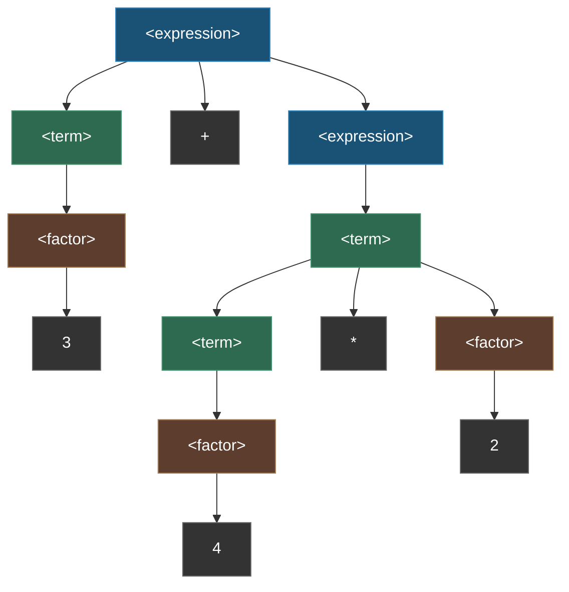
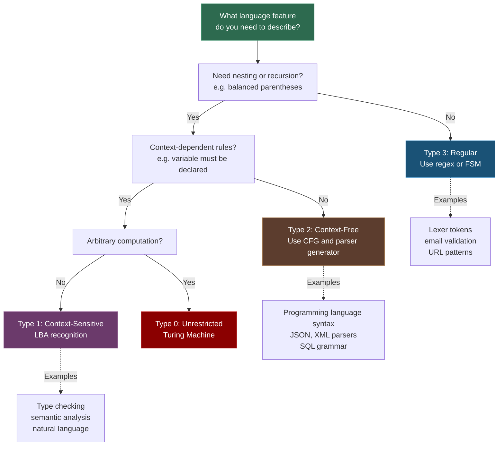

---
tags:
- math
- software-engineering
---

# Topic 6: Grammars and the Chomsky Hierarchy

Grammars are formal systems that define languages by specifying production rules. Understanding grammars is essential for compiler design, parser generation, and any system that processes structured text. The Chomsky hierarchy classifies all formal languages into four nested levels of expressive power.

---

## Formal Languages

A **formal language** is a set of strings over a finite **alphabet** $\Sigma$. For example:
- Alphabet: $\Sigma = \{0, 1\}$
- Language: $L = \{0^n 1^n \mid n \geq 0\} = \{\epsilon, 01, 0011, 000111, \dots\}$

A **grammar** generates a language. Grammars consist of:

| Component | Symbol | Meaning |
|-----------|--------|---------|
| Terminals | $\Sigma$ | Actual symbols of the language (tokens like `if`, `+`, `42`) |
| Nonterminals | $N$ | Abstract syntactic categories (`<expression>`, `<statement>`) |
| Production rules | $P$ | Rewrite rules: $\text{Nonterminal} \rightarrow \text{sequence}$ |
| Start symbol | $S \in N$ | The top-level nonterminal defining the whole language |

---

## The Chomsky Hierarchy

Four levels of formal grammars, each more powerful (and harder to parse) than the previous:

### Type 3: Regular Grammars

- **Rules:** $A \rightarrow aB$ or $A \rightarrow a$ (right-linear) or $A \rightarrow Ba$ or $A \rightarrow a$ (left-linear)
- **Recognized by:** Finite-State Machines (DFA/NFA)
- **Power:** Cannot count — cannot recognize $a^n b^n$ (balanced nesting)
- **Applications:** Lexical analysis (tokenization), regular expressions, simple pattern matching

### Type 2: Context-Free Grammars (CFG)

- **Rules:** $A \rightarrow \gamma$ where $\gamma$ is any string of terminals/nonterminals (single nonterminal on LHS)
- **Recognized by:** Pushdown Automata (PDA)
- **Power:** Can handle nesting/recursion — can recognize $a^n b^n$
- **Applications:** **Programming language syntax** — this is the level of most parser generators (YACC, Bison, ANTLR)

### Type 1: Context-Sensitive Grammars (CSG)

- **Rules:** $\alpha A \beta \rightarrow \alpha \gamma \beta$ (A can be replaced by $\gamma$ only in context $\alpha \dots \beta$)
- **Recognized by:** Linear-Bounded Automata
- **Power:** Can express context-dependent constraints
- **Applications:** Natural language processing, semantic analysis (e.g., "variable must be declared before use")

### Type 0: Phrase-Structure (Unrestricted) Grammars

- **Rules:** No restrictions whatsoever
- **Recognized by:** Turing Machines
- **Power:** Equivalent to general computation
- **Applications:** Theoretical — anything computable can be described

### Hierarchy Summary

```
Most expressive
    ▲
    │  Type 0: Unrestricted Grammars (Turing Machines)
    │  Type 1: Context-Sensitive Grammars (LBA)
    │  Type 2: Context-Free Grammars (PDA) ← Programming languages
    │  Type 3: Regular Grammars (FSM) ← Lexical analysis
    │
```

---

## Regular Expressions

Regular expressions describe **regular languages** (Type 3). Three fundamental operations:

| Operation | Notation | Meaning |
|-----------|----------|---------|
| Union | $R + S$ or $R|S$ | Match $R$ or $S$ |
| Concatenation | $R \circ S$ or $RS$ | Match $R$ followed by $S$ |
| Kleene star | $R^*$ | Match zero or more repetitions of $R$ |

Every regex engine (PCRE, JavaScript, Python `re`) implements these three operations. Extensions like backreferences (`\1`) push regex beyond regular languages, but the core is pure Type 3.

### BNF / EBNF Notation

Backus-Naur Form is how CFGs are written in practice:

```bnf
<expression> ::= <term> | <expression> "+" <term>
<term>       ::= <factor> | <term> "*" <factor>
<factor>     ::= <number> | "(" <expression> ")"
```

This is the grammar for arithmetic expressions — it captures operator precedence (multiplication binds tighter than addition) through the structure.

### Worked Parse Tree: Parsing `3 + 4 * 2`

Given the CFG above, the string `3 + 4 * 2` parses as follows. Notice how the tree structure encodes precedence: `*` binds tighter because it's deeper in the tree.



**Reading the tree:**
- `3` is parsed as `<factor>` → `<term>` → `<expression>`
- `4 * 2` is parsed as `<term>` → `<expression>` (the `*` is at the term level)
- The `+` is at the expression level, so addition has **lower** precedence than multiplication

This is exactly how ANTLR, YACC, and other parser generators produce ASTs from BNF grammars.

### Ambiguous Grammars — A Practical Problem

A grammar is **ambiguous** if a string has more than one valid parse tree. The classic example is the `dangling else`:

```bnf
<stmt> ::= "if" <cond> "then" <stmt>
         | "if" <cond> "then" <stmt> "else" <stmt>
```

For `if C1 then if C2 then S1 else S2`, the `else` could attach to either `if`. Languages resolve this differently:
- C/Java/Python: `else` binds to the **nearest** `if`
- Haskell: uses layout (indentation) to disambiguate

Parser generators handle ambiguity through precedence declarations or grammar rewriting.

### The Chomsky Hierarchy Decision Flow



---

## Why Grammars Matter in SE

| Concept | SE Application |
|---------|---------------|
| Regular expressions | Pattern matching in code (grep, sed), input validation, URL routing |
| Context-free grammars | Parser generators (ANTLR, YACC/Bison, Tree-sitter), IDE syntax highlighting |
| BNF/EBNF | Language specification documents (ECMAScript, SQL, Python grammar) |
| Production rules | Compiler front-ends: lexer → parser → AST → code generation |
| Chomsky hierarchy | Understanding what can and cannot be parsed — regex cannot parse HTML/XML (nested tags) |
| Language recognition | Deciding whether an input string belongs to a language — the core of parsing |

---

## Sources

- [1*] K. Rosen, *Discrete Mathematics and Its Applications*, 8th ed., McGraw-Hill, 2018.
- SWEBOK v4.0 — Chapter 17: Mathematical Foundations
