---
tags:
- discrete-math
- math
- number-theory
- software-engineering
---

# Topic 7: Number Theory

Number theory studies the properties of integers. It underpins cryptography, hashing, random number generation, and modular arithmetic — essential for security engineering and efficient algorithms.

---

## Types of Numbers

| Set | Symbol | Definition | Example |
|-----|--------|------------|---------|
| Natural | $\mathbb{N}$ | $\{1, 2, 3, \dots\}$ (sometimes includes 0) | 1, 42, 1000 |
| Integer | $\mathbb{Z}$ | $\{\dots, -2, -1, 0, 1, 2, \dots\}$ | -5, 0, 7 |
| Rational | $\mathbb{Q}$ | $\frac{a}{b}$ where $a,b \in \mathbb{Z}, b \neq 0$ | $\frac{1}{2}, -3, 0.75$ |
| Irrational | — | Cannot be expressed as $\frac{a}{b}$ | $\pi, \sqrt{2}, e$ |
| Real | $\mathbb{R}$ | All points on the number line | $\pi, -2, 0, \sqrt{3}$ |
| Imaginary | — | Multiples of $i = \sqrt{-1}$ | $3i, -i$ |
| Complex | $\mathbb{C}$ | $a + bi$ where $a,b \in \mathbb{R}$ | $2 + 3i$ |

---

## Divisibility

$a \mid b$ (read "$a$ divides $b$") means $b = a \cdot k$ for some integer $k$.

**Key properties:**
- If $a \mid b$ and $a \mid c$, then $a \mid (b + c)$
- If $a \mid b$, then $a \mid bc$ for any integer $c$
- If $a \mid b$ and $b \mid c$, then $a \mid c$ (transitivity)

### The Division Algorithm

For any integers $a$ and $b$ (with $b > 0$), there exist unique integers $q$ (quotient) and $r$ (remainder) such that:
$$a = bq + r, \quad 0 \leq r < b$$

---

## Modular Arithmetic

$a \bmod m$ is the remainder when $a$ is divided by $m$.

**Congruence:** $a \equiv b \pmod{m}$ means $m \mid (a - b)$ — they have the same remainder modulo $m$.

**Properties (under modulo $m$):**
- $(a + b) \bmod m = ((a \bmod m) + (b \bmod m)) \bmod m$
- $(a \cdot b) \bmod m = ((a \bmod m) \cdot (b \bmod m)) \bmod m$

**Example:** $(17 + 25) \bmod 7 = (3 + 4) \bmod 7 = 0$ ✓ ($42 \bmod 7 = 0$)

**In code:**
```python
# Clock arithmetic — hours wrap at 12
(10 + 5) % 12  # = 3 (3 PM)

# Hash table index
index = hash(key) % table_size

# Even/odd check
is_even = n % 2 == 0
```

---

## Prime Numbers

A **prime** is an integer $p > 1$ whose only divisors are $1$ and $p$.

**Fundamental Theorem of Arithmetic:** Every integer > 1 can be uniquely factored into primes (up to ordering).

**Example:** $84 = 2^2 \times 3 \times 7$

### Why Primes Matter

- **RSA encryption:** Security relies on the difficulty of factoring the product of two large primes
- **Hash functions:** Prime table sizes reduce collision patterns
- **Random number generation:** Primes used in LCG (Linear Congruential Generator) parameters

---

## Greatest Common Divisor (GCD)

$\gcd(a, b)$ is the largest integer that divides both $a$ and $b$.

**Euclidean Algorithm** (efficient GCD computation):

```python
def gcd(a, b):
    while b != 0:
        a, b = b, a % b
    return a

# Example: gcd(48, 18) → gcd(18, 12) → gcd(12, 6) → gcd(6, 0) = 6
```

**Coprime / Relatively prime:** $\gcd(a, b) = 1$ — they share no common prime factors.

**Applications:** Simplifying fractions, finding modular inverses (Extended Euclidean Algorithm), RSA key generation.

---

## RSA Public-Key Cryptography — Worked Example

RSA is the practical application that ties together primes, modular arithmetic, and the Extended Euclidean Algorithm. Here's a complete walkthrough with small numbers.

### Step 1: Key Generation (Alice)

1. **Choose two large primes** (small here for illustration): $p = 11$, $q = 13$
2. **Compute** $n = p \cdot q = 143$ (this is the modulus)
3. **Compute** $\phi(n) = (p-1)(q-1) = 10 \times 12 = 120$ (Euler's totient)
4. **Choose** $e$ such that $1 < e < \phi(n)$ and $\gcd(e, \phi(n)) = 1$. Pick $e = 7$.
5. **Compute** $d = e^{-1} \bmod \phi(n)$ using the Extended Euclidean Algorithm: $d = 103$ (since $7 \times 103 = 721 \equiv 1 \pmod{120}$)

**Public key:** $(n, e) = (143, 7)$ — share freely

**Private key:** $(n, d) = (143, 103)$ — keep secret

### Step 2: Encryption (Bob sends message to Alice)

Bob wants to send $m = 9$:
$$c = m^e \bmod n = 9^7 \bmod 143$$

Using modular exponentiation:
$$9^7 = 9^4 \cdot 9^2 \cdot 9 = 6561 \cdot 81 \cdot 9$$

Reducing step by step:
- $9^1 \equiv 9$
- $9^2 = 81$
- $9^4 = 81^2 = 6561 \equiv 6561 - 45 \times 143 = 6561 - 6435 = 126$
- $9^7 = 9^4 \cdot 9^2 \cdot 9^1 = 126 \cdot 81 \cdot 9$
- $126 \cdot 81 = 10206 \equiv 10206 - 71 \times 143 = 10206 - 10153 = 53$
- $53 \cdot 9 = 477 \equiv 477 - 3 \times 143 = 477 - 429 = 48$

**Ciphertext:** $c = 48$

### Step 3: Decryption (Alice reads message)

Alice computes:
$$m = c^d \bmod n = 48^{103} \bmod 143$$

In practice this is done with fast modular exponentiation (repeated squaring). The result: $m = 9$ ✓

### RSA Process Flow

```mermaid
flowchart TD
    BOB["Bob: message m = 9"] --> ENC["Encrypt: c = m^e mod n\nc = 9^7 mod 143 = 48"]
    ENC --> WIRE["Ciphertext c = 48\nsent over insecure channel"]
    WIRE --> ALICE["Alice: receives c = 48"]
    ALICE --> DEC["Decrypt: m = c^d mod n\nm = 48^103 mod 143 = 9"]
    DEC --> PLAIN["Recovered: m = 9"]

    subgraph ALICE_KEYS["Alice's Keys"]
        GEN["p = 11, q = 13\nn = 143, phi = 120"]
        GEN --> PUB["Public: &#40;143, 7&#41;"]
        GEN --> PRI["Private: &#40;143, 103&#41;"]
    end

    PUB -.-> ENC
    PRI -.-> DEC

    style ALICE_KEYS fill:#1a1a2e,stroke:#4a90e2,color:#fff
    style ENC fill:#2d6a4f,stroke:#40916c,color:#fff
    style DEC fill:#2d6a4f,stroke:#40916c,color:#fff
    style WIRE fill:#5c3d2e,stroke:#a67c52,color:#fff
```



### Modular Exponentiation Algorithm

The key efficiency trick — computing $a^b \bmod n$ without calculating $a^b$ directly:

```python
def mod_exp(base, exp, mod):
    """Compute (base^exp) % mod efficiently using repeated squaring."""
    result = 1
    base = base % mod
    while exp > 0:
        if exp % 2 == 1:          # If exp is odd
            result = (result * base) % mod
        exp = exp // 2
        base = (base * base) % mod
    return result

# Example: 9^7 mod 143
print(mod_exp(9, 7, 143))  # Output: 48
```

This runs in $O(\log b)$ time — essential for real-world RSA where $e$ and $d$ are hundreds of digits long.

### Why RSA Is Secure

The security rests on the **difficulty of integer factorization**: given $n = 143$, an attacker could factor it to find $p = 11, q = 13$, then compute $d$. For 2048-bit $n$, no known classical algorithm can factor it in feasible time. Quantum computers (Shor's algorithm) could break this — hence the field of post-quantum cryptography.

---

## Why Number Theory Matters in SE

| Concept | SE Application |
|---------|---------------|
| Modular arithmetic | Hash tables, circular buffers, clock arithmetic, array index wrapping |
| Prime factorization | RSA public-key cryptography, Diffie-Hellman key exchange |
| GCD / Euclidean algorithm | Cryptographic key generation, fraction simplification |
| Coprime | Choosing modulus for LCG random generators, hash function parameters |
| Congruence | Checksums, error detection, parity bits |
| Modular exponentiation | Fast exponentiation for RSA encryption/decryption |
| RSA | TLS/HTTPS, digital signatures, SSH key exchange, code signing |

---

## Sources

- [1*] K. Rosen, *Discrete Mathematics and Its Applications*, 8th ed., McGraw-Hill, 2018.
- SWEBOK v4.0 — Chapter 17: Mathematical Foundations
