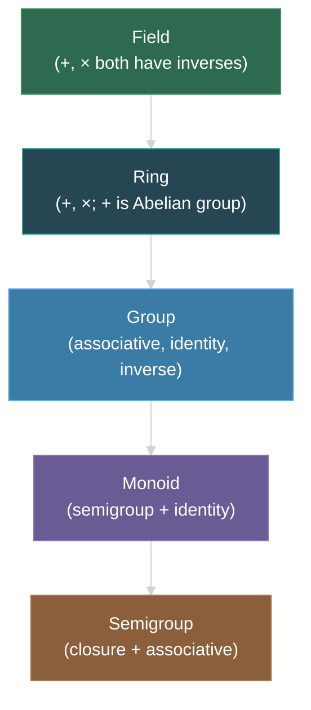

---
tags:
- algebra
- math
- software-engineering
---

# Topic 11: Algebraic Structures

Algebraic structures formalize the properties of operations — what rules do `+`, `*`, `∧`, `∪` follow? Understanding these abstractions helps recognize patterns across domains and underpins functional programming typeclasses, cryptography, and abstract algebra libraries.

---

## 1. Groups

A **group** $(G, \circ)$ is a set $G$ with a binary operation $\circ$ satisfying four axioms:

| Axiom | Definition | Meaning |
|-------|------------|---------|
| Closure | $\forall a,b \in G: a \circ b \in G$ | Operation stays within the set |
| Associativity | $\forall a,b,c \in G: (a \circ b) \circ c = a \circ (b \circ c)$ | Grouping doesn't matter |
| Identity | $\exists e \in G: \forall a \in G: e \circ a = a \circ e = a$ | There's a "do nothing" element |
| Inverse | $\forall a \in G: \exists a^{-1} \in G: a \circ a^{-1} = a^{-1} \circ a = e$ | Every element can be "undone" |

**Example:** $(\mathbb{Z}, +)$ — integers under addition.
- Closure: sum of two integers is an integer ✓
- Associative: $(1+2)+3 = 1+(2+3)$ ✓
- Identity: $0$ ✓
- Inverse: For any $n$, $-n$ is the inverse ✓

**Non-example:** $(\mathbb{N}, +)$ — natural numbers under addition. No inverses (what's the inverse of 5 in naturals? -5 isn't in $\mathbb{N}$). So $\mathbb{N}$ is NOT a group.

### Special Group Types

| Type | Extra Property | Example |
|------|---------------|---------|
| Abelian group | Commutative: $a \circ b = b \circ a$ | $(\mathbb{Z}, +)$ |
| Subgroup | Subset that's itself a group | Even integers under addition |
| Cyclic group | Generated by a single element | $(\mathbb{Z}_n, +)$ — modular addition |

---

## 2. Semigroups and Monoids

**Semigroup:** A set with an associative binary operation (closure + associativity only). No identity or inverse required.

**Monoid:** A semigroup with an identity element.

| Structure | Axioms | Example |
|-----------|--------|---------|
| Semigroup | Closure, Associativity | $(\mathbb{N}, +)$ |
| Monoid | Closure, Associativity, Identity | $(\mathbb{N} \cup \{0\}, +)$ — adding 0 gives identity |

**In code:**
- Strings under concatenation form a monoid: identity = `""`
- Lists under concatenation form a monoid: identity = `[]`
- MapReduce works because data + combining operation forms a monoid

---

## 3. Rings

A **ring** $(R, +, \times)$ has TWO operations:

1. $(R, +)$ is an **Abelian group** (identity = 0, inverse = negation)
2. $(R, \times)$ is a **semigroup** (associative, no identity or inverse required)
3. **Distributive laws** link them: $a(b + c) = ab + ac$ and $(a + b)c = ac + bc$

**Example:** $(\mathbb{Z}, +, \times)$ — integers form a ring.

---

## 4. Fields

A **field** is a ring where:
- $(R - \{0\}, \times)$ is an Abelian group (every non-zero element has a multiplicative inverse)
- Multiplication is commutative

**Examples:**
- $\mathbb{Q}$ (rationals)
- $\mathbb{R}$ (reals)
- $\mathbb{C}$ (complex numbers)
- $\mathbb{Z}_p$ for prime $p$ (finite fields — used in cryptography)

**Non-example:** $\mathbb{Z}$ is NOT a field — $2$ has no integer multiplicative inverse ($\frac{1}{2} \notin \mathbb{Z}$).

---

## Hierarchy Summary

---

## Why Algebraic Structures Matter in SE

| Concept | SE Application |
|---------|---------------|
| Monoid | MapReduce, distributed aggregation, fold/reduce operations |
| Group | Cryptographic protocols (elliptic curve groups), symmetry in graphics |
| Ring | Polynomial arithmetic, CRC/checksum algorithms |
| Field | Finite fields in AES encryption, error-correcting codes (Reed-Solomon) |
| Semigroup | Combining logs/events, data pipeline aggregation |
| Abelian group | Commutative operations enable parallel/out-of-order processing |

### Functional Programming Connection

Haskell typeclasses mirror algebraic structures:

| Haskell Typeclass | Algebraic Structure |
|-------------------|-------------------|
| `Semigroup` | Semigroup (`<>` operator) |
| `Monoid` | Monoid (`mempty`, `mappend`) |
| `Functor` | Structure-preserving mapping |
| `Applicative` | Monoidal functor |
| `Monad` | Monoid in the category of endofunctors |

---

## Sources

- [1*] K. Rosen, *Discrete Mathematics and Its Applications*, 8th ed., McGraw-Hill, 2018.
- SWEBOK v4.0 — Chapter 17: Mathematical Foundations
