---
tags:
- math
- software-engineering
---

# Topic 10: Numerical Precision, Accuracy, and Errors

Computers represent numbers with finite memory. Every computation is an approximation. Understanding the limits of numerical representation is critical for scientific computing, financial systems, and any domain where precision matters.

---

## 1. Finite Representation

A computer uses $k$ bits to store a number. This means:
- At most $2^k$ distinct values can be represented
- Values outside this range cause **overflow** (too large) or **underflow** (too close to zero)

**Example:** An 8-bit unsigned integer can represent $2^8 = 256$ values: $[0, 255]$. Adding 1 to 255 wraps to 0 (overflow).

---

## 2. Fixed-Point vs. Floating-Point

| Approach | How It Works | Trade-off |
|----------|-------------|-----------|
| **Fixed-point** | Fixed number of digits after decimal point | Fast (integer arithmetic), limited range |
| **Floating-point** | Scientific notation: $m \times 2^e$ (mantissa × exponent) | Wide range, but precision varies with magnitude |

### IEEE 754 Floating-Point

The standard for floating-point arithmetic:

| Precision | Bits | Sign | Exponent | Mantissa | ~Decimal digits |
|-----------|------|------|----------|----------|-----------------|
| Single (float) | 32 | 1 | 8 | 23 | ~7 |
| Double (double) | 64 | 1 | 11 | 52 | ~16 |

**Classic pitfalls:**
```python
0.1 + 0.2 == 0.3  # False! → 0.30000000000000004
0.1 + 0.2         # 0.30000000000000004
```
$0.1$ cannot be represented exactly in binary (it's a repeating fraction, like $\frac{1}{3}$ in decimal).

---

## 3. Rounding vs. Chopping

When a number doesn't fit in $k$ digits, two strategies exist:

| Strategy | How | Error |
|----------|-----|-------|
| **Rounding** | Pick the nearest representable value | Balanced (errors can cancel over many operations) |
| **Chopping (truncation)** | Simply discard extra digits | Biased (always underestimates positive numbers) |

---

## 4. Error Measurement

Let $x^*$ be the computed (approximate) value and $x$ be the true value.

| Error Type | Formula | Meaning |
|-----------|---------|---------|
| Absolute error | $|x^* - x|$ | Raw difference |
| Relative error | $\frac{|x^* - x|}{|x|}$ | Error as a proportion — scale-independent |

**Example:** Measuring 1 km with 1 m error = 0.1% relative error. Measuring 1 cm with 1 m error = 10,000% — same absolute error, vastly different significance.

---

## 5. Significant Digits

The number of meaningful digits in a value. Rules:
- All non-zero digits are significant
- Zeros between non-zeros are significant
- Leading zeros are NOT significant
- Trailing zeros after decimal are significant

| Value | Significant Digits |
|-------|-------------------|
| 123.45 | 5 |
| 0.00420 | 3 |
| 1200 | Ambiguous (2, 3, or 4 — use scientific notation: $1.200 \times 10^3$ = 4) |

---

## 6. Goals of Numerical Analysis

1. **Accuracy:** How close the computed answer is to the true answer
2. **Stability:** Whether small input errors produce small output errors
3. **Efficiency:** Minimize computation while preserving accuracy

**Common sources of numerical error:**
- **Catastrophic cancellation:** Subtracting nearly equal numbers loses precision (e.g., $1.0000001 - 1.0000000 = 0.0000001$ — only 1 significant digit survives)
- **Swamping:** Adding a tiny number to a huge number ($10^{15} + 1$ may be indistinguishable from $10^{15}$ in floating-point)
- **Error accumulation:** Repeated operations compound rounding errors

---

## 7. Iterative Numerical Methods

### Newton's Method (Root Finding)

Find where $f(x) = 0$ by iteratively improving a guess:

$$x_{n+1} = x_n - \frac{f(x_n)}{f'(x_n)}$$

**Example:** Find $\sqrt{2}$ by solving $f(x) = x^2 - 2 = 0$.

- $f'(x) = 2x$, so $x_{n+1} = x_n - \frac{x_n^2 - 2}{2x_n} = \frac{x_n}{2} + \frac{1}{x_n}$

Starting with $x_0 = 1$:

| Iteration | $x_n$ | $x_n^2$ | Error |
|-----------|--------|---------|-------|
| 0 | 1.0 | 1.0 | 0.414 |
| 1 | 1.5 | 2.25 | 0.086 |
| 2 | 1.4167 | 2.0069 | 0.0025 |
| 3 | 1.4142 | 2.0000 | 0.0000 |

Converges to $\sqrt{2} \approx 1.4142$ in 3 iterations — **quadratic convergence** (doubles of correct digits per step).

### Bisection Method (Guaranteed Convergence)

If $f(a)$ and $f(b)$ have opposite signs, there's a root in $[a, b]$. Repeatedly halve the interval:

```python
def bisection(f, a, b, tol=1e-10):
    """Find root of f in [a, b] using bisection."""
    while (b - a) / 2 > tol:
        mid = (a + b) / 2
        if f(mid) == 0:
            return mid
        elif f(a) * f(mid) < 0:
            b = mid
        else:
            a = mid
    return (a + b) / 2

# Example: find sqrt(2)
import math
root = bisection(lambda x: x**2 - 2, 0, 2)
print(f"sqrt(2) ≈ {root}")  # 1.41421356237...
```

Bisection is slower (linear convergence) but **guaranteed** to converge if $f$ is continuous and signs differ at endpoints.

### Convergence Comparison

```mermaid
flowchart LR
    NEWTON["Newton's Method\nx_n+1 = x_n - f&#40;x_n&#41;/f'&#40;x_n&#41;"] --> FAST["Quadratic convergence\nDoubles correct digits per step"]
    NEWTON --> RISK["Risk: diverges if\nguess is poor or f'&#40;x&#41; = 0"]

    BISECT["Bisection Method\nHalve interval each step"] --> SAFE["Guaranteed convergence\nif f is continuous"]
    BISECT --> SLOW["Linear convergence\nOne bit per step"]

    style NEWTON fill:#2d6a4f,stroke:#40916c,color:#fff
    style BISECT fill:#1a5276,stroke:#2e86c1,color:#fff
    style FAST fill:#333,stroke:#40916c,color:#fff
    style RISK fill:#5c2e2e,stroke:#a65252,color:#fff
    style SAFE fill:#333,stroke:#2e86c1,color:#fff
    style SLOW fill:#333,stroke:#a67c52,color:#fff
```



---

## Why This Matters in SE

| Concept | SE Application |
|---------|---------------|
| Floating-point | Never use `==` for float comparison — use tolerance: `abs(a - b) < epsilon` |
| Overflow/underflow | Integer overflow bugs (Ariane 5 explosion), buffer size calculations |
| Absolute vs relative error | Choosing the right tolerance for assertion tests |
| Catastrophic cancellation | Financial calculations, physics simulations, matrix operations |
| Fixed-point | Embedded systems, financial software (no rounding ambiguity) |
| Significant digits | Display precision in UIs, scientific data formatting |
| Numerical stability | Choosing algorithms (stable sort, Kahan summation) |

---

## Sources

- [2*] E.W. Cheney and D.R. Kincaid, *Numerical Mathematics and Computing*, 7th ed., Addison Wesley, 2020.
- SWEBOK v4.0 — Chapter 17: Mathematical Foundations
