---
tags:
- math
- foundations
- computational-neuroscience
- genomics
- software-engineering
---

# New Advancements — Math Meets Software Engineering

Two interdisciplinary fields where mathematical foundations directly drive software engineering. These aren't core math topics — they're application domains where SE + math create new capabilities.

---

## Computational Neuroscience

> Mathematical models, simulations, and brain abstractions for understanding cognition — and increasingly, for designing AI systems inspired by biological intelligence.

### What It Is

Computational neuroscience uses mathematical models to understand how the brain processes information. Software engineers build the simulations, data pipelines, and analysis tools that make this research possible.

### Three Sub-Areas

| Sub-Area | Math Used | SE Role |
|----------|-----------|---------|
| **Neural Coding** | Probability, information theory, statistics | How do neurons represent information? Encoding (stimulus → spike trains) and decoding (spike trains → stimulus). Software processes and analyzes neural recordings. |
| **Biophysics of Neurons** | Differential equations, calculus, dynamical systems | Hodgkin-Huxley model — how ion channels create action potentials. Software simulates electrical behavior of single neurons and networks. |
| **Neural Networks** | Linear algebra, calculus, optimization, graph theory | Mathematical models of interconnected neurons. Directly inspired artificial neural networks (deep learning). Software engineers train, deploy, and scale these models. |

### Why SE Cares

- **Artificial Neural Networks** (ANNs) are directly derived from computational neuroscience models
- **Recurrent Neural Networks** (RNNs) model biological circuits as continuous-time dynamical systems
- Understanding biological learning (Hebbian learning, spike-timing dependent plasticity) inspires new ML architectures
- Simulation tools (NEST, Brian, NEURON) are large-scale software engineering projects themselves

### Key Mathematical Tools

| Math Topic | Application |
|------------|-------------|
| Differential equations | Neuron membrane dynamics (Hodgkin-Huxley) |
| Probability & statistics | Stochastic neural firing, population coding |
| Information theory | Neural coding efficiency, channel capacity |
| Linear algebra | Network connectivity matrices, signal processing |
| Dynamical systems | Attractor networks, oscillations, stability |
| Graph theory | Neural circuit topology, connectivity patterns |

---

## Genomics & Bioinformatics

> In-silico analysis of genomes via DNA sequencing and bioinformatic analysis — heavily reliant on software engineering for data handling and algorithm development.

### What It Is

Genomics generates massive datasets (a single human genome = ~3 billion base pairs). Bioinformatics is the software engineering discipline that stores, processes, analyzes, and interprets this data. Without SE, genomics data is just noise.

### The Pipeline

```
DNA Sample → Sequencing (hardware) → Raw Data (FASTQ)
    → Alignment (algorithms) → Variant Calling (statistics)
    → Annotation (databases) → Clinical/Research Interpretation
```

Every step after sequencing is **software engineering + mathematics**.

### Key Algorithms & Math

| Algorithm/Method | Math Used | What It Solves |
|-----------------|-----------|----------------|
| **Sequence Alignment** (BLAST, BWA) | Dynamic programming, string matching | Find where a DNA fragment maps to the reference genome |
| **Assembly** (de Bruijn graphs) | Graph theory, Eulerian paths | Reconstruct full genome from short fragments |
| **Variant Calling** | Bayesian statistics, probability | Identify mutations (SNPs, indels) from noisy data |
| **Phylogenetics** | Trees, graph theory, distance metrics | Evolutionary relationships between species |
| **Gene Expression Analysis** | Linear algebra (PCA), statistics (t-test, FDR) | Which genes are active under what conditions? |
| **Machine Learning in Genomics** | Neural networks, classification | Predict protein structure (AlphaFold), drug targets |

### Scale Challenge

| Metric | Scale |
|--------|-------|
| Human genome | 3.2 billion base pairs |
| One sequencing run | 100-600 GB of raw data |
| UK Biobank | 500,000 genomes |
| Storage growth | Outpacing Moore's Law |

This is why bioinformatics is fundamentally a **software engineering challenge** — algorithms must be space-efficient, parallelizable, and correct on noisy data.

### Why SE Cares

- **String algorithms** (suffix trees, BWT) were advanced significantly by genomics needs
- **Streaming/pipeline architectures** handle the data volume
- **Distributed computing** (MapReduce, Spark) widely used for genome-wide analysis
- **Data formats & standards** (FASTA, FASTQ, BAM, VCF) — a configuration management problem
- **Reproducibility** — bioinformatics pipelines must be versioned, containerized, and auditable (same as any SE system)

---

## Connection to Core Math Topics

| This Note's Topic | Uses These Math Foundations |
|---|---|
| Neural coding | [[Discrete Probability]], [[Calculus]] |
| Neural networks | [[Algebraic Structures]], [[Calculus]], [[Basic Logic]] |
| Sequence alignment | [[Graphs and Trees]], [[Basics of Counting]] |
| Genome assembly | [[Graphs and Trees]], [[Finite State Machines]] |
| Variant calling | [[Discrete Probability]], [[Number Theory]] |
| Phylogenetics | [[Graphs and Trees]], [[Set, Relations, Functions]] |

---

## How Math Foundations Connect to New Advancements

```mermaid
flowchart TD
    subgraph CORE["Core Math Foundations"]
        LOGIC["00 Basic Logic"]
        SETS["02 Sets and Relations"]
        COUNT["03 Counting"]
        PROB["04 Probability"]
        GRAPH["05 Graphs and Trees"]
        FSM["06 Finite State Machines"]
        GRAM["07 Grammars"]
        NUM["08 Number Theory"]
        CALC["10 Calculus"]
    end

    subgraph NEURO["Computational Neuroscience"]
        NN["Neural Networks\nLinear algebra + calculus"]
        CODE["Neural Coding\nProbability + info theory"]
        BIO["Biophysics\nDifferential equations"]
    end

    subgraph GENO["Genomics and Bioinformatics"]
        ALIGN["Sequence Alignment\nDynamic programming"]
        ASSEM["Genome Assembly\nGraph theory + Eulerian paths"]
        VAR["Variant Calling\nBayesian statistics"]
        PHYLO["Phylogenetics\nTrees and distance metrics"]
    end

    PROB --> NN
    PROB --> CODE
    CALC --> NN
    CALC --> BIO
    GRAPH --> ASSEM
    GRAPH --> PHYLO
    SETS --> VAR
    COUNT --> ALIGN
    FSM --> ASSEM
    LOGIC --> NN

    style CORE fill:#1a1a2e,stroke:#4a90e2,color:#fff
    style NEURO fill:#2d4a2d,stroke:#40916c,color:#fff
    style GENO fill:#4a2d4a,stroke:#9b6b9b,color:#fff
    style LOGIC fill:#333,stroke:#666,color:#fff
    style SETS fill:#333,stroke:#666,color:#fff
    style COUNT fill:#333,stroke:#666,color:#fff
    style PROB fill:#333,stroke:#666,color:#fff
    style GRAPH fill:#333,stroke:#666,color:#fff
    style FSM fill:#333,stroke:#666,color:#fff
    style GRAM fill:#333,stroke:#666,color:#fff
    style NUM fill:#333,stroke:#666,color:#fff
    style CALC fill:#333,stroke:#666,color:#fff
    style NN fill:#333,stroke:#40916c,color:#fff
    style CODE fill:#333,stroke:#40916c,color:#fff
    style BIO fill:#333,stroke:#40916c,color:#fff
    style ALIGN fill:#333,stroke:#9b6b9b,color:#fff
    style ASSEM fill:#333,stroke:#9b6b9b,color:#fff
    style VAR fill:#333,stroke:#9b6b9b,color:#fff
    style PHYLO fill:#333,stroke:#9b6b9b,color:#fff
```



### Key Insight

Both computational neuroscience and genomics are **software engineering challenges** at their core — the math provides the models, but building correct, efficient, scalable implementations is pure SE. The math foundations you learn in notes 00–11 are not abstract theory — they are the language in which these domains express their problems and solutions.

---

## Sources

- SWEBOK v4, Chapter 17, Section 13 — New Advancements
- Dayan, P. & Abbott, L.F. *Theoretical Neuroscience*, MIT Press, 2001.
- Compeau, P. & Pevzner, P. *Bioinformatics Algorithms*, Active Learning Publishers, 2015.
- Erwin, B.G. *Mathematical Foundations of Neuroscience*, Springer, 2010.
