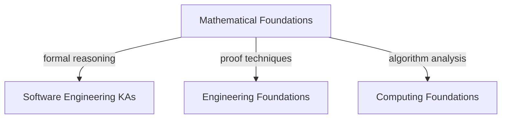

---
tags:
  - math
  - foundations
  - swebok
  - overview
  - software-engineering
  - discrete-mathematics
---

# Mathematical Foundations — Overview

> **Source:** [[SWEBOK v4 - Overview|SWEBOK v4]] Chapter 17 — Mathematical Foundations
> **Purpose:** Logic, proof techniques, set theory, graphs & trees, FSMs, the Chomsky hierarchy, probability, numerical methods, and algebraic structures — the formal bedrock for rigorous specification and verification.

## What Is This?

Mathematical Foundations covers the discrete mathematics and formal reasoning that underpin software engineering. These aren't math for math's sake — they're the tools for specifying systems precisely, proving properties about algorithms, reasoning about state machines, analyzing complexity, and managing uncertainty. Every time you write a loop invariant, design a state machine, or estimate a probability, you're using these foundations.

## The 12 Topic Areas

### 1. [[Basic Logic]]

- Propositional logic: connectives, truth tables, tautologies, equivalences
- Predicate logic: quantifiers (∀, ∃), predicates, inference rules
- Logical reasoning for specification and verification
- **Book:** *Discrete Mathematics and Its Applications, 8th Ed.* (2019) — Kenneth Rosen

### 2. [[Proof Techniques]]

- Direct proof
- Proof by contradiction
- Proof by induction (weak and strong)
- Proof by contrapositive
- Constructive vs. non-constructive proofs
- **Book:** *Discrete Mathematics with Applications, 5th Ed.* (2019) — Susanna Epp

### 3. [[Set, Relations, Functions]]

- Set operations: union, intersection, difference, complement, power set
- Relations: reflexivity, symmetry, transitivity, equivalence relations, partial orders
- Functions: injective, surjective, bijective, composition, inverse
- Cardinality and countability
- **Book:** *Discrete Mathematics and Its Applications* — Rosen

### 4. [[Graphs and Trees]]

- Graph terminology: vertices, edges, degree, paths, cycles
- Graph representations: adjacency matrix, adjacency list
- Trees: binary trees, spanning trees, tree traversals
- Applications: dependency graphs, call graphs, state transitions
- **Book:** *Discrete Mathematics and Its Applications* — Rosen

### 5. [[Finite State Machines]]

- Deterministic finite automata (DFA) and non-deterministic (NFA)
- Regular expressions and their equivalence to FSMs
- State diagrams for system behavior modeling
- Applications: parsers, protocol design, UI state management
- **Book:** *Introduction to Automata Theory, Languages, and Computation (Hopcroft-Ullman-Motwani), 3rd Ed.* (2006)

### 6. [[Grammars]]

- The Chomsky hierarchy: Type 0–3 (unrestricted → regular)
- Context-free grammars and parse trees
- Language recognition: regular, context-free, context-sensitive, recursively enumerable
- Applications: compilers, DSLs, protocol specifications
- **Book:** *Introduction to Automata Theory, Languages, and Computation* — Hopcroft et al.

### 7. [[Number Theory]]

- Divisibility, primes, GCD, modular arithmetic
- Applications: cryptography (RSA, Diffie-Hellman), hashing, checksums
- **Book:** *Discrete Mathematics and Its Applications* — Rosen

### 8. [[Basics of Counting]]

- Permutations and combinations
- Pigeonhole principle
- Inclusion-exclusion principle
- Recurrence relations
- Applications: algorithm analysis, capacity planning, combinatorial testing
- **Book:** *Discrete Mathematics and Its Applications* — Rosen

### 9. [[Discrete Probability]]

- Sample spaces, events, conditional probability, Bayes' theorem
- Random variables: expected value, variance, standard deviation
- Distributions: binomial, Poisson, geometric, uniform
- Applications: reliability analysis, performance modeling, risk assessment
- **Book:** *A First Course in Probability, 10th Ed.* (2019) — Sheldon Ross

### 10. [[Numerical Precision, Accuracy, and Errors]]

- Floating-point representation (IEEE 754)
- Rounding errors, truncation errors, catastrophic cancellation
- Numerical stability in algorithms
- Error propagation and bounds
- **Book:** *Numerical Analysis, 10th Ed.* (2015) — Burden & Faires

### 11. [[Algebraic Structures]]

- Groups: closure, associativity, identity, inverse
- Rings and fields
- Boolean algebra (directly applicable to logic circuits and bitwise operations)
- Applications: cryptography, error-correcting codes, formal verification
- **Book:** *Discrete Mathematics and Its Applications* — Rosen

### 12. [[Calculus]]

- Limits, continuity, derivatives, integrals
- Applications: continuous optimization, rate of change in systems, ML gradient descent
- **Note:** Less directly used in day-to-day SE, but essential for ML, signal processing, and scientific computing
- **Book:** *Calculus: Early Transcendentals, 9th Ed.* (2020) — James Stewart

---

## Recommended Books (Priority Order)

| # | Book | Author(s) | Pages | Priority | Covers |
|---|------|-----------|:-----:|:--------:|--------|
| 1 | Discrete Mathematics and Its Applications, 8th Ed. (2019) | Kenneth Rosen | 840 | 🔴 Core | Logic, proofs, sets, graphs, counting, number theory, algebra |
| 2 | Discrete Mathematics with Applications, 5th Ed. (2019) | Susanna Epp | 984 | 🟡 Supplementary | Proofs, logic, sets — more accessible than Rosen |
| 3 | Introduction to Automata Theory, Languages, and Computation, 3rd Ed. (2006) | Hopcroft, Motwani & Ullman | 520 | 🟡 Supplementary | FSMs, grammars, computability |
| 4 | A First Course in Probability, 10th Ed. (2019) | Sheldon Ross | 528 | 🟡 Supplementary | Probability theory |
| 5 | Numerical Analysis, 10th Ed. (2015) | Burden & Faires | 912 | 🟢 Deep Dive | Numerical precision and errors |
| 6 | Calculus: Early Transcendentals, 9th Ed. (2020) | James Stewart | 1368 | 🟢 Deep Dive | Calculus (ML, scientific computing) |

---

## Current Vault Coverage

| Topic | Status | File |
|-------|:------:|------|
| Basic Logic | ✅ | `Basic Logic/Basic Logic.md` |
| Proof Techniques | ✅ | `Proof Techniques/Proof Techniques.md` |
| Set, Relations, Functions | ✅ | `Set, Relations, Functions/Set, Relations, Functions.md` |
| Graphs and Trees | ✅ | `Graphs and Trees/Graphs and Trees.md` |
| Finite State Machines | ✅ | `Finite State Machines/Finite State Machines.md` |
| Grammars | ✅ | `Grammars/Grammars.md` |
| Number Theory | ✅ | `Number Theory/Number Theory.md` |
| Basics of Counting | ✅ | `Basics of Counting/Basics of Counting.md` |
| Discrete Probability | ✅ | `Discrete Probability/Discrete Probability.md` |
| Numerical Precision | ✅ | `Numerical Precision, Accuracy, and Errors/Numerical Precision, Accuracy, and Errors.md` |
| Algebraic Structures | ✅ | `Algebraic Structures/Algebraic Structures.md` |
| Calculus | ✅ | `Calculus/Calculus.md` |

All 12 topics have notes. ✅

---

## Relationship to Other Foundations

- **Logic & Proofs** → formal specification, verification, program correctness
- **Graphs & Trees** → data structures, network routing, dependency analysis
- **FSMs & Grammars** → compilers, parsers, protocol design, UI state
- **Probability** → reliability, performance modeling, risk, ML
- **Numerical Methods** → floating-point safety, scientific computing
- **Algebraic Structures** → cryptography, error correction, formal methods

---

## Related

- [[SWEBOK v4 - Overview]]
- [[Computing Foundation Overview]]
- [[Engineering Foundation Overview]]
