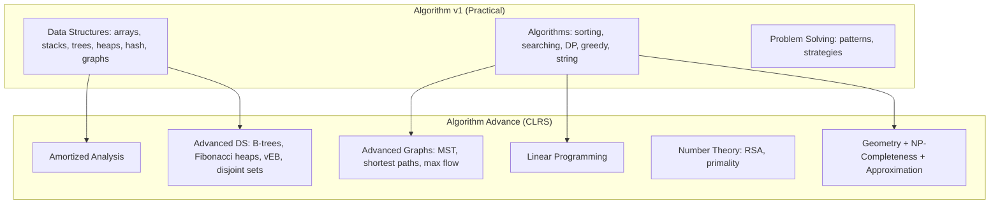

# Algorithm Advance — Advanced Topics (CLRS)

> **Source:** *Introduction to Algorithms* (CLRS) by Cormen, Leiserson, Rivest, Stein — 4th Edition
> Advanced topics that complement the practical Algorithm v1 notes.

## What Is This?

This vault extends [[Algorithm Overview|Algorithm v1]] with **advanced algorithm topics** from CLRS that the v1 notes don't cover. Where v1 focuses on practical implementations and interview patterns, Algorithm Advance covers the theory, proofs, and advanced structures that deepen understanding.

## Files

| File | Topic | CLRS Chapters | v1 Gap |
|---|---|---|---|
| [[01_Amortized_Analysis]] | Aggregate, accounting, potential methods | Ch 17 | ❌ Not in v1 |
| [[02_Advanced_Data_Structures]] | B-trees, Fibonacci heaps, van Emde Boas, disjoint sets | Ch 18–21 | ❌ Not in v1 |
| [[03_Advanced_Graph_Algorithms]] | MST, shortest paths, max flow | Ch 23–26 | 🟡 Partial (BFS/DFS only) |
| [[04_Linear_Programming]] | Simplex, duality, applications | Ch 29 | ❌ Not in v1 |
| [[05_Number_Theory_and_Cryptography]] | GCD, RSA, primality testing | Ch 31 | 🟡 Basic (GCD, primes) |
| [[06_Geometry_NP_and_Approximation]] | Geometry, NP-completeness, approximation | Ch 33–35 | ❌ Not in v1 |

## How v1 and v2 Relate

## When to Study What

| Your Goal | Start Here |
|---|---|
| **Interview prep** | v1 first — data structures, sorting, DP, greedy |
| **Deepen DS knowledge** | [[02_Advanced_Data_Structures]] — B-trees, heaps, disjoint sets |
| **Graph problems** | [[03_Advanced_Graph_Algorithms]] — MST, shortest paths, max flow |
| **Optimization** | [[04_Linear_Programming]] — resource allocation, scheduling |
| **Cryptography** | [[05_Number_Theory_and_Cryptography]] — RSA, modular arithmetic |
| **Theory/academia** | [[06_Geometry_NP_and_Approximation]] — NP-completeness, reductions |
| **Performance analysis** | [[01_Amortized_Analysis]] — understanding average-case bounds |

## Related

- [[Algorithm Overview|Algorithm v1 Overview]] — The practical foundation
- [[02_Advanced_Data_Structures]] → links back to v1's [[01 Trees & BSTs]], [[01 Heaps & Priority Queues]], [[01 Graphs]]
- [[03_Advanced_Graph_Algorithms]] → links back to v1's [[01 Graphs]], [[02 Greedy Algorithms]]
- [[05_Number_Theory_and_Cryptography]] → links back to v1's [[02 Math Algorithms]]
