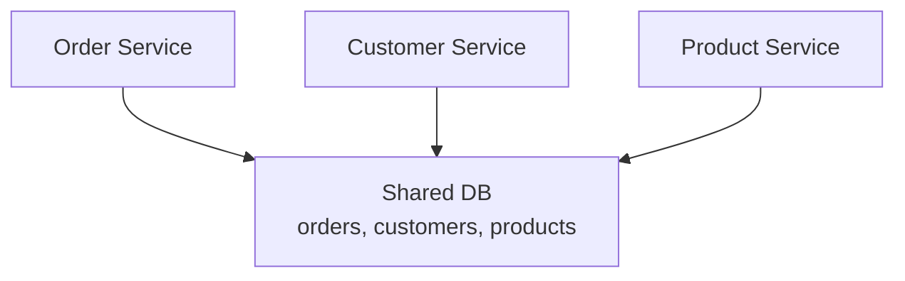
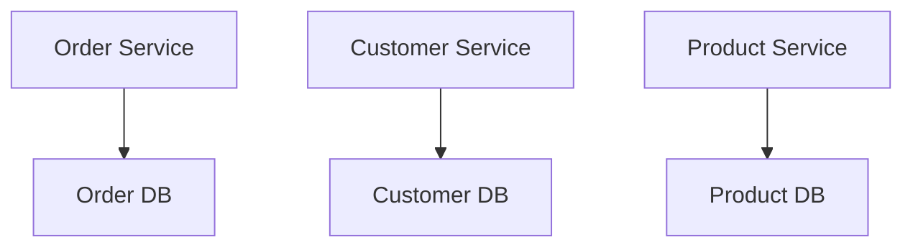

---
tags:
- architecture
- microservices
- programming
---

# 03 Database per Service

Each microservice owns its data. No other service touches it directly — only through the service's API. This is the single most important rule in microservice data management.

---

## The Rule

> **Each service has its own database. No service accesses another service's database directly.**

### ❌ Shared Database

> Tight coupling. Schema change in orders breaks customer service.

### ✅ Database per Service

> Loose coupling. Each service evolves independently.

---

## Why This Matters

| With Shared DB | With Database per Service |
|---------------|--------------------------|
| Any service can change any table → chaos | Only the owning service touches its data |
| Schema change = coordinate N teams | Schema change = 1 team |
| One slow query blocks everyone | Isolation — one service can't kill another's DB |
| Impossible to scale independently | Each DB scales for its own workload |

---

## Implementation

| Pattern | Description |
|---------|------------|
| **Database per Service** | Each service gets its own database instance (separate PostgreSQL, MySQL, MongoDB, etc.) |
| **Schema per Service** | Shared DB instance, but each service uses a different schema/namespace. Lighter weight, less isolation. |
| **Table per Service** | Shared DB + schema. Each service owns specific tables. Weakest isolation — avoid. |

---

## The Trade-Off

| Benefit | Cost |
|---------|------|
| Independent scaling | **No ACID transactions across services** |
| Independent schema evolution | Data consistency becomes eventual |
| Technology diversity (Postgres for orders, MongoDB for products) | Cross-service queries require API composition |

> The database-per-service rule is why distributed transactions (Saga pattern) and CQRS exist. You give up ACID for independence — and need new patterns to fill the gap.

---

## Polyglot Persistence

Different services need different databases:

| Service | Best Database | Why |
|---------|:------------:|-----|
| Order (transactions) | PostgreSQL | ACID, relational integrity |
| Product Catalog (search) | Elasticsearch | Full-text search |
| User Session | Redis | Low latency, TTL |
| Analytics | ClickHouse / BigQuery | Columnar, high-volume reads |
| Social Graph | Neo4j | Graph relationships |

---

## Sources

- Newman, Sam. *Building Microservices*, 2nd ed., O'Reilly, 2021.
- Richardson, Chris. *Microservices Patterns*, Manning, 2018.
