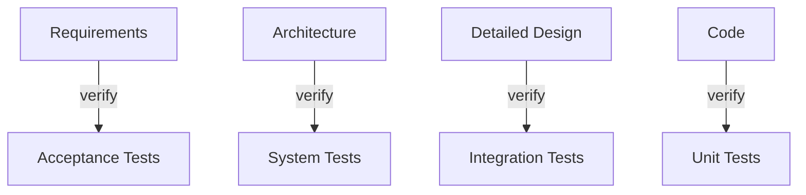
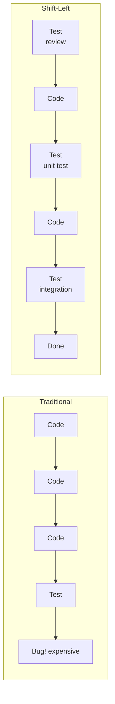

---
tags:
- programming
- qa
- testing
---

# 01 Verification & Validation

Verification asks: "Did we build it right?" Validation asks: "Did we build the right thing?" Both are essential. One without the other = a well-built solution to the wrong problem, or a great idea poorly executed.

---

## Verification vs Validation

| | Verification | Validation |
|---|:---:|:---:|
| **Question** | Are we building the product correctly? | Are we building the correct product? |
| **Focus** | Conformance to specifications | Meeting user needs |
| **When** | Throughout development | At delivery milestones |
| **Activities** | Reviews, inspections, unit tests, static analysis | UAT, beta testing, A/B testing, analytics |
| **Who** | Developers, QA engineers | Users, product owners, stakeholders |

---

## SDLC Models & Testing

### V-Model

Every development phase has a corresponding testing phase. Test planning starts when requirements are written — not when code is done.

### Waterfall

Test only at the end. **Problem:** bugs found late cost 30–100x more to fix than bugs found early.

### Agile / Iterative

Testing happens every sprint. QA is embedded in the team, not a separate phase.

| Traditional QA | Agile QA |
|---------------|----------|
| QA after dev | QA alongside dev |
| Test from specs | Test from user stories |
| "QA found a bug" | "We have a failing test" |
| Separate QA team | Whole team owns quality |

---

## Shift-Left Testing

Move testing earlier in the lifecycle. The earlier you find a bug, the cheaper it is to fix.

| Shift-Left Activity | When |
|--------------------|------|
| **Requirements review** | Before coding |
| **Static code analysis** | As code is written |
| **Unit tests** | Same time as code |
| **Code review** | Before merge |

---

## Sources

- ISTQB Foundation Level Syllabus
- Boehm, B. (1981). *Software Engineering Economics.* (Cost of defect escalation)
