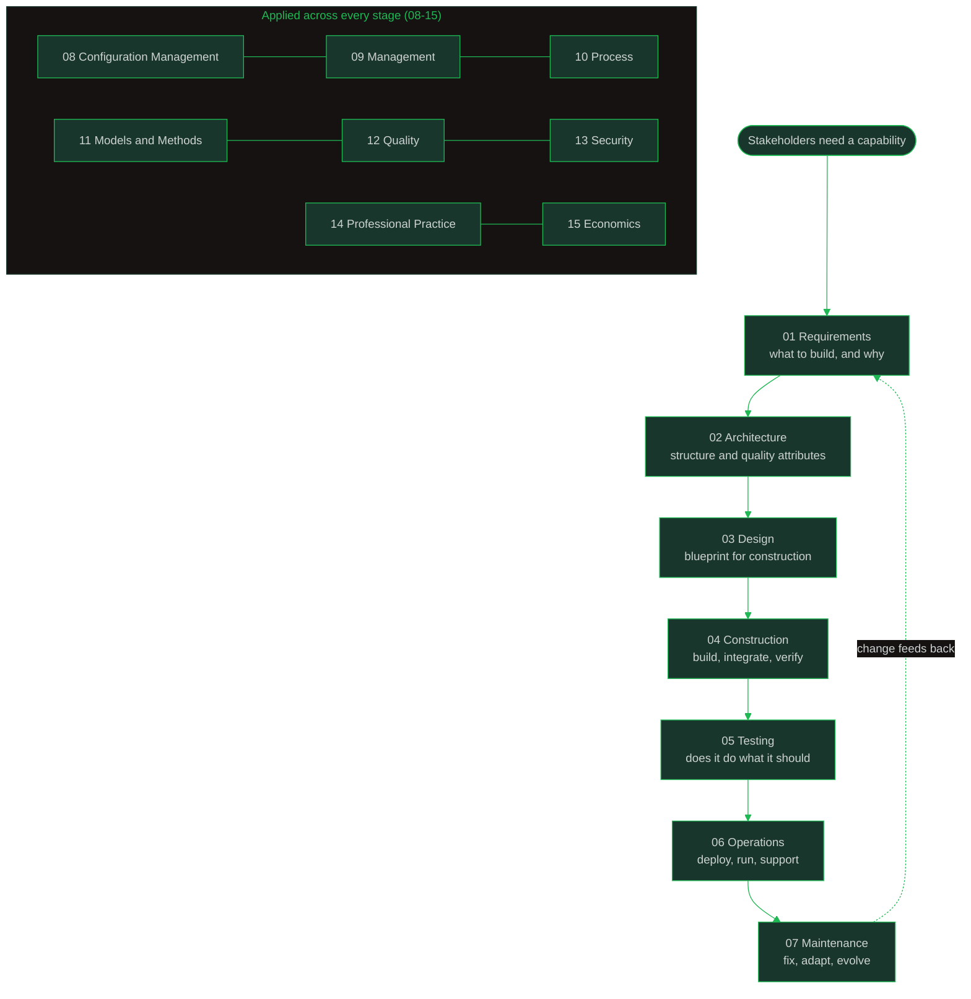

---
tags:
  - introduction
  - overview
  - software-engineering
  - swebok
  - sdlc
---

# Introduction to Software Engineering

> **Source:** [[SWEBOK v4 - Overview|SWEBOK v4]] (IEEE Computer Society, 2024) for the discipline map; 1968 NATO Software Engineering Conference for the discipline's origin.
> **Purpose:** The front door to this vault: what software engineering is, why the discipline exists, how its knowledge areas fit together, and how to study them.

## What Is Software Engineering?

Software engineering is **"the application of a systematic, disciplined, quantifiable approach to the development, operation, and maintenance of software"** (SEVOCAB, quoted in [[00_Introduction|Introduction to SWEBOK v4]]). In plain terms: it is the discipline that turns programming into dependable products: discovering what should be built, designing it to survive change, building and verifying it, running it in production, and keeping it healthy for years. It matters because software systems are among the most complex artifacts humans build; ad-hoc development collapses under that complexity.

The term was coined at the **1968 NATO Software Engineering Conference** in Garmisch, Germany, convened in response to a "software crisis": systems chronically late, over budget, and unreliable. The conference's answer became the discipline's program: treat software development as engineering. Make requirements explicit; design before building; measure quality; manage change; learn from cost and defects. Decades of practice organized that program into the knowledge areas this vault covers.

Three contrasts help place the field:

- **Programming vs. software engineering:** programming constructs a solution to a well-defined problem; software engineering owns the whole journey from stakeholder need to maintained system, at scale and over time.
- **Computer science vs. software engineering:** science discovers new things; engineering applies knowledge to solve real-world problems cost-effectively. Related disciplines, not the same thing.
- **Software engineering vs. other engineering:** software is invisible, endlessly malleable, and constrained by complexity rather than physics. That is why it needed a discipline of its own.

## The Discipline at a Glance

The first seven knowledge areas follow a product through its life cycle: what to build, how it is structured, how it is designed, built, tested, operated, and maintained. The remaining eight apply across every stage: configuration management and management keep the work organized, process shapes how work flows, models and methods supply the techniques, quality and security keep the product sound, professional practice governs how engineers work and behave, and economics guides the investment decisions.

The three foundation knowledge areas (16-18) distill the theory underneath: computing, mathematics, and engineering. They live in sibling folders of this vault.

## The 15 Knowledge Areas

| # | Knowledge Area | What it covers |
|---|---|---|
| 01 | [[01_Software_Requirements/Software Requirements Overview\|Requirements]] | Eliciting, specifying, validating, and managing what the system must do: the root of both quality and rework. |
| 02 | [[02_Software_Architecture/Software Architecture Overview\|Architecture]] | The fundamental structure: components, relationships, principles, styles, and the quality attributes they carry. |
| 03 | [[03_Software_Design/Software Design Note Overview\|Design]] | Turning requirements into implementable specifications: design principles, strategies, patterns, and human-computer interaction. |
| 04 | [[04_Software_Construction/Software Construction Overview\|Construction]] | The craft of building: coding, integration, debugging, TDD, reuse, and API design. |
| 05 | [[05_Software_Testing/Software Testing Overview\|Testing]] | Verification and validation across levels and techniques, plus QA practice and domain-specific testing. |
| 06 | [[06_Software_Engineering_Operations/Software Engineering Operations Overview\|Operations]] | Deployment and production: DevOps, CI/CD, infrastructure as code, SRE, platform engineering, incident management. |
| 07 | [[07_Software_Maintenance/Software Maintenance Overview\|Maintenance]] | Post-delivery evolution (corrective, adaptive, perfective, preventive): the majority of lifecycle cost. |
| 08 | [[08_Software_Configuration_Management/Software Configuration Management Overview\|Configuration Management]] | Keeping artifacts under control: version control, baselines, change control, status accounting, audits, releases. |
| 09 | [[09_Software_Engineering_Management/Software Engineering Management Overview\|Management]] | Planning, estimation, risk, measurement, and the people side of delivering software. |
| 10 | [[10_Software_Engineering_Process/Software Methodology - Overview\|Process]] | Life cycle models and methodologies: waterfall, V-model, spiral, agile, lean, Kanban; assessment (CMMI, SPICE) and improvement (PDCA). |
| 11 | [[11_Software_Engineering_Models_and_Methods/Software Engineering Models and Methods Overview\|Models and Methods]] | Modeling principles and techniques: structural and behavioral models, prototyping, formal methods, design contracts. |
| 12 | [[12_Software_Quality/Software Quality Overview\|Quality]] | Quality fundamentals, reviews, metrics, verification and validation, dependability, and safety-critical systems. |
| 13 | [[13_Software_Security/Software Security Overview\|Security]] | Secure development across the SDLC: threat modeling, secure coding, security testing, vulnerability management, DevSecOps. |
| 14 | [[14_Software_Engineering_Professional_Practice/Professionalism of Software Engineering Overview\|Professional Practice]] | Professionalism, ethics, teamwork, communication, and craftsmanship (Clean Code, Clean Coder, Clean Craftsmanship, Clean Agile, The Pragmatic Programmer). |
| 15 | [[15_Software_Engineering_Economics/Software Engineering Economics Overview\|Economics]] | Cost and value: ROI, estimation, decision-making, the SIPAC model, and intangible assets. |

## How This Vault Is Organized

- **One folder per knowledge area.** Folder numbers 01-15 match SWEBOK v4 chapter numbers; the vault holds roughly 400 notes.
- **Each folder opens with an Overview note:** a one-page map of the topic (what it is, the notes inside, how it relates to other KAs, and SWEBOK coverage status). Start there for any topic.
- **Deep notes follow recognizable sources:** SWEBOK v4 for structure, plus classic references: Wiegers for requirements, Clean Code / Clean Coder / Clean Craftsmanship / Clean Agile and The Pragmatic Programmer for craft and practice, and further texts per folder.
- **Coverage tracking:** [[Software Engineering Note Content]] is the master tracker: coverage %, gaps, and priorities for every KA.
- **Format:** Obsidian markdown throughout: YAML frontmatter, wikilinks, and Mermaid diagrams.

## Reading Paths

Every folder's Overview is a one-page map: start there, then dive into the deep notes you actually need.

| Your goal | Start here |
|---|---|
| **New to software engineering** | [[01_Software_Requirements/Software Requirements Overview\|Requirements (01)]] -> [[02_Software_Architecture/Software Architecture Overview\|Architecture (02)]] -> [[03_Software_Design/Software Design Note Overview\|Design (03)]] -> [[04_Software_Construction/Software Construction Overview\|Construction (04)]] -> [[05_Software_Testing/Software Testing Overview\|Testing (05)]] -> [[06_Software_Engineering_Operations/Software Engineering Operations Overview\|Operations (06)]] -> [[07_Software_Maintenance/Software Maintenance Overview\|Maintenance (07)]]: the life cycle spine, in order |
| **Fast orientation** | The [[10_Software_Engineering_Process/Software Methodology - Overview\|Process (10)]] and [[12_Software_Quality/Software Quality Overview\|Quality (12)]] overviews for context, then open the KA that matches your current problem |
| **Practitioner refresher** | Open the overview for the KA you are dealing with; use its note index and coverage map to pick exactly the notes you need |
| **Career and interview preparation** | [[00_Career_Path_Overview\|Career Paths]]: choose a role, then map its skill areas back to the KAs here (for example, SRE -> 06 Operations; Security Engineer -> 13 Security) |
| **Full curriculum** | All 15 overviews as a first pass, then KA by KA in order, using each coverage map as a checklist |

---

## Where to Go Next

- [[Software Engineering Note Content]]: the master tracker (coverage, gaps, priorities)
- [[SWEBOK v4 - Overview]] and [[00_Introduction|Introduction to SWEBOK v4]]: the standard this vault is organized around
- [[Body of Knowledge - Overview]]: the vault's other bodies of knowledge (PMBOK, BABOK, CyBOK, DMBOK, SEBoK)
- [[00_Career_Path_Overview|Career Paths]]: where these knowledge areas can take a career
- Foundations: [[Computing Foundation Overview|Computing Foundations (16)]], [[Math For SE Note Overview|Mathematical Foundations (17)]], [[Engineering Foundation Overview|Engineering Foundations (18)]]
