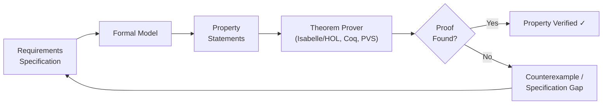
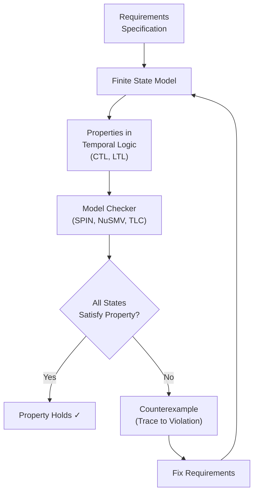
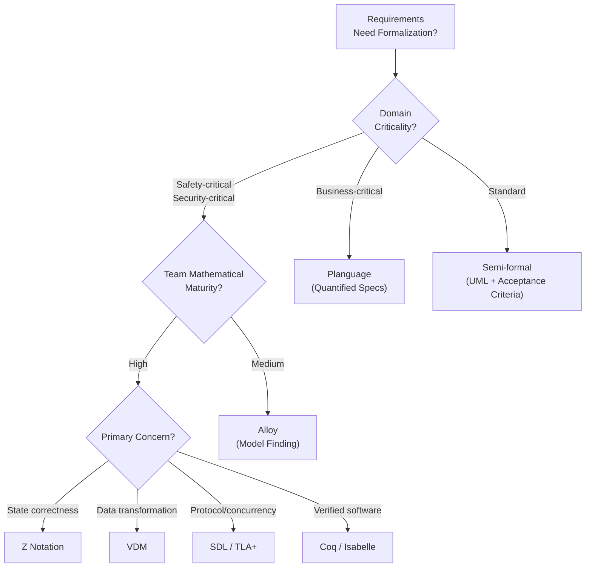

---
tags:
  - requirements
  - formal-specification
  - formal-methods
  - z-notation
  - vdm
  - sdl
  - alloy
  - swebok-ka01
  - software-requirements
source: "SWEBOK v4 Chapter 01 (KA 01.4)"
chapter: "Section 1.4: Formal Requirements Specification"
created: 2026-07-21
updated: 2026-07-21
aliases:
  - Formal Requirements Spec
  - Formal Specification Techniques
  - Z Notation for Requirements
---

# Formal Requirements Specification (SWEBOK KA 01.4)

> *"A specification is a contract between the software engineer and the customer. If the contract is ambiguous, both parties lose."*

Formal specification techniques bring **mathematical precision** to requirements documents, eliminating the ambiguity that plagues natural language. This note focuses on formal methods **as applied to requirements specification** — distinct from formal methods used for design verification or implementation correctness. For formal methods in general software engineering, see [[../11_Software_Engineering_Models_and_Methods/07_Formal_Methods|Formal Methods (KA 11.9)]].

---

## 1 | Why Formalize Requirements?

### 1.1 The Ambiguity Problem

Natural language requirements suffer from well-documented weaknesses:

| Weakness | Example | Impact |
|----------|---------|--------|
| **Ambiguity** | "The system shall respond quickly" | How fast is "quickly"? |
| **Incompleteness** | No behavior specified for edge cases | Undefined behavior discovered late |
| **Inconsistency** | Two requirements contradict each other | Designers must guess intent |
| **Vagueness** | "User-friendly interface" | No testable criterion |
| **Volatility** | Requirements shift as stakeholders reinterpret prose | Scope creep disguised as clarification |

> [!warning] Ambiguity is the #1 source of requirements defects. Studies show that 30–50% of requirements errors stem from ambiguous or incomplete specifications (Davis 1993; Hull et al. 2005).

### 1.2 Formal vs. Informal vs. Semi-Formal

| Level | Notation | Defect Detection | Cost | When to Use |
|-------|----------|-----------------|------|-------------|
| **Informal** | Natural language | Low (requires review) | Low | Most requirements documents |
| **Semi-formal** | UML, SysML, BPMN | Medium (structure helps) | Medium | Architecture-level specs |
| **Lightweight formal** | Alloy, Design by Contract, TLA+ | High (tool-checked) | Medium-High | Critical subsystems |
| **Fully formal** | Z, VDM, B, Event-B | Very High (provable) | High | Safety/security-critical components |

> [!tip] The goal is not to formalize everything. Apply formal specification **selectively** to requirements that are high-risk, safety-critical, or historically prone to ambiguity. See [[11_Tools_Process_Improvement_and_Risk|Risk Management]] for risk-based approaches.

### 1.3 Benefits in the Requirements Context

Formal specification of requirements yields:

- **Unambiguous communication** between stakeholders, analysts, and developers
- **Early inconsistency detection** through type checking and theorem proving
- **Executable models** that stakeholders can validate through simulation
- **Traceable verification** — each requirement maps to a formal property
- **Change impact analysis** — modifying a formal spec reveals all affected properties

---

## 2 | Z Notation for Requirements Specification

### 2.1 Overview

**Z** (pronounced "zed") is a formal specification language based on **set theory** and **first-order predicate logic**, developed at Oxford University in the late 1970s. It uses **schemas** — structured boxes that describe system state and operations — to build requirements models.

### 2.2 Core Concepts

#### Schemas

A Z schema consists of a **signature** (declared variables and their types) and a **predicate** (constraints over those variables).

```
┌──────────────────────────────┐
│      ATM_System               │
├──────────────────────────────┤
│ accounts : ACCOUNT → ℕ        │
│ dispensed : ℕ                 │
│ cardInserted : BOOL           │
├──────────────────────────────┤
│ ∀ a : dom accounts ·          │
│   accounts(a) ≥ 0             │
│ dispensed ≥ 0                 │
└──────────────────────────────┘
```

#### State Machine View

Z naturally models system state transitions, making it ideal for specifying **stateful requirements**:

```
┌──────────────────────────────┐
│   Withdraw_OK                 │
├──────────────────────────────┤
│ ΔATM_System                   │
│ amount? : ℕ                   │
│ account? : ACCOUNT            │
├──────────────────────────────┤
│ account? ∈ dom accounts       │
│ amount? > 0                   │
│ accounts(account?) ≥ amount?  │
│ accounts' = accounts ⊕        │
│   {account? ↦ accounts(account?) - amount?} │
│ dispensed' = amount?          │
└──────────────────────────────┘
```

The **Δ** prefix indicates the schema modifies state. The **?** suffix marks input variables. Primed variables (e.g., `accounts'`) represent post-operation state.

#### Operations and Preconditions

Z operations have explicit preconditions. If a precondition is violated, the behavior is **undefined** — this is a deliberate design choice that forces specifiers to handle all failure modes explicitly.

```
┌──────────────────────────────┐
│   Withdraw_Fail               │
├──────────────────────────────┤
│ ΔATM_System                   │
│ amount? : ℕ                   │
│ account? : ACCOUNT            │
├──────────────────────────────┤
│ account? ∈ dom accounts       │
│ accounts(account?) < amount?  │
│ accounts' = accounts          │
│ dispensed' = 0                │
└──────────────────────────────┘
```

### 2.3 Applying Z to Requirements

| Requirements Aspect | Z Technique |
|-------------------|-------------|
| Data model | Set-theoretic declarations in schemas |
| Business rules | Predicates within schemas |
| Stateful behavior | Δ-schemas for state transitions |
| Operations | Operation schemas with pre/post-conditions |
| Error handling | Separate error schemas |
| Refinement | Schema inclusion and composition |

### 2.4 Strengths and Limitations

| Strengths | Limitations |
|-----------|-------------|
| Precise, unambiguous | Steep learning curve for stakeholders |
| Supports proof of properties | Requires mathematical maturity |
| Well-defined tool support (Z/EVES, CZT) | Specifications can be verbose |
| ISO standard (ISO 13568:2002) | Difficult to scale to very large systems |
| Strong academic foundation | Not executable without translation |

> [!example] **Z in Practice**: The IBM CICS transaction processing system used Z specifications to verify that system upgrades preserved backward compatibility. The Z specification revealed 3 latent design inconsistencies that had survived 18 months of code review (Bowen and Hinchey 1995).

---

## 3 | VDM: Vienna Development Method

### 3.1 Overview

**VDM** (Vienna Development Method) is a family of formal specification languages developed at IBM's Vienna laboratory. The most widely used variant is **VDM-SL** (Specification Language), standardized as ISO 13817-1. VDM specifies systems through **data types**, **functions**, and **operations** with explicit pre- and post-conditions.

### 3.2 Core Concepts

#### Types and Invariants

```vdm
types
  Account = compose Account of
    owner   : Token
    balance : nat
    inv mk_Account(o, b) == b >= 0;
```

The **invariant** (inv) is a type-level constraint that holds at all times — every requirement must preserve it.

#### Functions and Operations

```vdm
functions
  withdraw: Account * nat -> Account
  withdraw(acc, amount) ==
    mk_Account(acc.owner, acc.balance - amount)
  pre acc.balance >= amount
  post RESULT.balance = acc.balance - amount;
```

#### State and Operations with Side Effects

```vdm
state BankState of
  accounts : map Token to Account
  inv s == forall a in set rng s & a.balance >= 0
end

operations
  process_withdrawal: Token * nat ==> ()
  process_withdrawal(acct_id, amount) ==
    accounts(acct_id) := withdraw(accounts(acct_id), amount)
  pre acct_id in set dom accounts and
      accounts(acct_id).balance >= amount
  post accounts = accounts~ ++ {acct_id |-> 
        mk_Account(accounts~(acct_id).owner,
                   accounts~(acct_id).balance - amount)};
```

### 3.3 VDM vs. Z for Requirements

| Aspect | Z | VDM-SL |
|--------|---|--------|
| Foundation | Set theory + predicate logic | Typed higher-order logic |
| Structure | Schemas (boxes) | Modules, types, functions |
| Style | State-centric | Function/operation-centric |
| Invariants | Embedded in schema predicates | Explicit type invariants |
| Refinement | Schema composition | Data reification |
| ISO Standard | ISO 13568 | ISO 13817 |
| Tool Support | Z/EVES, CZT | VDMTools, Overture |

### 3.4 VDM++ and VDM-RT

Modern VDM extends to object-oriented (VDM++) and real-time (VDM-RT) domains, enabling:

- **Class-based** requirements for OO systems
- **Concurrency** specifications for distributed systems
- **Timing constraints** for real-time requirements
- **Executable models** for prototyping and validation

> [!tip] Use VDM when requirements involve **complex data transformations** and **algebraic properties** (e.g., compiler specifications, data pipeline correctness). Use Z when requirements are **state-centric** (e.g., protocol specifications, system state machines).

---

## 4 | SDL: Specification and Description Language

### 4.1 Overview

**SDL** (Specification and Description Language) is an ITU-T standard (Z.100) for specifying **reactive**, **event-driven**, and **distributed** systems. Originally developed for telecommunications protocol specification, SDL is particularly suited to requirements involving **message passing**, **concurrency**, and **state machines**.

### 4.2 Core Concepts

SDL models systems as hierarchies of:

| Concept | Description | Use in Requirements |
|---------|-------------|---------------------|
| **System** | Top-level block containing the entire specification | System boundary |
| **Block** | Subsystem partition | Functional areas |
| **Process** | Communicating finite state machine | Concurrent behaviors |
| **Signal** | Message passed between processes | Inter-component communication |
| **State** | Waiting point for signals | System states |
| **Input** | Signal received at a state | Triggering events |
| **Output** | Signal sent | System responses |
| **Decision** | Conditional branching | Business rule evaluation |

### 4.3 SDL Diagram Example

```
┌─────────────────────────────────────────────────────┐
│ System: ATM                                          │
│ ┌──────────────┐  ┌──────────────┐                  │
│ │ Block:       │  │ Block:       │                  │
│ │ CardReader   │  │ CashDispenser│                  │
│ │ ┌──────────┐ │  │ ┌──────────┐ │                  │
│ │ │ Process: │ │  │ │ Process: │ │                  │
│ │ │ CardMgr  │ │  │ │ Dispenser│ │                  │
│ │ │          │ │  │ │          │ │                  │
│ │ │ [idle]───┤ │  │ │ [ready]──┤ │                  │
│ │ │   │      │ │  │ │   │      │ │                  │
│ │ │ card_in   │ │  │ │ dispense  │ │                  │
│ │ │   ↓      │ │  │ │   ↓      │ │                  │
│ │ │ [reading] │ │  │ │ [busy]   │ │                  │
│ │ └──────────┘ │  │ └──────────┘ │                  │
│ └──────────────┘  └──────────────┘                  │
└─────────────────────────────────────────────────────┘
```

### 4.4 SDL for Requirements

SDL is well-suited for requirements involving:

- **Protocol specification**: telecommunications, network, IoT protocols
- **Concurrent systems**: multi-agent, distributed architectures
- **Event-driven systems**: GUIs, message brokers, reactive applications
- **Standardization**: ITU-T and ETSI mandate SDL for protocol specification

| Advantage | Limitation |
|-----------|-----------|
| Visual and textual dual notation | Primarily designed for telecom domain |
| Strong concurrency model | Steep learning curve |
| Executable (simulation tools available) | Limited academic tooling outside telecom |
| International standard (ITU-T Z.100) | Heavy-weight for simple requirements |
| Supports hierarchy and abstraction | Less suited for data-centric requirements |

---

## 5 | Planguage: Quantified Requirements Specification

### 5.1 Overview

**Planguage** (Plan Language) is Tom Gilb's **quantified specification language** designed specifically for requirements. Unlike mathematical formal methods, Planguage is a **structured natural language** that enforces precision through mandatory fields — making it accessible to stakeholders while still eliminating ambiguity.

### 5.2 Core Structure

A Planguage requirement has:

```planguage
Scale: [The measurement scale, e.g., "seconds", "transactions/hour", "%"]

Meter: [How the scale is measured, e.g., "average response time measured 
        at application layer under 100 concurrent users"]

Must: [Minimum acceptable level - non-negotiable constraint]

Plan: [Planned target - the level we aim for]

Wish: [Stretch goal - aspirational level]

Stakeholder: [Who cares about this requirement]

Priority: [Relative importance: Critical, High, Medium, Low]

Status: [Current state: Draft, Agreed, Tested, Achieved]
```

### 5.3 Example: Planguage Requirements

**Performance Requirement:**

```planguage
Response Time.
Scale: milliseconds, average response time at application layer.
Meter: measured under 500 concurrent users, P95 percentile.
Must: ≤ 2000 ms.
Plan: ≤ 500 ms.
Wish: ≤ 200 ms.
Stakeholder: End users, operations team.
Priority: High.
Status: Draft.
Rationale: Google found that 53% of mobile users abandon sites 
           that take longer than 3 seconds to load.
```

**Availability Requirement:**

```planguage
System Availability.
Scale: percentage uptime per calendar year, excluding scheduled 
       maintenance windows.
Meter: measured by monitoring system, aggregated monthly.
Must: ≥ 99.9% (8.76 hours downtime/year).
Plan: ≥ 99.99% (52.56 minutes downtime/year).
Wish: ≥ 99.999% (5.26 minutes downtime/year).
Stakeholder: Operations, business continuity, customers.
Priority: Critical.
Status: Agreed.
```

### 5.4 Why Planguage Works

| Feature | Benefit |
|---------|---------|
| **Explicit scale** | No ambiguity about "performance" — which metric? |
| **Must/Plan/Wish levels** | Eliminates "as fast as possible" vagueness |
| **Meter** | Defines measurement method — testable immediately |
| **Stakeholder** | Ensures someone owns the requirement |
| **Rationale** | Justifies the requirement — supports prioritization |
| **Quantification** | Every requirement becomes testable |

> [!tip] Planguage is the most **practical** formal specification technique for requirements. It requires no mathematical training, yet produces quantified, testable, stakeholder-owned requirements. Start here before moving to mathematical formalisms.

### 5.5 Planguage vs. Traditional Requirements

| Traditional | Planguage |
|-------------|-----------|
| "The system shall be fast" | Response Time: Must ≤ 2000ms, Plan ≤ 500ms |
| "The system shall be reliable" | Availability: Must ≥ 99.9%, Plan ≥ 99.99% |
| "The system shall support many users" | Concurrency: Must ≥ 1000, Plan ≥ 5000 simultaneous sessions |
| "The interface shall be user-friendly" | Learnability: Must ≤ 30min training for new users, Plan ≤ 10min |

---

## 6 | Theorem Proving for Requirements Verification

### 6.1 Concept

Theorem proving applies **mathematical reasoning** to verify that a requirements specification satisfies desired properties. Unlike testing, which checks specific scenarios, theorem proving establishes properties for **all possible inputs and states**.

### 6.2 Process



### 6.3 What Can Be Proved About Requirements

| Property | Example |
|----------|---------|
| **Consistency** | No two requirements contradict each other |
| **Completeness** | All states have defined behavior (no deadlocks) |
| **Non-vacuity** | The specification is satisfiable by at least one implementation |
| **Safety properties** | "The system never enters an unsafe state" |
| **Liveness properties** | "Every request is eventually served" |
| **Refinement** | A detailed spec correctly implements an abstract spec |

### 6.4 Practical Theorem Provers for Requirements

| Prover | Type | Best For |
|--------|------|----------|
| **Isabelle/HOL** | Interactive | General-purpose verification, large theories |
| **Coq** | Interactive (constructive) | Verified software, proofs-as-programs |
| **PVS** | Interactive | Aerospace, protocol verification |
| **TLA+ / TLC** | Model checker + prover | Concurrent/distributed systems (Lamport) |
| **Alloy Analyzer** | SAT-based model finder | Requirements modeling, counterexample generation |

> [!warning] Theorem proving is **labor-intensive**. Reserve it for the most critical requirements — safety properties, security invariants, protocol correctness. For most requirements, lighter techniques (Planguage, Design by Contract) suffice.

---

## 7 | Model Checking for Requirements Consistency

### 7.1 Concept

Model checking **exhaustively explores all reachable states** of a finite-state model to verify that specified properties hold. Unlike theorem proving, model checking is **fully automatic** — but requires a finite (or abstractable-to-finite) state space.

### 7.2 Process



### 7.3 Temporal Logic Properties for Requirements

| Property Type | Formula (CTL) | Meaning |
|--------------|---------------|---------|
| **Safety** | `AG ¬deadlock` | No deadlock is ever reachable |
| **Safety** | `AG (request → AF response)` | Every request eventually gets a response |
| **Liveness** | `AF (task_complete)` | The task is eventually completed |
| **Invariant** | `AG (balance ≥ 0)` | Balance never goes negative |
| **Reachability** | `EF (state = error)` | An error state is reachable (often a bug) |

### 7.4 Model Checkers for Requirements Analysis

| Tool | Input | Strengths |
|------|-------|-----------|
| **SPIN** | Promela models | Concurrent systems, infinite-state via abstractions |
| **NuSMV** | SMV models, CTL/LTL | Hardware and protocol verification |
| **TLC** | TLA+ specifications | Distributed systems (Lamport's TLA+) |
| **UPPAAL** | Timed automata | Real-time systems |
| **PRISM** | Probabilistic models | Stochastic requirements |

### 7.5 State Space Explosion

The main limitation of model checking is **state space explosion**: the number of states grows exponentially with the number of variables and concurrent components. Mitigation techniques:

| Technique | Description |
|-----------|-------------|
| **Abstraction** | Replace concrete data types with abstract domains |
| **Symmetry reduction** | Exploit symmetry in system components |
| **Partial order reduction** | Explore only interleavings that affect the property |
| **Bounded model checking** | Check properties up to a given depth |
| **Compositional verification** | Verify components separately, compose results |

---

## 8 | Lightweight Formal Methods: Alloy for Requirements

### 8.1 Overview

**Alloy** (MIT, Daniel Jackson) is a **lightweight formal language** and **model finder** designed for requirements modeling. It occupies a middle ground: more rigorous than UML, less costly than full theorem proving. Alloy's key innovation is **counterexample generation** — rather than proving properties, it searches for violations and presents concrete examples.

### 8.2 Alloy's Approach to Requirements

```alloy
-- Data model
sig Account {
    balance: Int,
    owner: one Person
}

sig Person {}

-- Fact: balance invariant
fact BalanceNonNegative {
    all a: Account | a.balance >= 0
}

-- Operation: withdrawal
pred withdraw[a, a': Account, amount: Int] {
    a.balance >= amount
    a'.balance = minus[a.balance, amount]
    a'.owner = a.owner
}

-- Assertion: no account goes negative
assert NoNegativeBalance {
    all a, a': Account, amount: Int |
        withdraw[a, a', amount] implies a'.balance >= 0
}

-- Check: find counterexample
check NoNegativeBalance for 5
```

### 8.3 Why Alloy Excels for Requirements

| Feature | Benefit for Requirements |
|---------|------------------------|
| **Model finder** | Generates concrete scenarios — stakeholders can validate them |
| **Counterexample generation** | Finds requirement inconsistencies automatically |
| **Lightweight syntax** | Easier to learn than Z or VDM |
| **Scope-bounded analysis** | Checks all instances up to a given size — fast, practical |
| **Visualization** | Alloy Analyzer renders instances as graphs |
| **Iterative** | Rapid exploration of requirement spaces |

### 8.4 Alloy vs. Traditional Formal Methods

| Aspect | Alloy | Z/VDM/B | Theorem Provers |
|--------|-------|---------|-----------------|
| Analysis method | SAT-based model finding | Proof-based | Proof-based |
| Automation | Fully automatic | Semi-automatic | Mostly manual |
| Feedback | Concrete counterexamples | Proof obligations | Proof scripts |
| Scalability | Bounded but fast | Unbounded but slow | Unbounded but very slow |
| Learning curve | Low-Medium | Medium-High | High |
| Best for | Requirements exploration, consistency | Design verification | Critical properties |

> [!tip] Alloy is the **recommended entry point** for teams new to formal requirements specification. Install the [Alloy Analyzer](https://alloytools.org/), model your requirements as signatures and facts, and use the model finder to discover inconsistencies before they become defects.

---

## 9 | Design by Contract for Requirements

### 9.1 Overview

**Design by Contract (DbC)**, introduced by Bertrand Meyer for the Eiffel language, specifies requirements as **preconditions**, **postconditions**, and **invariants** attached to operations. While technically a design/implementation technique, DbC is increasingly used as a **lightweight formal requirements notation**.

### 9.2 Contract Structure

| Component | Meaning | Requirements Role |
|-----------|---------|-------------------|
| **Precondition** (requires) | What must be true before an operation | Defines valid inputs and system state |
| **Postcondition** (ensures) | What must be true after the operation | Defines expected behavior and outcomes |
| **Invariant** | What must always be true | Defines system-wide constraints |

### 9.3 Example: Requirements as Contracts

```python
class AccountService:
    """
    INVARIANT: forall a in accounts: a.balance >= 0
    INVARIANT: forall a in accounts: a.owner is not None
    """
    
    def transfer(self, source_id: int, target_id: int, amount: int):
        """
        PRECONDITION: source_id in self.accounts
        PRECONDITION: target_id in self.accounts
        PRECONDITION: source_id != target_id
        PRECONDITION: amount > 0
        PRECONDITION: self.accounts[source_id].balance >= amount
        
        POSTCONDITION: self.accounts[source_id].balance == 
                        old(self.accounts[source_id].balance) - amount
        POSTCONDITION: self.accounts[target_id].balance == 
                        old(self.accounts[target_id].balance) + amount
        POSTCONDITION: sum of all balances is unchanged
        """
```

### 9.4 DbC in Requirements Documents

Use contracts as **structured acceptance criteria**:

```markdown
## REQ-004: Fund Transfer

### Contracts

**Preconditions:**
- Source account exists and is active
- Target account exists and is active
- Source and target are different accounts
- Transfer amount > 0
- Source account balance ≥ transfer amount

**Postconditions:**
- Source balance decreased by transfer amount
- Target balance increased by transfer amount
- Total system balance unchanged
- Transfer recorded in audit log

**Invariants:**
- No account balance < 0
- All accounts have an owner
```

---

## 10 | Choosing the Right Formalism

### 10.1 Decision Framework



### 10.2 Comparison Matrix

| Criterion | Planguage | Alloy | Z | VDM | SDL | TLA+ | DbC |
|-----------|-----------|-------|---|-----|-----|------|-----|
| **Learning curve** | Low | Medium | High | High | Medium | High | Low |
| **Stakeholder access** | High | Medium | Low | Low | Medium | Low | Medium |
| **Tool support** | Templates | Alloy Analyzer | CZT, Z/EVES | Overture | Telelogic | TLA+ Toolbox | Language-native |
| **Automation** | Manual | High | Medium | Medium | Medium | High | Runtime |
| **Best for** | All requirements | Requirements exploration | State systems | Data transforms | Protocols | Distributed systems | API/interface specs |
| **Standard** | — | — | ISO 13568 | ISO 13817 | ITU-T Z.100 | — | — |
| **Cost** | Low | Medium | High | High | Medium | Medium | Low |

### 10.3 Recommended Adoption Strategy

| Phase | Action | Formalism |
|-------|--------|-----------|
| **1. Baseline** | Quantify all requirements with explicit scales | Planguage |
| **2. Critical subset** | Model-check high-risk requirements | Alloy |
| **3. Protocol/concurrency** | Verify concurrent behaviors | TLA+ / SDL |
| **4. Safety-critical** | Full formal proof of safety properties | Z / VDM + Theorem Proving |
| **5. Continuous** | Embed contracts in code for runtime verification | Design by Contract |

---

## 11 | Relationship to Requirements Activities

| Requirements Activity | Formal Technique Support |
|----------------------|-------------------------|
| [[01_Requirements_Fundamentals|Requirements Fundamentals]] | Formal specs clarify what a "requirement" is — precise, testable, unambiguous |
| [[03_Requirements_Elicitation|Elicitation]] | Formal models surface missing requirements during construction |
| [[06_Requirements_Modeling|Modeling]] | Z/VDM schemas complement UML models with precision |
| [[08_Prioritization_Validation_and_Reuse|Validation]] | Theorem proving and model checking validate requirements before implementation |
| [[10_Requirements_Management|Management]] | Formal specs enable precise change impact analysis |
| [[../11_Software_Engineering_Models_and_Methods/07_Formal_Methods|Formal Methods (KA 11.9)]] | Full treatment of formal methods across the software lifecycle |

---

## 12 | Key Takeaways

1. **Formalize selectively** — apply formal techniques to the most critical, ambiguous, or error-prone requirements, not to everything.
2. **Start with Planguage** — the lowest barrier to entry with the highest impact on requirements quality.
3. **Use Alloy for exploration** — model finding generates concrete counterexamples that stakeholders understand.
4. **Reserve Z/VDM for safety-critical** — full formal specification is justified when failure costs lives or significant money.
5. **Model checking finds bugs automatically** — TLA+ and SPIN explore all states within a bounded scope.
6. **Design by Contract bridges requirements and code** — preconditions and postconditions are requirements that execute.
7. **Formal specs are living documents** — they must evolve with requirements; treat them as specifications, not proofs done once.

---

## References

- Bowen, J.P. and Hinchey, M.G. (1995). "Ten Commandments of Formal Methods." *IEEE Computer*, 28(4), 56-63.
- Davis, A.M. (1993). *Software Requirements: Objects, Functions, and States*. Prentice Hall.
- Gilb, T. (2005). *Competitive Engineering*. Butterworth-Heinemann.
- Hull, E., Jackson, K., and Dick, J. (2005). *Requirements Engineering*, 2nd ed. Springer.
- Jackson, D. (2006). *Software Abstractions: Logic, Language, and Analysis*. MIT Press.
- Meyer, B. (1997). *Object-Oriented Software Construction*, 2nd ed. Prentice Hall.
- Spivey, J.M. (1992). *The Z Notation: A Reference Manual*, 2nd ed. Prentice Hall.
- SWEBOK v4 (2024). Chapter 1: Software Requirements. IEEE.
