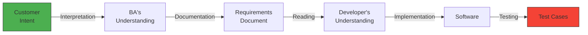
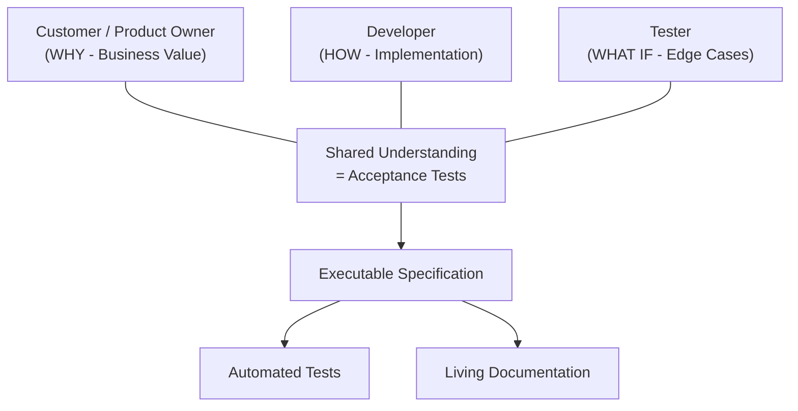
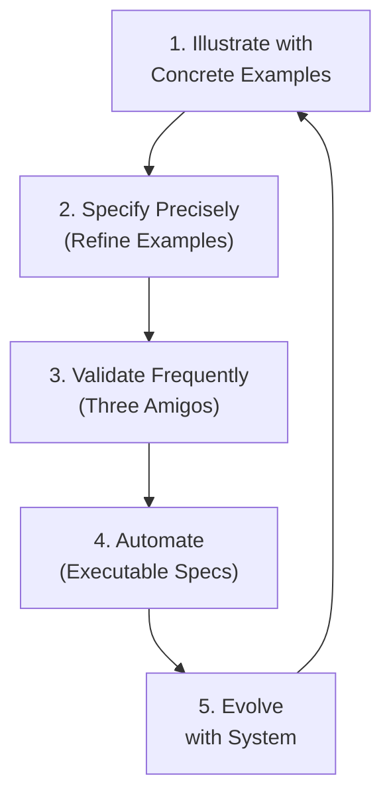
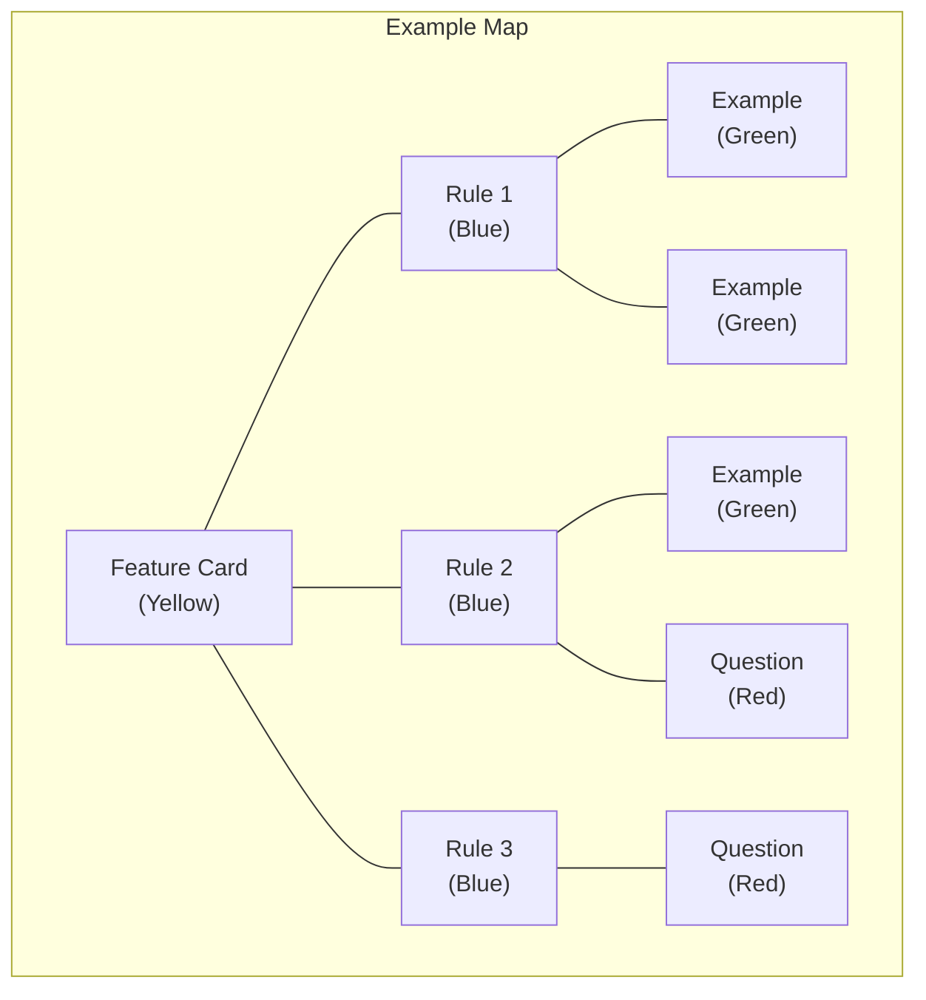
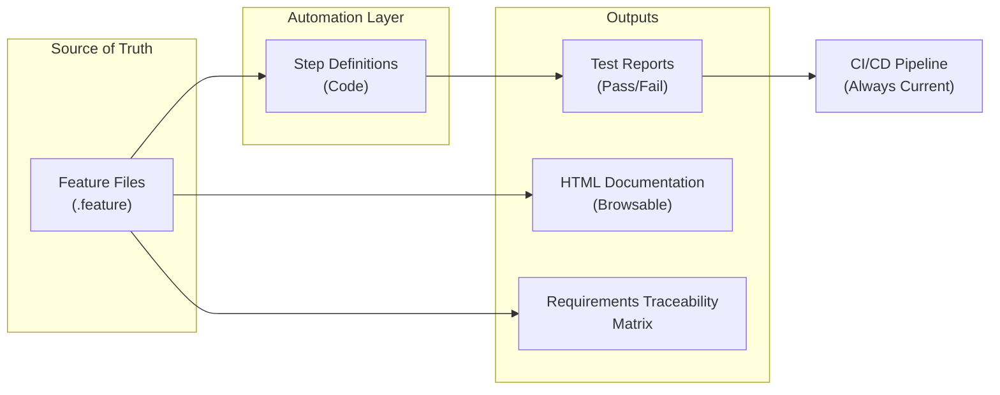
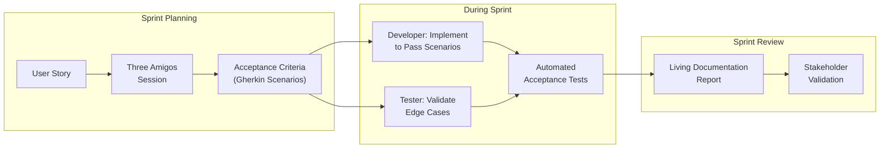
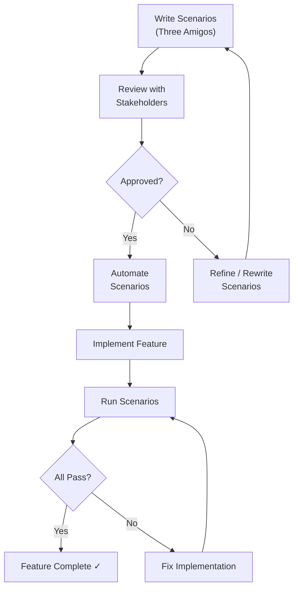

---
tags:
  - requirements
  - bdd
  - atdd
  - acceptance-testing
  - agile
  - specification-by-example
  - gherkin
  - swebok-ka01
  - software-requirements
source: "SWEBOK v4 Chapter 01 (KA 01.4-01.5)"
chapter: "Section 1.4-1.5: ATDD, BDD, and Acceptance Criteria"
created: 2026-07-21
updated: 2026-07-21
aliases:
  - ATDD
  - BDD
  - Behavior-Driven Development
  - Acceptance Test-Driven Development
  - Specification by Example
---

# ATDD, BDD, and Acceptance (SWEBOK KA 01.4-01.5)

> *"The single biggest problem in communication is the illusion that it has taken place."*
> — George Bernard Shaw

**Behavior-Driven Development (BDD)** and **Acceptance Test-Driven Development (ATDD)** are specification paradigms that treat requirements as **executable examples**. Rather than writing requirements in prose and testing them later, BDD/ATDD define requirements as concrete, automatable scenarios — closing the gap between "what the customer said" and "what the developer built."

---

## 1 | From Requirements to Executable Specifications

### 1.1 The Specification Gap

Traditional requirements workflows suffer from information loss at every handoff:



Each arrow is a **translation** — and each translation introduces potential misinterpretation. BDD eliminates most of these arrows by making the specification itself executable.

### 1.2 The BDD Insight

Dan North (2006) observed that developers don't write tests — they **specify behavior**. The shift:

| Traditional Thinking | BDD Thinking |
|---------------------|--------------|
| "Write a test for the login" | "Specify how login behaves" |
| "Test that the cart works" | "Describe what the cart does" |
| "Is this requirement testable?" | "This requirement IS the test" |
| Testing is verification | Specification is communication |

### 1.3 ATDD: The Triad

**ATDD** (Acceptance Test-Driven Development) involves three roles collaborating **before** coding begins:



> [!tip] The key ATDD practice is the **"Three Amigos" meeting**: customer, developer, and tester collaborate to write acceptance criteria before any code is written. This single practice catches more requirements defects than any review process.

---

## 2 | Given/When/Then: The Ubiquitous Language

### 2.1 Structure

The **Given/When/Then** format (also called Gherkin syntax) provides a structured template for specifying behavior:

```gherkin
Feature: Fund Transfer
  As a bank customer
  I want to transfer funds between accounts
  So that I can manage my money efficiently

  Scenario: Successful transfer between own accounts
    Given I have an account "Checking" with balance $1000
    And I have an account "Savings" with balance $5000
    When I transfer $200 from "Checking" to "Savings"
    Then the "Checking" balance should be $800
    And the "Savings" balance should be $5200
    And a transfer record should be created
```

### 2.2 Component Meanings

| Component | Purpose | Requirements Role |
|-----------|---------|-------------------|
| **Feature** | High-level capability | Maps to a requirement or user story |
| **As a...** | The persona/role | Identifies the stakeholder |
| **I want to...** | The desired action | States the functional requirement |
| **So that...** | The business value | Justifies the requirement (prioritization) |
| **Scenario** | A specific example | One concrete testable instance |
| **Given** | Precondition / initial state | System state before the action |
| **When** | The action/trigger | The stimulus or user action |
| **Then** | Expected outcome | The verifiable result |
| **And/But** | Additional clauses | Extends any section |

### 2.3 Anatomy of a Good Scenario

```gherkin
Scenario: Transfer with insufficient funds
  Given I have an account "Checking" with balance $100
  And I have an account "Savings" with balance $5000
  When I attempt to transfer $500 from "Checking" to "Savings"
  Then the transfer should be rejected
  And I should see error message "Insufficient funds"
  And the "Checking" balance should remain $100
  And the "Savings" balance should remain $5000
  And no transfer record should be created
```

**What makes this good:**

| Quality Criterion | How This Scenario Meets It |
|-------------------|---------------------------|
| **Specific** | Exact amounts, exact account names |
| **Complete** | Covers all affected system state |
| **Testable** | Every "Then" can be automated |
| **Independent** | Scenario stands alone, no hidden dependencies |
| **Realistic** | Uses actual business terms, not technical jargon |

### 2.4 Scenario Outline: Data-Driven Specifications

When multiple examples share the same structure:

```gherkin
Scenario Outline: Transfer validation
  Given I have account "<source>" with balance <source_balance>
  And I have account "<target>" with balance <target_balance>
  When I transfer <amount> from "<source>" to "<target>"
  Then the result should be <result>
  And the message should be "<message>"

  Examples:
    | source   | source_balance | target  | target_balance | amount | result  | message              |
    | Checking | 1000           | Savings | 5000           | 200    | success | Transfer complete    |
    | Checking | 100            | Savings | 5000           | 500    | failure | Insufficient funds   |
    | Checking | 1000           | Checking| 1000           | 100    | failure | Cannot transfer to self |
    | Checking | 1000           | Savings | 5000           | 0      | failure | Amount must be positive |
    | Checking | 1000           | Savings | 5000           | -100   | failure | Amount must be positive |
```

> [!tip] Scenario Outlines are the BDD equivalent of **equivalence partitioning** and **boundary value analysis** — but expressed in business language that stakeholders can read and validate.

---

## 3 | Gherkin Syntax Deep Dive

### 3.1 Full Gherkin Reference

| Keyword | Purpose | Example |
|---------|---------|---------|
| `Feature` | Groups related scenarios | `Feature: User Authentication` |
| `Rule` | Business rule within a feature (Gherkin 6+) | `Rule: Password must meet complexity requirements` |
| `Background` | Shared preconditions for all scenarios | `Background: Given the system is running` |
| `Scenario` | A single testable example | `Scenario: Valid login` |
| `Scenario Outline` | Template with data tables | `Scenario Outline: Login attempts` |
| `Examples` | Data table for outline | `Examples: (table)` |
| `Given` | Initial state | `Given I am on the login page` |
| `When` | Action or event | `When I enter valid credentials` |
| `Then` | Expected outcome | `Then I should see the dashboard` |
| `And` | Additional step | `And I should receive a welcome email` |
| `But` | Negative/additional step | `But I should not see admin options` |
| `*` | Bullet list alternative | `* I am on the login page` |
| `"""` (Doc String) | Multi-line text | Inline documentation |
| `\|` (Data Table) | Tabular data | Parameters for steps |

### 3.2 Best Practices for Gherkin

**DO:**

| Practice | Example |
|----------|---------|
| Use **declarative** voice | `When I submit the order` (not `When I click the Submit button`) |
| Write in **business domain** language | `Given the customer has a premium account` |
| Keep scenarios **independent** | Each scenario sets up its own state |
| Use **consistent terminology** | Same terms as [[01_Requirements_Fundamentals|requirements glossary]] |
| One **When** per scenario | Multiple actions in one scenario = unclear cause/effect |
| **5-7 steps** maximum | More steps = scenario is doing too much |

**DON'T:**

| Anti-pattern | Why It's Bad |
|-------------|-------------|
| `When I click the blue button at the top right` | UI implementation detail — change the UI, break the spec |
| `Then the database should have a record` | Technical detail — specify observable behavior instead |
| Multiple `When` steps | Ambiguous: which action caused the result? |
| `Given/When/Then` in wrong order | Confuses preconditions with actions |
| Scenarios longer than 10 steps | Hard to understand, debug, and maintain |
| Shared state between scenarios | Creates test interdependencies and flaky results |

### 3.3 Gherkin as a Requirements Language

| Traditional Requirement | Gherkin Equivalent |
|------------------------|-------------------|
| "The system shall validate email format" | `When I enter email "invalid" Then I should see error "Invalid email format"` |
| "Users with role Admin can delete records" | `Given I am logged in as Admin When I delete record #42 Then record #42 should be removed` |
| "Password must be 8+ characters with special chars" | `Given I am registering When I enter password "abc" Then I should see "Password must be at least 8 characters"` |

---

## 4 | Specification by Example

### 4.1 The Approach

**Specification by Example** (SBE), formalized by Gojko Adzic (2011), is the broader practice that BDD/ATDD implement. The core cycle:



### 4.2 Example Mapping

**Example Mapping** (Matt Wynne, 2015) is a structured workshop technique for discovering requirements through examples:



| Card Color | Content | Action |
|-----------|---------|--------|
| **Yellow** (top) | The feature/story being discussed | Scope |
| **Blue** (rules) | Business rules that govern the feature | Rules discovered through examples |
| **Green** (examples) | Concrete examples illustrating rules | Become scenarios |
| **Red** (questions) | Open questions, unresolved ambiguity | Escalate to stakeholders |

> [!tip] When a **red card** appears, the team has found **genuine ambiguity** in the requirements. Stop writing examples and resolve the question. This is SBE's most powerful mechanism for defect prevention.

### 4.3 From Examples to Scenarios: Workshop Flow

| Step | Activity | Duration | Output |
|------|----------|----------|--------|
| 1 | Present the feature/story | 2 min | Shared context |
| 2 | Each participant writes examples on sticky notes | 5 min | Diverse perspectives |
| 3 | Group examples by business rule | 5 min | Rules identified |
| 4 | Identify gaps and contradictions | 10 min | Questions (red cards) |
| 5 | Write Gherkin scenarios from examples | 10 min | Executable specifications |
| 6 | Review for completeness and consistency | 5 min | Ready for automation |

**Total: ~40 minutes per feature.** This is far cheaper than discovering ambiguity during testing or production.

---

## 5 | Living Documentation

### 5.1 Concept

**Living documentation** is the idea that the executable specification IS the documentation — always current, always correct, because it's verified on every build. Outdated documentation is worse than no documentation; living documentation eliminates staleness.

### 5.2 Living Documentation Architecture



### 5.3 Documentation Generation Tools

| Tool | Platform | Output |
|------|----------|--------|
| **Cucumber Reports** | Java/Ruby/JS | HTML, JSON, JUnit XML |
| **SpecFlow+ LivingDoc** | .NET | Azure DevOps integration, HTML |
| **Pickles** | .NET | Static HTML documentation |
| **Relish** | Ruby | Hosted, browsable feature documentation |
| **Allure** | Multi-platform | Rich HTML reports with history |
| **Serenity BDD** | Java | Requirements-linked test reports |

### 5.4 Example: Living Documentation Output

From the feature file:

```gherkin
Feature: Fund Transfer
  As a bank customer
  I want to transfer funds between my accounts
  So that I can manage my money efficiently

  ✅ Scenario: Successful transfer between own accounts
  ✅ Scenario: Transfer with insufficient funds
  ✅ Scenario: Transfer to same account (rejected)
  ❌ Scenario: Transfer with daily limit exceeded (FAILED)
  ⏳ Scenario: Transfer during maintenance window (PENDING)
```

This report is **generated on every build** — it's the requirements document, the test report, and the progress tracker, all in one.

---

## 6 | BDD in Agile Workflows

### 6.1 BDD in the Sprint Cycle



### 6.2 BDD and User Stories

A standard user story format enhanced with BDD:

```markdown
## Story: Transfer Funds Between Accounts

**As a** bank customer
**I want to** transfer funds between my accounts
**So that** I can manage my money without visiting a branch

### Acceptance Criteria (Scenarios)

```gherkin
Scenario: Successful transfer
  Given I have "Checking" with $1000 and "Savings" with $5000
  When I transfer $200 from "Checking" to "Savings"
  Then "Checking" should have $800
  And "Savings" should have $5200

Scenario: Insufficient funds
  Given I have "Checking" with $100
  When I attempt to transfer $500 from "Checking" to "Savings"
  Then the transfer should be rejected
  And I should see "Insufficient funds"
```

### 6.3 BDD and Story Mapping

**Story mapping** (Jeff Patton) enhanced with BDD scenarios:

| Story Map Layer | BDD Contribution |
|----------------|------------------|
| **User Activities** (backbone) | Features group related scenarios |
| **User Tasks** (walking skeleton) | Each task has scenarios covering happy path + edge cases |
| **Detailed Stories** (sprint backlog) | Each story has 2-5 Gherkin scenarios as acceptance criteria |
| **Minimum Viable Product** | Scenarios that MUST pass for release |
| **Enhancements** | Additional scenarios for future sprints |

### 6.4 BDD and Definition of Done

| DoD Criterion | BDD Implementation |
|---------------|-------------------|
| Code complete | All scenarios pass |
| Tests written | Scenarios ARE the tests |
| Documentation updated | Living documentation auto-generated from passing scenarios |
| Requirements traced | Each scenario traces to a story/requirement |
| Stakeholder approved | Stakeholders reviewed scenarios before development |

---

## 7 | BDD as Defense Against Requirements Ambiguity

### 7.1 How BDD Prevents Ambiguity

| Ambiguity Type | How BDD Addresses It |
|---------------|---------------------|
| **Vague terms** ("fast", "user-friendly") | Scenarios force specific, measurable outcomes |
| **Missing edge cases** | Three Amigos session surfaces "what if" scenarios |
| **Implicit assumptions** | Given steps make all assumptions explicit |
| **Ambiguous scope** | Feature file boundaries define scope clearly |
| **Conflicting interpretations** | Stakeholder reviews scenarios before coding; conflicts surface immediately |
| **Missing non-functional requirements** | Scenarios can specify performance, security, accessibility criteria |

### 7.2 The Ambiguity Spectrum

| Requirement | Ambiguity Level | BDD Scenario |
|-------------|----------------|--------------|
| "System should be fast" | 🔴 High | N/A — need to define "fast" first |
| "Response time should be under 2 seconds" | 🟡 Medium | `Then the response should arrive within 2 seconds` |
| "API should respond in <200ms at P95 for 100 concurrent users" | 🟢 Low | `Given 100 concurrent users When each requests /api/health Then P95 latency should be < 200ms` |

### 7.3 BDD vs. Traditional Requirements Review

| Aspect | Traditional Review | BDD Specification |
|--------|-------------------|-------------------|
| **Ambiguity detection** | During review meeting (if reviewers catch it) | During scenario writing (concrete examples expose vagueness) |
| **Edge case discovery** | During test design (too late) | During Three Amigos (before coding) |
| **Stakeholder validation** | Read document, hope for understanding | Review concrete examples, validate behavior |
| **Change management** | Update document, hope everyone reads it | Update scenario, tests fail if code doesn't match |
| **Traceability** | Manual matrix maintained separately | Scenarios trace directly to code through automation |

---

## 8 | Acceptance Criteria Specification

### 8.1 Types of Acceptance Criteria

| Type | Description | Example |
|------|-------------|---------|
| **Scenario-based** (BDD) | Given/When/Then examples | Most common; see examples above |
| **Rule-based** | Checklist of rules that must hold | "Must support IE11+, Chrome, Firefox" |
| **Checklist-based** | Simple pass/fail items | "□ Error messages logged □ Audit trail created" |
| **Given/When/Then with DataTable** | Tabular data expectations | Validation rules for multiple fields |

### 8.2 Acceptance Criteria Templates

**Template 1: Simple Checklist**

```markdown
## Acceptance Criteria
- [ ] User can log in with valid credentials
- [ ] User sees error message with invalid credentials
- [ ] Account locks after 5 failed attempts
- [ ] Password reset email sent within 60 seconds
- [ ] Session expires after 30 minutes of inactivity
```

**Template 2: BDD Scenarios (Preferred)**

```gherkin
Feature: User Authentication

  Scenario: Valid login
    Given I am a registered user with email "user@example.com"
    When I log in with correct credentials
    Then I should be redirected to the dashboard
    And I should see my name in the header

  Scenario: Invalid password
    Given I am a registered user with email "user@example.com"
    When I log in with incorrect password
    Then I should see error "Invalid email or password"
    And I should remain on the login page
    And no session should be created

  Scenario: Account lockout
    Given I am a registered user with email "user@example.com"
    And I have failed login 4 times
    When I attempt to log in with incorrect password
    Then my account should be locked
    And I should see "Account locked. Contact support."
    And an alert email should be sent to "user@example.com"
```

**Template 3: Planguage-Enhanced BDD**

```gherkin
Feature: Login Performance
  # Planguage: Must ≤ 2s, Plan ≤ 500ms for login response

  Scenario: Login response time
    Given 100 concurrent users are logging in
    When each user submits valid credentials
    Then 95% of responses should arrive within 500 milliseconds
    And 100% of responses should arrive within 2000 milliseconds
```

### 8.3 Quality Criteria for Acceptance Criteria

| Criterion | Description | BDD Enforces? |
|-----------|-------------|---------------|
| **Unambiguous** | Only one interpretation possible | ✅ Concrete examples |
| **Testable** | Can be verified by inspection or automation | ✅ Executable |
| **Complete** | Covers happy path + edge cases + error cases | ✅ Multiple scenarios |
| **Feasible** | Can be implemented with available resources | ⚠️ Requires human judgment |
| **Necessary** | Traces to a business need | ✅ "So that..." clause |
| **Independent** | Doesn't depend on other criteria being met first | ⚠️ Requires careful scenario design |
| **Negotiable** | Can be refined through discussion | ✅ Living documentation |

---

## 9 | BDD Tools and Ecosystem

### 9.1 Tool Landscape

| Tool | Language | Platform | Key Feature |
|------|----------|----------|-------------|
| **Cucumber** | Java, Ruby, JS | Cross-platform | Original BDD framework; Gherkin standard |
| **SpecFlow** | C# | .NET | Visual Studio integration; LivingDoc |
| **Behave** | Python | Cross-platform | Pythonic BDD |
| **JBehave** | Java | JVM | Story-based (pre-Gherkin) |
| **Gauge** | Multi | Cross-platform | Markdown specs (not Gherkin) |
| **Concordion** | Java, .NET | Cross-platform | HTML-based executable specifications |
| **FitNesse** | Multi | Wiki-based | Collaborative specification wiki |
| **Robot Framework** | Multi | Cross-platform | Keyword-driven acceptance testing |
| **Playwright + Cucumber** | JS/TS | Cross-platform | Modern E2E BDD |

### 9.2 Gherkin Ecosystem

| Component | Purpose | Example |
|-----------|---------|---------|
| **Gherkin parser** | Parse .feature files | `gherkin` npm package, `gherkin` gem |
| **Step definitions** | Map Gherkin steps to code | `@Given("I have an account with balance ${int}")` |
| **Hooks** | Setup/teardown per scenario | `@Before`, `@After` |
| **Tags** | Filter scenarios | `@smoke`, `@wip`, `@critical` |
| **Data tables** | Tabular input | Step parameters |
| **Doc strings** | Multi-line text | JSON payloads, SQL queries |
| **World object** | Shared state within scenario | Per-scenario context |

### 9.3 Example: Cucumber + Java

**Feature file** (`transfer.feature`):

```gherkin
@banking @transfers
Feature: Fund Transfer
  As a bank customer
  I want to transfer funds between accounts
  So that I can manage my money efficiently

  Background:
    Given the banking system is running

  @happy-path
  Scenario: Successful transfer
    Given I have account "Checking" with balance 1000.00
    And I have account "Savings" with balance 5000.00
    When I transfer 200.00 from "Checking" to "Savings"
    Then account "Checking" should have balance 800.00
    And account "Savings" should have balance 5200.00

  @error-handling
  Scenario: Insufficient funds
    Given I have account "Checking" with balance 100.00
    When I attempt to transfer 500.00 from "Checking" to "Savings"
    Then the transfer should be rejected with message "Insufficient funds"
```

**Step definitions** (Java):

```java
public class TransferSteps {
    
    private AccountService accountService = new AccountService();
    private TransferResult lastResult;
    
    @Given("I have account {string} with balance {double}")
    public void iHaveAccountWithBalance(String name, double balance) {
        accountService.createAccount(name, balance);
    }
    
    @When("I transfer {double} from {string} to {string}")
    public void iTransfer(double amount, String from, String to) {
        lastResult = accountService.transfer(from, to, amount);
    }
    
    @When("I attempt to transfer {double} from {string} to {string}")
    public void iAttemptToTransfer(double amount, String from, String to) {
        lastResult = accountService.transfer(from, to, amount);
    }
    
    @Then("account {string} should have balance {double}")
    public void accountShouldHaveBalance(String name, double expected) {
        assertEquals(expected, accountService.getBalance(name), 0.01);
    }
    
    @Then("the transfer should be rejected with message {string}")
    public void transferShouldBeRejected(String message) {
        assertFalse(lastResult.isSuccess());
        assertEquals(message, lastResult.getMessage());
    }
}
```

### 9.4 Tags for Test Organization

```gherkin
@smoke        # Quick sanity checks - run on every commit
@regression   # Full suite - run nightly
@wip          # Work in progress - exclude from CI
@critical     # Must-pass for release
@performance  # Non-functional scenarios
@security     # Security-related scenarios
@manual       # Cannot be automated (exploratory)
```

---

## 10 | BDD Anti-Patterns

### 10.1 Common Anti-Patterns

| Anti-Pattern | Description | Fix |
|-------------|-------------|-----|
| **UI scripting** | `When I click the Submit button` | Use business language: `When I submit the order` |
| **God scenarios** | 20+ steps in one scenario | Split into focused scenarios (5-7 steps each) |
| **Shared mutable state** | Scenario B depends on Scenario A's output | Each scenario sets up its own state |
| **Test automation theater** | Scenarios pass but don't actually verify behavior | Review step definitions; ensure meaningful assertions |
| **Over-specification** | Testing implementation details, not behavior | Focus on observable outcomes, not internal mechanics |
| **Ignoring non-functional** | Only happy-path functional scenarios | Add performance, security, accessibility scenarios |
| **BA writes alone** | Business analyst writes scenarios without developers/testers | Three Amigos session is mandatory |
| **Scenario duplication** | Same scenario in multiple feature files | Use Background, shared steps, or refactor features |
| **"And everything else"** | Vague "Then" steps | Each "Then" must be specific and automatable |
| **Premature automation** | Automating scenarios before they stabilize | Stabilize scenarios first, automate second |

### 10.2 BDD Smells

| Smell | What It Means | Action |
|-------|--------------|--------|
| Scenarios break when UI changes | Coupled to implementation | Abstract to business behavior |
| Lots of `And` steps | Scenario is doing too much | Split into multiple scenarios |
| Duplicate Given steps across scenarios | Missing Background | Extract to Background section |
| Scenarios that are never run | Not in CI/CD pipeline | Add to automated suite or delete |
| "Pending" scenarios for months | Requirements unclear or deprioritized | Resolve or remove |
| Technical jargon in scenarios | Team hasn't established ubiquitous language | Refactor with domain experts |

---

## 11 | BDD and Requirements Validation

### 11.1 The Validation Loop



### 11.2 BDD Validation Techniques

| Technique | When | What It Catches |
|-----------|------|-----------------|
| **Three Amigos** | Before development | Missing edge cases, ambiguous requirements |
| **Example Mapping** | Story refinement | Incomplete rules, open questions |
| **Scenario review** | Before automation | Technical inaccuracies, missing assertions |
| **Scenario walkthrough** | Sprint review | Stakeholder understanding gaps |
| **Living documentation audit** | Quarterly | Stale scenarios, coverage gaps |
| **Mutation testing** | Ongoing | Weak assertions that always pass |

### 11.3 Executable Specifications as Requirements

When BDD is practiced fully, the **feature files become the requirements specification**:

| Traditional Artifact | BDD Equivalent |
|---------------------|----------------|
| Requirements document | Feature files |
| Acceptance criteria | Scenarios |
| Requirements traceability matrix | Tag-based filtering + step definition links |
| Requirements review | Three Amigos + scenario walkthrough |
| Requirements sign-off | Stakeholder approval of scenarios |
| Test plan | Scenario suite organization |
| Test report | Living documentation report |

> [!warning] **Important caveat**: BDD excels at functional, behavioral requirements. Non-functional requirements (performance, scalability, maintainability), architectural constraints, and strategic requirements still need complementary specification approaches. See [[12_Formal_Requirements_Specification|Formal Requirements Specification]] for non-functional requirements and [[06_Requirements_Modeling|Requirements Modeling]] for architectural constraints.

---

## 12 | Relationship to Other Requirements Activities

| Activity | BDD/ATDD Contribution |
|----------|----------------------|
| [[01_Requirements_Fundamentals|Requirements Fundamentals]] | BDD makes requirements concrete and testable |
| [[03_Requirements_Elicitation|Elicitation]] | Example Mapping discovers requirements through examples |
| [[04_Use_Cases_and_Business_Rules|Use Cases]] | Scenarios map directly to use case scenarios/flows |
| [[05_Documenting_Requirements|Documenting Requirements]] | Feature files ARE documentation (living documentation) |
| [[06_Requirements_Modeling|Modeling]] | BDD complements models with executable examples |
| [[08_Prioritization_Validation_and_Reuse|Validation]] | Scenarios provide automated validation |
| [[09_Agile_and_Project_Types|Agile Requirements]] | BDD is the specification practice for Agile teams |
| [[10_Requirements_Management|Management]] | Feature files under version control; tags enable traceability |
| [[12_Formal_Requirements_Specification|Formal Specification]] | BDD is "lightweight formal" — structured but not mathematical |

---

## 13 | Key Takeaways

1. **BDD is specification, not testing** — the primary value is shared understanding, not automation.
2. **Three Amigos is the keystone practice** — without collaboration, BDD degrades into test scripting.
3. **Given/When/Then is a ubiquitous language** — use it to bridge business and technical stakeholders.
4. **Scenarios are executable requirements** — when scenarios pass, the requirement is verified.
5. **Living documentation eliminates stale docs** — the specification is always current because it's always running.
6. **Specification by Example prevents ambiguity** — concrete examples expose vagueness that prose hides.
7. **BDD complements, doesn't replace** — use BDD for behavioral requirements, formal methods for critical properties, and models for architecture.
8. **Start with Example Mapping** — 40 minutes per feature to discover requirements beats weeks of rework.
9. **Anti-patterns are real** — UI scripting, god scenarios, and solo writing destroy BDD's value.
10. **Feature files are living artifacts** — version them, review them, evolve them with the system.

---

## References

- Adzic, G. (2011). *Specification by Example*. Manning Publications.
- Adzic, G. (2009). *Bridging the Communication Gap*. Neuri Limited.
- Chelimsky, D. et al. (2010). *The Cucumber Book*. Pragmatic Bookshelf.
- North, D. (2006). "Introducing BDD." dan-north.com.
- Rose, S. and Wynne, M. (2015). *The Cucumber for Java Book*. Pragmatic Bookshelf.
- Smart, J.F. (2014). *BDD in Action*. Manning Publications.
- SWEBOK v4 (2024). Chapter 1: Software Requirements. IEEE.
- Wynne, M. and Hellesoy, A. (2017). *The Cucumber Book*, 2nd ed. Pragmatic Bookshelf.
