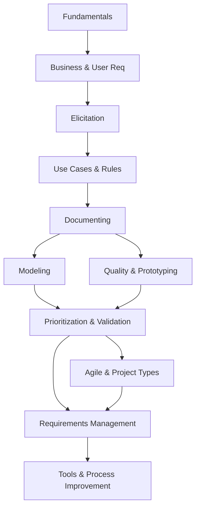

# Software Requirements — Overview

> **Source:** *Software Requirements* 3rd Edition by Karl Wiegers (Microsoft Press)

## What Is This?

This vault covers **software requirements engineering** — the process of eliciting, documenting, validating, and managing requirements. It fills SWEBOK's Software Requirements KA with practical, industry-tested techniques from Karl Wiegers' classic reference.

## Files

| File | Topics | Source |
|---|---|---|
| [[01_Requirements_Fundamentals]] | Essential requirements, levels/types, customer perspective, good practices, BA role | Ch 1–4 |
| [[02_Business_and_User_Requirements]] | Vision/scope, user classes, personas, product champions | Ch 5–6 |
| [[03_Requirements_Elicitation]] | Interviews, workshops, focus groups, observation, questionnaires, interface analysis | Ch 7 |
| [[04_Use_Cases_and_Business_Rules]] | Use cases, user stories, business rules taxonomy, facts/constraints/inferences | Ch 8–9 |
| [[05_Documenting_Requirements]] | SRS, template, labeling, writing excellent requirements | Ch 10–11 |
| [[06_Requirements_Modeling]] | DFD, swimlane, state-transition, dialog maps, decision tables, UML, data dictionary | Ch 12–13 |
| [[07_Quality_and_Prototyping]] | Quality attributes, constraints, Planguage, prototyping techniques | Ch 14–15 |
| [[08_Prioritization_Validation_and_Reuse]] | MoSCoW, pairwise, $100, inspection, acceptance criteria, requirements reuse | Ch 16–19 |
| [[09_Agile_and_Project_Types]] | Agile, enhancement, packaged, outsourced, BPA, analytics, embedded | Ch 20–26 |
| [[10_Requirements_Management]] | Baseline, version control, change control, CCB, impact analysis, traceability | Ch 27–29 |
| [[11_Tools_Process_Improvement_and_Risk]] | Requirements tools, process improvement, risk management | Ch 30–32 |

## How These Topics Relate

## Reading Paths

| Your Goal | Start Here |
|---|---|
| **Requirements basics** | [[01_Requirements_Fundamentals]] → [[02_Business_and_User_Requirements]] → [[03_Requirements_Elicitation]] |
| **Writing requirements** | [[05_Documenting_Requirements]] → [[08_Prioritization_Validation_and_Reuse]] |
| **Modeling** | [[06_Requirements_Modeling]] → [[04_Use_Cases_and_Business_Rules]] |
| **Agile requirements** | [[09_Agile_and_Project_Types]] → [[10_Requirements_Management]] |
| **Change management** | [[10_Requirements_Management]] → [[11_Tools_Process_Improvement_and_Risk]] |
| **Full requirements process** | [[01_Requirements_Fundamentals]] through [[11_Tools_Process_Improvement_and_Risk]] |

## Related

- [[../02_Software_Architecture/Software Architecture Overview|Software Architecture]] — Design decisions from requirements
- [[../05_Software_Testing/Software Testing Overview|Software Testing]] — Test cases from requirements
- [[10_Software_Engineering_Process/Software Methodology - Overview|Software Methodology]] — Agile and process models

---

## SWEBOK v4 Coverage Map

> **Source:** [[SWEBOK v4 - Overview|SWEBOK v4]] Chapter 01 | **Last analyzed:** 2026-07-21 | **Coverage:** ~80%

| #   | SWEBOK Topic                | Status | Vault File(s)                                       | Notes                                                                                       |
| --- | --------------------------- | ------ | --------------------------------------------------- | ------------------------------------------------------------------------------------------- |
| 1   | Requirements Fundamentals   | ✅      | `01_Requirements_Fundamentals.md` (31 KB)           | Substantive: levels/types, cost amplification, BA role                                      |
| 2   | Requirements Elicitation    | ✅      | `03_Requirements_Elicitation.md` (21 KB)            | Interviews, workshops, observation, questionnaires                                          |
| 3   | Requirements Analysis       | ⚠️     | `01`, `08`                                          | SWEBOK's 5-Whys, QoS economic curve, formal analysis are SWEBOK-specific; content scattered |
| 4   | Requirements Specification  | ✅      | `05_Documenting_Requirements.md` (45 KB)            | SRS, templates, writing excellent requirements                                              |
| 5   | Requirements Validation     | ✅      | `08_Prioritization_Validation_and_Reuse.md` (28 KB) | Inspection, acceptance criteria                                                             |
| 6   | Requirements Management     | ✅      | `10_Requirements_Management.md` (45 KB)             | Baseline, change control, CCB, traceability                                                 |
| 7   | Practical Considerations    | ✅      | `08`, `09`, `11`                                    | Prioritization, Agile, tracing, FSM                                                         |
| 8   | Software Requirements Tools | ✅      | `11_Tools_Process_Improvement_and_Risk.md` (46 KB)  | Tools, process improvement, risk                                                            |

### Gaps to Fill

| Priority | Gap | SWEBOK Topic | What's Missing |
|----------|-----|-------------|----------------|
| 🟡 Medium | Formal methods spec | Requirements Specification | Z, VDM, theorem provers, model checking as specification techniques |
| 🟡 Medium | ATDD/BDD as specification | Requirements Specification | Given/When/Then as a core specification paradigm (not just testing) |
| 🟢 Low | Requirements Analysis as distinct KA | Requirements Analysis | 5-Whys, atomicity criteria, conflict resolution (scattered across files) |
| 🟢 Low | Perfect Technology Filter & QoS economics | Requirements Analysis | Analytical frameworks for functional/nonfunctional separation |
