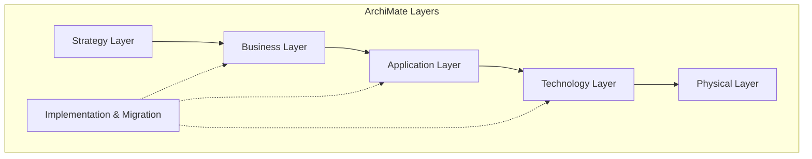
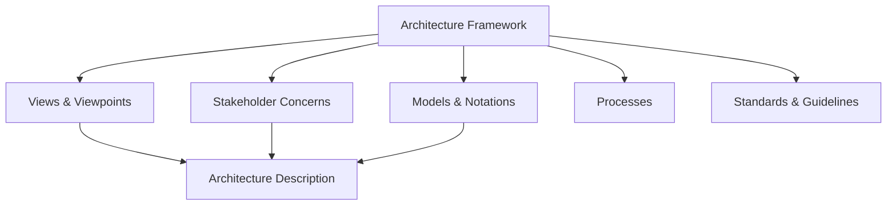
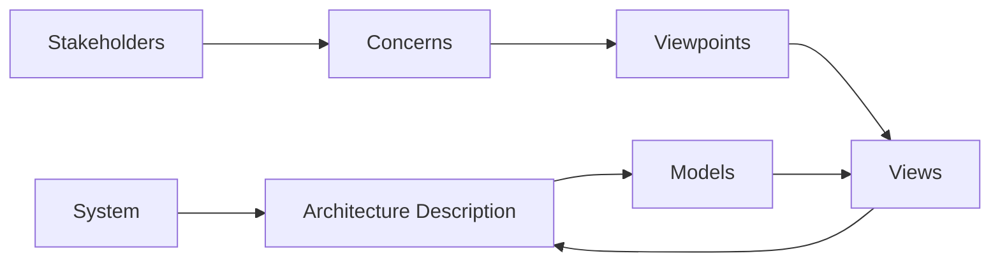
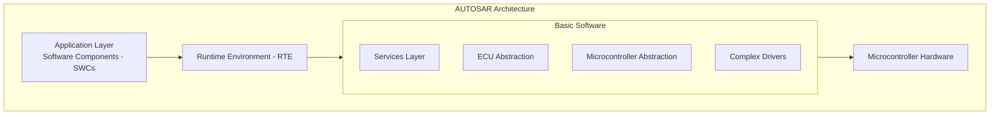
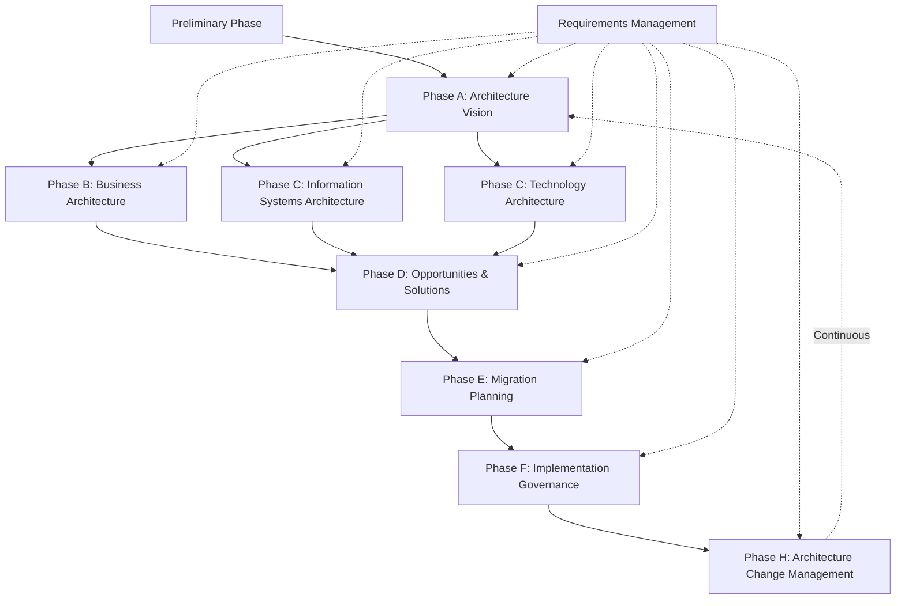
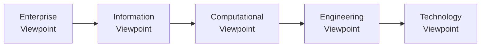
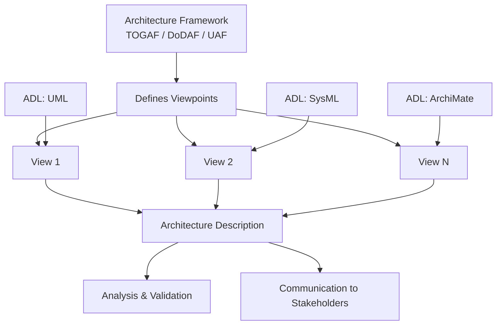

# ADLs and Architecture Frameworks

## Overview

An Architecture Description Language (ADL) provides a formal or semi-formal notation for representing software architectures. Architecture frameworks provide structured approaches for organizing and documenting architecture descriptions across multiple concerns and stakeholders. Together, they enable consistent, communicable, and analyzable architecture descriptions.

> [!important] Key Distinction
> ADLs define *how* to describe architecture (notation and semantics). Architecture frameworks define *what* to describe (views, viewpoints, and organization). They are complementary: a framework may recommend or require specific ADLs.

## Architecture Description Languages (ADLs)

### Characteristics of ADLs

An ADL must support at minimum:

| Characteristic | Description |
|---------------|-------------|
| Components | Modular units of computation or data storage |
| Connectors | Interactions between components (procedure calls, events, data flows) |
| Configurations | Topological arrangement of components and connectors |
| Interfaces | Ports and protocols exposed by components |
| Constraints | Rules governing allowable architectural configurations |

Additional desirable features:

| Feature | Description | Example ADLs |
|---------|-------------|-------------|
| Formal semantics | Precise mathematical foundations for analysis | Wright, Rapide |
| Behavioral specification | How components and connectors behave over time | Wright, Rapide |
| Type systems | Formal typing for interfaces and interactions | UniCon, xADL |
| Tool support | CASE tools for editing, analysis, visualization | Acme, xADL, ArchiMate |
| Refinement | Support for hierarchical decomposition | Acme, Rapide |
| Analysis support | Model checking, deadlock detection, performance analysis | Wright, Rapide |
| Extensibility | Ability to add domain-specific constructs | Acme, xADL |

### Formal vs Semi-Formal ADLs

| Aspect | Formal ADLs | Semi-Formal ADLs |
|--------|-------------|-----------------|
| Semantics | Mathematical (process algebras, event structures) | Informal or structured natural language |
| Analysis | Automated (model checking, theorem proving) | Manual or limited tool support |
| Examples | Wright (CSP-based), Rapide (event-based) | UML, ArchiMate |
| Learning curve | Steep | Moderate |
| Adoption | Research, safety-critical domains | Industry standard |
| Precision | High (unambiguous) | Medium (interpretation needed) |
| Trade-off | Rigor and analyzability vs. accessibility | Accessibility vs. formal analysis |

### Major ADLs

#### Acme

| Aspect | Detail |
|--------|--------|
| Origin | Carnegie Mellon University (Garlan, Monroe, Wile) |
| Type | ADL interchange language |
| Key feature | Not an ADL itself but a common interchange format for ADLs |
| Components | Components, connectors, systems, ports, roles, representations |
| Strengths | ADL interoperability, tool integration, extensible property lists |
| Tool support | AcmeStudio, Armani |
| Status | Foundational; influenced subsequent ADL design |

```
System simple_client_server = {
    Component client = {
        Port send_request;
        Port receive_response;
    }
    Component server = {
        Port receive_request;
        Port send_response;
    }
    Connector rpc = {
        Role caller;
        Role callee;
        Property protocol = "request-response";
    }
    Attachments:
        client.send_request to rpc.caller;
        server.receive_request to rpc.callee;
}
```

#### Wright

| Aspect | Detail |
|--------|--------|
| Origin | Carnegie Mellon University (Allen, Garlan) |
| Type | Formal ADL based on CSP (Communicating Sequential Processes) |
| Key feature | Formal semantics enabling automated analysis |
| Components | Components with ports, connectors with roles |
| Analysis | Deadlock detection, protocol compatibility checking |
| Connector types | Explicit connector types with formal protocol specifications |
| Strengths | Rigorous analysis, precise behavioral specification |
| Limitations | Complexity, limited industrial adoption |

#### Rapide

| Aspect | Detail |
|--------|--------|
| Origin | Stanford University (Luckham, Kenall) |
| Type | Event-based simulation ADL |
| Key feature | Executable architecture descriptions; event pattern matching |
| Components | Interfaces, types, patterns |
| Analysis | Simulation, causal event tracking, pattern matching |
| Strengths | Executable models, behavior visualization |
| Limitations | Learning curve, simulation fidelity concerns |

#### xADL

| Aspect | Detail |
|--------|--------|
| Origin | University of California, Irvine |
| Type | XML-based extensible ADL |
| Key feature | Highly extensible via XML schemas |
| Components | Components, connectors, interfaces, links |
| Tool support | ArchStudio (Eclipse-based) |
| Extensions | Configuration management, deployment views |
| Strengths | Tool ecosystem, extensibility, web-friendly format |
| Limitations | XML verbosity |

#### ArchiMate

| Aspect | Detail |
|--------|--------|
| Origin | The Open Group (now an Open Group standard) |
| Type | Semi-formal enterprise architecture modeling language |
| Key feature | Multi-layer architecture modeling (business, application, technology) |
| Layers | Strategy, Business, Application, Technology, Physical, Implementation |
| Cross-cutting | Motivation, Implementation and Migration |
| Strengths | Industry adoption, standardized, tool-rich ecosystem |
| Analysis | Limited formal analysis; relies on tool-specific extensions |
| Relationship to UML | Complements UML; higher abstraction level |



#### UML as an ADL

UML (Unified Modeling Language) can serve as an ADL through profile-based extension:

| UML Element | Architecture Mapping | Notes |
|-------------|---------------------|-------|
| Component diagram | Components and connectors | Direct mapping |
| Package diagram | Module structure | Decomposition views |
| Class diagram | Interface specifications | Type definitions |
| Sequence diagram | Behavioral interactions | Connector protocols |
| Deployment diagram | Deployment architecture | Physical allocation |
| Composite structure | Internal component structure | Ports, connectors |
| Profile mechanism | Stereotypes for ADL concepts | e.g., `<<component>>`, `<<connector>>` |

**UML Profile for Software Architecture (UPSA):**

| Stereotype | Base Class | Purpose |
|-----------|-----------|---------|
| `<<component>>` | Component | Architectural component |
| `<<connector>>` | Connector / Association | Architectural connector |
| `<<port>>` | Port | Component interface point |
| `<<role>>` | Interface | Connector endpoint role |
| `<<configuration>>` | Package / Composite Structure | Architectural configuration |

**Strengths of UML as ADL:**
- Widespread adoption and tool support
- Rich diagram types covering multiple views
- Profile mechanism enables ADL customization
- Familiar to most software engineers

**Limitations of UML as ADL:**
- First-class connector concept requires stereotypes
- Behavioral semantics less precise than formal ADLs
- Configuration-level reasoning is weak
- Multiple overlapping diagram types can cause confusion

#### SysML

SysML (Systems Modeling Language) extends UML for systems engineering:

| SysML Diagram | UML Base | Architecture Relevance |
|--------------|----------|----------------------|
| Block Definition Diagram | Class diagram | System structure and interfaces |
| Internal Block Diagram | Composite structure | Component interconnection |
| Parametric Diagram | (new) | Constraint-based analysis |
| Requirements Diagram | (new) | Requirements traceability |
| Activity, Sequence, State Machine | Same | Behavioral specification |
| Use Case Diagram | Same | Functional architecture |

SysML is particularly relevant for cyber-physical systems where software architecture must integrate with hardware and mechanical subsystems.

## ADL Comparison Matrix

| Criterion | Acme | Wright | Rapide | xADL | ArchiMate | UML | SysML |
|-----------|:----:|:------:|:------:|:----:|:---------:|:---:|:-----:|
| Formal semantics | No | Yes (CSP) | Yes (events) | No | No | Partial | Partial |
| Executable | No | No | Yes | No | No | Partial | Partial |
| Tool support | Good | Limited | Limited | Good | Excellent | Excellent | Good |
| Industry adoption | Low | Very low | Very low | Low | High | Very high | High |
| Extensibility | High | Low | Medium | High | Medium | High | High |
| Interchange format | Yes | No | No | Yes (XML) | Yes | Yes (XMI) | Yes |
| Analysis support | Limited | Strong | Simulation | Limited | Limited | Limited | Medium |
| Learning curve | Medium | High | High | Medium | Medium | Low-Medium | Medium |
| Multi-view support | Partial | No | No | Partial | Yes | Yes | Yes |

## Architecture Frameworks

### What Is an Architecture Framework?

An architecture framework defines:
- A set of **views** and **viewpoints** for describing architecture
- **Stakeholder concerns** each viewpoint addresses
- **Models** and notations used within each viewpoint
- **Processes** for creating and maintaining architecture descriptions
- **Standards** and guidelines for compliance



### ISO/IEC/IEEE 42010 (Architecture Description)

The international standard for architecture description defines:

| Concept | Definition |
|---------|-----------|
| System | A functionally, physically, and/or behaviorally related set of elements |
| Stakeholder | Individual, team, or organization with interest in the system |
| Concern | A stakeholder interest in the system |
| Viewpoint | A set of conventions for constructing a view (method, model types, analysis) |
| View | A representation of a system from the perspective of a viewpoint |
| Architecture description | A work product documenting the architecture |



### AUTOSAR (AUTomotive Open System ARchitecture)

| Aspect | Detail |
|--------|--------|
| Domain | Automotive software |
| Governance | AUTOSAR consortium (BMW, Bosch, Continental, Daimler, etc.) |
| Purpose | Standardize ECU (Electronic Control Unit) software architecture |
| Layers | Application Layer, Runtime Environment (RTE), Basic Software (BSW) |
| Methodology | Top-down: SWC design -> RTE mapping -> BSW configuration |



| Layer | Responsibility |
|-------|---------------|
| Application | Vehicle functions as interconnected SWCs |
| RTE | Communication middleware between SWCs |
| Services | OS, diagnostics, memory management, communication services |
| ECU Abstraction | Hardware-independent access to ECU peripherals |
| MCAL | Direct microcontroller register access |
| Complex Drivers | Non-standard hardware integration |

**Key AUTOSAR concepts:**
- **SWC (Software Component)**: Atomic or composite application unit with defined ports
- **Port Interface**: Contract for SWC communication (sender-receiver, client-server)
- **VFB (Virtual Function Bus)**: Abstract communication before ECU mapping
- **RTE**: Generated middleware implementing VFB on specific ECU

### UAF (Unified Architecture Framework)

| Aspect | Detail |
|--------|--------|
| Domain | Enterprise and System of Systems (SoS) |
| Standard | OMG UAF 1.2 |
| Based on | MODAF/NAF meta-model, DoDAF concepts |
| Purpose | Model enterprise architectures across operational, systems, and strategic views |
| Approach | Grid-based framework with rows (viewpoint types) and columns (aspects) |

**UAF Grid:**

| | Strategic | Operational | Services | Personnel | Resources | Security | Projects | Standards | Actual Resources | Dictionary |
|---|:---:|:---:|:---:|:---:|:---:|:---:|:---:|:---:|:---:|:---:|
| Taxonomy | x | x | x | x | x | x | x | x | x | x |
| Structure | x | x | | x | x | x | | | x | |
| Connectivity | | x | x | | x | x | | | x | |
| Processes | | x | x | | x | | | | x | |
| States | | x | | x | x | | | | x | |
| Interactions | | x | x | | x | | | | x | |
| Constraints | x | x | x | x | x | x | | x | | |
| Traceability | x | x | x | x | x | x | x | x | x | |
| Parameters | | | | | x | | | | x | |
| Collections | x | x | x | x | x | x | x | x | x | x |

### TOGAF (The Open Group Architecture Framework)

| Aspect | Detail |
|--------|--------|
| Governance | The Open Group |
| Current version | TOGAF Standard, 10th Edition |
| Core | Architecture Development Method (ADM) |
| Domains | Business, Data, Application, Technology |
| Artifacts | Catalogs, matrices, diagrams |



| ADM Phase | Purpose | Key Outputs |
|-----------|---------|-------------|
| Preliminary | Establish architecture capability | Principles, framework, tools |
| A: Architecture Vision | Set scope and stakeholders | Statement of work, high-level architecture |
| B: Business Architecture | Define business strategy and governance | Business process models, capability maps |
| C: Information Systems | Define data and application architectures | Data models, application portfolios |
| D: Technology Architecture | Define technology infrastructure | Platform architectures, technology standards |
| E: Opportunities & Solutions | Identify implementation projects | Work packages, transition architectures |
| F: Migration Planning | Develop detailed migration plan | Implementation roadmap, prioritized projects |
| G: Implementation Governance | Oversee implementation | Architecture contracts, compliance assessments |
| H: Architecture Change Management | Manage architecture changes | Change requests, architecture updates |

### Zachman Framework

| Aspect | Detail |
|--------|--------|
| Origin | John Zachman, 1987 (IBM); updated multiple times |
| Type | Ontology (classification scheme) for architecture artifacts |
| Structure | 6x6 matrix: 6 interrogatives x 6 perspectives |

| | What (Data) | How (Function) | Where (Network) | Who (People) | When (Time) | Why (Motivation) |
|---|---|---|---|---|---|---|
| **Planner (Scope)** | List of things | List of processes | List of locations | List of organizations | List of events | List of goals |
| **Owner (Business Model)** | Conceptual data model | Business process model | Business logistics | Workflow model | Master schedule | Business plan |
| **Designer (System Model)** | Logical data model | System design model | Distributed system architecture | Human interface architecture | Processing structure | Business rule model |
| **Builder (Technology Model)** | Physical data model | Technical design model | Technology architecture | Presentation architecture | Control structure | Rule design |
| **Implementer (Detailed Representations)** | Data definition | Program | Network architecture | Security architecture | Timing definitions | Rule specification |
| **Functioning Enterprise** | Usable data | Functioning function | Usable network | Functioning organization | Usable schedule | Functioning strategy |

### DoDAF (Department of Defense Architecture Framework)

| Aspect | Detail |
|--------|--------|
| Governance | US Department of Defense |
| Current version | DoDAF 2.02 |
| Purpose | Ensure interoperability and integration across defense systems |
| Core | 52 models organized into 8 viewpoints |

| Viewpoint | Prefix | Focus | Key Models |
|-----------|--------|-------|------------|
| All | AV | Overview and summary | AV-1, AV-2 |
| Capability | CV | Capability requirements | CV-1 through CV-7 |
| Data and Information | DIV | Data relationships | DIV-1 through DIV-3 |
| Operational | OV | Operational scenarios and activities | OV-1 through OV-6 |
| Project | PV | Project relationships and dependencies | PV-1 through PV-3 |
| Services | SvcV | Service-oriented solutions | SvcV-1 through SvcV-13 |
| Standards | StdV | Standards and rules | StdV-1, StdV-2 |
| Systems | SV | System interconnections | SV-1 through SV-10 |

### MoDAF (Ministry of Defence Architecture Framework)

| Aspect | Detail |
|--------|--------|
| Governance | UK Ministry of Defence |
| Relationship to DoDAF | Based on DoDAF but adapted for UK defense |
| Viewpoints | Strategic, Operational, Systems, Technical, Acquisition, All Views |
| Key difference | Stronger focus on acquisition and capability management |

### ISO RM-ODP (Reference Model for Open Distributed Processing)

| Aspect | Detail |
|--------|--------|
| Standard | ISO/IEC 10746 |
| Purpose | Framework for specifying distributed and open systems |
| Viewpoints | 5 fundamental viewpoints |

| Viewpoint | Concern | Key Concepts |
|-----------|---------|--------------|
| Enterprise | Business purpose and environment | Enterprise objects, policies, contracts |
| Information | Semantics of information processing | Information objects, schemas, invariant rules |
| Computational | Functional decomposition | Computational objects, interfaces, operations |
| Engineering | Distribution infrastructure | Engineering objects, capsules, channels, nodes |
| Technology | Technology choices | Technology objects, artifacts |



## Architecture Framework Comparison

| Criterion | TOGAF | Zachman | DoDAF | MoDAF | UAF | RM-ODP | AUTOSAR |
|-----------|:-----:|:-------:|:-----:|:-----:|:---:|:------:|:-------:|
| Domain | Enterprise | Universal | Defense | Defense | Enterprise/SoS | Distributed systems | Automotive |
| Structure | Process-based | Ontology matrix | Viewpoint-based | Viewpoint-based | Grid matrix | 5 viewpoints | Layered |
| Prescriptive process | Yes (ADM) | No | Partial | Partial | Partial | No | Yes |
| Standard body | Open Group | De facto | US DoD | UK MoD | OMG | ISO/IEC | AUTOSAR consortium |
| Industry adoption | Very high | High | High (defense) | Medium (UK) | Growing | Low | High (auto) |
| Completeness | High | High (classification) | High | High | High | Medium | High (domain) |
| Tool support | Excellent | Good | Good | Limited | Growing | Limited | Excellent |
| Tailorable | Yes | N/A (ontology) | Yes | Yes | Yes | Yes | Domain-specific |

## When to Use Formal ADLs vs UML

| Scenario | Recommended Approach | Rationale |
|----------|---------------------|-----------|
| Safety-critical systems | Formal ADL (Wright, CSP-based) | Need provable properties (deadlock freedom, safety) |
| High-assurance systems | Formal ADL + model checking | Automated verification of architectural properties |
| Enterprise architecture | ArchiMate or UML + TOGAF | Industry adoption, stakeholder communication |
| General software systems | UML with architecture profile | Familiarity, tool support, flexibility |
| Rapid prototyping | UML or lightweight notation | Speed over rigor |
| System of Systems | UAF with SysML | Multi-concern, multi-stakeholder modeling |
| Automotive software | AUTOSAR | Domain standard with strong tool support |
| Research / novel architectures | Formal ADL | Precise semantics for academic contribution |
| Distributed systems | RM-ODP or ArchiMate | Distribution-aware viewpoints |

## ADL Selection Criteria

| Criterion | Questions to Ask |
|-----------|-----------------|
| Formality needs | Do you need automated analysis (model checking, deadlock detection)? |
| Domain | Is there a domain-specific standard (AUTOSAR, DoDAF)? |
| Stakeholder skills | Can your team learn a formal ADL, or is UML sufficient? |
| Tool ecosystem | What tools are available and affordable? |
| Interchange | Do you need to exchange architecture models between tools? |
| Compliance | Do standards or regulations require specific ADLs? |
| Analysis | What analyses are needed (performance, reliability, security)? |
| Extensibility | Will you need domain-specific extensions? |

## Integrating ADLs and Frameworks



**Best practice:** Select the ADL (or combination) that best serves each viewpoint within the chosen framework. A single ADL rarely covers all architectural concerns adequately.

## Summary

Architecture description languages provide the notational foundation for capturing software architecture, while architecture frameworks organize those descriptions into coherent, stakeholder-aligned views. Formal ADLs like Wright and Rapide enable automated analysis but require significant expertise. Industry-standard notations like UML, SysML, and ArchiMate offer broader adoption with less formal rigor. Domain-specific frameworks (AUTOSAR, DoDAF) and general-purpose frameworks (TOGAF, Zachman) address different organizational needs. The key is matching formality and framework to the system's criticality, domain, and stakeholder needs.
