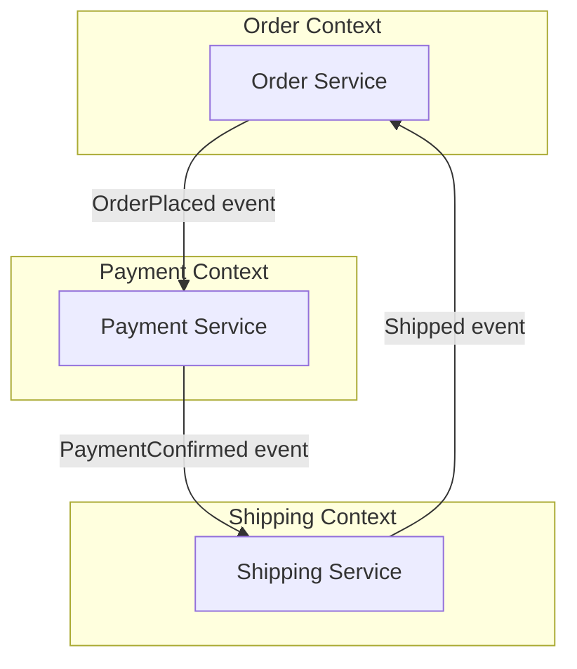

---
tags:
- architecture
- microservices
- programming
---

# 01 Decomposition Patterns

The hardest question in microservices: **where do you draw the lines?** Decompose wrong and you get a distributed monolith — all the complexity of microservices with none of the benefits.

---

## Decomposition Strategies

### 1. By Business Capability

Align services with **what the business does**, not how it's organized.

| Business Capability | Service |
|-------------------|---------|
| Product Catalog | `product-service` |
| Order Management | `order-service` |
| Customer Management | `customer-service` |
| Payment Processing | `payment-service` |
| Shipping & Logistics | `shipping-service` |

> **Rule:** One service = one business capability. The service owns the data + logic + UI for that capability.

### 2. By Subdomain (DDD — Domain-Driven Design)

Decompose using **bounded contexts** from DDD. Each bounded context becomes a service.

| DDD Concept | Microservice Mapping |
|------------|---------------------|
| **Bounded Context** | One microservice (or a small cluster) |
| **Aggregate** | Transaction boundary within a service |
| **Domain Event** | Message published to other services |

### 3. By Transaction Boundary

Find where **atomic transactions end** — those are natural service boundaries. Everything inside a transaction must live in the same service. Everything across transactions can be separate services.

> If two operations MUST succeed or fail together (ACID), they belong in the same service. If they can be eventually consistent, they can be separate.

---

## Anti-Patterns to Avoid

| ❌ Anti-Pattern | Why It Hurts | ✅ Better |
|---------------|-------------|----------|
| **Decompose by layer** (all controllers in one service, all DB in another) | Every feature change touches every service. Distributed monolith. | Decompose by capability |
| **Decompose by noun** (UserService, ProductService, OrderService) | Too granular. Services end up as CRUD wrappers with no business logic. | Decompose by bounded context |
| **Decompose by team** | Teams change. Services should map to business domains, not org charts. | Conway's Law: design the system to match the desired communication |

---

## Conway's Law

> **Organizations design systems that mirror their own communication structure.**

If your org has 3 teams — Orders, Payments, Shipping — you'll naturally build 3 services. The architecture follows the org chart. Use this as a design tool: **structure your teams around the architecture you want.**

---

## Sources

- Newman, Sam. *Building Microservices*, 2nd ed., O'Reilly, 2021.
- Evans, Eric. *Domain-Driven Design*, Addison-Wesley, 2003.
