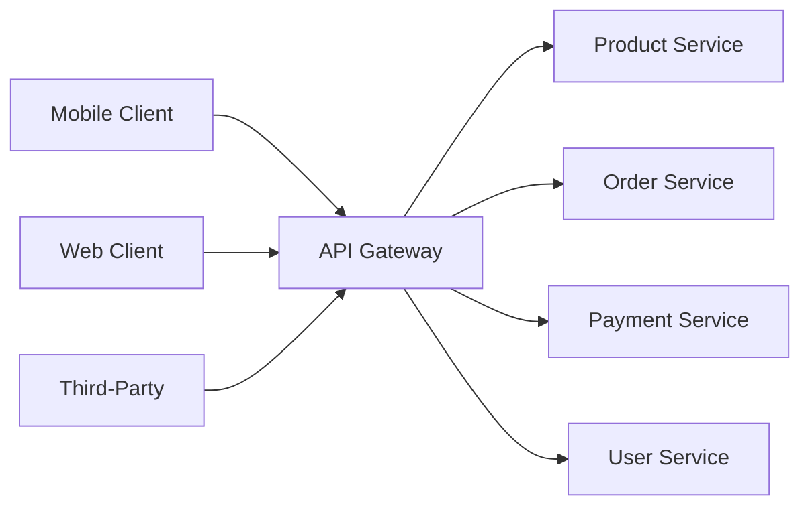

---
tags:
- architecture
- microservices
- programming
---

# 02 API Gateway

The single entry point for all clients. Instead of every client calling every service directly, the gateway routes, aggregates, authenticates, and protects.

---

## Why You Need One

| Without API Gateway | With API Gateway |
|--------------------|------------------|
| Mobile app calls 8 services directly | Mobile app calls 1 endpoint |
| Each service handles auth separately | Auth centralized at gateway |
| Client needs to know all service URLs | Client only knows gateway URL |
| Rate limiting scattered everywhere | Rate limiting at one choke point |
| Protocol translation: client's problem | Gateway translates REST ↔ gRPC ↔ GraphQL |

---

## Architecture



---

## Core Responsibilities

| Responsibility | What It Does |
|---------------|-------------|
| **Routing** | Maps incoming requests to the correct backend service |
| **Authentication** | Validates JWT/API keys before forwarding requests |
| **Rate Limiting** | Protects backend from abuse — per user, per IP, per endpoint |
| **Aggregation** | Calls multiple services and combines responses (e.g., order detail = order + product + user) |
| **Protocol Translation** | REST-in, gRPC-out. Or WebSocket-in, REST-out. |
| **Logging & Tracing** | Injects trace IDs, logs every request at the boundary |

---

## Popular Implementations

| Gateway | Type | Best For |
|---------|------|----------|
| **Spring Cloud Gateway** | Java/Spring | Spring Boot microservices |
| **Kong** | Lua/OpenResty | High-performance, plugin-based |
| **NGINX** | C | Simple routing, reverse proxy |
| **Traefik** | Go | Kubernetes-native, auto-discovery |
| **AWS API Gateway** | Managed | Serverless, AWS ecosystem |
| **Envoy** | C++ | Service mesh sidecar |

---

## BFF Pattern (Backend for Frontend)

One gateway per client type — mobile gets different aggregation than web:

```
Mobile App → Mobile BFF → Services
Web App   → Web BFF   → Services
```

> Each BFF provides exactly what its client needs — no over-fetching, no under-fetching.

---

## ⚠️ Beware

| Trap | Fix |
|------|-----|
| Gateway becomes a monolith with business logic | Gateway = routing + cross-cutting. Business logic stays in services. |
| Single point of failure | Run multiple gateway instances behind a load balancer |
| Gateway as bottleneck | Keep it lightweight. Offload heavy processing to services. |

---

## Sources

- Richardson, Chris. *Microservices Patterns*, Manning, 2018.
- Spring Cloud Gateway — https://spring.io/projects/spring-cloud-gateway
