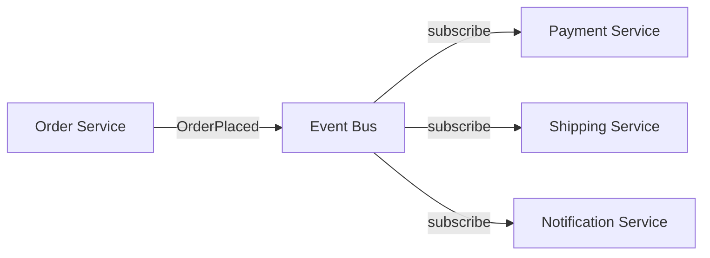

---
tags:
- architecture
- microservices
- programming
---

# 02 Event-Driven Architecture

Synchronous REST calls create tight coupling. When Service A calls Service B, A must wait for B — and if B is down, A fails. Event-driven architecture decouples services: they communicate by publishing and subscribing to events.

---

## Sync vs Async

| Synchronous (REST/gRPC) | Asynchronous (Events) |
|------------------------|----------------------|
| Caller waits for response | Publisher fires and forgets |
| Both must be up | Subscriber can process later |
| Tight temporal coupling | Loose temporal coupling |
| Easier to reason about | Harder to debug, trace |
| Good for: queries, immediate responses | Good for: state changes, notifications |

---

## Event Patterns

### 1. Pub/Sub (Publish-Subscribe)



One event, multiple consumers. Each service reacts independently.

### 2. Event Sourcing

Instead of storing current state, store **all state-changing events** as an append-only log. Current state = replay all events.

| Traditional | Event Sourcing |
|------------|---------------|
| `UPDATE orders SET status='shipped'` | Append `OrderShipped(orderId=123, at=14:32)` |
| Current state only | Full audit trail |
| Lost history on update | Can replay to any point in time |

### 3. CQRS (Command Query Responsibility Segregation)

Separate **write** model (commands) from **read** model (queries). Often paired with Event Sourcing.

```
Command → Write DB → Event → Read DB (denormalized) → Query
```

---

## Event Bus Implementations

| Tool | Type | Best For |
|------|------|----------|
| **Kafka** | Distributed log | High-throughput, ordered, replayable |
| **RabbitMQ** | Message broker | Flexible routing, lower throughput |
| **AWS SNS/SQS** | Managed | AWS ecosystem, serverless |
| **Redis Pub/Sub** | In-memory | Simple, fast, no persistence guarantees |

---

## Key Design Decisions

| Decision | Options |
|----------|---------|
| **At-least-once vs exactly-once** | Idempotent consumers handle duplicates |
| **Event schema evolution** | Avro/Protobuf with schema registry. Never break backward compatibility. |
| **Ordering guarantees** | Kafka: per-partition ordering. RabbitMQ: per-queue FIFO. |
| **Dead Letter Queue (DLQ)** | Where failed events go for later inspection |

---

## Sources

- Newman, Sam. *Building Microservices*, 2nd ed., O'Reilly, 2021.
- Kleppmann, Martin. *Designing Data-Intensive Applications*, O'Reilly, 2017.
