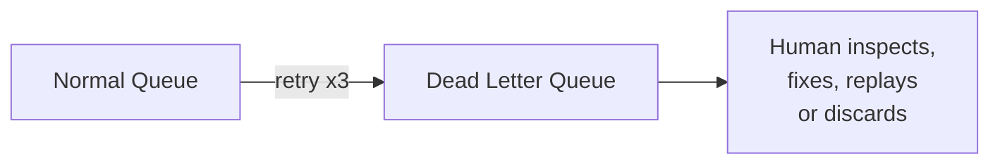

---
tags:
- architecture
- microservices
- programming
---

# 02 Messaging Patterns

When services communicate asynchronously via messages, you need patterns for reliability, ordering, and correctness. Messages can be lost, duplicated, or arrive out of order — your system must handle all three.

---

## Message Channels

| Channel Type | Use Case |
|-------------|----------|
| **Point-to-Point** | One sender → one receiver. Exactly one consumer processes the message. |
| **Publish-Subscribe** | One sender → many receivers. Each gets a copy. |
| **Request-Reply** | Async request with a reply-to address and correlation ID |

---

## Message Ordering

| Guarantee | How |
|-----------|-----|
| **FIFO (First In, First Out)** | Single partition/queue. Kafka: one partition key. RabbitMQ: one queue. |
| **No ordering needed** | Any partition. Higher throughput. |
| **Key-based ordering** | Kafka: same key → same partition. Messages with same key arrive in order. |

---

## Idempotency — Handling Duplicates

Messages can be delivered **more than once**. Every consumer must handle duplicates safely.

| Strategy | How It Works |
|----------|-------------|
| **Idempotency key** | Sender includes a unique key. Receiver stores processed keys. Duplicate = discard. |
| **Database uniqueness** | Insert with unique constraint. Duplicate insert fails silently. |
| **State check** | "Is this order already shipped? Then ignore the ShipOrder command." |

```
// Idempotent consumer pattern
def handle(event):
    if db.exists(processed_events, event.id):
        return  // Already processed — skip
    process(event)
    db.insert(processed_events, event.id)
```

---

## Dead Letter Queue (DLQ)

Messages that can't be processed after N retries go to a DLQ for human inspection.



---

## Message Broker Comparison

| | Kafka | RabbitMQ |
|---|-------|----------|
| **Model** | Distributed log | Message broker |
| **Throughput** | Millions/sec | Tens of thousands/sec |
| **Message retention** | Configurable (days, forever) | Deleted after consumption |
| **Ordering** | Per partition | Per queue |
| **Replay** | ✅ Built-in | ❌ Messages gone after ack |
| **Routing** | Topic → partition | Exchange → binding → queue |
| **Best for** | Event streaming, audit | Task queues, RPC |

---

## Sources

- Hohpe, Gregor & Woolf, Bobby. *Enterprise Integration Patterns*, Addison-Wesley, 2003.
- Kleppmann, Martin. *Designing Data-Intensive Applications*, O'Reilly, 2017.
