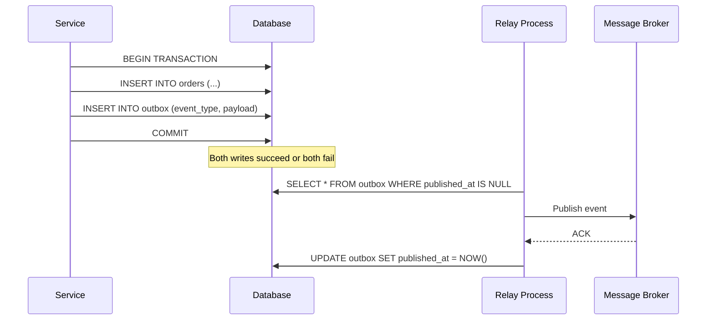

---
tags:
  - architecture
  - microservices
  - programming
---

# 02 Outbox Pattern

The dual-write problem: you need to update your database AND publish an event to a message broker. If either fails independently, you get inconsistency. The outbox pattern solves this.

## The Dual-Write Problem

Two separate systems, two separate failure modes:

```
Scenario A: DB commits, message fails
  Service → DB ✅ (order saved)
  Service → Broker ❌ (network timeout)
  Result: Order exists but no event published. Downstream never knows.

Scenario B: Message sent, DB rolls back
  Service → Broker ✅ (event published)
  Service → DB ❌ (constraint violation, rollback)
  Result: Event published for an order that doesn't exist.
```

You cannot make two independent writes atomic without a coordination protocol.

## The Solution

Write the event to an **outbox table** in the SAME database transaction as your business data. A separate relay process reads the outbox and publishes to the broker.



Single DB transaction = atomic guarantee. The relay handles delivery separately.

## Relay Approaches

| Approach | How it works | Pros | Cons |
|----------|-------------|------|------|
| **Polling Publisher** | Background job polls outbox table every N seconds, publishes pending rows, marks as sent | Simple to implement, no extra infra | Added latency (up to N seconds), DB load from polling |
| **CDC (Change Data Capture)** | Debezium tails the DB transaction log, streams new outbox rows to Kafka automatically | Near real-time, no polling overhead, captures deletes too | Requires Debezium/Kafka Connect setup, more operational complexity |

## Outbox Table Schema

```sql
CREATE TABLE outbox (
    id            BIGSERIAL PRIMARY KEY,
    aggregate_type VARCHAR(255) NOT NULL,  -- e.g. 'Order', 'Payment'
    aggregate_id   VARCHAR(255) NOT NULL,  -- e.g. order UUID
    event_type    VARCHAR(255) NOT NULL,   -- e.g. 'OrderCreated'
    payload       JSONB NOT NULL,          -- event data
    created_at    TIMESTAMP NOT NULL DEFAULT NOW(),
    published_at  TIMESTAMP NULL           -- NULL = not yet published
);

CREATE INDEX idx_outbox_unpublished ON outbox (created_at) WHERE published_at IS NULL;
```

## Key Rules

1. **Delete or archive published events** — don't let the outbox table grow unbounded. Purge rows where `published_at IS NOT NULL` older than X days.
2. **Ordering by sequence** — use the `id` (auto-increment/serial) to guarantee publish order per aggregate.
3. **Idempotent consumers still needed** — the relay delivers at-least-once. Consumers must handle duplicates (use event ID for deduplication).
4. **At-least-once delivery** — if the relay crashes after publishing but before marking as sent, it will re-publish. This is a feature, not a bug.

## When to Use

| Use when | Don't use when |
|----------|---------------|
| You need reliable event publishing alongside DB writes | Simple fire-and-forget notifications (email, push) |
| Event ordering matters per aggregate | You already use an event store as your primary store |
| You want to avoid distributed transactions (2PC) | Latency of polling is unacceptable AND you can't run CDC |
| Multiple consumers need the same event reliably | The system is a monolith with in-process event handling |

## Sources

- [microservices.io — Transactional Outbox](https://microservices.io/patterns/data/transactional-outbox.html)
- [Debezium Outbox Event Router](https://debezium.io/documentation/reference/transformations/outbox-event-router.html)
- Chris Richardson, *Microservices Patterns* (Manning, 2018) — Chapter 3
