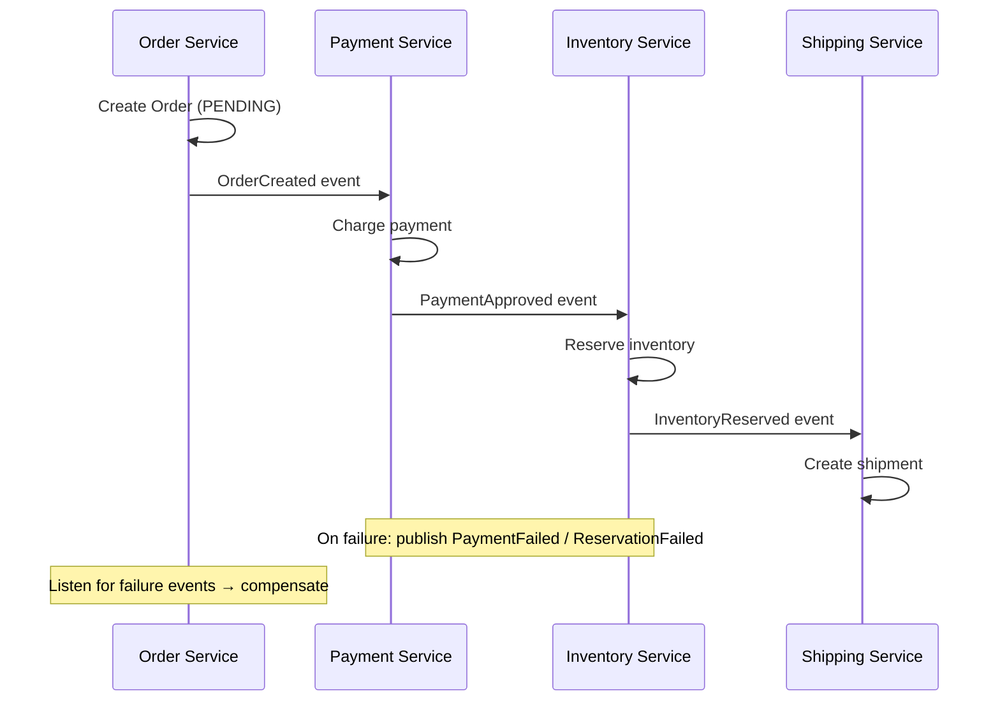
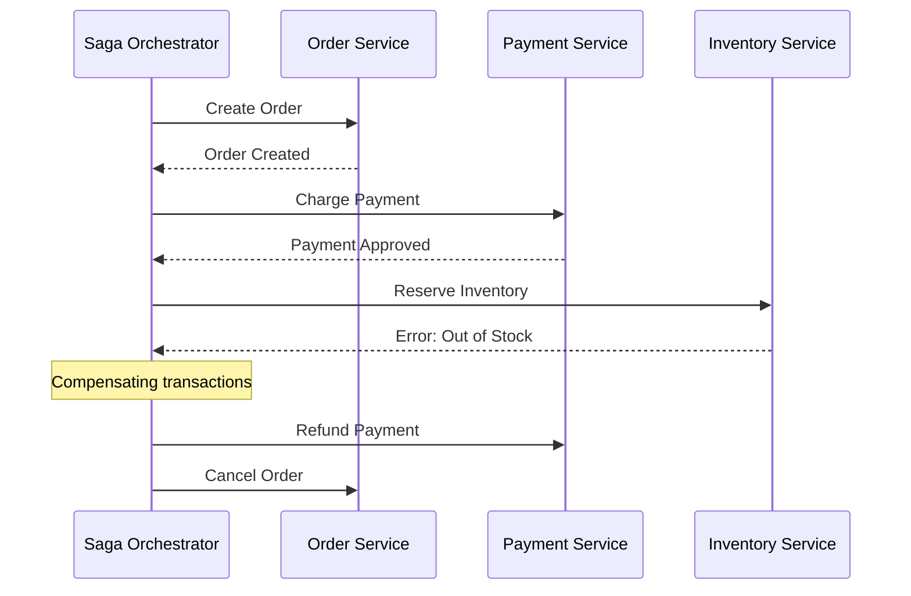

---
tags:
- architecture
- microservices
- programming
---

# 03 Saga Pattern

When a business transaction spans multiple services, you can't use a single ACID transaction. The Saga pattern coordinates a sequence of local transactions — each with a compensating action if something fails.

---

## The Problem

```
Order placed → Payment charged → Inventory reserved → Shipment created

All must succeed, or all must roll back. But each step is a different service with its own database.
```

---

## Two Saga Approaches

### 1. Choreography (Event-Driven)

Each service publishes events. Other services listen and react. No central coordinator.



**✅ Simple, loosely coupled** | **❌ Hard to see the full flow, cyclic dependencies possible**

### 2. Orchestration (Command-Driven)

A central **Saga Orchestrator** tells each service what to do and handles failures.



**✅ Clear flow, easy to understand** | **❌ Orchestrator = single point of coordination**

---

## Compensating Transactions

When a step fails, previous steps must be **undone** — but you can't truly "undo" in distributed systems. You execute a compensating transaction.

| Step | Compensating Action |
|------|-------------------|
| Order Created | Cancel Order |
| Payment Charged | Refund Payment |
| Inventory Reserved | Release Reservation |
| Email Sent | Send "Oops, ignore that" email |

> Compensation isn't a perfect undo (the customer saw the charge and refund). It's a business-level correction.

---

## Implementation Patterns

| Pattern | How |
|---------|-----|
| **Saga Log** | Persist every step. If orchestrator crashes, replay from log. |
| **Idempotent steps** | Every step can be called multiple times safely. |
| **Timeouts** | If a step hangs, the saga times out and triggers compensation. |

---

## Sources

- Richardson, Chris. *Microservices Patterns*, Manning, 2018.
- Garcia-Molina, H. & Salem, K. (1987). *Sagas*. ACM SIGMOD.
