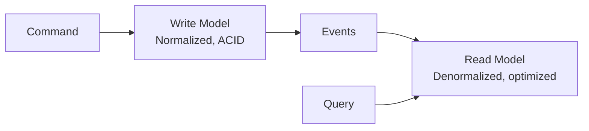

---
tags:
- architecture
- microservices
- programming
---

# 03 CQRS & Event Sourcing

CQRS separates reads from writes. Event Sourcing stores state as a sequence of events instead of a snapshot. Together they enable audit trails, high-scale reads, and eventual consistency.

---

## CQRS (Command Query Responsibility Segregation)

> **Use different models for reading and writing data.**



| Write Side (Commands) | Read Side (Queries) |
|----------------------|---------------------|
| Normalized (no duplication) | Denormalized (pre-joined, flat) |
| Optimized for writes | Optimized for reads |
| PostgreSQL, MySQL | Elasticsearch, Redis, Materialized View |
| `INSERT INTO orders...` | `GET /orders/123` hits the read DB |

### When to Use CQRS

| ✅ Use | ❌ Don't Use |
|--------|------------|
| Read/write patterns are very different | Simple CRUD app |
| Reads need complex joins across services | All queries fit one table |
| You need independent scaling of reads vs writes | Extra complexity adds no value |

---

## Event Sourcing

> **Store state changes as an append-only event log. Current state = replay all events.**

### Traditional vs Event Sourcing

| Traditional DB | Event Sourcing |
|---------------|---------------|
| `UPDATE orders SET status='shipped'` | Append `OrderShipped(orderId=123)` |
| Old value lost forever | Complete audit trail |
| Current state only | Can reconstruct state at any point in time |

### Example: Bank Account

```
Event Stream:
  AccountOpened(balance=0)
  Deposit(amount=100)       → balance: 100
  Deposit(amount=50)        → balance: 150
  Withdraw(amount=30)       → balance: 120
  Withdraw(amount=200)      → INSUFFICIENT FUNDS (event not appended)
```

Current balance = replay all events. Never delete — only append.

---

## CQRS + Event Sourcing Combined

```
Command → Write Service → Event Store (Kafka/Kinesis)
                              ↓
                         Read Service → Denormalized View (Elasticsearch/Redis)
                              ↓
                         Query → Read API
```

| Benefit | How |
|---------|-----|
| **Full audit trail** | Every state change is an immutable event |
| **Temporal queries** | "What was the order status on June 1st?" — replay to that point |
| **Multiple read models** | One event stream can feed a search index, a cache, and an analytics DB |
| **Bug fixes** | Fix the handler, replay events → corrected state |

---

## The Cost

| Cost | Mitigation |
|------|-----------|
| Eventual consistency | Accept staleness. Show "updating..." in UI. |
| Complexity | Only use where the benefits justify it. |
| Event schema evolution | Avro/Protobuf + schema registry. Upcasting old events. |

---

## Sources

- Evans, Eric. *Domain-Driven Design*, Addison-Wesley, 2003.
- Young, Greg. *CQRS Documents* — https://cqrs.files.wordpress.com/2010/11/cqrs_documents.pdf
