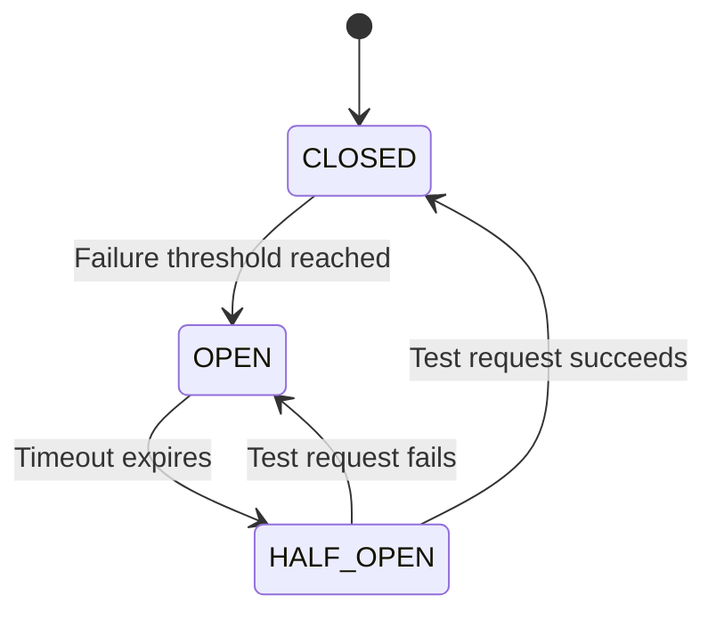

---
tags:
- architecture
- microservices
- programming
---

# 04 Circuit Breaker

When a downstream service fails, retrying only makes things worse — you flood a dying service with more requests. The Circuit Breaker stops calling the failing service and fails fast, giving it time to recover.

---

## The Pattern



| State | Behavior |
|-------|----------|
| **CLOSED** | Normal operation. Requests pass through. Count failures. |
| **OPEN** | Circuit is tripped. Requests fail immediately without calling the service. |
| **HALF_OPEN** | After a timeout, one test request is allowed. If it succeeds → CLOSED. If it fails → OPEN. |

---

## Configuration

| Parameter | What It Means | Example |
|-----------|--------------|---------|
| **Failure threshold** | How many failures before opening | 5 failures in 10 seconds |
| **Timeout** | How long to stay OPEN before trying HALF_OPEN | 30 seconds |
| **Success threshold** | How many successes in HALF_OPEN to close | 2 successful requests |

---

## Implementation (Spring Boot + Resilience4j)

```yaml
resilience4j:
  circuitbreaker:
    instances:
      paymentService:
        slidingWindowSize: 10
        failureRateThreshold: 50
        waitDurationInOpenState: 30s
        permittedNumberOfCallsInHalfOpenState: 3
```

```java
@CircuitBreaker(name = "paymentService", fallbackMethod = "paymentFallback")
public PaymentResponse charge(Order order) {
    return paymentClient.charge(order);
}

public PaymentResponse paymentFallback(Order order, Exception e) {
    // Graceful degradation — queue for retry, show pending status
    return PaymentResponse.pending(order.getId());
}
```

---

## Fallback Strategies

When the circuit is OPEN, what do you return?

| Strategy | Example |
|----------|---------|
| **Graceful degradation** | Return partial data ("Payment pending") |
| **Cache** | Return last known good response |
| **Default value** | "Out of stock" when inventory service is down |
| **Fail fast** | Return error immediately — don't keep user waiting |

---

## ⚠️ Things That Go Wrong

| Problem | Fix |
|---------|-----|
| **All circuits open at once** → cascade | Set different thresholds per service. Critical services get looser thresholds. |
| **Timeout too short** → false positives | Match timeout to p95 latency. Don't punish slow legitimate calls. |
| **Forgetting to close** → circuit stays open forever | Always configure HALF_OPEN and test it. |
| **No monitoring** → you don't know circuits are open | Expose circuit state as a metric. Alert when circuits open. |

---

## Sources

- Nygard, Michael. *Release It!*, 2nd ed., Pragmatic Bookshelf, 2018.
- Resilience4j — https://resilience4j.readme.io/
