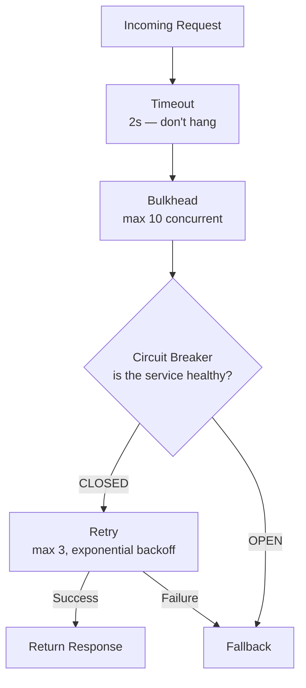

---
tags:
- architecture
- microservices
- programming
---

# 04 Retry, Timeout & Fallback

Not every failure is permanent. Sometimes a request fails because of a momentary network blip. But retrying blindly makes things worse. These three patterns work together as a resilience stack.

---

## Timeout — Don't Wait Forever

Every remote call needs a deadline. Without one, a hung service blocks your threads forever.

| Timeout Type | What It Means |
|-------------|---------------|
| **Connection timeout** | Max time to establish a TCP connection (e.g., 2s) |
| **Read timeout** | Max time to wait for a response after connecting (e.g., 5s) |
| **Overall timeout** | Max time for the entire operation (e.g., 10s) |

```java
// Spring RestTemplate / WebClient
RestTemplate rest = new RestTemplate();
HttpComponentsClientHttpRequestFactory factory = new HttpComponentsClientHttpRequestFactory();
factory.setConnectTimeout(2000);   // 2 seconds
factory.setReadTimeout(5000);      // 5 seconds
rest.setRequestFactory(factory);
```

> **Rule of thumb:** Set timeouts at p99 latency + some buffer. If your service responds in 200ms at p99, set 500ms. Don't set 30s "just to be safe" — that's how threads pile up.

---

## Retry — Try Again, But Smartly

Retry transient failures. Don't retry permanent ones.

| Transient (Retry) | Permanent (Don't Retry) |
|-------------------|------------------------|
| Network timeout | 400 Bad Request (invalid input) |
| Connection refused (service restarting) | 401 Unauthorized |
| 503 Service Unavailable (overloaded) | 404 Not Found |
| Deadlock / temporary DB lock | 500 with "invalid state" |

### Retry Strategies

| Strategy | How It Works |
|----------|-------------|
| **Fixed delay** | Retry every 1s, max 3 times |
| **Exponential backoff** | 1s → 2s → 4s → 8s (max 3-5 retries) |
| **Exponential backoff + jitter** | 1s±200ms → 2s±400ms → 4s±800ms (spreads retries, avoids thundering herd) |

```java
@Retry(name = "paymentService", fallbackMethod = "fallback")
@CircuitBreaker(name = "paymentService")
public PaymentResponse charge(Order order) { ... }
```

```yaml
resilience4j:
  retry:
    instances:
      paymentService:
        maxAttempts: 3
        waitDuration: 1s
        exponentialBackoffMultiplier: 2
```

---

## Fallback — When Everything Fails

What do you return when retries are exhausted and the circuit is open?

| Strategy | Example |
|----------|---------|
| **Graceful degradation** | Show "Payment pending, will update shortly" |
| **Cached response** | Return last known price from cache |
| **Static default** | Show estimated shipping (3-5 days) when shipping API is down |
| **Queued retry** | Write to a retry queue. Process when service recovers. |

---

## The Full Resilience Stack



---

## Sources

- Nygard, Michael. *Release It!*, 2nd ed., Pragmatic Bookshelf, 2018.
- Resilience4j — https://resilience4j.readme.io/
