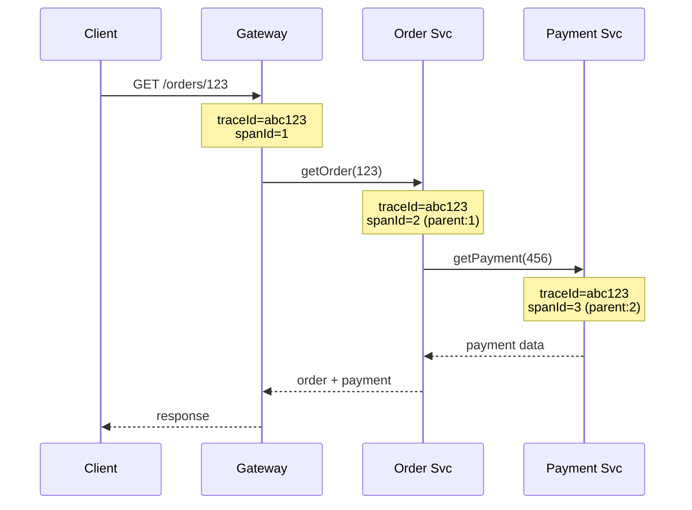

---
tags:
- architecture
- microservices
- programming
---

# 05 Distributed Tracing

A single user request can touch the API gateway, auth service, order service, payment service, inventory service, and notification service. When something goes wrong — which service broke? Distributed tracing follows the request across every hop.

---

## How It Works



| Concept | Meaning |
|---------|---------|
| **Trace** | The entire journey of one request across all services |
| **Span** | One unit of work within a trace (a single service call) |
| **traceId** | Unique ID for the whole trace — passed through HTTP headers |
| **spanId** | Unique ID for one span — parent-child relationship forms the tree |

---

## Propagation — How traceId Travels

Every service must forward the trace context to downstream calls.

### W3C Trace Context (HTTP Headers)

```
traceparent: 00-abc123def456-0000000000000001-01
             │  │             │                │
             │  │             │                └── trace flags (sampled)
             │  │             └── parent span ID
             │  └── trace ID
             └── version
```

### B3 Propagation (Zipkin, older)

```
X-B3-TraceId: abc123def456
X-B3-SpanId: 0000000000000001
X-B3-ParentSpanId: 0000000000000000
X-B3-Sampled: 1
```

---

## Tools

| Tool | Type | Best For |
|------|------|----------|
| **Jaeger** | Standalone tracer (Uber) | OpenTelemetry-native, good UI |
| **Zipkin** | Standalone tracer (Twitter) | B3 propagation, Spring Boot integration |
| **OpenTelemetry** | SDK + collector | Vendor-neutral instrumentation |
| **AWS X-Ray** | Managed (AWS) | AWS ecosystem |
| **Datadog APM** | SaaS | Full observability platform |

---

## Sampling — Don't Trace Everything

Tracing every request is expensive. Sample strategically:

| Strategy | When |
|----------|------|
| **Always-on** | Errors, slow requests (> 500ms), specific users |
| **Probabilistic** | 1% of all requests for baseline |
| **Adaptive** | More samples when error rate spikes |

---

## Spring Boot + Micrometer Tracing

```yaml
management:
  tracing:
    sampling:
      probability: 0.1  # 10% of requests
  zipkin:
    tracing:
      endpoint: http://zipkin:9411/api/v2/spans
```

```java
@GetMapping("/orders/{id}")
public Order getOrder(@PathVariable String id) {
    // traceId automatically propagated to any RestTemplate/WebClient call
    return orderService.findById(id);
}
```

---

## Sources

- OpenTelemetry — https://opentelemetry.io/
- Jaeger — https://www.jaegertracing.io/
- W3C Trace Context — https://www.w3.org/TR/trace-context/
