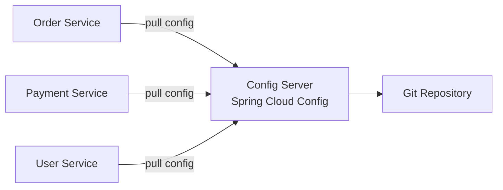

---
tags:
- architecture
- microservices
- programming
---

# 06 Configuration Management

Hardcoded config values (URLs, passwords, feature flags) scattered across services = a nightmare. Externalized configuration centralizes settings so you can change them without redeploying.

---

## The Problem

```
❌ Hardcoded:
  application.yml (inside the JAR)
  → Change DB password? Rebuild, redeploy every service.

✅ Externalized:
  Config Server (separate service)
  → Change DB password? Update one place. Services pick it up live.
```

---

## Patterns

### 1. External Config Server



All config lives in Git. Services pull on startup and can refresh at runtime.

### 2. Environment Variables (12-Factor App)

Simplest approach. Config is injected at deploy time, not baked into the image.

```yaml
# Kubernetes
env:
  - name: DB_URL
    valueFrom:
      secretKeyRef:
        name: db-secret
        key: url
```

### 3. Kubernetes ConfigMap + Secret

| Resource | What It Stores |
|----------|---------------|
| **ConfigMap** | Non-sensitive: URLs, feature flags, log levels |
| **Secret** | Sensitive: passwords, API keys, TLS certs |

---

## Spring Cloud Config

```yaml
# Config Server (config-server.yml)
spring:
  cloud:
    config:
      server:
        git:
          uri: https://github.com/myorg/config-repo
          searchPaths: '{application}'
```

```yaml
# order-service.yml (in Git repo)
server:
  port: 8080
database:
  url: jdbc:postgresql://order-db:5432/orders
payment:
  service:
    url: http://payment-service
    timeout: 5000
feature:
  new-checkout: true
```

Services consume:

```yaml
# order-service's bootstrap.yml
spring:
  application:
    name: order-service
  cloud:
    config:
      uri: http://config-server:8888
```

---

## Refresh Without Restart

```java
@RestController
@RefreshScope  // Re-injects config when /actuator/refresh is called
public class OrderController {
    @Value("${feature.new-checkout}")
    private boolean newCheckoutEnabled;
}
```

```
POST /actuator/refresh  →  Reloads config without restarting the service
```

Or use Spring Cloud Bus (Kafka/RabbitMQ) to broadcast refresh to all instances.

---

## Feature Flags

Toggle features on/off without deploying:

```yaml
feature:
  new-checkout-flow: false   # Toggle in config repo → refresh → live
  dark-mode: false
  beta-search: true
```

| Use Case | Example |
|----------|---------|
| **Canary release** | Roll out new feature to 10% of users |
| **Kill switch** | Disable a broken feature instantly |
| **A/B testing** | Two versions, measure which performs better |

---

## Sources

- Spring Cloud Config — https://spring.io/projects/spring-cloud-config
- 12-Factor App — https://12factor.net/config
