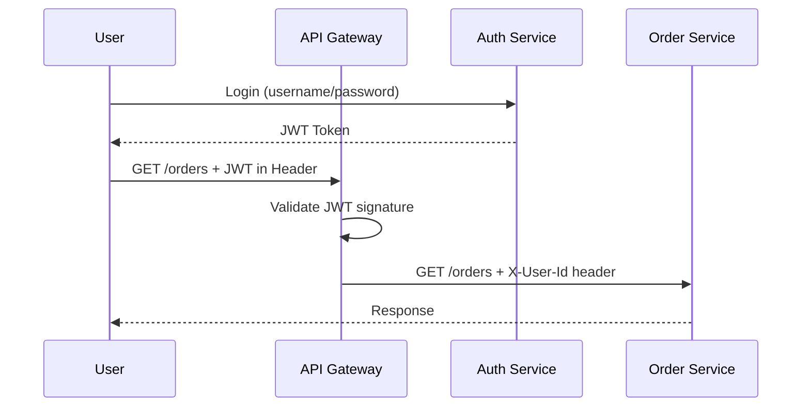

---
tags:
- architecture
- microservices
- programming
---

# 06 Security Patterns

In a monolith, security is one login check. In microservices, every service call needs authentication and authorization — but you can't make the user log in 5 times. Security patterns solve this without coupling every service to an auth system.

---

## Core Concepts

| Concept | Meaning |
|---------|---------|
| **Authentication** | Who are you? (login, token, certificate) |
| **Authorization** | What can you do? (roles, permissions, scopes) |
| **mTLS** | Both client AND server verify each other's certificates |

---

## JWT (JSON Web Token)

A self-contained token that carries user identity and claims. The service validates it without calling an auth server.

```
JWT Structure:
  Header.Payload.Signature
  
  Header:   {"alg": "RS256", "typ": "JWT"}
  Payload:  {"sub": "user123", "roles": ["customer"], "exp": 1716123456}
  Signature: HMAC or RSA signature of Header + Payload
```

### JWT Flow



---

## OAuth2 / OpenID Connect

| Flow | Use Case |
|------|----------|
| **Authorization Code** | Web app with backend (most secure) |
| **Client Credentials** | Service-to-service (no user involved) |
| **PKCE** | Mobile apps, SPAs (no client secret) |

### Service-to-Service: Client Credentials

```
Order Service → Auth Server: "I am order-service, here's my client_id + secret"
Auth Server → Order Service: Access Token (JWT)
Order Service → Payment Service: Request + Access Token
Payment Service → validates JWT locally (public key)
```

---

## mTLS (Mutual TLS)

Both sides present certificates. Perfect for service-to-service communication in zero-trust environments.

```
Without mTLS:  Service A → Service B  (B trusts A because... network?)
With mTLS:     Service A ⇄ Service B  (Both verified by certificates)
```

| Tool | What It Does |
|------|-------------|
| **Istio** | Automatic mTLS between all services in the mesh |
| **Cert-Manager** | Auto-issues and rotates certificates in Kubernetes |

---

## API Gateway Security

The gateway is the security choke point:

| Gateway Responsibility | Service Responsibility |
|------------------------|------------------------|
| Validate JWT | Trust X-User-Id header from gateway |
| Rate limiting per user/IP | Authorization (does this user own this order?) |
| TLS termination | Internal mTLS between services |
| OAuth flows | Business-level permissions |

---

## Security Checklist

- [ ] All external traffic goes through API Gateway with TLS
- [ ] Service-to-service uses mTLS or JWT client credentials
- [ ] JWTs have short expiration (15 min) + refresh tokens
- [ ] Secrets never in code — use Vault or K8s Secrets
- [ ] Rate limiting at gateway + per-service
- [ ] Audit logs for all auth events

---

## Sources

- JWT — https://jwt.io/
- OAuth2 — https://oauth.net/2/
- Istio Security — https://istio.io/latest/docs/concepts/security/
