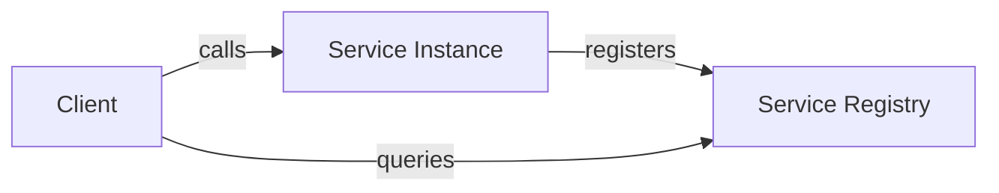
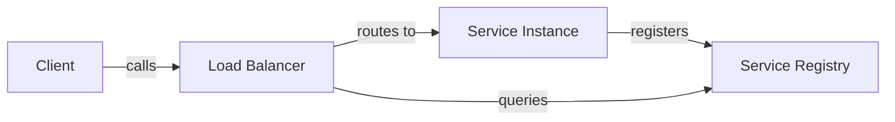

---
tags:
- architecture
- microservices
- programming
---

# 06 Service Discovery

In a static world, you hardcode service URLs. In microservices, instances come and go — scaling up, scaling down, crashing, restarting. Service discovery lets services find each other dynamically.

---

## The Problem

```
Without Discovery:
  Order Service → http://payment-service:8080 (hardcoded)
  Payment scales to 3 instances → Order doesn't know about them
  Payment instance dies → Order keeps sending requests to a dead IP
```

---

## Patterns

### Client-Side Discovery



| Step | Action |
|------|--------|
| 1 | Service registers with the registry on startup |
| 2 | Client queries registry: "Give me payment-service instances" |
| 3 | Client load-balances across available instances |
| 4 | Client handles failures, retries, circuit breaking |

**Tools:** Netflix Eureka, Consul (with client lib)

### Server-Side Discovery



| Step | Action |
|------|--------|
| 1 | Service registers with the registry |
| 2 | Client calls a known load balancer address |
| 3 | Load balancer queries registry and routes to an instance |

**Tools:** AWS ALB + ECS, Kubernetes Service + kube-proxy

---

## Service Registry

| Tool | Type | Notes |
|------|------|-------|
| **Eureka** (Netflix) | Client-side | AP (available, partition-tolerant). Self-preservation mode. |
| **Consul** (HashiCorp) | Both | CP (consistent). Health checking, KV store, service mesh. |
| **Kubernetes Service** | Server-side | Built-in. DNS-based (`payment-service.default.svc.cluster.local`). |
| **etcd** | CP | CoreOS. Used by Kubernetes internally. |

---

## Self-Registration Pattern

Each service registers itself — no external agent.

```java
// Spring Boot + Eureka
@SpringBootApplication
@EnableDiscoveryClient
public class OrderServiceApplication {
    public static void main(String[] args) {
        SpringApplication.run(OrderServiceApplication.class, args);
    }
}
```

```yaml
spring:
  application:
    name: order-service
eureka:
  client:
    serviceUrl:
      defaultZone: http://eureka:8761/eureka/
```

---

## Health Checking + Discovery

The registry must know when an instance dies. Two approaches:

| Approach | How |
|----------|-----|
| **Heartbeat** (Eureka) | Service sends heartbeat every 30s. If missed, deregister after 90s. |
| **Health check** (Consul) | Registry actively checks `/health` endpoint. |

> Without health checking, dead instances stay in the registry and clients route to ghosts.

---

## Sources

- Netflix Eureka — https://github.com/Netflix/eureka
- Consul — https://www.consul.io/
- Kubernetes Service Discovery — https://kubernetes.io/docs/concepts/services-networking/service/
