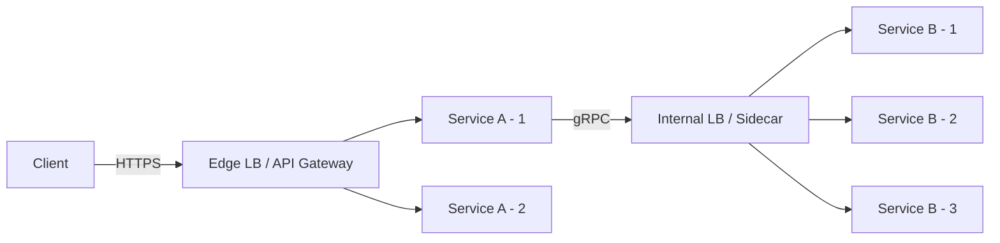

---
tags:
  - architecture
  - microservices
  - programming
---

# 03 Load Balancing

Load balancing distributes incoming network traffic across multiple service instances to maximize throughput, minimize latency, and ensure no single instance is overwhelmed. In microservices, it operates at two distinct layers and is critical for achieving high availability and horizontal scalability.

---

## Two Layers

| Layer | Scope | Example |
|-------|-------|---------|
| **Edge / External** | Client → API Gateway | Cloud ALB, NGINX, Traefik |
| **Internal / Service-to-Service** | Service A → Service B | Envoy sidecar, client-side LB (gRPC) |

---

## L4 vs L7

| Aspect | Layer 4 (Transport) | Layer 7 (Application) |
|--------|---------------------|----------------------|
| Protocol | TCP / UDP | HTTP, gRPC, WebSocket |
| Speed | Very fast — no payload inspection | Slightly slower — parses headers/body |
| Content awareness | None — routes by IP + port | Full — can route by path, header, cookie |
| Use case | Raw throughput, database proxying | API routing, auth offload, rate-limiting |
| TLS | Pass-through or terminate | Always terminates to inspect |
| Example | AWS NLB, HAProxy (TCP mode) | AWS ALB, NGINX, Envoy |

---

## Algorithms

| Algorithm | How it works | When to use |
|-----------|-------------|-------------|
| **Round-Robin** | Rotate sequentially | Stateless, homogeneous instances |
| **Least Connections** | Pick instance with fewest active connections | Varying request durations |
| **Weighted** | Assign weights per instance capacity | Mixed instance sizes |
| **Consistent Hashing** | Hash key (user ID, session) maps to instance | Caching layers, sticky routing without state |
| **Latency-based** | Pick instance with lowest observed latency | Multi-region or heterogeneous networks |
| **Random** | Pick randomly | Simple, surprisingly effective at scale |

---

## Health Checks & Outlier Detection

### Active vs Passive

| Type | Mechanism | Pros | Cons |
|------|-----------|------|------|
| **Active** | LB periodically pings `/health` endpoint | Detects down instances quickly | Adds traffic; may miss slow degradation |
| **Passive** | LB observes real traffic responses (5xx, timeouts) | No extra traffic; catches real failures | Slower detection on low-traffic routes |

### Outlier Detection

Even if an instance passes active health checks, it may still degrade (high p99, partial failures). Outlier detection ejects instances that exceed error/latency thresholds from the pool temporarily.

- **Consecutive errors** — eject after N consecutive 5xx responses
- **Success rate** — eject if success rate drops below cluster average
- **Latency** — eject if p99 exceeds a multiple of the median

> Envoy's outlier detection is the gold standard — configure `consecutive_5xx`, `interval`, and `base_ejection_time`.

---

## Technology Options

| Tool | Type | Strengths |
|------|------|-----------|
| **Traefik** | L7 reverse proxy | Auto-discovery (Docker/K8s), built-in Let's Encrypt, middleware chains |
| **NGINX** | L4/L7 | Battle-tested, high performance, rich ecosystem |
| **HAProxy** | L4/L7 | Ultra-low latency, advanced health checks, TCP excellence |
| **Envoy** | L4/L7 sidecar | xDS API for dynamic config, observability, service mesh backbone |
| **Cloud ALB/NLB** | Managed | Zero ops, auto-scaling, native integration |
| **Caddy** | L7 | Automatic HTTPS, simple config, good for smaller deployments |

---

## Key Decisions

1. **TLS termination location** — Terminate at edge LB for simplicity, or re-encrypt (mTLS) between services for zero-trust. Terminating at sidecar (Envoy) gives both security and observability.
2. **Sticky sessions** — Avoid. They create hotspots and complicate scaling. Use external session stores (Redis) or stateless tokens (JWT) instead.
3. **Centralized vs Client-side LB** — Centralized (dedicated proxy) is simpler to operate. Client-side (built into SDK/sidecar) reduces hops and latency. Service meshes (Istio/Linkerd) give client-side LB without app code changes.

---

## Sources

- [NGINX Load Balancing Docs](https://docs.nginx.com/nginx/admin-guide/load-balancer/http-load-balancer/)
- [Envoy Proxy — Load Balancing](https://www.envoyproxy.io/docs/envoy/latest/intro/arch_overview/upstream/load_balancing/load_balancing)
