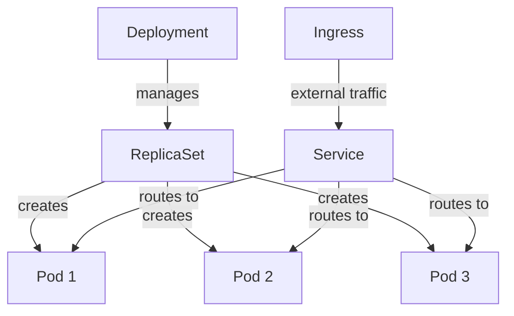

---
tags:
- architecture
- microservices
- programming
---

# 07 Containers & Orchestration

Containers package your service with its dependencies into a single, portable unit. Orchestrators manage containers at scale — scheduling, scaling, networking, and healing.

---

## Docker — The Container

A container is a lightweight, isolated process with its own filesystem, network, and resource limits.

```dockerfile
FROM openjdk:17-jdk-slim
COPY target/order-service.jar app.jar
EXPOSE 8080
HEALTHCHECK --interval=30s CMD curl -f http://localhost:8080/actuator/health || exit 1
ENTRYPOINT ["java", "-jar", "app.jar"]
```

| Concept | What It Is |
|---------|-----------|
| **Image** | Immutable blueprint (Dockerfile → built image) |
| **Container** | Running instance of an image |
| **Registry** | Where images are stored (Docker Hub, ECR, GCR) |

---

## Kubernetes — The Orchestrator

Kubernetes schedules containers, keeps them running, and connects them.

### Core Objects



| Object | Purpose |
|--------|---------|
| **Pod** | Smallest deployable unit — one or more containers sharing network/storage |
| **Deployment** | Manages pods: desired count, rolling updates, rollbacks |
| **Service** | Stable IP/DNS for pods (pods die, service stays) |
| **Ingress** | External HTTP access with routing rules |
| **ConfigMap / Secret** | Externalized configuration |
| **Namespace** | Virtual cluster for isolation |

---

## Pod Design Patterns

| Pattern | Description |
|---------|------------|
| **Sidecar** | Helper container alongside main (e.g., Envoy proxy for service mesh) |
| **Ambassador** | Proxy that abstracts external services (e.g., Redis sentinel proxy) |
| **Adapter** | Normalizes output (e.g., log format adapter) |
| **Init Container** | Runs before main container (e.g., DB migration, wait-for-dependency) |

---

## Kubernetes Manifest Example

```yaml
apiVersion: apps/v1
kind: Deployment
metadata:
  name: order-service
spec:
  replicas: 3
  selector:
    matchLabels:
      app: order-service
  template:
    metadata:
      labels:
        app: order-service
    spec:
      containers:
        - name: order-service
          image: myregistry/order-service:1.2.0
          ports:
            - containerPort: 8080
          livenessProbe:
            httpGet:
              path: /actuator/health/liveness
              port: 8080
          readinessProbe:
            httpGet:
              path: /actuator/health/readiness
              port: 8080
          resources:
            requests:
              memory: "256Mi"
              cpu: "250m"
            limits:
              memory: "512Mi"
              cpu: "500m"
---
apiVersion: v1
kind: Service
metadata:
  name: order-service
spec:
  selector:
    app: order-service
  ports:
    - port: 8080
      targetPort: 8080
```

---

## Sources

- Kubernetes — https://kubernetes.io/docs/
- Docker — https://docs.docker.com/
