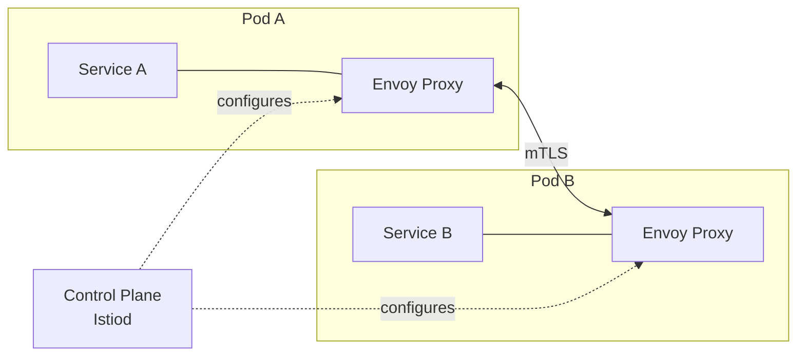

---
tags:
- architecture
- microservices
- programming
---

# 07 Service Mesh

A service mesh offloads networking, security, and observability from your application code to a sidecar proxy. Your service just handles business logic — the mesh handles everything else.

---

## The Problem

Without a mesh, every service implements retry, circuit breaking, TLS, metrics, and tracing itself. That's duplicated code in every service in every language.

---

## How a Mesh Works

| Component | Role |
|-----------|------|
| **Data Plane** | Sidecar proxies (Envoy) that handle all service-to-service traffic |
| **Control Plane** | Manages and configures the proxies (Istiod, Linkerd control plane) |

---

## What the Mesh Handles (Without You Writing Code)

| Feature | How |
|---------|-----|
| **mTLS** | Automatic encryption between all services |
| **Retry** | Retry failed requests (configurable per route) |
| **Circuit Breaking** | Stop calling failing services |
| **Traffic Splitting** | Canary: 90% v1, 10% v2 |
| **Load Balancing** | Least request, round-robin, random |
| **Observability** | Metrics, traces, access logs — automatically |
| **Fault Injection** | Deliberately delay/abort requests to test resilience |

---

## Istio vs Linkerd

| | Istio | Linkerd |
|---|-------|---------|
| **Proxy** | Envoy (C++) | linkerd2-proxy (Rust) |
| **Complexity** | High (many CRDs) | Low (simpler config) |
| **Performance** | High | Very high (lighter proxy) |
| **Ecosystem** | Largest, most features | Simpler, growing |
| **Best for** | Complex, multi-cluster | Simple, performance-focused |

---

## When You DON'T Need a Service Mesh

| Scenario | Don't Use Mesh |
|----------|:-------------:|
| < 5 services | Overkill — the complexity isn't worth it |
| Monolith | No service-to-service traffic to manage |
| Simple infrastructure | Library-based resilience (Resilience4j) is enough |
| Team is small | Mesh adds operational complexity |

> **Rule of thumb:** Start without a mesh. Add one when you feel the pain of implementing retry/circuit-breaking/TLS in every service.

---

## Sources

- Istio — https://istio.io/
- Linkerd — https://linkerd.io/
