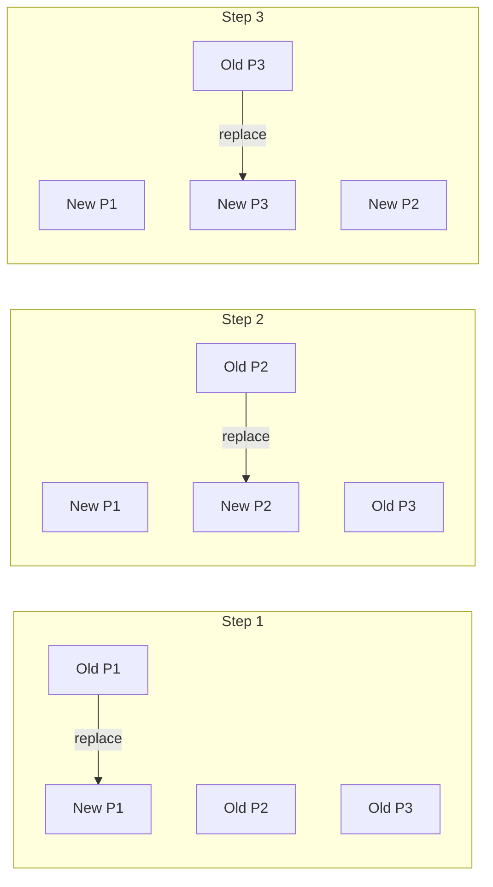
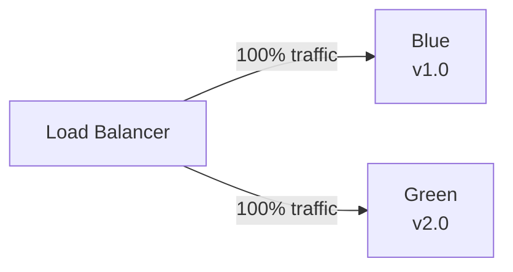
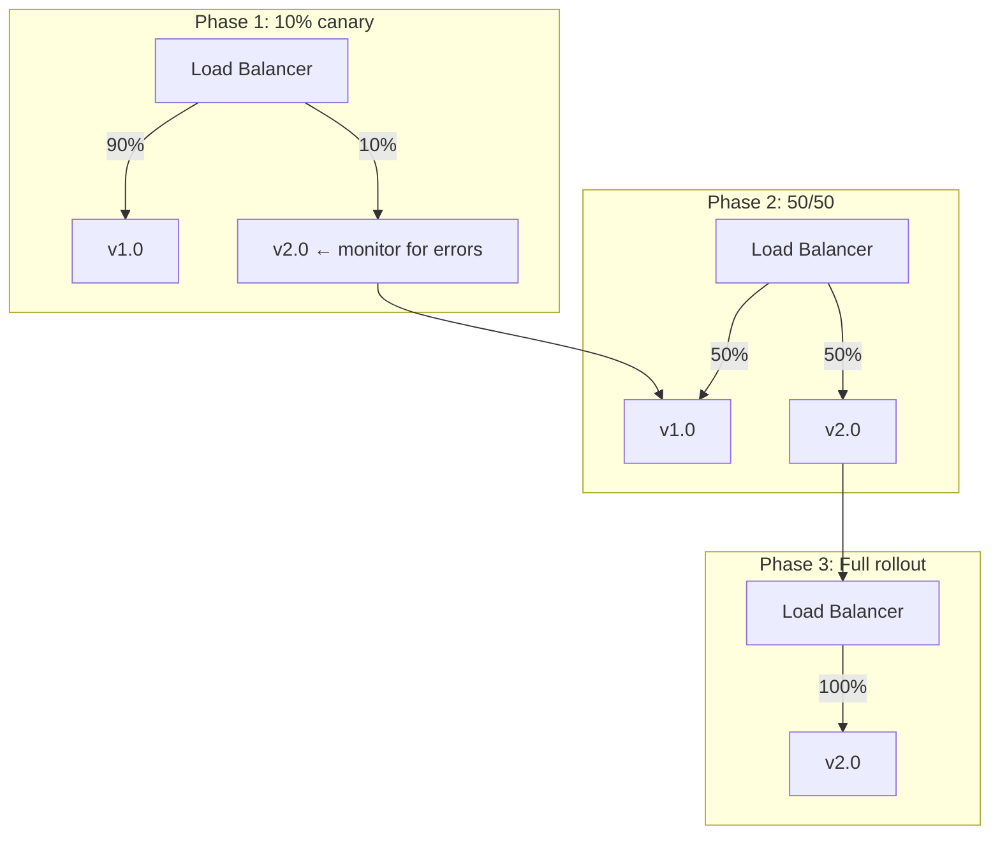

---
tags:
- architecture
- microservices
- programming
---

# 07 Deployment Strategies

How you deploy matters as much as what you deploy. The wrong strategy means downtime, broken users, and 3am rollbacks. The right strategy means users never notice.

---

## Strategies Comparison

| Strategy | Downtime | Rollback Speed | Complexity |
|----------|:--------:|:-------------:|:----------:|
| **Recreate** | Yes (full) | Slow | Lowest |
| **Rolling Update** | No | Medium | Low |
| **Blue-Green** | No | Instant | Medium |
| **Canary** | No | Instant | High |

---

## Rolling Update

Replace old instances one at a time. Default in Kubernetes.



| ✅ | ❌ |
|----|-----|
| No downtime | Both old and new run simultaneously — must be compatible |
| Gradual rollout | Slow — takes time to replace all instances |
| Simple | Can't easily test new version in isolation |

```yaml
strategy:
  type: RollingUpdate
  rollingUpdate:
    maxUnavailable: 1   # Replace 1 pod at a time
    maxSurge: 1         # Allow 1 extra pod during update
```

---

## Blue-Green

Two identical environments. Blue serves traffic. Green gets the new version. Switch all traffic at once.



| Step | Action |
|------|--------|
| 1 | Deploy v2.0 to Green (no traffic) |
| 2 | Test Green thoroughly |
| 3 | Switch load balancer: Blue → Green |
| 4 | Keep Blue for instant rollback |
| 5 | Destroy Blue after confirming v2.0 is stable |

| ✅ | ❌ |
|----|-----|
| Instant rollback (switch back to Blue) | Double infrastructure cost |
| Test in production-like env before release | Database migrations must be backward-compatible |

---

## Canary Release

Route a small % of traffic to the new version. Ramp up gradually.



| Tool | How |
|------|-----|
| **Istio** | Traffic splitting by weight (90/10, 50/50) |
| **AWS CodeDeploy** | Canary deployment groups |
| **Argo Rollouts** | Kubernetes-native canary |

---

## Database Migrations — The Hard Part

Rollback is easy for stateless services. Database migrations make it hard.

| Rule | Why |
|------|-----|
| **Additive only** | Add columns/tables — never delete or rename during deploy |
| **Backward-compatible** | v1.0 must work with v2.0's schema |
| **Separate migration step** | Run migration BEFORE deploying v2.0 |
| **Rollback plan** | How to undo the migration if v2.0 fails? |

---

## Sources

- Kubernetes Deployments — https://kubernetes.io/docs/concepts/workloads/controllers/deployment/
- Argo Rollouts — https://argoproj.github.io/argo-rollouts/
