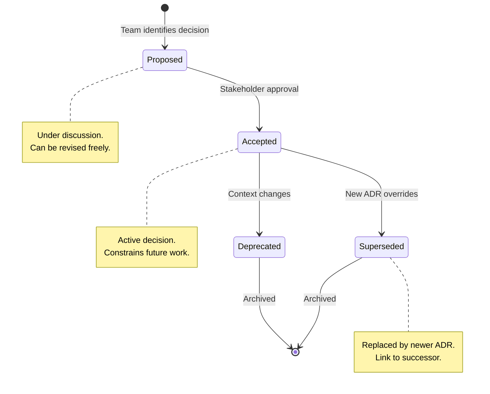
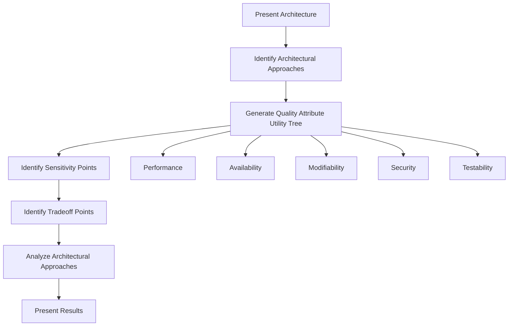
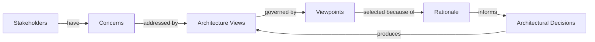

# Design Rationale and Decisions

> *Source: SWEBOK v4 Chapter 03 — Software Design | ISO/IEC/IEEE 42010*

## Purpose

Every design embodies hundreds of decisions: why a microservice boundary was drawn here, why an event-driven pattern was chosen over request-reply, why a particular database was selected. Without capturing the **rationale** behind these decisions, future engineers face a ruinous choice: blindly preserve decisions they don't understand, or recklessly change them without knowing what constraints they served. Design rationale is the institutional memory of architectural choice.

## What Is Design Rationale?

**Definition:** Design rationale is the set of reasons, assumptions, alternatives, trade-offs, and constraints that explain *why* a design decision was made, not just *what* was decided.

### The Rationale Gap

Most design documents describe **what** the system looks like. Few explain **why** it looks that way. This gap creates:

| Problem | Symptom | Consequence |
|---|---|---|
| **Mystery decisions** | "Why did they use Kafka here?" | New team members waste weeks reverse-engineering intent |
| **Cargo-cult architecture** | "We've always done it this way" | Obsolete constraints drive current decisions |
| **Regression on change** | "We changed X and broke Y" | Hidden dependencies between decisions are lost |
| **Repeated mistakes** | "We tried that before and it failed" | Lessons learned are not preserved |
| **Stakeholder distrust** | "Why did this take so long?" | No visible reasoning behind cost or schedule |

### What Rationale Captures

```
┌─────────────────────────────────────────────────┐
│              DESIGN DECISION                     │
├─────────────────────────────────────────────────┤
│ Context:    What problem or requirement?         │
│ Decision:   What was chosen?                     │
│ Alternatives: What else was considered?          │
│ Rationale:  Why was this chosen over others?     │
│ Trade-offs: What was sacrificed?                 │
│ Assumptions: What must remain true?              │
│ Consequences: What follows from this choice?     │
│ Status:     Proposed / Accepted / Deprecated     │
└─────────────────────────────────────────────────┘
```

## Architecture Decision Records (ADRs)

### What Is an ADR?

An **Architecture Decision Record (ADR)** is a lightweight, version-controlled document that captures a single architectural decision along with its context and consequences. ADRs were popularized by Michael Nygard in 2011 and have become the de facto standard for capturing design rationale in modern software teams.

### ADR Template (Standard)

```markdown
# ADR-{NNN}: {Title}

## Status
{Proposed | Accepted | Deprecated | Superseded by ADR-XXX}

## Date
{YYYY-MM-DD}

## Context
{What is the issue that we're seeing that is motivating this decision?}

## Decision
{What is the change that we're proposing and/or doing?}

## Alternatives Considered
1. **{Alternative A}** — {description, pros, cons}
2. **{Alternative B}** — {description, pros, cons}
3. **{Alternative C}** — {description, pros, cons}

## Rationale
{Why this decision over the alternatives? What factors were decisive?}

## Consequences
- **Positive:** {what improves}
- **Negative:** {what degrades}
- **Neutral:** {what changes but is neither better nor worse}

## Assumptions
- {What must remain true for this decision to hold?}

## Related Decisions
- ADR-{NNN}: {related decision}
- See also: [[06_Design_Quality_Analysis|Design Quality Analysis]]

## Participants
{Who was involved in making this decision?}
```

### ADR Lifecycle



### ADR Numbering and Organization

| Strategy | Description | Best For |
|---|---|---|
| **Sequential** | ADR-001, ADR-002, ... | Small to medium projects |
| **Categorical** | ADR-DB-001, ADR-API-002 | Large projects with many domains |
| **Date-based** | ADR-2025-07-21-001 | Teams that prefer chronological ordering |
| **Decision-tree** | Nested folders by domain | Very large programs with sub-teams |

**Storage:** ADRs live alongside the codebase in version control (e.g., `docs/adr/`), ensuring they evolve with the code they describe.

### Minimal ADR (Lightweight Variant)

For teams that find the full template too heavy:

```markdown
# ADR-{NNN}: {Title}

**Status:** Accepted | **Date:** {YYYY-MM-DD}

**Context:** {one paragraph}

**Decision:** {one sentence}

**Consequences:** {bullet list}
```

> **Rule of thumb:** ADRs should take less than 15 minutes to write. If they take longer, the decision is probably not yet mature enough to record.

## Decision Analysis Frameworks

### Decision Matrix

A **decision matrix** evaluates alternatives against weighted criteria. It transforms subjective preferences into a structured, repeatable process.

| Criterion | Weight | Alt A: REST API | Alt B: GraphQL | Alt C: gRPC |
|---|---|---|---|---|
| **Performance** | 30% | 6 | 5 | 9 |
| **Developer experience** | 25% | 8 | 7 | 5 |
| **Tooling maturity** | 20% | 9 | 7 | 6 |
| **Type safety** | 15% | 4 | 6 | 9 |
| **Caching** | 10% | 9 | 3 | 4 |
| **Weighted Score** | 100% | **6.85** | **5.75** | **6.65** |

**Calculation:** `Score = Σ (weight_i × rating_i)` for each alternative.

### Pugh Matrix (Concept Selection)

The **Pugh Matrix** (developed by Stuart Pugh) compares alternatives against a **datum** (baseline) using +, -, and S (same) ratings. It is especially useful early in design when you need to converge quickly on a promising direction.

| Criterion | Datum: Monolith | Microservices | Serverless | Modular Monolith |
|---|---|---|---|---|
| Deployment simplicity | S | - | + | + |
| Operational complexity | S | - | - | S |
| Independent scaling | S | + | + | S |
| Team autonomy | S | + | + | S |
| Development speed (initial) | S | - | + | + |
| Debugging ease | S | - | - | S |
| **Total +** | — | 3 | 4 | 4 |
| **Total -** | — | 3 | 2 | 0 |
| **Net** | 0 | 0 | +2 | +4 |

**Process:**
1. Select the current best design as the datum
2. Rate each alternative as + (better), - (worse), or S (same)
3. Sum the columns; the alternative with the best net score wins
4. If no clear winner, combine the best features of top contenders (hybrid approach)

### Weighted Scoring Model

For complex decisions with many stakeholders:

```
Final Score = Σ (W_i × R_ij × C_j)

Where:
  W_i  = Weight of criterion i (sums to 1.0)
  R_ij = Rating of alternative j on criterion i (1-10 scale)
  C_j  = Confidence factor for rating (0.5-1.0, reflects uncertainty)
```

The confidence factor is critical: it forces teams to acknowledge when ratings are guesses rather than measurements.

### ATAM (Architecture Tradeoff Analysis Method)

Developed by the Software Engineering Institute (SEI), ATAM is a structured method for evaluating architectural decisions against quality attribute scenarios.

**ATAM Process:**



**Key concepts:**
- **Sensitivity point:** An architectural decision that significantly affects a quality attribute (e.g., choosing a message queue is a sensitivity point for availability)
- **Tradeoff point:** A decision that affects multiple quality attributes in opposing ways (e.g., adding encryption improves security but degrades performance)

> See also: [[03_Design_Qualities|Design Qualities]] for the quality attributes referenced in ATAM.

## Design Decision Logs

### Beyond ADRs: The Decision Log

A **decision log** is a chronological record of all significant decisions, including those too small or too routine for a full ADR. Think of it as a project diary for architectural choices.

| Date | Decision | Made By | Rationale (brief) | ADR? |
|---|---|---|---|---|
| 2025-01-15 | Use PostgreSQL as primary database | Tech Lead + DBA | JSON support + maturity + team expertise | ADR-003 |
| 2025-01-20 | Adopt 200-line max for API handlers | Team vote | Readability, enforceable by linting | No |
| 2025-02-03 | Switch from REST to gRPC for internal services | Architect | Latency requirements + type safety | ADR-007 |
| 2025-02-10 | Add Redis caching layer | Performance team | p99 latency exceeded SLA by 40% | ADR-008 |
| 2025-03-01 | Deprecate SOAP endpoint | Product + Engineering | 3 active clients, maintenance burden | ADR-012 |

### Decision Log vs ADR

| Aspect | Decision Log | ADR |
|---|---|---|
| **Granularity** | All decisions, large and small | Significant architectural decisions only |
| **Detail level** | One-line summary | Full context, alternatives, consequences |
| **Format** | Table or chronological list | Structured template |
| **Audience** | Team members | Team + stakeholders + future maintainers |
| **Location** | Wiki, spreadsheet, or project board | Version-controlled alongside code |

## Communicating Design Decisions to Stakeholders

### Stakeholder-Specific Views

Different audiences need different views of the same decision:

| Stakeholder | What They Care About | Communication Channel |
|---|---|---|
| **Developers** | Technical details, constraints, APIs | ADR in repo, tech talks |
| **Product managers** | Feature impact, timeline effects | Summary email, roadmap update |
| **Executives** | Cost, risk, strategic alignment | One-page brief, executive summary |
| **Operations** | Deployment, monitoring, scaling | Runbook update, architecture diagram |
| **Security** | Threat model, compliance impact | Security review document |
| **New team members** | Context, history, rationale | ADR index, onboarding guide |

### The Decision Communication Canvas

```
┌────────────────────────────────────────────────────────┐
│                DECISION COMMUNICATION                   │
├──────────────────────┬─────────────────────────────────┤
│ WHAT we decided      │ One sentence summary            │
├──────────────────────┼─────────────────────────────────┤
│ WHY we decided it    │ Top 3 reasons                    │
├──────────────────────┼─────────────────────────────────┤
│ WHAT we rejected     │ Top 2 alternatives + why        │
├──────────────────────┼─────────────────────────────────┤
│ WHAT changes         │ Impact on team, process, system │
├──────────────────────┼─────────────────────────────────┤
│ WHAT could go wrong  │ Top 2 risks + mitigations       │
├──────────────────────┼─────────────────────────────────┤
│ WHEN to revisit      │ Trigger conditions              │
└──────────────────────┴─────────────────────────────────┘
```

### Presentation Techniques

1. **Decision brief:** 1-page document covering the canvas above
2. **Tech talk:** 15-minute presentation with Q&A (good for complex decisions)
3. **Architecture review meeting:** Formal presentation to review board
4. **RFC (Request for Comments):** Propose decision, collect feedback asynchronously over 1-2 weeks
5. **Decision Slack channel:** Lightweight channel for day-to-day decisions with threading

## Design Reviews as Rationale Capture Opportunities

### Reviews as Decision Points

Design reviews (see [[06_Design_Quality_Analysis|Design Quality Analysis]]) are not just defect-finding exercises; they are the natural moment to capture rationale. When a reviewer asks "Why did you choose X?", that question and its answer should be recorded.

### Integrating Rationale into Reviews

| Review Activity | Rationale Opportunity |
|---|---|
| **Reviewer asks "why?"** | Record the question and answer as an ADR |
| **Alternative proposed during review** | Add to ADR's "Alternatives Considered" section |
| **Trade-off identified** | Document in the decision's "Trade-offs" section |
| **Assumption challenged** | Update ADR's "Assumptions" section with the challenge |
| **Decision reversed** | Create new ADR superseding the old one |

### Review Rationale Template

```markdown
## Review Rationale Capture (Meeting Date: YYYY-MM-DD)

### Decisions Reviewed
| ADR | Review Outcome | Rationale Updates |
|---|---|---|
| ADR-005 | Accepted with modification | Added performance data |
| ADR-007 | Rejected, alternative proposed | New ADR-015 created |

### New Decisions Made During Review
| Decision | Rationale | ADR Created? |
|---|---|---|
| Add circuit breaker to PaymentService | Latency spike on 3rd-party calls | ADR-016 |
```

## Relationship Between Design Rationale and Maintainability

### Why Rationale Matters for Maintenance

Maintenance consumes 60-80% of total software lifecycle cost. The majority of maintenance is **corrective** (fixing defects) and **adaptive** (responding to environmental changes). Both require understanding *why* the system was designed the way it was.

```
┌─────────────────────────────────────────────────────────┐
│           MAINTENANCE WITHOUT RATIONALE                  │
│                                                          │
│   Developer encounters unfamiliar design decision        │
│           │                                              │
│           ▼                                              │
│   Can I change this safely?                              │
│           │                                              │
│     ┌─────┴─────┐                                        │
│     ▼           ▼                                        │
│   Guess      Don't touch                                 │
│     │           │                                        │
│     ▼           ▼                                        │
│  Regression  Technical debt                              │
│  defects     accumulates                                 │
└─────────────────────────────────────────────────────────┘

┌─────────────────────────────────────────────────────────┐
│           MAINTENANCE WITH RATIONALE                     │
│                                                          │
│   Developer encounters unfamiliar design decision        │
│           │                                              │
│           ▼                                              │
│   Reads ADR: context, constraints, alternatives          │
│           │                                              │
│           ▼                                              │
│   Understands what must remain true                      │
│           │                                              │
│           ▼                                              │
│   Changes what's safe, proposes ADR for risky changes    │
│           │                                              │
│           ▼                                              │
│   Safe evolution with documented traceability            │
└─────────────────────────────────────────────────────────┘
```

### Rationale and Technical Debt

Technical debt often arises from decisions whose rationale has been forgotten:

| Scenario | Without Rationale | With Rationale |
|---|---|---|
| Team wants to replace library X | "It works, don't touch it" | ADR says X was chosen for compliance. Check if constraint still holds. |
| Performance bottleneck in module Y | Rewrite from scratch | ADR says Y was designed for different load profile. Adapt, don't rewrite. |
| New developer questions pattern Z | "That's how we've always done it" | ADR explains Z prevents a specific race condition. Document the invariant. |
| Vendor lock-in discovered | Panic | ADR notes lock-in was accepted for time-to-market. Now revisit with current context. |

### Rationale Debt

Just as code accumulates technical debt, decisions accumulate **rationale debt**: the growing gap between what was decided and what is documented.

**Signs of rationale debt:**
- Frequent "why did we do this?" conversations
- Decisions being re-debated without new information
- New hires taking months to become productive
- Architectural changes that cause unexpected breakage
- Tribal knowledge concentrated in a few long-tenured engineers

**Repaying rationale debt:**
1. Start with the most-changed modules (highest rationale need)
2. Reverse-engineer rationale from commit messages, PR descriptions, and interviews
3. Write ADRs for the current state, not the original intent
4. Establish an ADR-first culture for all new decisions

## Rationale in Practice: Patterns and Anti-Patterns

### Patterns

| Pattern | Description |
|---|---|
| **ADR-first** | Write the ADR before (or during) implementation, not after |
| **Decision pairing** | Every significant PR includes an ADR or link to existing ADR |
| **Rationale retrospective** | Quarterly review of recent decisions: were assumptions validated? |
| **Living ADRs** | ADRs are updated when context changes, not treated as immutable |
| **Rationale templates** | Standard templates reduce friction and ensure completeness |

### Anti-Patterns

| Anti-Pattern | Description | Consequence |
|---|---|---|
| **Rationale afterthought** | Writing ADRs months after decisions | Context is forgotten, rationale is reconstructed from memory |
| **Rationale theater** | ADRs exist but are never read or updated | False sense of documentation |
| **Over-documentation** | Every trivial choice gets an ADR | ADRs become noise, important decisions buried |
| **Single-author ADRs** | One person writes all rationale | Misses diverse perspectives, creates single point of failure |
| **Rationale hoarding** | Rationale is in private notes, not shared | Institutional knowledge is fragile |

## Rationale Tools and Ecosystem

| Tool | Category | Strengths |
|---|---|---|
| **Markdown + Git** | Plain text | Simple, version-controlled, diff-able |
| **adr-tools** (CLI) | CLI tooling | Standard commands: `adr new`, `adr link`, `adr list` |
| **Log4brains** | Static site | Generates browsable ADR website from Markdown |
| **Confluence** | Wiki | Rich editing, search, team collaboration |
| **Notion** | Wiki | Templates, databases, team-friendly |
| **DecisionRecord** (Java) | Library | ADR management in Java projects |
| **GitHub Discussions** | Platform | Async discussion tied to codebase |

### adr-tools Quick Start

```bash
# Initialize ADR directory
adr init docs/adr

# Create a new ADR
adr new "Use PostgreSQL as primary database"

# Create an ADR that supersedes a previous one
adr new -s 3 "Switch to CockroachDB for multi-region"

# Generate a table of contents
adr generate toc > docs/adr/README.md

# Generate a graph of relationships
adr generate graph > docs/adr/graph.dot
```

## Rationale for Different Design Levels

| Design Level | Decision Scope | Rationale Focus | Typical ADR Count |
|---|---|---|---|
| **Enterprise architecture** | Technology standards, platform choices | Strategic alignment, cost, risk | 5-20 per year |
| **System architecture** | Style (microservices, event-driven), data stores | Quality attributes, team structure | 10-50 per year |
| **Component design** | Patterns, algorithms, interfaces | Performance, maintainability, testability | 20-100 per year |
| **Detailed design** | Data structures, error handling, concurrency | Correctness, efficiency, readability | Usually inline comments |

> See also: [[01_Design_Fundamentals_and_Principles|Design Fundamentals]] for design levels and abstraction, and [[05_Design_Strategies_and_Methods|Design Strategies]] for design methods at each level.

## ISO/IEC/IEEE 42010 and Rationale

ISO/IEC/IEEE 42010 (Systems and Software Engineering: Architecture Description) explicitly requires architecture descriptions to include:

- **Architectural decisions** and their rationale
- **Stakeholder concerns** and how they are addressed
- **Architecture viewpoints** and the rationale for their selection
- **Rationale for consistency** between views

The standard treats rationale as a first-class element of architecture documentation, not an optional supplement.



## Practical Checklist

### Before Making a Design Decision

- [ ] Is this decision significant enough to warrant an ADR?
- [ ] Have at least 2 alternatives been identified?
- [ ] Are the evaluation criteria explicit and weighted?
- [ ] Have affected stakeholders been consulted?
- [ ] Are assumptions documented?

### After Making a Design Decision

- [ ] ADR created with all required sections?
- [ ] ADR reviewed by at least one peer?
- [ ] ADR linked to related ADRs and requirements?
- [ ] Stakeholders notified of the decision?
- [ ] Calendar reminder set to revisit if assumptions are time-bound?

### During Maintenance

- [ ] Relevant ADRs consulted before changing design?
- [ ] New ADR created when context changes?
- [ ] Superseded ADRs marked and linked to successors?
- [ ] Rationale debt assessed quarterly?

## Summary

Design rationale transforms opaque artifacts into understandable, evolvable systems. ADRs provide a standard, lightweight mechanism for capturing the *why* behind the *what*. Decision analysis frameworks (matrices, ATAM) provide rigor for complex trade-offs. Rationale captured during design reviews has the highest fidelity. The relationship between rationale and maintenance is direct: systems whose rationale is documented are cheaper to maintain, safer to evolve, and faster to onboard onto.

> **Key takeaway:** A decision without rationale is a liability. A decision with rationale is an asset.

## Related Notes

- [[01_Design_Fundamentals_and_Principles]]: Core design principles referenced in rationale
- [[02_Design_Processes]]: Where decisions fit in the design lifecycle
- [[03_Design_Qualities]]: Quality attributes that drive trade-off decisions
- [[04_Recording_Software_Designs]]: Documenting design beyond ADRs
- [[06_Design_Quality_Analysis]]: Reviews as rationale capture opportunities
- [[08_Model_Based_Design]]: Model-driven decisions and transformations
- [[09_Variability_and_Feature_Models]]: Decision-making in product lines

## References

1. SWEBOK v4, Chapter 03: Software Design
2. ISO/IEC/IEEE 42010:2011, Systems and Software Engineering: Architecture Description
3. Nygard, M. (2011). *Documenting Architecture Decisions.* blog.thecodewhisperer.com
4. Tyree, A. & Akerman, J. (2005). Architecture Decisions: Demystifying Architecture. *IEEE Software*, 22(2).
5. Clements, P. et al. (2003). *Evaluating Software Architectures: Methods and Case Studies.* SEI Series.
6. Pugh, S. (1991). *Total Design: Integrated Methods for Successful Product Engineering.* Addison-Wesley.
7. Ford, N. et al. (2017). *Building Evolutionary Architectures.* O'Reilly.
