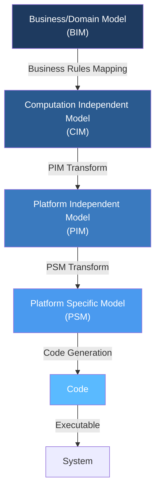
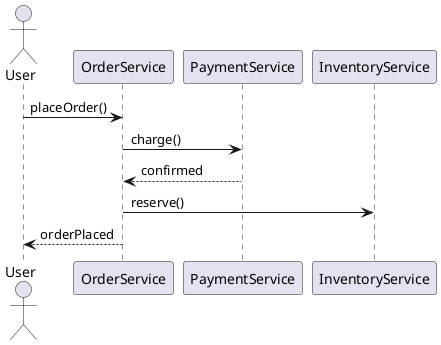
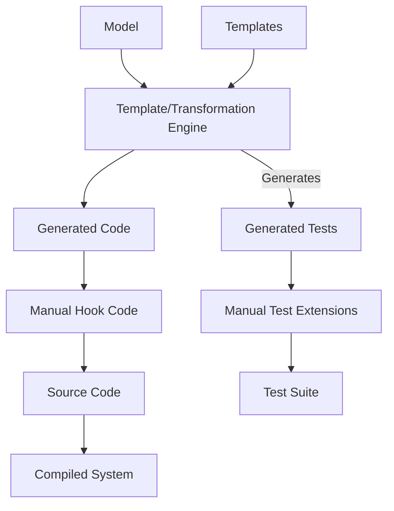
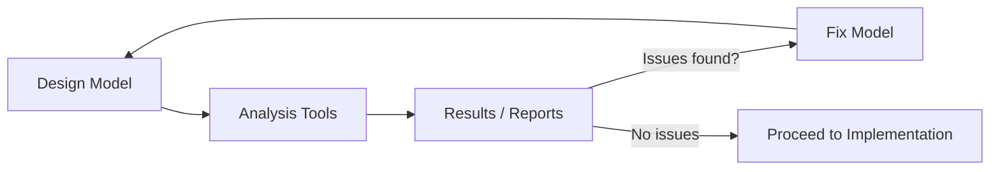
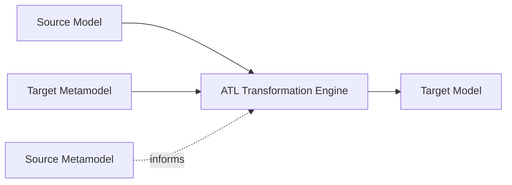
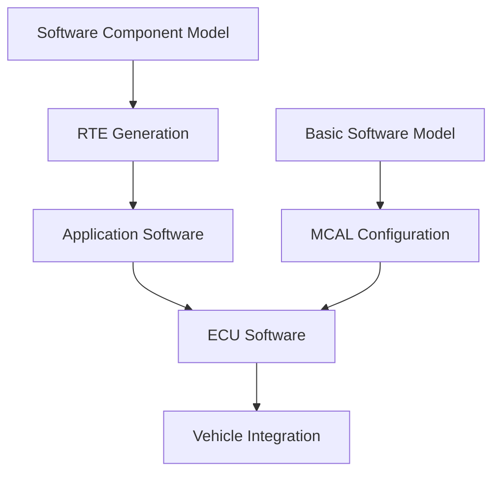
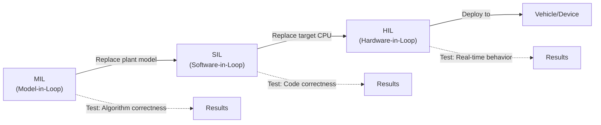

# Model-Based Design

> *Source: SWEBOK v4 Chapter 03 — Software Design*

## Purpose

Traditional software design produces **documents**: UML diagrams, specification text, interface contracts. These documents describe the system, but they are not the system. They drift from reality the moment coding begins. **Model-Based Design (MBD)** inverts this relationship: the model *is* the primary artifact, and code, tests, and documentation are **generated** from it. When the model changes, everything derived from it updates automatically. This eliminates the gap between specification and implementation that plagues document-centric approaches.

## From Document-Based to Model-Based Artifacts

### The Problem with Documents

```
┌───────────────────────────────────────────────────────┐
│            DOCUMENT-BASED WORKFLOW                     │
│                                                        │
│  Requirements ──▶ Design Docs ──▶ Code ──▶ Tests      │
│                      │                   │             │
│                      ▼                   ▼             │
│                 DRIFT BEGINS       DRIFT ACCELERATES   │
│                      │                   │             │
│                      ▼                   ▼             │
│              Docs ≠ Code          Tests ≠ Behavior     │
└───────────────────────────────────────────────────────┘
```

| Problem | Document-Based | Model-Based |
|---|---|---|
| **Consistency** | Manual sync between docs and code | Model generates code; always consistent |
| **Abstraction level** | Code is the ground truth | Model is the ground truth; code is derived |
| **Change propagation** | Update doc, then update code, then update tests | Update model; code and tests regenerate |
| **Validation** | Check docs against code manually | Model simulation and analysis tools |
| **Traceability** | Links maintained by hand | Links embedded in model structure |
| **Communication** | Documents interpreted differently | Executable models remove ambiguity |

### The Model-Based Continuum

| Level | Artifacts | Automation | Example |
|---|---|---|---|
| **Level 0: Document-centric** | Text specs, hand-drawn diagrams | None | Waterfall SRS documents |
| **Level 1: Model-aware** | UML diagrams with code generation hints | Low | Rational Rose, Enterprise Architect |
| **Level 2: Model-driven** | Models as primary artifacts; partial code gen | Medium | Eclipse Modeling Framework |
| **Level 3: Fully model-based** | Complete code, tests, deployment from models | High | Simulink, ANSYS SCADE |
| **Level 4: Executable models** | Models run directly (interpreted or compiled) | Very High | MATLAB/Simulink, LabVIEW |

## Model-Driven Architecture (MDA)

### Overview

**Model-Driven Architecture (MDA)** is a framework from the Object Management Group (OMG) that organizes models into abstraction levels and defines standard transformations between them.



### The Four Model Levels

#### CIM: Computation Independent Model

The **CIM** (also called the **business model** or **domain model**) describes the business context: processes, rules, actors, and constraints, independent of any software system.

| Aspect | Example |
|---|---|
| **Business process** | Customer places order → Payment processed → Order fulfilled |
| **Business rule** | Orders over $500 require manager approval |
| **Actor** | Customer, Warehouse Manager, Payment Gateway |
| **Constraint** | Orders must be fulfilled within 48 hours |

**Key question:** *What does the business need?*

#### PIM: Platform Independent Model

The **PIM** describes the software system's structure and behavior without committing to any specific implementation platform.

| Aspect | Example |
|---|---|
| **Structure** | OrderService, PaymentService, InventoryService |
| **Behavior** | OrderService.processOrder(): validates, charges, reserves |
| **Data model** | Order {id, items, total, status} |
| **Interface** | IOrderService with defined operations |

**Key question:** *What does the system do, regardless of how?*

#### PSM: Platform Specific Model

The **PSM** adds platform-specific details to the PIM: Java annotations, Spring configurations, database schemas, API protocols.

| Aspect | Example |
|---|---|
| **Language mapping** | OrderService → @Service class with @Autowired dependencies |
| **Persistence** | Order → @Entity with @Table(name="orders") |
| **API style** | REST endpoints with @RequestMapping |
| **Configuration** | application.yml with datasource URL |

**Key question:** *How does it run on this platform?*

#### Code

The final level: compilable, executable source code generated from the PSM.

### MDA Transformations

| Transformation | From | To | Mechanism |
|---|---|---|---|
| **CIM to PIM** | Business rules | Software requirements | Manual + semi-automated |
| **PIM to PSM** | Platform-independent model | Platform-specific model | Model-to-model (M2M) transformation |
| **PSM to Code** | Platform-specific model | Source code | Model-to-text (M2T) transformation |

**Standards:**
- **MOF (Meta-Object Facility):** OMG's metamodeling language; defines the structure of modeling languages
- **QVT (Query/View/Transformation):** OMG's standard for model-to-model transformations
- **ATL (Atlas Transformation Language):** Eclipse-based transformation language
- **Xtext/Xtend:** Eclipse-based grammar-driven DSL and code generation

## Domain-Specific Languages (DSLs)

### What Is a DSL?

A **Domain-Specific Language (DSL)** is a programming language tailored to a particular domain. Unlike general-purpose languages (Java, Python), DSLs use vocabulary and concepts familiar to domain experts.

### Internal vs External DSLs

| Aspect | Internal DSL (Embedded) | External DSL (Standalone) |
|---|---|---|
| **Definition** | Hosted inside a general-purpose language | Separate language with own parser |
| **Syntax** | Constrained by host language syntax | Fully custom syntax |
| **Tooling** | Inherits host language tools | Requires custom tooling |
| **Learning curve** | Lower (familiar host language) | Higher (new syntax to learn) |
| **Examples** | Ruby DSLs, Kotlin DSLs, Scala DSLs | SQL, HTML, CSS, PlantUML, GraphQL SDL |
| **Advantage** | Easy to integrate, debug, and test | Cleanest syntax, best domain fit |
| **Disadvantage** | Host language syntax constraints | Parser/IDE support required |

### Internal DSL Examples

**Ruby (build tool DSL):**
```ruby
Pipeline.define do
  stage :build do
    run "mvn clean package"
    artifact "target/app.jar"
  end
  
  stage :test do
    run "mvn test"
    fail_on "test failures > 0"
  end
  
  stage :deploy do
    to "production"
    strategy :blue_green
  end
end
```

**Kotlin (HTML DSL):**
```kotlin
html {
    body {
        h1 { +"Welcome" }
        p { +"This is generated from a Kotlin DSL" }
        ul {
            items.forEach { item ->
                li { +item.name }
            }
        }
    }
}
```

### External DSL Examples

**PlantUML (diagram DSL):**


**GraphQL SDL (schema DSL):**
```graphql
type Order {
  id: ID!
  items: [OrderItem!]!
  total: Float!
  status: OrderStatus!
}

enum OrderStatus {
  PENDING
  CONFIRMED
  SHIPPED
  DELIVERED
}

type Query {
  order(id: ID!): Order
  ordersByCustomer(customerId: ID!): [Order!]!
}
```

### Language Workbenches

A **language workbench** is a tool for creating, editing, and using DSLs with full IDE support (syntax highlighting, code completion, error checking, refactoring).

| Workbench | Approach | Notable Feature |
|---|---|---|
| **JetBrains MPS** | Projectional editing | No parser needed; edits AST directly |
| **Eclipse Xtext** | Grammar-driven | Generate full editor from grammar |
| **Spoofax** | Syntax + semantics | Integrated analysis and transformation |
| **Langium** | TypeScript-based | Modern, VS Code integrated |
| **Racket** | Macro system | Language-oriented programming |
| **IntelliJ Platform** | Plugin SDK | Build DSL plugins for IntelliJ IDEs |

### DSL Design Principles

1. **Speak the domain:** Use vocabulary that domain experts recognize
2. **Minimal surface area:** Every keyword should earn its place
3. **Fail early:** Report errors at parse time, not runtime
4. **Composability:** Small constructs combine into larger ones
5. **Escape hatches:** Allow users to drop to a general-purpose language when needed
6. **Progressive disclosure:** Simple things simple, complex things possible
7. **IDE support:** Syntax highlighting, completion, and validation are not optional

### Grammar-Driven Tooling

Grammar-driven DSLs define a **grammar** (BNF or EBNF) and generate everything from it:

```mermaid
flowchart LR
    G[Grammar File] -->|Generates| Parser
    G -->|Generates| AST
    G -->|Generates| Serializer
    G -->|Generates| Validator
    G -->|Generates| Editor Support
    G -->|Generates| Formatter
    AST -->|Traversed by| CodeGenerator
    CodeGenerator -->|Produces| SourceCode
```

**Grammar example (Xtext):**
```xtext
grammar org.example.order.OrderDsl

generate orderDsl "http://www.example.org/order/OrderDsl"

Order:
    'order' name=ID '{'
        ('customer' customer=ID)?
        items+=OrderItem*
        'status' status=OrderStatus
    '}';

OrderItem:
    product=ID ':' quantity=INT;

enum OrderStatus:
    PENDING='pending' | CONFIRMED='confirmed' | SHIPPED='shipped';
```

From this grammar, Xtext generates a full parser, EMF model, Xtext editor with syntax highlighting and completion, and a serializer.

## Code Generation from Models

### Types of Code Generation

| Type | Description | Example |
|---|---|---|
| **Full generation** | 100% of code generated from model | Simulink C code generation |
| **Partial generation** | Boilerplate generated; hand-code logic | JPA entity generation from schema |
| **Round-trip** | Model to code and back; changes sync both ways | Enterprise Architect reverse engineering |
| **One-way** | Model to code; code is not fed back | Most MDA implementations |
| **Skeletal** | Interfaces and stubs generated; implementation manual | Swagger/OpenAPI codegen |

### Code Generation Architecture



**Key principle: Generated and hand-written code must be separated.** Never edit generated files directly; use hooks, extension points, or protected regions.

### Template-Based Generation

Templates define the output format with embedded model access:

```
// Template: EntityClass.tpl
{{for each entity in model.entities}}
package {{entity.package}};

@Entity
@Table(name = "{{entity.tableName}}")
public class {{entity.name}} {
    {{for each attr in entity.attributes}}
    @Column(name = "{{attr.column}}")
    private {{attr.type}} {{attr.name}};
    {{end for}}
    
    // Getters and setters generated
}
{{end for}}
```

**Popular template engines:** Acceleo, Xtend, Velocity, Mustache, Handlebars, Jinja2, Epsilon EGL.

### Code Generation Best Practices

| Practice | Rationale |
|---|---|
| **Never edit generated code** | Changes will be overwritten on next generation |
| **Use protected regions** | Mark sections where hand-written code can be inserted |
| **Generate to separate directories** | Keep generated and manual code physically apart |
| **Version the generator** | Track which generator version produced which code |
| **Test the generator** | Unit test templates and transformations |
| **Document the template contract** | What model elements are expected, what code is produced |
| **Generate documentation too** | Models can produce user guides, API docs, and runbooks |

## Model Simulation and Analysis

### Why Simulate?

Simulation allows you to **execute a design before implementing it**, discovering problems when they are cheapest to fix.

### Types of Model Analysis

| Analysis Type | What It Checks | Tool Examples |
|---|---|---|
| **Static analysis** | Structure, completeness, consistency | OCL constraint checking, model finders |
| **Dynamic simulation** | Behavior over time | Simulink, MATLAB, Stateflow |
| **Formal verification** | Mathematical proof of properties | NuSMV, PRISM, UPPAAL |
| **Performance analysis** | Timing, throughput, resource usage | PCM, SimuLizar |
| **Reachability analysis** | Can all states be reached? | Model checkers |
| **Deadlock detection** | Are there circular dependencies? | CSP tools, Petri net analyzers |

### Model Simulation Workflow



### OCL Constraints (Object Constraint Language)

OCL adds formal constraints to UML models:

```
context Order inv ValidTotal:
    self.total = self.items->sum(item | item.price * item.quantity)

context Order inv NoEmptyOrders:
    self.items->notEmpty()

context OrderItem inv PositiveQuantity:
    self.quantity > 0
```

These constraints can be checked automatically against the model, catching inconsistencies before code is written.

## Model-Based Testing

### What Is Model-Based Testing?

**Model-Based Testing (MBT)** generates test cases automatically from a model of the system's behavior. The model defines expected behavior; the test generator creates inputs and expected outputs.


### MBT Approaches

| Approach | Model Type | Test Generation | Example |
|---|---|---|---|
| **Finite state machines** | State diagrams | Path coverage through states | Protocol testing |
| **UML-based** | Sequence/activity diagrams | Scenario traces from interaction models | Integration testing |
| **Decision tables** | Input/output tables | Combinatorial test generation | Business rule testing |
| **Markov chains** | Probabilistic models | Usage-based statistical testing | Reliability testing |
| **Contract-based** | Pre/postconditions | Boundary value and equivalence class | API testing |

### MBT Benefits and Challenges

| Benefits | Challenges |
|---|---|
| Tests always consistent with model | Creating accurate behavioral models is expensive |
| Exhaustive path coverage possible | Generated tests may be redundant |
| Early test design (shift-left) | Test oracle problem: how to verify expected output? |
| Automatic regeneration when model changes | Not all non-functional properties can be modeled |
| Reduces manual test design effort | Model maintenance becomes a new burden |

## Model Transformation Languages

### QVT (Query/View/Transformation)

QVT is OMG's standard for model-to-model transformations. It has three layers:

| Layer | Description | Use Case |
|---|---|---|
| **QVT-Relational** | Declarative; defines source-target relationships | PIM to PSM transformations |
| **QVT-Operational** | Imperative; procedural transformation code | Complex, sequential transformations |
| **QVT-Core** | Minimal, simple; foundation for the other two | Compiler/optimizer target |

**QVT-Relational example (conceptual):**
```
top relation ClassToTable {
    checkonly domain uml class:Class {
        name = className,
        attributes = attrs
    }
    enforce domain sql table:Table {
        name = className,
        columns = cols
    }
    where {
        AttributeToColumn(attrs, cols)
    }
}
```

### ATL (Atlas Transformation Language)

ATL is a widely used model transformation language from the Eclipse ecosystem.



**ATL example:**
```atl
-- UML to RDBMS transformation
module UML2RDBMS;
create OUT : RDBMS from IN : UML;

helper context UML!Class def : tableName : String =
    self.name.toUpper();

rule Class2Table {
    from
        c : UML!Class
    to
        t : RDBMS!Table (
            name <- c.tableName,
            columns <- c.attributes->collect(a |
                thisModule.Attribute2Column(a))
        )
}

rule Attribute2Column {
    from
        a : UML!Attribute
    to
        col : RDBMS!Column (
            name <- a.name,
            type <- thisModule.mapType(a.type)
        )
}
```

### Transformation Chains

Complex transformations are composed as chains:

```
CIM ──(ATL)──▶ PIM ──(QVT)──▶ PSM ──(Acceleo)──▶ Code
                         │
                         ├──(ATL)──▶ Test Model ──(Acceleo)──▶ Test Code
                         │
                         └──(ATL)──▶ Deploy Model ──(Acceleo)──▶ Docker/K8s configs
```

## Tooling for Model-Based Design

### Tool Landscape

| Tool | Vendor | Strengths | Domain |
|---|---|---|---|
| **MATLAB/Simulink** | MathWorks | Simulation, code gen, domain libraries | Control systems, signal processing |
| **Enterprise Architect** | Sparx | UML, SysArbital, round-trip engineering | Enterprise software |
| **MagicDraw/Cameo** | No Magic/Dassault | UML/SysML, simulation, team collaboration | Systems engineering |
| **Eclipse Modeling Framework** | Eclipse Foundation | Open source, extensible, MDA ecosystem | General-purpose modeling |
| **Capella** | Eclipse/Thales | Arcadia method, open source | System architecture |
| **Papyrus** | Eclipse Foundation | UML/SysML, open source | Model-driven development |
| **ANSYS SCADE** | ANSYS | Formal verification, DO-178C qualified | Safety-critical embedded |
| **Rational Rhapsody** | IBM | UML, SysML, code gen, simulation | Embedded systems |
| **Altova UModel** | Altova | UML, Java/C# round-trip | Application development |
| **PlantUML** | Open Source | Text-based UML, version control friendly | Documentation |

### Selecting MBD Tools

| Criterion | Questions to Ask |
|---|---|
| **Domain fit** | Does the tool support your modeling language (UML, SysML, domain-specific)? |
| **Code generation** | Does it generate code for your target platform? How customizable? |
| **Simulation** | Can you execute/validate models before generating code? |
| **Team support** | Model versioning, merge conflict resolution, team repositories? |
| **Standards compliance** | Does it support required standards (DO-178C, ISO 26262, AUTOSAR)? |
| **Integration** | Does it connect to your CI/CD pipeline, version control, requirements tools? |
| **Learning curve** | How long to productivity? Is training available? |
| **Cost** | License model (per-seat, floating, open source)? |

## MBD in Safety-Critical Domains

### Why MBD for Safety-Critical?

Safety-critical domains (automotive, aerospace, medical devices, rail) demand:
- **Traceability** from requirements to code
- **Formal verification** that code meets specification
- **Certification** evidence for regulatory bodies
- **Zero tolerance** for specification-implementation drift

MBD addresses all four: the model is the specification, code is generated from it, traces are maintained through transformation, and certification artifacts are produced automatically.

### Automotive: AUTOSAR and Model-Based Development



| Aspect | Approach |
|---|---|
| **Architecture** | AUTOSAR component model with model-based configuration |
| **Behavior** | Simulink/Stateflow models for control algorithms |
| **Code generation** | Embedded Coder generates AUTOSAR-compliant C code |
| **Testing** | MIL (Model-in-Loop), SIL (Software-in-Loop), HIL (Hardware-in-Loop) |
| **Standards** | ISO 26262 (functional safety), AUTOSAR standard |

### Aerospace: DO-178C and Model-Based Development

| DO-178C Objective | MBD Support |
|---|---|
| **Requirements traceability** | Model elements linked to requirements |
| **Design description** | Model IS the design description |
| **Code verification** | Generated code verified by model analysis |
| **Structural coverage** | Model coverage (MC/DC) maps to code coverage |
| **Tool qualification** | MBD tools qualified per DO-330 (tool qualification) |

**Key standard supplement:** DO-331 (Model-Based Development and Verification Supplement) defines how models satisfy DO-178C objectives.

### Medical Devices: IEC 62304

| IEC 62304 Phase | MBD Application |
|---|---|
| **Software requirements** | Requirements model with formal constraints |
| **Software architecture** | Architecture model with component interactions |
| **Software detailed design** | Detailed behavioral models (state machines, data flow) |
| **Software unit implementation** | Code generated from detailed models |
| **Software integration testing** | Tests generated from behavioral models |

### MIL/SIL/HIL Testing Progression



| Stage | Model | Code | Hardware | Tests |
|---|---|---|---|---|
| **MIL** | Plant + controller model | None (simulated) | None (PC) | Algorithm verification |
| **SIL** | Plant model | Generated C code | None (PC, compiled) | Code correctness |
| **PIL** | Plant model | Generated C code | Target processor | Processor-specific behavior |
| **HIL** | None (real plant) | Generated C code | Target hardware + I/O | Real-time system testing |

## MBD Adoption Challenges

| Challenge | Description | Mitigation |
|---|---|---|
| **Learning curve** | Modeling languages and tools require training | Invest in training; start with pilot project |
| **Model maintenance** | Models themselves become artifacts to maintain | Treat models as code: version, review, test |
| **Generator quality** | Generated code may be inefficient or hard to debug | Profile and optimize generators; add hand-code hooks |
| **Legacy integration** | Existing codebases don't fit MBD | Use reverse engineering to create initial models |
| **Tool lock-in** | Proprietary generators create vendor dependency | Prefer open standards (MOF, QVT, fUML) |
| **Cultural resistance** | Developers prefer coding to modeling | Demonstrate ROI on pilot; don't mandate across org |
| **Scalability** | Large models can become unwieldy | Modular models; model libraries; hierarchical decomposition |

## When to Use Model-Based Design

### High-Value Scenarios

- **Safety-critical systems:** Certification requirements mandate traceability
- **Embedded systems:** Hardware-software co-design benefits from simulation
- **Product lines:** Multiple variants generated from shared models
- **Complex domains:** Control systems, signal processing, protocol design
- **Regulatory compliance:** Industries where documentation must be generated and auditable

### Lower-Value Scenarios

- **Simple CRUD applications:** Models add overhead without proportional benefit
- **Highly dynamic requirements:** Models are expensive to change rapidly
- **Small teams:** Tooling and training costs may exceed benefits
- **Prototype/exploration phases:** Speed of iteration matters more than rigor

## Summary

Model-Based Design elevates models from documentation artifacts to the primary source of truth. MDA provides the framework (CIM/PIM/PSM) for organizing models at the right abstraction level. DSLs provide the languages for expressing domain concepts precisely. Code generation eliminates the specification-implementation gap. Model simulation and analysis catch design errors before they become code bugs. In safety-critical domains, MBD is not optional: it is the only practical way to achieve the required levels of traceability, verification, and certification evidence.

> **Key takeaway:** Models that can be executed, analyzed, and transformed into code are worth more than documents that describe what code should look like.

## Related Notes

- [[01_Design_Fundamentals_and_Principles]]: Abstraction and modularity principles underlying MBD
- [[02_Design_Processes]]: Where modeling fits in the design lifecycle
- [[04_Recording_Software_Designs]]: Document-based approaches that MBD supersedes
- [[05_Design_Strategies_and_Methods]]: Design methods that produce models
- [[07_Design_Rationale_and_Decisions]]: Rationale for choosing MBD approaches
- [[09_Variability_and_Feature_Models]]: Feature models as a form of model-based design
- [[Design Pattern/index|Design Patterns]]: Patterns encoded in models and generators
- [[Clean Architecture/index|Clean Architecture]]: Architecture constraints enforceable via models

## References

1. SWEBOK v4, Chapter 03: Software Design
2. OMG (2014). *MDA Guide Rev. 2.0.* Object Management Group.
3. Schmidt, D.C. (2006). Model-Driven Engineering. *IEEE Computer*, 39(2).
4. Fowler, M. (2010). *Domain-Specific Languages.* Addison-Wesley.
5. Voelter, M. et al. (2013). *DSL Engineering: Designing, Implementing and Using Domain-Specific Languages.* dslbook.org.
6. OMG (2016). *Meta Object Facility (MOF) Core Specification, v2.5.1.*
7. Jouault, F. et al. (2006). ATL: A QVT-like Model Transformation Language. *OOPSLA.*
8. RTCA (2011). *DO-178C: Software Considerations in Airborne Systems and Equipment Certification.*
9. ISO 26262 (2018). Road vehicles: Functional safety.
10. Selic, B. (2003). The Pragmatics of Model-Driven Development. *IEEE Software*, 20(5).
