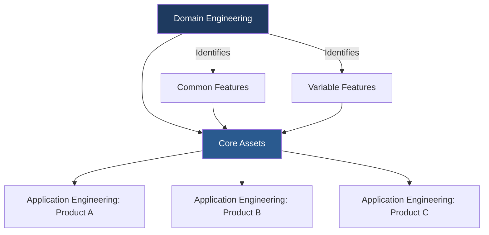
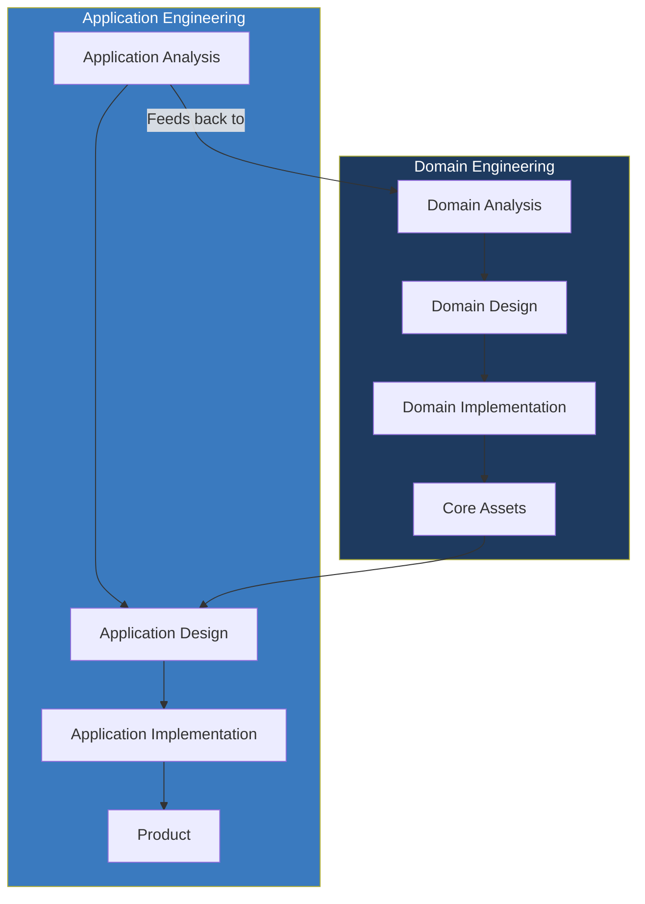
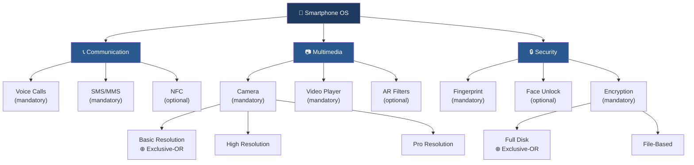
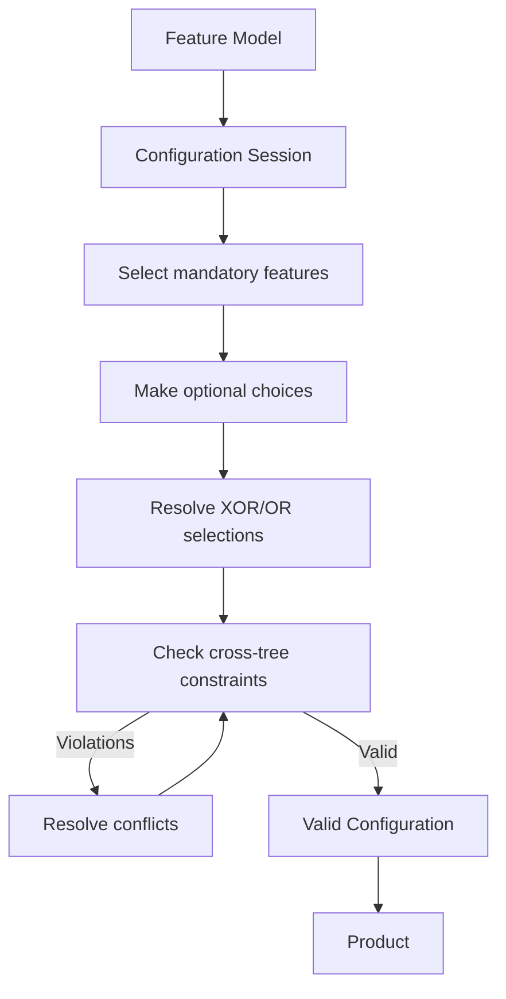
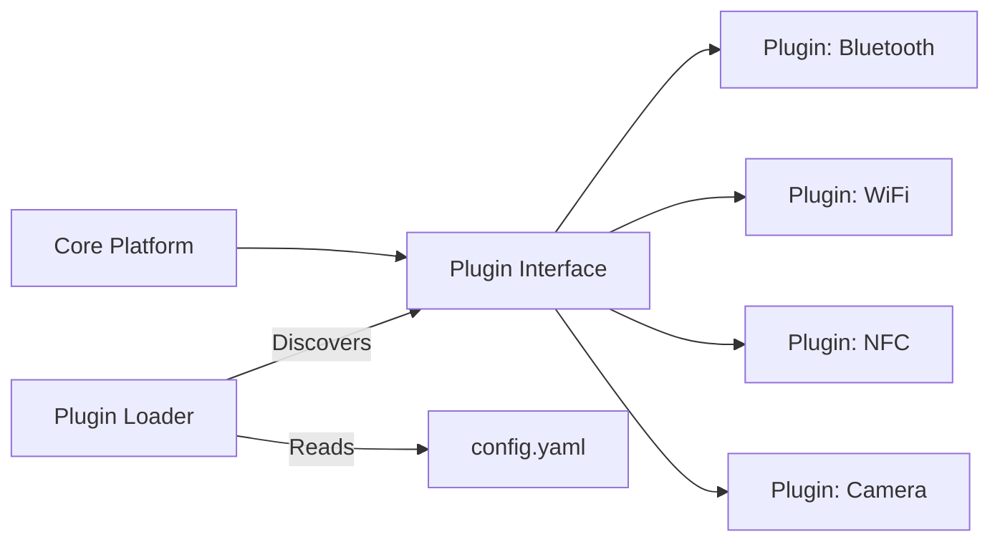
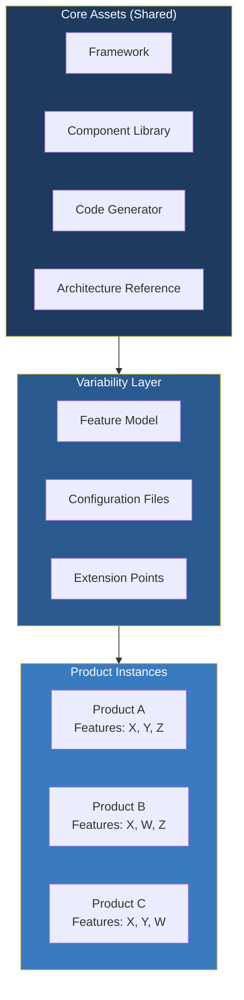
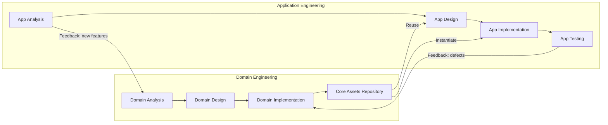
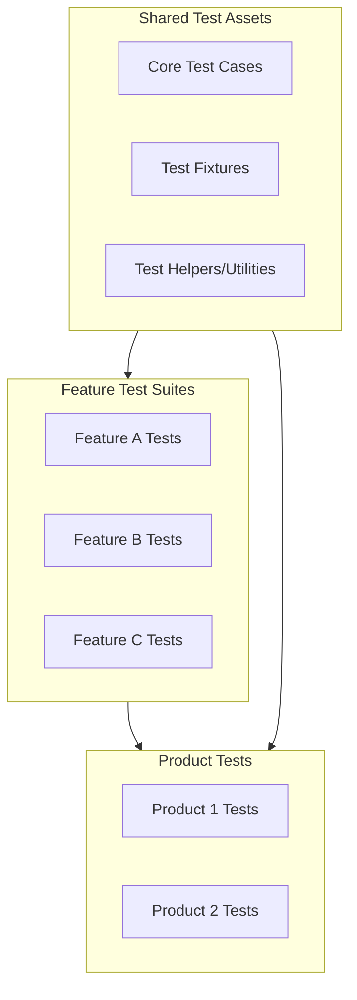
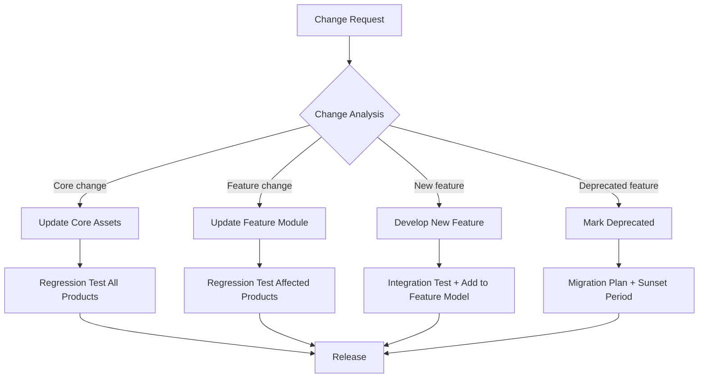

# Variability and Feature Models

> *Source: SWEBOK v4 Chapter 03 — Software Design*

## Purpose

Modern software is rarely a single, monolithic product. Organizations build **families** of related products that share a common core but differ in features, configurations, and platform targets. A smartphone operating system runs on dozens of hardware variants. An automotive ECU platform serves multiple vehicle models. A SaaS product offers tiered plans with different feature sets. Managing this **variability** systematically is the domain of Software Product Lines (SPL), feature modeling, and variability management. Without systematic approaches, each variant becomes a fork, and forks multiply maintenance costs exponentially.

## Software Product Lines (SPL)

### What Is a Software Product Line?

A **Software Product Line (SPL)** is a set of software-intensive systems that share a common, managed set of features satisfying the specific needs of a particular market segment or mission, and that are developed from a common set of core assets in a prescribed way.



### SPL vs Traditional Development

| Aspect | Traditional | Software Product Line |
|---|---|---|
| **Reuse** | Ad hoc, copy-paste | Systematic, planned |
| **Scope** | Single product | Family of products |
| **Investment** | Per-product | Upfront in core assets |
| **Marginal cost** | High per variant | Low per variant |
| **Maintenance** | Per-product, multiplied | Shared core, single fix propagates |
| **Time to market** | Long per variant | Short (configure, don't code) |
| **Quality** | Varies per product | Consistent across family |

### The SPL Two-Life-Cycle Model



| Phase | Activity | Output |
|---|---|---|
| **Domain Analysis** | Identify commonalities and variabilities across the product family | Feature model, domain vocabulary |
| **Domain Design** | Design architecture that accommodates variability | Product line architecture |
| **Domain Implementation** | Build reusable core assets | Components, generators, templates |
| **Application Analysis** | Determine which features a specific product needs | Feature configuration |
| **Application Design** | Adapt core architecture for specific product | Product-specific design |
| **Application Implementation** | Instantiate core assets with product-specific configuration | Product code |

## Feature Modeling

### What Is a Feature?

A **feature** is a prominent or distinctive user-visible aspect, quality, or characteristic of a software system. Features are the primary unit of variability in SPLs.

### Feature Diagrams

A **feature diagram** (also called a **feature tree** or **feature model**) is a hierarchical representation of all features in a product line and the relationships between them.



### Feature Dependency Types

| Relationship | Symbol | Meaning | Example |
|---|---|---|---|
| **Mandatory** | Solid line, no label | Must be included if parent is included | Smartphone OS must have Communication |
| **Optional** | Dashed line or ○ | May or may not be included | NFC is optional under Communication |
| **OR** | OR | At least one child must be selected | Camera resolution: Basic OR High OR Pro (or multiple) |
| **XOR (Alternative)** | XOR or ⊕ | Exactly one child must be selected | Encryption: exactly one of FDE or FBE |
| **Require** | Dashed arrow between features | If A is selected, B must also be selected | AR Filters requires High Resolution camera |
| **Exclude** | Dashed arrow with ✕ | A and B cannot both be selected | Basic Edition excludes Pro Resolution |

### Feature Diagram Notation Comparison

| Notation | Mandatory | Optional | XOR | OR | Cross-tree |
|---|---|---|---|---|---|
| **FODA** (Kang 1990) | Filled circle | Empty circle | Filled arc | Empty arc | Requires/Excludes edges |
| **FORM** (Kang 2002) | FODA + | Cardinality | Cardinality | Cardinality | Cardinality constraints |
| **FeatureIDE** | Solid line | Dashed line | Alternative | Or | Constraints (CNF) |
| **SPLC** | Standard | Standard | Mutex group | Or group | Implication formulas |
| **Clafer** | Mandatory | Optional | Xor group | Or group | Global constraints |

### Cardinality-Based Feature Models

Extended feature models support cardinality to express more complex relationships:

```
Feature: Camera
  children: [Lens, Flash, Stabilization]
  cardinality: [1..3]        // Must have at least 1, at most 3
  
Feature: Lens
  children: [Wide, Telephoto, Macro]
  cardinality: [1..*]        // Must have at least 1, unlimited

Feature: Storage
  children: [SDCard, CloudSync, USB]
  cardinality: [0..*]        // Optional, unlimited
```

### Feature Configuration

A **feature configuration** is a valid selection of features from the feature model that satisfies all constraints. Configuring a product means choosing which features to include.

**Configuration process:**



**Example: Configuring a "Basic Smartphone"**

| Feature | Selected? | Reason |
|---|---|---|
| Communication | Yes (mandatory) | Root feature |
| Voice Calls | Yes (mandatory) | Parent selected |
| SMS/MMS | Yes (mandatory) | Parent selected |
| NFC | No (optional) | Basic model, no NFC hardware |
| Multimedia | Yes (mandatory) | Root feature |
| Camera | Yes (mandatory) | Parent selected |
| Basic Resolution | Yes (XOR) | Budget hardware |
| High Resolution | No (XOR) | Budget hardware |
| Pro Resolution | No (XOR) | Budget hardware |
| Video Player | Yes (mandatory) | Parent selected |
| AR Filters | No (optional) | Requires High Resolution |
| Security | Yes (mandatory) | Root feature |
| Fingerprint | Yes (mandatory) | Parent selected |
| Face Unlock | No (optional) | Budget model |
| Encryption | Yes (mandatory) | Parent selected |
| Full Disk | Yes (XOR) | Selected for simplicity |
| File-Based | No (XOR) | Full Disk selected |

### Feature Interaction

**Feature interaction** occurs when combining features produces unexpected, undesirable behavior that neither feature exhibits in isolation.

| Interaction Type | Example | Consequence |
|---|---|---|
| **Direct conflict** | Call forwarding + Call blocking | Forwarding to blocked number creates loop |
| **Indirect conflict** | Battery saver + Always-on display | Battery saver disables display; always-on prevents sleep |
| **Semantic conflict** | Multi-language support + Right-to-left layout | RTL breaks some language UIs |
| **Resource conflict** | 4K video recording + Background app refresh | Insufficient memory for both |
| **Ordering conflict** | Auto-update + Offline mode | Update fails without network |

**Detection approaches:**
1. **Static analysis:** Check feature model constraints for logical conflicts
2. **Runtime monitoring:** Detect conflicts during execution
3. **Pairwise testing:** Test all pairs of features together
4. **Formal verification:** Model check feature compositions

## Variability Management

### Binding Time

**Binding time** is the point in the lifecycle when a variability decision is fixed. Earlier binding reduces flexibility but improves performance; later binding increases flexibility but adds runtime overhead.

| Binding Time | Mechanism | Flexibility | Overhead | Example |
|---|---|---|---|---|
| **Design time** | Design choice | None after decision | Zero | Choosing architecture style |
| **Compile time** | Preprocessor, conditional compilation | Low (recompile) | Zero | `#ifdef LINUX` |
| **Link time** | Static linking, module selection | Low (rebuild) | Zero | Linking with specific library |
| **Load time** | Configuration files, plugins | Medium (restart) | Minimal | Loading plugins at startup |
| **Runtime** | Dynamic loading, dependency injection | High (no restart) | Runtime cost | Feature flags, A/B tests |
| **User time** | User preferences, settings | Highest | Runtime cost | User toggles in settings |

### Binding Time Spectrum

```
Design ──▶ Compile ──▶ Link ──▶ Load ──▶ Runtime ──▶ User
  │           │          │        │          │          │
  ▼           ▼          ▼        ▼          ▼          ▼
Zero       Zero       Zero     Minimal   Medium     Highest
flexibility                                          flexibility

  ◄── Earlier: Faster, less flexible ──▶
  ◄── Later: Slower, more flexible ────▶
```

### Variability Mechanisms

#### 1. Preprocessor Directives

```c
// Compile-time variability
#ifdef FEATURE_BLUETOOTH
void initBluetooth() {
    bt_stack_init();
    bt_scan_start();
}
#endif

#ifdef FEATURE_WIFI
void initWiFi() {
    wifi_scan();
    wifi_connect(config.ssid);
}
#endif
```

| Pros | Cons |
|---|---|
| Zero runtime overhead | Code becomes unreadable with many `#ifdefs` |
| Universal language support | No type checking across variants |
| Simple implementation | Dead code remains in source |
| Fine-grained control | Difficult to test all combinations |

#### 2. Configuration Files

```yaml
# runtime-features.yaml
features:
  bluetooth:
    enabled: true
    max_connections: 7
  wifi:
    enabled: true
    band: "dual"
  nfc:
    enabled: false
  camera:
    resolution: "high"
    stabilization: true
    hdr: true
```

| Pros | Cons |
|---|---|
| Change without recompilation | Runtime overhead for parsing |
| Human-readable | No compile-time validation |
| Version-controllable | Feature interactions not checked |
| Easy to diff | Configuration drift possible |

#### 3. Plugin Architecture



```java
// Plugin interface
public interface CommunicationPlugin {
    String getName();
    void initialize(Config config);
    void start();
    void stop();
    boolean isAvailable();
}

// Plugin loader
public class PluginLoader {
    public List<CommunicationPlugin> loadPlugins(Config config) {
        return ServiceLoader.load(CommunicationPlugin.class)
            .stream()
            .filter(p -> config.isFeatureEnabled(p.getName()))
            .map(Provider::get)
            .collect(Collectors.toList());
    }
}
```

| Pros | Cons |
|---|---|
| Clean separation of concerns | Plugin interface design is critical |
| Independent development/deployment | Versioning and compatibility challenges |
| Third-party extensibility | Runtime discovery overhead |
| Each plugin is testable in isolation | Error handling across boundaries |

#### 4. Dependency Injection

```java
// Variability via DI
@Module
public class FeatureModule {
    
    @Provides
    @Singleton
    CommunicationService provideCommunicationService(
            FeatureFlags flags,
            BluetoothService bluetooth,
            WifiService wifi,
            NfcService nfc) {
        
        CompositeCommunicationService service = new CompositeCommunicationService();
        if (flags.isEnabled("bluetooth")) service.add(bluetooth);
        if (flags.isEnabled("wifi")) service.add(wifi);
        if (flags.isEnabled("nfc")) service.add(nfc);
        return service;
    }
}
```

| Pros | Cons |
|---|---|
| Testable (inject mocks) | Requires DI framework |
| Runtime variability | Configuration complexity |
| Follows SOLID principles | Startup overhead |
| Industry-standard approach | Debugging across DI boundaries |

#### 5. Feature Flags / Feature Toggles

```java
public class FeatureFlags {
    private final Map<String, Boolean> flags;
    
    public boolean isEnabled(String feature) {
        return flags.getOrDefault(feature, false);
    }
    
    // Supports gradual rollout
    public boolean isEnabledFor(String feature, User user) {
        if (!isEnabled(feature)) return false;
        return rolloutPercentage(feature) > hash(user.getId());
    }
}

// Usage
if (featureFlags.isEnabled("new-checkout-flow")) {
    return newCheckoutService.process(order);
} else {
    return legacyCheckoutService.process(order);
}
```

| Pros | Cons |
|---|---|
| Instant on/off without deployment | Technical debt if flags accumulate |
| A/B testing support | Dead code if flags not cleaned up |
| Gradual rollout | All code paths must be maintained |
| Kill switches for incidents | Testing complexity (2^n combinations) |

### Variability Mechanism Comparison

| Mechanism | Binding Time | Granularity | Overhead | Complexity | Testing |
|---|---|---|---|---|---|
| Preprocessor | Compile | Statement | None | Low | Combinatorial explosion |
| Config files | Load/Runtime | Feature | Low | Medium | Config validation |
| Plugins | Load/Runtime | Module | Medium | High | Per-plugin testing |
| DI | Runtime | Component | Medium | Medium | Mock injection |
| Feature flags | Runtime | Statement | Low | Medium | Flag-aware testing |
| Code generation | Compile | Any | None | High | Generator testing |

## Product Line Architecture

### What Is Product Line Architecture?

**Product Line Architecture (PLA)** is an architecture designed to support a family of products by making variability explicit, modular, and configurable. Unlike a single-product architecture, a PLA must accommodate all current and anticipated variations.

### Architectural Mechanisms for Variability

| Mechanism | Description | Binding Time |
|---|---|---|
| **Parameterization** | Generic components with type/value parameters | Compile/Load |
| **Inheritance** | Specialization of base components | Compile |
| **Extension points** | Defined hooks for adding behavior | Load/Runtime |
| **Strategy pattern** | Interchangeable algorithms behind interface | Runtime |
| **Template method** | Skeleton with overridable steps | Compile |
| **Component replacement** | Swappable modules with same interface | Load/Runtime |
| **Aspect weaving** | Cross-cutting concerns added modularly | Compile/Runtime |
| **Microservices** | Independent services composed at runtime | Runtime |

> See also: [[Design Pattern/index|Design Patterns]] for detailed pattern descriptions, and [[Clean Architecture/index|Clean Architecture]] for architectural principles.

### PLA Structure



## Domain Engineering vs Application Engineering

### Domain Engineering

**Domain engineering** is the activity of collecting, organizing, and storing knowledge about the domain for reuse across the product line.

| Activity | Purpose | Output |
|---|---|---|
| **Domain scoping** | Define the product line boundary | Product map, market analysis |
| **Domain analysis** | Identify commonalities and variabilities | Feature model, domain glossary |
| **Domain design** | Create reusable architecture | PLA, component specifications |
| **Domain implementation** | Build reusable assets | Components, generators, tests, docs |
| **Asset management** | Catalog, version, and maintain assets | Asset repository |

### Application Engineering

**Application engineering** is the activity of creating individual products by reusing and customizing domain engineering assets.

| Activity | Purpose | Output |
|---|---|---|
| **Requirements engineering** | Determine product-specific requirements | Feature configuration, constraints |
| **Design** | Adapt PLA for specific product | Product architecture |
| **Implementation** | Instantiate and customize core assets | Product code |
| **Testing** | Verify product-specific behavior | Test results |
| **Evolution** | Maintain product and feed back improvements | Updated assets |

### Relationship Between Domain and Application Engineering



## Feature-Oriented Software Development (FOSD)

### What Is FOSD?

**Feature-Oriented Software Development (FOSD)** treats features as the primary unit of design, implementation, and composition. Each feature is implemented as a separate module, and products are assembled by composing the desired feature modules.

### FOSD Principles

1. **One feature, one module:** Each feature is isolated in its own code module
2. **Feature composition:** Products are created by composing feature modules
3. **Feature interaction:** Interactions between features are explicitly managed
4. **Incremental development:** Features can be added independently
5. **Separation of concerns:** Each feature addresses one aspect of variability

### Feature Module Example

```java
// Base module: CoreOrder
module CoreOrder {
    class Order {
        String id;
        List<OrderItem> items;
        Money total;
    }
}

// Feature module: DiscountFeature
module DiscountFeature extends CoreOrder {
    class Order {
        Money discountAmount;
        Money discountedTotal;
        
        Money calculateTotal() {
            return super.calculateTotal().subtract(discountAmount);
        }
    }
}

// Feature module: TaxFeature
module TaxFeature extends CoreOrder {
    class Order {
        Money taxAmount;
        TaxRate taxRate;
        
        Money calculateTotal() {
            Money base = super.calculateTotal();
            return base.add(base.multiply(taxRate));
        }
    }
}

// Product: Basic Order (no discount, no tax)
product BasicOrder = CoreOrder;

// Product: Discounted Order
product DiscountOrder = CoreOrder + DiscountFeature;

// Product: Full Order (discount + tax)
product FullOrder = CoreOrder + DiscountFeature + TaxFeature;
```

### FOSD Tools

| Tool | Approach | Language |
|---|---|---|
| **FeatureHouse** | Feature grammars + superimposition | Java, C, C#, Haskell |
| **DeltaJ** | Delta modules (deltas applied to base) | Java |
| **AHEAD** | Feature-based program transformation | Java, C |
| **CAFE** | Aspect-oriented feature composition | Java |
| **Munge** | Preprocessor-based feature selection | Java |
| **CIDE** | Colored IDE (visual feature separation) | Java |

## Configuration Management for Variants

### The Variant Management Problem

As the number of variants grows, managing them becomes exponentially complex:

| Variants | Pairwise Tests | Config Files | Release Artifacts |
|---|---|---|---|
| 5 features (binary) | 2^5 = 32 | 32 | 32 |
| 10 features (binary) | 2^10 = 1,024 | 1,024 | 1,024 |
| 20 features (binary) | 2^20 = ~1M | ~1M | ~1M |
| 50 features (binary) | 2^50 = ~1 quadrillion | Impractical | Impractical |

### Variant Management Strategies

| Strategy | Description | Pros | Cons |
|---|---|---|---|
| **Clone-and-own** | Copy codebase, modify for each variant | Simple, fast | Maintenance nightmare at scale |
| **Component-based** | Shared components + variant-specific components | Clean separation | Interface design critical |
| **Configuration-based** | Single codebase + configuration | Single source of truth | Configuration complexity |
| **Generator-based** | Generate variant code from models + config | Highly automated | Generator maintenance |
| **Delta-based** | Apply deltas (changes) to base product | Fine-grained control | Delta composition complexity |

### Versioning Variants

```
Product Line v2.3.0
├── Core Assets v2.3.0
│   ├── Shared components
│   ├── Architecture reference
│   └── Build scripts
├── Feature: Bluetooth v1.5.2
├── Feature: WiFi v2.1.0
├── Feature: NFC v1.0.3
├── Feature: Camera v3.0.1
└── Product Configs
    ├── BasicPhone v2.3.0-config-001
    ├── MidRangePhone v2.3.0-config-002
    └── PremiumPhone v2.3.0-config-003
```

## SPL Testing Strategies

### The SPL Testing Challenge

Testing a product line means testing not just individual products but the **variability mechanism itself** and the **interactions between features**.

### SPL Testing Levels

| Level | What to Test | Approach |
|---|---|---|
| **Core asset testing** | Shared components in isolation | Standard unit/integration testing |
| **Feature testing** | Individual features work correctly | Feature-specific test suites |
| **Feature interaction testing** | Pairs/groups of features compose correctly | Pairwise testing, combinatorial |
| **Configuration testing** | Specific product configurations work | Configuration-driven test selection |
| **Product testing** | Complete products meet requirements | Product-specific acceptance testing |
| **Regression testing** | Core changes don't break variants | Impact analysis + selective retesting |

### Pairwise Testing for Feature Interactions

**Pairwise testing** (also called all-pairs testing) ensures that every pair of feature values is tested at least once, dramatically reducing the test space while maintaining high fault detection.

| Feature | Options |
|---|---|
| OS | Android, iOS |
| Camera | Basic, Pro |
| NFC | Yes, No |
| Resolution | HD, FHD, 4K |

**Full factorial:** 2 × 2 × 2 × 3 = 24 tests
**Pairwise:** 7 tests (covers all pairs)

| Test | OS | Camera | NFC | Resolution |
|---|---|---|---|---|
| 1 | Android | Basic | Yes | HD |
| 2 | Android | Pro | No | FHD |
| 3 | iOS | Basic | No | 4K |
| 4 | iOS | Pro | Yes | HD |
| 5 | Android | Basic | No | 4K |
| 6 | Android | Pro | Yes | FHD |
| 7 | iOS | Basic | Yes | FHD |

### Test Asset Reuse in SPLs



| Test Asset | Reuse Strategy |
|---|---|
| **Core test cases** | Run against all products |
| **Feature test suites** | Run against products including that feature |
| **Interaction tests** | Run against products with interacting features |
| **Product-specific tests** | Run only against specific product |
| **Test infrastructure** | Shared across all tests |

## SPL Evolution

### Evolution Dimensions

| Dimension | Description | Challenge |
|---|---|---|
| **Feature evolution** | Features added, modified, removed | Backward compatibility, migration |
| **Core evolution** | Shared assets updated | All products potentially affected |
| **Platform evolution** | Target platforms change | Portability of core and features |
| **Market evolution** | Customer needs change | Feature model re-scoping |
| **Technology evolution** | New technologies adopted | Asset modernization |

### SPL Evolution Strategies



### Feature Deprecation Lifecycle

| Phase | Duration | Actions |
|---|---|---|
| **Announcement** | 1 release | Document deprecation, notify users |
| **Warning** | 1-2 releases | Runtime warnings, migration guide published |
| **Optional removal** | 1 release | Feature off by default, still available |
| **Removal** | Next release | Feature and code removed from codebase |
| **Cleanup** | Ongoing | Remove residual references, update tests |

### Managing SPL Complexity

| Strategy | Description |
|---|---|
| **Feature model refactoring** | Simplify feature model; merge, split, or abstract features |
| **Variability scoping** | Limit variability to where it adds value |
| **Architecture erosion prevention** | Regular architecture reviews, automated constraint checking |
| **Dependency management** | Explicit dependency tracking between features and core |
| **Continuous integration** | Build and test all product variants on every change |
| **Documentation** | Keep feature model, PLA, and configuration docs current |

## Practical Checklist

### Starting an SPL

- [ ] Identify the product family scope (market analysis)
- [ ] Define the feature model (domain analysis)
- [ ] Design the product line architecture (domain design)
- [ ] Implement core assets (domain implementation)
- [ ] Define variability mechanisms and binding times
- [ ] Set up variant-aware build and CI/CD pipeline
- [ ] Establish feature interaction detection process
- [ ] Create SPL testing strategy (pairwise, interaction tests)

### Maintaining an SPL

- [ ] Feature model reviewed quarterly for accuracy
- [ ] Core asset regression suite runs on all product builds
- [ ] Feature interaction tests updated when features change
- [ ] Deprecated features tracked with sunset timelines
- [ ] Configuration drift detected and corrected
- [ ] New product variants validated against feature model constraints
- [ ] SPL evolution roadmap aligned with product roadmap

## Summary

Software Product Lines transform the economics of software development: instead of building each product from scratch, organizations invest in reusable core assets and configure products from a feature model. Feature diagrams make variability explicit and analyzable. Variability mechanisms (preprocessor, config files, plugins, DI, feature flags) offer different binding-time trade-offs. Feature-Oriented Software Development composes products from modular feature implementations. SPL testing requires pairwise and interaction testing to manage combinatorial explosion. Successful SPLs require both domain engineering (building core assets) and application engineering (configuring products), with continuous evolution to keep the feature model and architecture aligned with market needs.

> **Key takeaway:** Variability is not accidental complexity; it is a first-class design concern that must be modeled, managed, and tested systematically.

## Related Notes

- [[01_Design_Fundamentals_and_Principles]]: Modularity and abstraction supporting variability
- [[02_Design_Processes]]: Where feature analysis fits in the design lifecycle
- [[03_Design_Qualities]]: Quality attributes affected by variability
- [[04_Recording_Software_Designs]]: Documenting product line architectures
- [[05_Design_Strategies_and_Methods]]: Domain-driven design and decomposition strategies
- [[07_Design_Rationale_and_Decisions]]: Rationale for variability mechanism choices
- [[08_Model_Based_Design]]: Feature models as model-based artifacts
- [[Design Pattern/index|Design Patterns]]: Patterns used for variability (Strategy, Template Method, Plugin)
- [[Clean Architecture/index|Clean Architecture]]: Clean Architecture's dependency rule supports SPL separation

## References

1. SWEBOK v4, Chapter 03: Software Design
2. Clements, P. & Northrop, L. (2001). *Software Product Lines: Practices and Patterns.* Addison-Wesley.
3. Kang, K.C. et al. (1990). Feature-Oriented Domain Analysis (FODA) Feasibility Study. SEI/CMU.
4. Pohl, K., Bockle, G. & van der Linden, F. (2005). *Software Product Line Engineering: Foundations, Principles, and Techniques.* Springer.
5. Apel, S. et al. (2013). *Feature-Oriented Software Product Lines.* Springer.
6. Czarnecki, K. & Eisenecker, U. (2000). *Generative Programming: Methods, Tools, and Applications.* Addison-Wesley.
7. Benavides, D., Segura, S. & Ruiz-Cortes, A. (2010). Automated analysis of feature models: A detailed literature review. *Information and Software Technology*, 52(6).
8. Classen, A. et al. (2010). Model checking software product lines with SNIP. *STTT*, 12(5).
9. Northrop, L. & Clements, P. (2007). *A Framework for Software Product Line Practice, Version 5.0.* SEI/CMU.
10. Kästner, C., Apel, S. & Kuhlemann, M. (2008). Granularity in software product lines. *ICSE 2008.*
