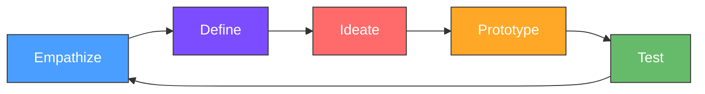
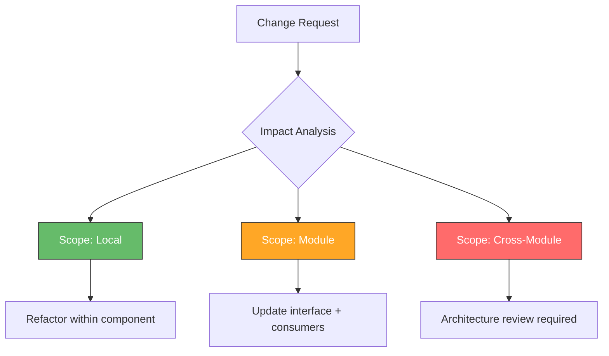
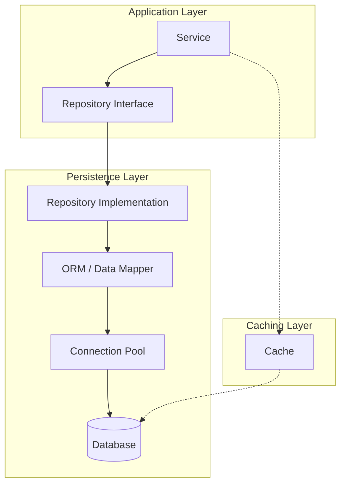
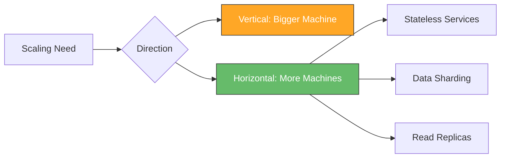
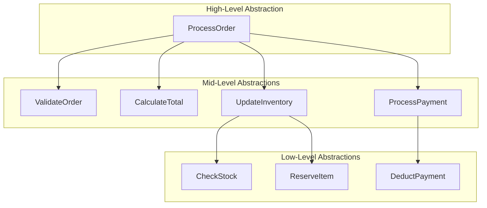
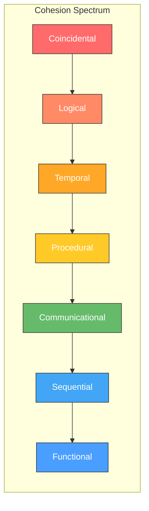
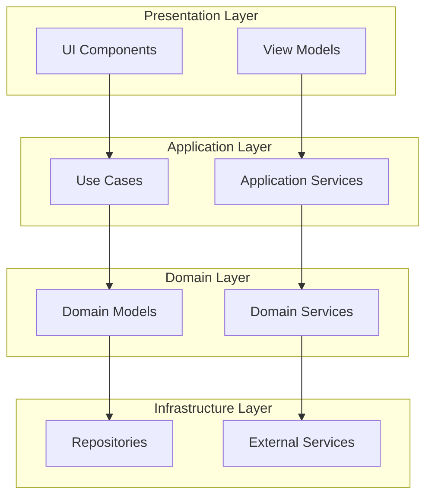
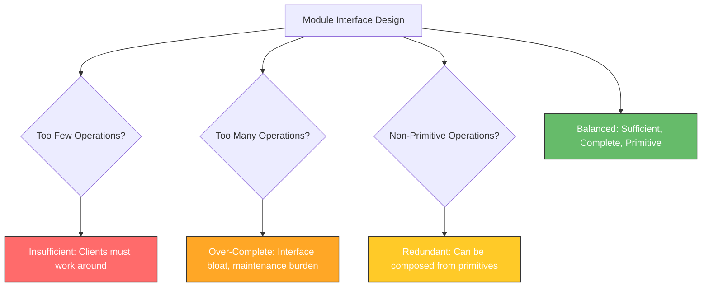
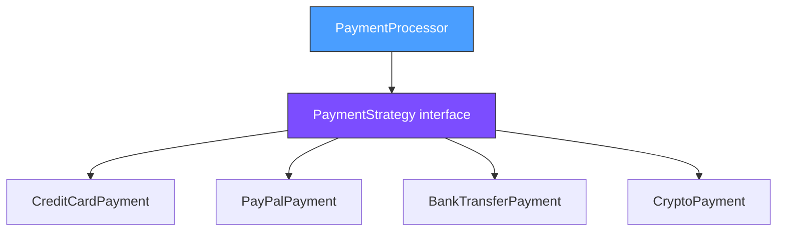
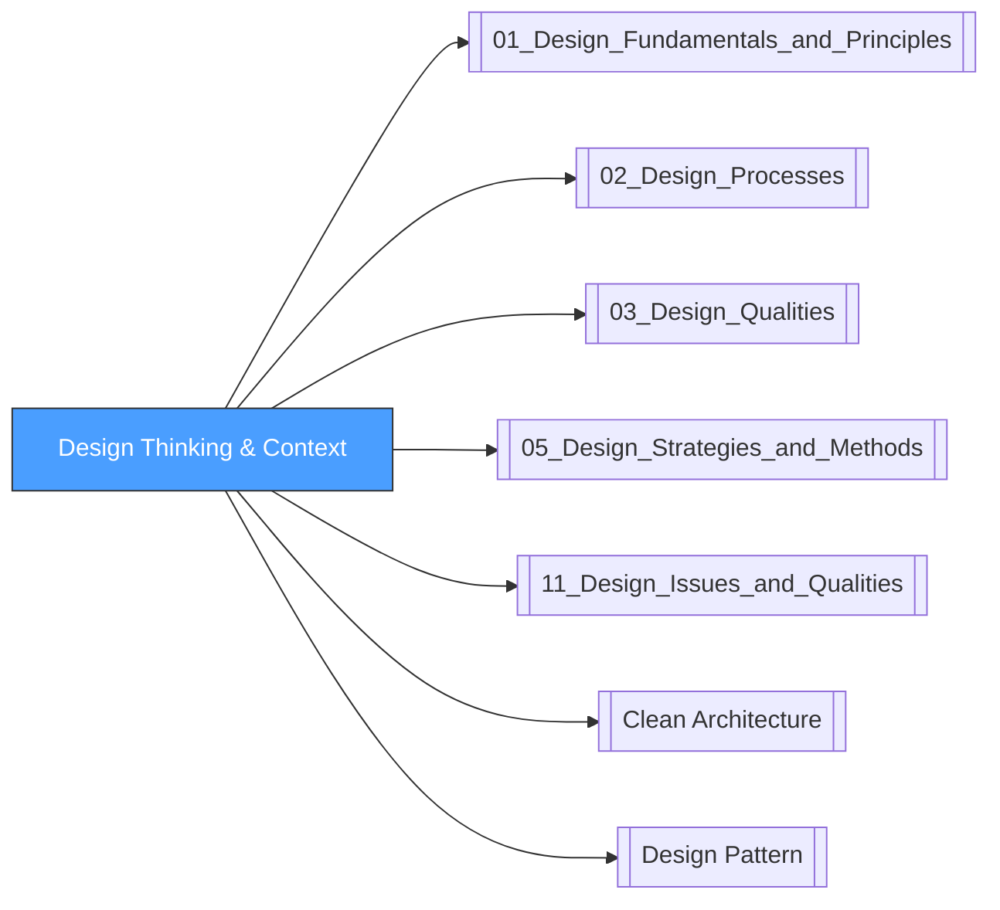

# Design Thinking and Context

## Overview

Design in software engineering operates within a broader context of human-centered problem solving and technical constraints. This note covers the design thinking process, the various contexts in which software must be designed, key design issues that span all projects, fundamental design principles in depth, practical design heuristics, and common design anti-patterns to avoid. These topics correspond to SWEBOK KA 3.1 (Software Design Fundamentals).

> [!info] SWEBOK Mapping
> This note covers SWEBOK v4 Chapter 3, Section 3.1: Software Design Fundamentals and related design context material.

---

## Design Thinking Process

Design thinking is a human-centered, iterative problem-solving methodology that integrates desirability (what people need), viability (what is sustainable), and feasibility (what is technically possible). Originally developed at Stanford's d.school and popularized by IDEO, it provides a structured framework for understanding users, challenging assumptions, and redefining problems.

### The Five Steps



| Step | Purpose | Key Activities | Design Output |
|------|---------|---------------|---------------|
| **Empathize** | Understand user needs, behaviors, and pain points | User interviews, observation, shadowing, surveys, contextual inquiry | Empathy maps, user personas, journey maps |
| **Define** | Synthesize findings into a clear problem statement | Affinity diagramming, point-of-view statements, "How Might We" questions | Problem statement, design brief, success criteria |
| **Ideate** | Generate a wide range of creative solutions | Brainstorming, mind mapping, SCAMPER, Crazy 8s, design studio | Concept sketches, solution alternatives, feature prioritization |
| **Prototype** | Build tangible representations of ideas | Low-fi wireframes, clickable prototypes, role plays, storyboards | Interactive prototypes, proof-of-concept artifacts |
| **Test** | Validate assumptions with real users | Usability testing, A/B testing, guerrilla testing, heuristic evaluation | Validated learnings, iteration backlog, refined requirements |

### Design Thinking in Software Engineering

Design thinking bridges the gap between business requirements and technical implementation:

1. **Empathy for Users**: Understanding who will use the software, their mental models, their workflows, and their frustrations. This goes beyond stated requirements to uncover latent needs.
2. **Problem Framing**: The way a problem is defined dramatically shapes the solution. Design thinking encourages reframing problems from the user perspective rather than the system perspective.
3. **Divergent then Convergent Thinking**: First expand the solution space (ideation), then narrow it down (selection). This prevents premature optimization on the first viable idea.
4. **Rapid Experimentation**: Prototyping allows testing assumptions before committing to expensive implementation. Fail fast, learn fast.
5. **Iterative Refinement**: Each cycle through the loop produces better understanding and better solutions. Design is never "done" in one pass.

### Design Thinking vs. Traditional Software Design

| Dimension | Traditional Design | Design Thinking |
|-----------|-------------------|-----------------|
| Starting point | Requirements specification | User empathy and observation |
| Problem definition | Given by stakeholders | Discovered through research |
| Solution approach | Analytical, top-down | Creative, iterative |
| Validation | After implementation | Before and during design |
| Risk focus | Technical feasibility | User desirability + feasibility |
| Documentation | Formal specifications | Prototypes and artifacts |

---

## Design Context

Software does not exist in a vacuum. Every design decision must account for the context in which the software will live, evolve, and be operated. Understanding design context means recognizing that software must be designed for multiple overlapping concerns simultaneously.

### Designing for Change

Change is the only constant in software. Requirements evolve, technologies advance, business needs shift, and user expectations grow. Designing for change means building software that can accommodate modifications with minimal disruption.

**Key Strategies:**

- **Separation of Concerns**: Isolate areas of change so that modifications in one area do not cascade through the system. See [[01_Design_Fundamentals_and_Principles#Separation of Concerns|Separation of Concerns]].
- **Information Hiding**: Hide implementation details behind stable interfaces so that internal changes do not affect external consumers. See [[01_Design_Fundamentals_and_Principles#Information Hiding|Information Hiding]].
- **Parameterization**: Make configurable what might change. Use configuration files, dependency injection, and strategy patterns rather than hard-coded behavior.
- **Anticipation of Change**: Identify the axes of change and orient module boundaries along those axes. The goal is not to predict the future but to make change cheap along likely dimensions.

**Change Impact Analysis:**



### Design for Reuse

Reuse operates at multiple levels: code reuse, design reuse, architecture reuse, and knowledge reuse. Designing for reuse requires making components general enough to be applicable in multiple contexts while remaining specific enough to be useful.

**Levels of Reuse:**

| Level | Artifact | Example | Coupling |
|-------|----------|---------|----------|
| **Code** | Functions, classes | Utility libraries, standard library | Direct import |
| **Design** | Patterns, templates | Strategy pattern, Observer pattern | Structural |
| **Architecture** | Architectural styles | Microservices, layered architecture | Framework |
| **Knowledge** | Algorithms, domain models | Sort algorithms, domain-driven design | Conceptual |

**Design for Reuse Principles:**

- **Generality**: Design components to handle a class of problems, not just one specific instance.
- **Composability**: Components should work together through well-defined interfaces. See [[05_Design_Strategies_and_Methods|Design Strategies and Methods]].
- **Discoverability**: Reusable components must be findable and understandable. Good naming, documentation, and cataloging are essential.
- **Independence**: Minimize dependencies so components can be extracted and reused without dragging along the entire system.

### Design for Deployment

Deployment context shapes design decisions around packaging, configuration, data migration, rollback capability, and operational readiness.

**Deployment Concerns:**

- **Environment Parity**: Design to minimize differences between development, staging, and production environments. Configuration externalization, containerization, and infrastructure-as-code help bridge the gap.
- **Zero-Downtime Deployment**: Design for blue-green deployments, canary releases, and rolling updates. This requires backward-compatible APIs, database migration strategies, and feature flags.
- **Rollback Capability**: Every deployment should be reversible. Design database migrations as forward-and-backward compatible. Use feature flags to decouple deployment from release.
- **Observability**: Build in logging, metrics, and tracing from the start. Design for the ability to diagnose problems in production without requiring code changes.

### Design for Operations

Operational design addresses how software will be monitored, maintained, scaled, and supported in production.

**Operational Design Principles:**

- **Health Checks**: Every service should expose its health status through standardized endpoints.
- **Graceful Degradation**: Design for partial failure. When a dependency is unavailable, the system should degrade gracefully rather than fail catastrophically.
- **Capacity Planning**: Design with growth in mind. Understand throughput requirements, storage growth, and scaling triggers.
- **Automation**: Design for automated deployment, testing, monitoring, and recovery. Manual operational procedures are a design failure.
- **Incident Response**: Design with the ability to quickly diagnose and mitigate issues. Structured logging, correlation IDs, and circuit breakers support rapid incident response.

---

## Key Design Issues

Software design must address a set of cross-cutting concerns that affect every significant system. These issues are not independent; they interact and sometimes conflict with each other.

### Persistence

Persistence design addresses how application state is stored, retrieved, and managed across sessions and system restarts.

**Design Considerations:**

| Concern | Options | Trade-offs |
|---------|---------|------------|
| **Storage model** | Relational, document, key-value, graph, column-family | Consistency vs. flexibility vs. query capability |
| **Access pattern** | Repository pattern, data mapper, active record | Abstraction vs. performance vs. simplicity |
| **Caching** | Write-through, write-behind, read-through | Consistency vs. performance |
| **Migration** | Forward-only, reversible, expand-contract | Safety vs. speed vs. downtime |
| **Concurrency** | Optimistic locking, pessimistic locking, MVCC | Throughput vs. consistency |

**Persistence Architecture Patterns:**



### Distribution

Distribution addresses how software is decomposed into communicating parts that run in different processes or on different machines. See [[11_Design_Issues_and_Qualities#Distribution Design|Distribution Design]] for detailed patterns.

**Core Distribution Challenges:**

- **Network Unreliability**: The network is not reliable. Design must account for message loss, reordering, duplication, and latency.
- **Partial Failure**: In a distributed system, some components can fail while others continue. Design must handle partial failure gracefully.
- **Consistency**: Distributed systems face fundamental trade-offs between consistency, availability, and partition tolerance (CAP theorem).
- **Latency**: Network calls are orders of magnitude slower than local calls. Design must minimize the number of round trips and batch operations where possible.

### Concurrency

Concurrency design addresses how multiple threads of execution interact safely and efficiently. See [[11_Design_Issues_and_Qualities#Concurrency Design|Concurrency Design]] for detailed patterns.

**Concurrency Design Challenges:**

- **Race Conditions**: Multiple threads accessing shared state without proper synchronization.
- **Deadlocks**: Circular dependencies between locks that prevent progress.
- **Starvation**: Some threads are perpetually denied access to resources.
- **Priority Inversion**: A high-priority thread is blocked by a low-priority thread holding a needed resource.

### Security

Security design addresses how the system protects data, resists attacks, and enforces access controls. See [[11_Design_Issues_and_Qualities#Security Design|Security Design]] for detailed patterns.

**Security Design Principles:**

- **Least Privilege**: Every component should operate with the minimum privileges necessary.
- **Defense in Depth**: Multiple layers of security so that failure of one layer does not compromise the system.
- **Fail Secure**: When errors occur, the system should default to denying access rather than granting it.
- **Separation of Duties**: Critical operations should require multiple parties to complete.

### Performance

Performance design addresses how the system meets throughput, latency, and resource utilization requirements. See [[11_Design_Issues_and_Qualities#Performance Design|Performance Design]] for detailed patterns.

**Performance Design Dimensions:**

| Dimension | Metric | Design Approach |
|-----------|--------|-----------------|
| **Latency** | Response time (p50, p95, p99) | Caching, async processing, connection pooling |
| **Throughput** | Requests per second | Parallelism, batching, load balancing |
| **Resource utilization** | CPU, memory, disk, network | Efficient algorithms, resource pooling |
| **Scalability** | Capacity under load | Horizontal scaling, sharding, replication |

### Scalability

Scalability design addresses how the system handles growing load without proportional increases in cost or complexity. See [[11_Design_Issues_and_Qualities#Scalability Design|Scalability Design]] for detailed patterns.

**Scaling Strategies:**



---

## Design Principles in Depth

Design principles are foundational guidelines that shape how software is decomposed, organized, and structured. They are not rules but heuristics that guide decision-making.

### Abstraction

Abstraction is the process of reducing complexity by focusing on essential characteristics while ignoring irrelevant details. It is the most fundamental design principle.

**Types of Abstraction:**

| Type | Definition | Example | Purpose |
|------|-----------|---------|---------|
| **Procedural** | Abstracting a sequence of operations into a named procedure | `sort(list)` hides the sorting algorithm | Reduce procedural complexity |
| **Data** | Abstracting a collection of data into a named type | `User` struct with name, email, role | Group related data |
| **Control** | Abstracting the flow of execution | Iterators hide traversal mechanism | Decouple iteration from collection |
| **Semantic** | Abstracting meaning and intent | `authenticate(credentials)` vs. raw DB query | Express domain concepts |

**Abstraction in Practice:**



### Decomposition

Decomposition is the process of breaking a complex problem into smaller, manageable parts. It is complementary to abstraction: abstraction groups things together; decomposition breaks them apart.

**Decomposition Approaches:**

- **Top-Down Decomposition**: Start with the whole system and progressively break it into subsystems, modules, and components. Good for systems with clear hierarchical structure.
- **Modular Decomposition**: Identify coherent units of functionality and encapsulate them as independent modules. Good for systems with well-defined functional boundaries.
- **Data-Driven Decomposition**: Decompose based on the data structures and their transformations. Good for data processing systems.
- **Event-Driven Decomposition**: Decompose based on events and their handlers. Good for reactive systems.

**Decomposition Criteria:**

A good decomposition should be:

- **Complete**: Every part of the problem is covered by exactly one module.
- **Minimal**: No module is redundant; each addresses a distinct concern.
- **Coherent**: Related functionality is grouped together within a module.
- **Loosely Coupled**: Modules interact through well-defined, minimal interfaces.

### Encapsulation and Information Hiding

Encapsulation bundles data and operations together, while information hiding conceals implementation details behind stable interfaces. See also [[01_Design_Fundamentals_and_Principles#Information Hiding|Information Hiding]].

**What to Hide:**

| Hidden Aspect | Interface Exposed | Benefit |
|---------------|-------------------|---------|
| **Data representation** | Accessor methods | Change storage without affecting clients |
| **Algorithm details** | Method signatures | Optimize algorithms independently |
| **Internal state** | Public operations | Manage concurrency and consistency |
| **External dependencies** | Abstraction layer | Swap implementations (e.g., database vendors) |
| **Communication protocol** | Service interface | Change protocols without affecting consumers |

**Information Hiding and Change:**

The key insight of information hiding (Parnas, 1972) is that module boundaries should be drawn to hide design decisions that are likely to change. Each module encapsulates a design decision, and the interface exposes only what is necessary for other modules to interact with it.

### Modularity: Coupling and Cohesion

Modularity measures how well a system is decomposed into independent, self-contained modules. Two complementary metrics guide modular design: coupling and cohesion.

**Cohesion (internal strength):**



| Level | Type | Description | Example |
|-------|------|-------------|---------|
| Lowest | **Coincidental** | Elements grouped arbitrarily | `Utils` class with unrelated methods |
| Low | **Logical** | Elements do similar things but are otherwise unrelated | All input parsers in one module |
| Low-Med | **Temporal** | Elements executed at the same time | Initialization routines grouped together |
| Medium | **Procedural** | Elements follow a specific execution sequence | Steps of a workflow in one module |
| Med-High | **Communicational** | Elements operate on the same data | All operations on `Order` data in one module |
| High | **Sequential** | Output of one element is input to the next | Pipeline stages in one module |
| Highest | **Functional** | All elements contribute to a single, well-defined task | `StringParser` that parses a string and returns a result |

**Coupling (external dependency):**

| Level | Type | Description | Example |
|-------|------|-------------|---------|
| Lowest | **Data** | Passing only data parameters | `calculateTotal(items)` |
| Low | **Stamp** | Passing data structures | `processOrder(order)` |
| Medium | **Control** | Passing control flags | `process(data, mode)` |
| Med-High | **External** | Sharing external data format | Both modules depend on same file format |
| High | **Common** | Sharing global data | Both modules access a global variable |
| Highest | **Content** | One module directly accesses another's internals | Reaching into another module's private data |

**Coupling-Cohesion Relationship:**

High cohesion naturally leads to low coupling. When a module does one thing well, it has fewer reasons to depend on or be depended upon by other modules. The goal is to maximize cohesion and minimize coupling simultaneously.

### Separation of Concerns

Separation of concerns (SoC) is the principle that each part of a system should address a separate concern, and that concerns should be organized in a way that minimizes overlap.

**Horizontal Separation (Layers):**



**Vertical Separation (Modules):**

Each vertical slice represents a bounded context or feature module that encapsulates all layers for a specific business capability.

| Separation Type | Axis | Example | Benefit |
|----------------|------|---------|---------|
| **Horizontal** | Technical layer | Presentation, Business, Data | Clear responsibility per layer |
| **Vertical** | Business capability | Order, Inventory, Payment | Independent feature development |
| **Aspect** | Cross-cutting concern | Logging, Security, Caching | Avoid scattering across modules |
| **Temporal** | Time of execution | Build-time, Run-time, Deploy-time | Flexibility at each stage |

### Sufficiency, Completeness, and Primitiveness

These three principles guide the design of module interfaces:

- **Sufficiency**: A module should capture enough features of the abstraction that it is useful. An insufficient module forces clients to work around its limitations. The module should do enough that clients do not need to reach past it for basic operations.

- **Completeness**: A module should capture all meaningful features of the abstraction. A complete module provides all operations that clients might reasonably need. Completeness must be balanced against simplicity; overly complete interfaces become unwieldy.

- **Primitiveness**: Operations in a module should be primitive, meaning they cannot be decomposed into other operations within the same module. Primitive operations are the building blocks from which more complex operations are composed. If an operation can be expressed as a combination of other operations in the module, it should not be included (or should be a convenience method).

**Balancing the Three:**



---

## Design Heuristics

Design heuristics are practical rules of thumb that guide design decisions. They are not absolute rules but experienced-based guidelines that improve design quality.

### Responsibility-Driven Design

Responsibility-driven design (Wirfs-Brock, 1990) organizes design around the responsibilities of objects rather than their data structures. Each object has clear responsibilities and collaborates with other objects to fulfill them.

**Core Concepts:**

- **Responsibilities**: What an object knows (knowledge) and what it does (behavior).
- **Collaborators**: Other objects that help fulfill responsibilities.
- **Roles**: Sets of related responsibilities that define how an object participates in the system.

**Design Process:**

1. **Identify candidate classes** from the problem domain.
2. **Assign responsibilities** based on what each class should know and do.
3. **Identify collaborators** for each responsibility that cannot be fulfilled alone.
4. **Define interfaces** based on the responsibilities and collaborations.
5. **Refine** by checking for high cohesion and low coupling.

**Example:**

| Class | Responsibilities | Collaborators |
|-------|-----------------|---------------|
| `Order` | Know items, quantities, status; calculate total | `Product`, `PricingService` |
| `OrderService` | Coordinate order processing; enforce business rules | `Order`, `InventoryService`, `PaymentService` |
| `InventoryService` | Track stock levels; reserve items | `Product`, `Warehouse` |

### Low Coupling and High Cohesion Metrics

**Quantitative Coupling Metrics:**

| Metric | Formula | Interpretation |
|--------|---------|----------------|
| **CBO** (Coupling Between Objects) | Number of classes a class is coupled to | Lower is better; threshold typically < 5 |
| **RFC** (Response For a Class) | Number of methods that can be executed in response to a message | Lower is better; indicates complexity |
| **LCOM** (Lack of Cohesion in Methods) | Number of method pairs not sharing instance variables | Lower indicates higher cohesion |

**Practical Thresholds:**

| Metric | Good | Acceptable | Poor |
|--------|------|------------|------|
| CBO | 0-5 | 6-10 | > 10 |
| RFC | 0-50 | 51-100 | > 100 |
| LCOM | 0-2 | 3-5 | > 5 |

### Law of Demeter

The Law of Demeter (LoD), also known as the Principle of Least Knowledge, states that a method should only call methods on:

1. Its own object (self).
2. Objects passed as parameters.
3. Objects it creates.
4. Its direct component objects.

**Violation Example:**

```java
// BAD: Reaching through multiple objects (train wreck)
String city = order.getCustomer().getAddress().getCity();

// GOOD: Tell, don't ask
String city = order.getShippingCity();
```

**Benefits:**

- Reduces coupling between distant objects.
- Makes code more resilient to changes in object structure.
- Improves encapsulation by keeping knowledge local.
- Simplifies testing by reducing mock setup.

### Open-Closed Principle (Practical Application)

The Open-Closed Principle (OCP), from Bertrand Meyer (1988), states that software entities should be open for extension but closed for modification. In practice, this means designing so that new behavior can be added without changing existing code.

**Practical Implementation Strategies:**

| Strategy | Mechanism | When to Use |
|----------|-----------|-------------|
| **Inheritance** | Subclass overrides behavior | When variation is hierarchical |
| **Composition** | Strategy/Policy pattern | When behavior varies independently |
| **Plugin Architecture** | Interface + dynamic loading | When extensions are developed externally |
| **Configuration** | Rules engine, DSL | When behavior varies by deployment |
| **Events/Callbacks** | Observer, hooks, middleware | When extensions are additive |

**Example: Payment Processing**



Adding a new payment method requires creating a new class implementing `PaymentStrategy` without modifying `PaymentProcessor` or existing payment implementations.

---

## Design Anti-Patterns

Anti-patterns are common design mistakes that appear to be beneficial but result in poor outcomes. Recognizing them is essential for avoiding and correcting design problems.

### God Class

**Description**: A single class that concentrates too much intelligence, data, or responsibility. It knows too much and does too much.

**Symptoms:**
- Class has hundreds or thousands of lines of code.
- Class has dozens of methods and instance variables.
- Class has low cohesion (LCOM score is high).
- Many other classes depend on it (high CBO).
- Changes to the system frequently require modifying this class.

**Consequences:**
- Difficult to understand, test, and maintain.
- High risk of merge conflicts in version control.
- Poor testability because the class has too many responsibilities.
- Violates Single Responsibility Principle.

**Remediation:**
1. Identify distinct responsibilities within the God Class.
2. Extract each responsibility into its own class using Extract Class refactoring.
3. Use delegation to forward calls from the original class to the new classes.
4. Apply [[Clean Architecture|Clean Architecture]] principles to redistribute responsibilities.

### Spaghetti Code

**Description**: Code with a tangled, unstructured control flow that is difficult to follow and understand. Typically caused by excessive use of goto, deep nesting, lack of modularity, and absence of clear structure.

**Symptoms:**
- Long methods with deep nesting (5+ levels).
- Many global variables and shared mutable state.
- No clear module boundaries or layering.
- Copy-paste programming.
- Circular dependencies between modules.

**Consequences:**
- Extremely difficult to maintain or extend.
- Bug fixes often introduce new bugs.
- Cannot be tested effectively.
- Onboarding new developers takes much longer.

**Remediation:**
1. Apply Extract Method to break long methods into smaller ones.
2. Eliminate global variables by introducing proper data structures.
3. Introduce clear module boundaries using layered or modular architecture.
4. Apply [[Clean Code|Clean Code]] principles systematically.

### Golden Hammer

**Description**: The tendency to apply a familiar tool, technology, or pattern to every problem, regardless of its suitability. "When all you have is a hammer, everything looks like a nail."

**Symptoms:**
- Using the same technology for all problems (e.g., relational database for everything including graph queries, document storage, and caching).
- Applying the same design pattern regardless of context.
- Resistance to exploring alternatives.
- Justification based on familiarity rather than fitness.

**Consequences:**
- Suboptimal solutions that do not fit the problem well.
- Performance problems from using the wrong tool.
- Increased complexity from forcing a tool to do something it was not designed for.
- Missed opportunities for simpler or more effective solutions.

**Remediation:**
1. Evaluate each problem independently before selecting a solution.
2. Build a diverse toolkit of technologies, patterns, and approaches.
3. Use decision matrices to objectively compare alternatives.
4. Seek input from team members with different expertise.

### Second-System Effect

**Description**: The tendency of a second system (or major revision) to be over-designed, over-engineered, and bloated because designers include all the features they wished they had in the first system. Coined by Fred Brooks in [[The Mythical Man-Month]].

**Symptoms:**
- Excessive generalization and abstraction.
- Features that are built "just in case" but never used.
- Significantly higher complexity than the first system.
- Longer development time than expected.
- "This time we'll get it right" mentality.

**Consequences:**
- Excessive complexity makes the system harder to build, test, and maintain.
- Over-engineering wastes development effort on unused features.
- Increased risk of schedule overruns and budget overruns.
- The system may be harder to use because of unnecessary generality.

**Remediation:**
1. Apply YAGNI (You Aren't Gonna Need It): build only what is needed now.
2. Use iterative development to add features incrementally.
3. Validate design decisions with working software, not just diagrams.
4. Learn from the first system's actual usage patterns, not imagined requirements.

### Anti-Pattern Summary Table

| Anti-Pattern | Root Cause | Primary Symptom | Key Remediation |
|-------------|-----------|----------------|-----------------|
| God Class | Centralization tendency | Single class doing too much | Extract Class, SRP |
| Spaghetti Code | Lack of structure | Tangled control flow | Modularization, layering |
| Golden Hammer | Comfort with familiar tools | Same solution for all problems | Diverse toolkit, problem-specific evaluation |
| Second-System Effect | Over-compensation from first system | Over-engineering | YAGNI, iterative development |

---

## Relationships to Other Notes



- [[01_Design_Fundamentals_and_Principles]]: Foundational principles (abstraction, encapsulation, modularity) are expanded here with practical application and metrics.
- [[02_Design_Processes]]: Design thinking complements the structured design process with a human-centered approach.
- [[03_Design_Qualities]]: Design context shapes which quality attributes are prioritized.
- [[05_Design_Strategies_and_Methods]]: Design heuristics provide practical guidance for applying design strategies.
- [[11_Design_Issues_and_Qualities]]: Key design issues (concurrency, distribution, security) are explored in depth in the companion note.
- [[Clean Architecture]]: Remediation for God Class anti-pattern and separation of concerns.
- [[Design Pattern]]: Patterns are the positive outcomes of applying design principles and heuristics.

---

## References

- SWEBOK v4, Chapter 3: Software Design
- Parnas, D.L. (1972). "On the Criteria To Be Used in Decomposing Systems into Modules"
- Wirfs-Brock, R. et al. (1990). *Designing Object-Oriented Software*
- Brooks, F. (1975). *The Mythical Man-Month*
- Brown, W. et al. (1998). *AntiPatterns: Refactoring Software, Architectures, and Projects in Crisis*
- IDEO. *Design Thinking for Educators*
- Stanford d.school. *Design Thinking Bootleg*
