# Design Issues and Qualities

## Overview

Modern software systems must address a complex web of design concerns that span concurrency, persistence, distribution, security, performance, scalability, and interoperability. This note provides in-depth coverage of each design issue area, including patterns, trade-offs, and practical implementation strategies. These topics correspond to SWEBOK KA 3.3 (Software Design Quality Analysis and Evaluation) and related sections.

> [!info] SWEBOK Mapping
> This note covers SWEBOK v4 Chapter 3, Section 3.3 and supplementary material on cross-cutting design concerns.

---

## Concurrency Design

Concurrency is the execution of multiple tasks during overlapping time periods. It is fundamental to modern software: web servers handle thousands of simultaneous requests, mobile apps manage UI responsiveness alongside background processing, and distributed systems coordinate work across multiple nodes.

### Thread Safety

Thread safety ensures that shared data structures behave correctly when accessed concurrently by multiple threads.

**Thread Safety Strategies:**

| Strategy | Mechanism | Trade-off | Use When |
|----------|-----------|-----------|----------|
| **Immutability** | Make shared data unmodifiable | No write capability | Data that does not change after creation |
| **Synchronization** | Locks, mutexes, semaphores | Performance overhead, deadlock risk | Critical sections with shared mutable state |
| **Concurrent Data Structures** | Lock-free or lock-striped collections | Limited operations | High-contention shared collections |
| **Thread Confinement** | Keep data on a single thread | Limits parallelism | UI thread, thread-local context |
| **Copy-on-Write** | Create copies for modification | Memory overhead | Read-heavy, write-rare scenarios |

**Synchronization Primitives:**

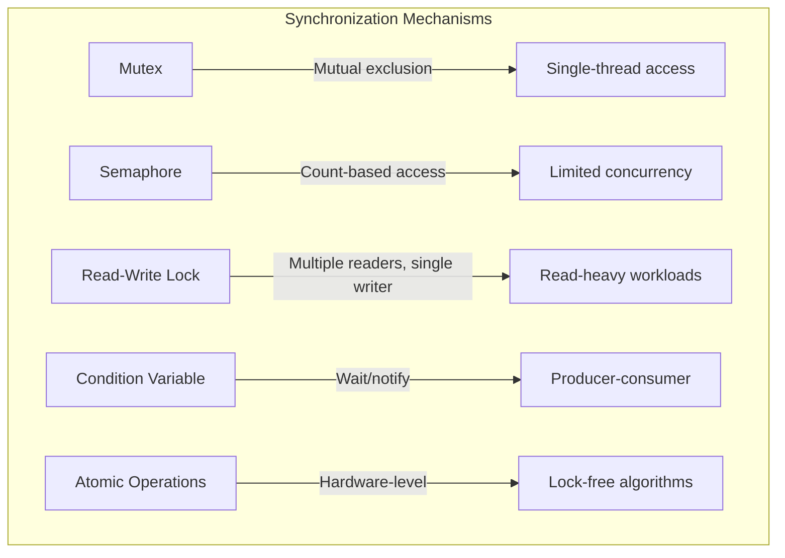

### Deadlock Prevention

Deadlock occurs when two or more threads are blocked forever, each waiting for a resource held by another. Four conditions are necessary for deadlock:

1. **Mutual Exclusion**: Resources cannot be shared.
2. **Hold and Wait**: Threads hold resources while waiting for others.
3. **No Preemption**: Resources cannot be forcibly taken.
4. **Circular Wait**: A cycle exists in the wait-for graph.

**Prevention Strategies:**

| Strategy | Approach | Trade-off |
|----------|----------|-----------|
| **Lock Ordering** | Always acquire locks in a fixed global order | Requires discipline, may reduce parallelism |
| **Timeout** | Release locks if acquisition times out | May cause unnecessary retries |
| **Try-Lock** | Non-blocking lock attempt; back off on failure | Complex retry logic |
| **Lock-Free Algorithms** | Use atomic operations instead of locks | Limited applicability, complex implementation |
| **Actor Model** | No shared state; communicate via messages | Different programming paradigm |

**Lock Ordering Example:**

```java
// GOOD: Consistent lock ordering prevents deadlock
// Both threads acquire locks in order: Account1 then Account2
public void transfer(Account from, Account to, BigDecimal amount) {
    Account first = from.id() < to.id() ? from : to;
    Account second = from.id() < to.id() ? to : from;
    synchronized (first) {
        synchronized (second) {
            from.debit(amount);
            to.credit(amount);
        }
    }
}
```

### Actor Model

The Actor Model (Hewitt, 1973) treats actors as the universal primitives of computation. Each actor has a mailbox, a behavior, and the ability to send messages to other actors.

**Actor Properties:**

- **Isolation**: Actors do not share state. All communication is through asynchronous messages.
- **Location Transparency**: Actors can be local or remote; the programming model is the same.
- **Supervision**: Hierarchical actor systems provide fault tolerance through supervisor strategies.

**Actor Model Implementations:**

| Framework | Language | Key Features |
|-----------|----------|-------------|
| **Akka** | JVM (Scala/Java) | Typed actors, clustering, persistence, streams |
| **Erlang/OTP** | Erlang | Lightweight processes, supervision trees, hot code swap |
| **Microsoft Orleans** | .NET | Virtual actors, grain persistence, cluster management |
| **Proto.Actor** | Go/.NET | Cluster support, remote grains |

**Actor Communication Pattern:**

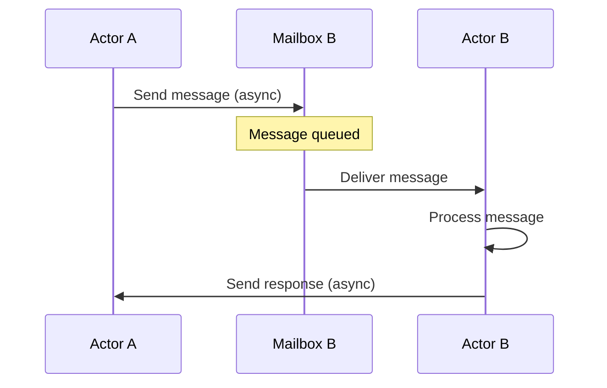

### CSP (Communicating Sequential Processes)

CSP (Hoare, 1978) is a formal language for describing patterns of interaction in concurrent systems. In practice, CSP manifests as channel-based concurrency where goroutines or lightweight threads communicate through typed channels.

**CSP vs. Actor Model:**

| Dimension | CSP | Actor Model |
|-----------|-----|-------------|
| Communication | Channels (typed, buffered/unbuffered) | Mailboxes (untyped) |
| Coupling | Sender and receiver can be decoupled via channel | Sender must know receiver identity |
| Synchronization | Can be synchronous (unbuffered) or asynchronous | Always asynchronous |
| Implementation | Go goroutines + channels, Kotlin coroutines | Akka, Erlang, Orleans |

**Go Channel Example:**

```go
func producer(ch chan<- int) {
    for i := 0; i < 10; i++ {
        ch <- i
    }
    close(ch)
}

func consumer(ch <-chan int) {
    for val := range ch {
        fmt.Println(val)
    }
}

func main() {
    ch := make(chan int, 5) // buffered channel
    go producer(ch)
    consumer(ch)
}
```

### Async/Await Patterns

Async/await provides a synchronous-looking syntax for asynchronous operations, making concurrent code more readable and maintainable.

**Async Patterns:**

| Pattern | Description | Use Case |
|---------|-------------|----------|
| **Sequential Async** | `await` each operation in sequence | Dependent operations |
| **Parallel Async** | Start all operations, then `await` all | Independent operations |
| **Selective Await** | `await` the first to complete | Race conditions, timeouts |
| **Structured Concurrency** | Scope-bound task groups | Parent-child lifecycle management |
| **Cancellation Propagation** | Cancel cascades through task tree | User-initiated cancellation |

**Structured Concurrency (Java 21):**

```java
try (var scope = new StructuredTaskScope.ShutdownOnFailure()) {
    Future<User> user = scope.fork(() -> findUser(userId));
    Future<Order> order = scope.fork(() -> findOrder(orderId));
    scope.join().throwIfFailed();
    return new UserOrder(user.resultNow(), order.resultNow());
}
```

---

## Persistence Design

Persistence design addresses how application state is stored, retrieved, and managed. The choice of persistence strategy profoundly affects system architecture, performance, and maintainability.

### ORM Patterns

Object-Relational Mapping bridges the impedance mismatch between object-oriented domain models and relational databases.

**ORM Pattern Comparison:**

| Pattern | Description | Control | Complexity | Use When |
|---------|-------------|---------|------------|----------|
| **Active Record** | Domain object contains persistence logic | Object-centric | Low | Simple CRUD, Rails-style apps |
| **Data Mapper** | Separate mapper handles persistence | Mapper-centric | Medium | Rich domain models, DDD |
| **Repository** | Collection-like interface for aggregates | Application-centric | Medium | DDD with aggregates |
| **Table Data Gateway** | One class per database table | Table-centric | Low | Thin wrapper over SQL |
| **Query Object** | Encapsulates query construction | Query-centric | High | Complex dynamic queries |

### Repository Pattern

The Repository pattern mediates between the domain and data mapping layers, acting as an in-memory collection of domain objects.

**Repository Design:**

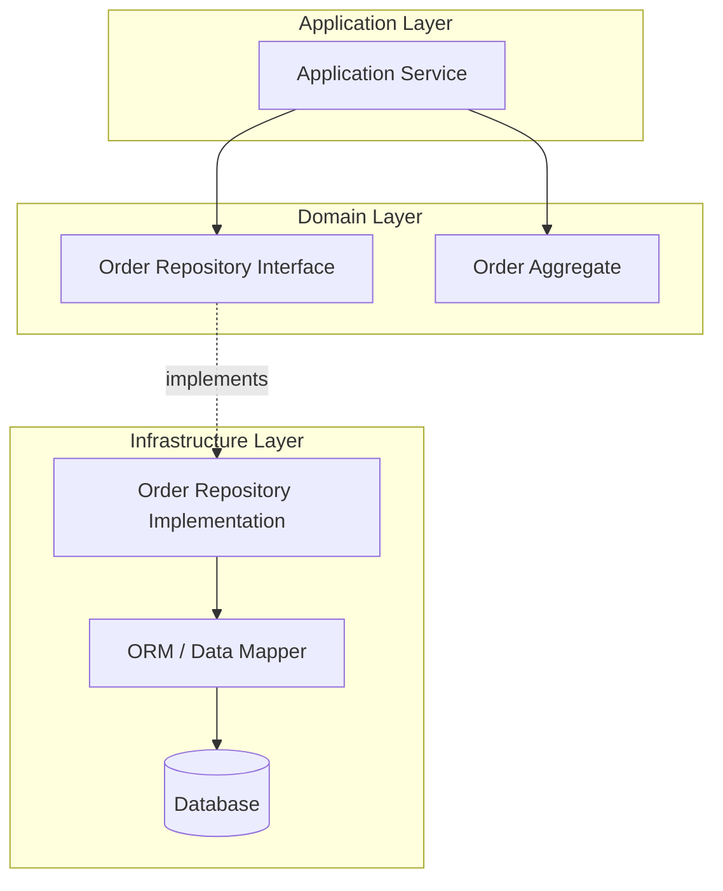

**Repository Best Practices:**

- **One repository per aggregate root**: Not every entity needs a repository.
- **Collection semantics**: Treat the repository as an in-memory collection (add, remove, find).
- **Specification pattern**: Use specifications for complex queries rather than exposing query details.
- **Unit of Work**: Coordinate persistence of changes across multiple repositories.

### Active Record vs. Data Mapper

| Dimension | Active Record | Data Mapper |
|-----------|--------------|-------------|
| **Object structure** | Domain object extends base class with persistence methods | Plain domain object; separate mapper class |
| **Database coupling** | Object is coupled to database schema | Domain model is persistence-ignorant |
| **Testing** | Requires database or mocking framework | Easy to unit test domain logic |
| **Complexity** | Low; good for simple models | Higher; better for complex domains |
| **DDD compatibility** | Limited; violates persistence ignorance | Full; supports rich domain model |
| **Examples** | Rails ActiveRecord, Django ORM | Hibernate (Java), Entity Framework (complex mode) |

### CQRS (Command Query Responsibility Segregation)

CQRS separates the write model (commands) from the read model (queries), allowing each to be optimized independently.

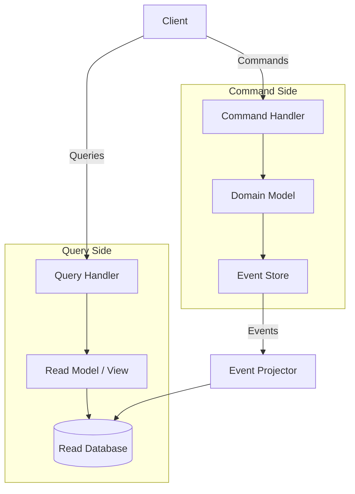

**CQRS Trade-offs:**

| Benefit | Cost |
|---------|------|
| Independent optimization of reads and writes | Increased complexity |
| Read models can be denormalized for performance | Eventual consistency between read and write models |
| Scalable read and write independently | More infrastructure components |
| Event sourcing integration | Debugging complexity |

---

## Distribution Design

Distribution design addresses how software is decomposed into communicating parts that run in different processes or on different machines. See also [[10_Design_Thinking_and_Context#Distribution|Distribution in Design Context]].

### Service Boundaries

Service boundaries define where one service ends and another begins. Good boundaries minimize inter-service communication and maximize service autonomy.

**Boundary Definition Criteria:**

| Criterion | Description | Example |
|-----------|-------------|---------|
| **Business capability** | Align with organizational structure | Order service, Inventory service |
| **Data ownership** | Each service owns its data | Order DB separate from Inventory DB |
| **Team autonomy** | Teams can develop and deploy independently | Feature team owns full service lifecycle |
| **Change frequency** | Group components that change together | Pricing logic in one service |
| **Failure isolation** | Failure in one service does not cascade | Payment failure does not affect browsing |

**Domain-Driven Design and Bounded Contexts:**

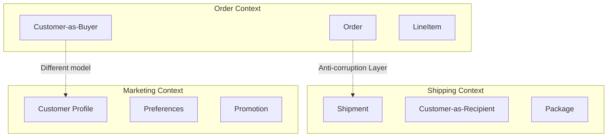

### API Contracts

API contracts define the interface between services. They specify request/response formats, error handling, versioning, and behavioral expectations.

**Contract-First vs. Code-First:**

| Approach | Description | Benefit | Drawback |
|----------|-------------|---------|----------|
| **Contract-First** | Define API specification before implementation | Clear separation, parallel development | Upfront design effort |
| **Code-First** | Generate API specification from implementation | Faster initial development | Tight coupling, harder to evolve |

**API Specification Formats:**

| Format | Protocol | Schema Language | Tooling |
|--------|----------|----------------|---------|
| **OpenAPI** | REST/HTTP | JSON Schema | Swagger UI, code generators |
| **GraphQL Schema** | GraphQL | SDL | Apollo, Relay, code generators |
| **Protocol Buffers** | gRPC | .proto files | protoc compiler, gRPC tooling |
| **AsyncAPI** | Async messaging | JSON Schema | Code generators, documentation |

### Idempotency

Idempotency ensures that performing an operation multiple times produces the same result as performing it once. This is critical for distributed systems where messages can be duplicated.

**Idempotency Strategies:**

| Strategy | Mechanism | Use Case |
|----------|-----------|----------|
| **Idempotency Key** | Client sends unique key; server deduplicates | Payment processing, order creation |
| **Natural Idempotency** | Operation is inherently idempotent (PUT, DELETE) | Resource updates |
| **Conditional Requests** | ETag/If-Match headers prevent duplicate processing | Optimistic concurrency control |
| **Deduplication** | Server tracks processed message IDs | Event processing, message queues |

### Eventual Consistency

Eventual consistency guarantees that, given no new updates, all replicas will eventually converge to the same state. It is the fundamental trade-off in distributed systems (CAP theorem).

**Consistency Models:**

| Model | Guarantee | Latency | Use Case |
|-------|-----------|---------|----------|
| **Strong** | All reads see the most recent write | High | Financial transactions, inventory |
| **Causal** | Causally related operations are seen in order | Medium | Social media feeds, collaboration |
| **Eventual** | All replicas converge given no new writes | Low | Caching, analytics, content delivery |
| **Read-Your-Writes** | A user always sees their own writes | Low | User profile updates |

### Saga Pattern

The Saga pattern manages distributed transactions by breaking them into a sequence of local transactions, each with a compensating action for rollback.

**Saga Types:**

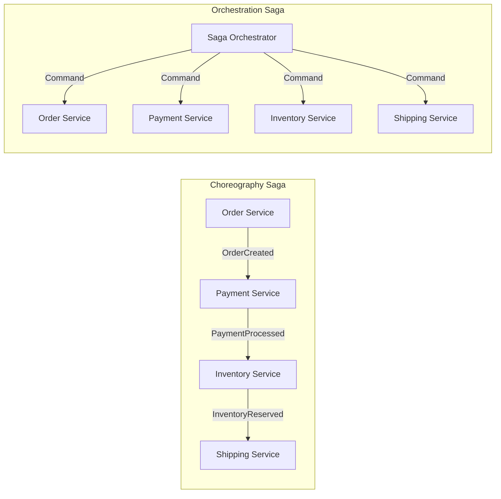

| Type | Coordination | Complexity | Coupling | Use When |
|------|-------------|-----------|----------|----------|
| **Choreography** | Events; each service decides next step | Low | Loose | Simple flows, 2-4 steps |
| **Orchestration** | Central coordinator directs sequence | Medium | Tighter | Complex flows, 5+ steps |

**Compensating Transactions:**

| Step | Forward Action | Compensating Action |
|------|---------------|-------------------|
| 1 | Create order (PENDING) | Cancel order |
| 2 | Reserve payment (AUTHORIZE) | Void authorization |
| 3 | Reserve inventory (HOLD) | Release reservation |
| 4 | Confirm shipment (SCHEDULE) | Cancel shipment |
| 5 | Confirm order (CONFIRMED) | Issue refund, release all |

### Circuit Breaker

The Circuit Breaker pattern (Michael Nygard, *Release It!*) prevents cascading failures by wrapping calls to external services with a state machine that monitors for failures.

**Circuit Breaker States:**

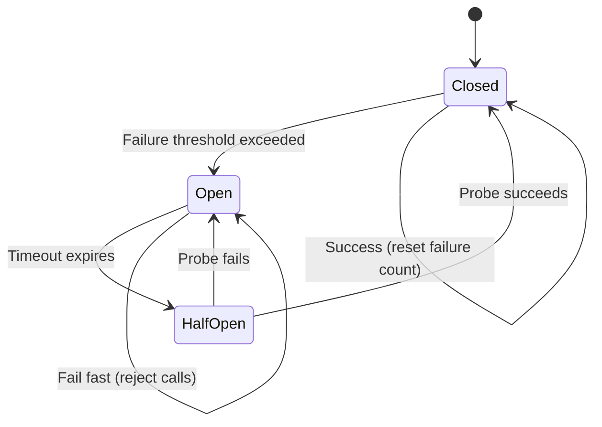

| State | Behavior | Transitions |
|-------|----------|-------------|
| **Closed** | Normal operation; calls pass through | Opens when failure count exceeds threshold |
| **Open** | Fail fast; calls are rejected immediately | Transitions to Half-Open after timeout |
| **Half-Open** | Limited probe calls to test recovery | Closes if probe succeeds; Opens if probe fails |

**Circuit Breaker Configuration:**

| Parameter | Description | Typical Value |
|-----------|-------------|---------------|
| Failure threshold | Number of failures before opening | 5 failures in 60 seconds |
| Success threshold | Number of successes before closing | 3 consecutive successes |
| Timeout | Duration before Half-Open probe | 30 seconds |
| Excluded exceptions | Exceptions that do not count as failures | Validation errors, 404s |

---

## Security Design

Security design addresses how the system protects data, resists attacks, and enforces access controls. Security must be designed in from the start; it cannot be bolted on later.

### Authentication Patterns

**OAuth 2.0 and OpenID Connect (OIDC):**

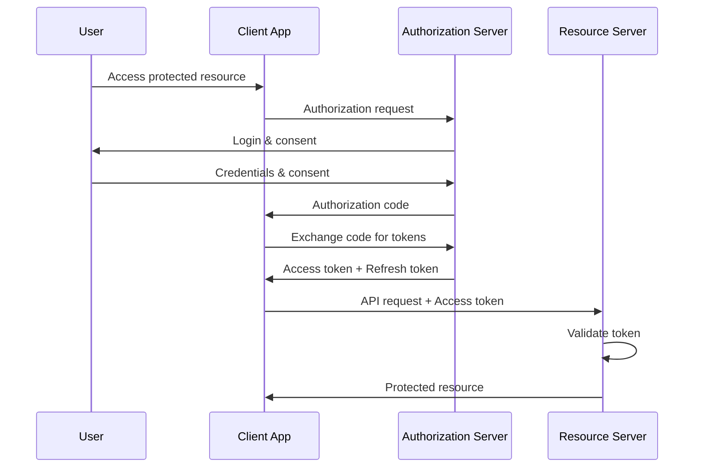

| Protocol | Purpose | Token Type | Use Case |
|----------|---------|------------|----------|
| **OAuth 2.0** | Authorization delegation | Access token | Third-party API access |
| **OIDC** | Authentication (identity) | ID token + Access token | Single sign-on |
| **JWT** | Token format (self-contained) | Signed JSON claims | Stateless auth, microservices |
| **SAML** | Enterprise SSO | XML assertion | Enterprise federation |

**JWT Structure:**

```
Header.Payload.Signature
  |       |        |
  |       |        +-- HMAC/RS256/ES256 signature
  |       +-- Claims (sub, iss, exp, iat, custom)
  +-- Algorithm (alg) and token type (typ)
```

**JWT Best Practices:**

- **Short expiration**: Access tokens should expire in minutes (5-15 min).
- **Refresh tokens**: Use longer-lived refresh tokens to obtain new access tokens.
- **Signature verification**: Always verify the signature before trusting claims.
- **Minimal claims**: Include only necessary data; JWTs are not encrypted by default.
- **Revocation strategy**: JWTs are hard to revoke; use short expiration + refresh token rotation.

### Authorization Patterns

| Model | Description | Flexibility | Complexity | Use When |
|-------|-------------|-----------|------------|----------|
| **RBAC** | Role-Based Access Control | Medium | Low | Organizational roles, admin/user/guest |
| **ABAC** | Attribute-Based Access Control | High | Medium | Context-dependent policies |
| **PBAC** | Policy-Based Access Control | Very High | High | Complex enterprise rules, compliance |
| **ACL** | Access Control List | Low | Low | Simple per-resource permissions |

**RBAC Implementation:**

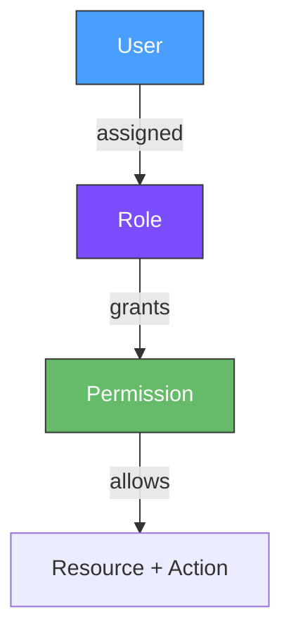

**ABAC Policy Example:**

```
ALLOW IF:
  subject.role == "manager"
  AND resource.department == subject.department
  AND action == "read"
  AND environment.time BETWEEN "09:00" AND "18:00"
```

### Encryption

| Concern | At Rest | In Transit |
|---------|---------|------------|
| **Mechanism** | AES-256, disk encryption, database encryption | TLS 1.3, HTTPS |
| **Key Management** | KMS, HSM, envelope encryption | Certificate management, cert pinning |
| **Scope** | Database fields, file systems, backups | All network communication |
| **Compliance** | GDPR, HIPAA, PCI-DSS requirements | TLS required by most regulations |

**Encryption Decision Matrix:**

| Data Type | At Rest | In Transit | Key Rotation | Notes |
|-----------|---------|------------|--------------|-------|
| PII (names, emails) | Encrypt | TLS | Annual | GDPR compliance |
| Financial data | Encrypt | TLS | Quarterly | PCI-DSS requirement |
| Health records | Encrypt | TLS | Annual | HIPAA requirement |
| Session tokens | Encrypt | TLS | Per-session | Security best practice |
| Public content | Optional | TLS | N/A | Integrity, not confidentiality |

### Secrets Management

**Secrets Management Patterns:**

| Pattern | Tool | Use Case |
|---------|------|----------|
| **Vault** | HashiCorp Vault, AWS Secrets Manager | Centralized secret storage with dynamic secrets |
| **Environment Variables** | dotenv, 12-factor app | Simple configuration secrets |
| **Configuration Service** | Spring Cloud Config, Consul | Distributed configuration |
| **Key Rotation** | Automated rotation scripts | Prevent stale credentials |

**Secrets Best Practices:**

- **Never commit secrets to source control**: Use `.gitignore` and pre-commit hooks.
- **Dynamic secrets**: Generate short-lived credentials on demand (Vault dynamic secrets).
- **Audit logging**: Track all secret access for compliance and incident response.
- **Least privilege**: Grant secrets only to services that need them.
- **Rotation**: Automate secret rotation to limit exposure window.

---

## Performance Design

Performance design addresses how the system meets throughput, latency, and resource utilization requirements.

### Caching Strategies

| Strategy | Description | Consistency | Use Case |
|----------|-------------|-------------|----------|
| **Write-Through** | Write to cache and DB simultaneously | Strong | Critical data that must be consistent |
| **Write-Behind** | Write to cache; async write to DB | Eventual | High-write throughput, tolerant of brief inconsistency |
| **Read-Through** | Cache fetches from DB on miss | Eventual | Read-heavy workloads |
| **Cache-Aside** | Application manages cache explicitly | Eventual | General purpose, most common pattern |

**Cache Hierarchy:**

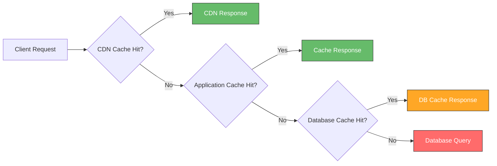

**Cache Invalidation Strategies:**

| Strategy | Description | Complexity | Consistency |
|----------|-------------|-----------|-------------|
| **TTL (Time-To-Live)** | Expire after fixed duration | Low | Eventual |
| **Event-Driven** | Invalidate on data change events | Medium | Near real-time |
| **Versioned Keys** | Include version in cache key | Low | Strong |
| **Tag-Based** | Invalidate by tags/categories | Medium | Near real-time |

### Lazy Loading

Lazy loading defers initialization of an object until it is first needed, reducing startup time and memory usage.

**Lazy Loading Patterns:**

| Pattern | Mechanism | Trade-off |
|---------|-----------|-----------|
| **Virtual Proxy** | Proxy loads real object on first access | Transparent but adds indirection |
| **Ghost Object** | Object loads its state on first property access | Complex implementation |
| **Value Holder** | Lazy reference that resolves on demand | Explicit but simple |
| **Lazy Collection** | Collection loads items on iteration/query | N+1 query risk |

### Connection Pooling

Connection pooling maintains a cache of database connections that can be reused, avoiding the overhead of creating new connections for each request.

**Connection Pool Configuration:**

| Parameter | Description | Typical Value |
|-----------|-------------|---------------|
| **Minimum size** | Connections kept warm | 2-5 |
| **Maximum size** | Upper bound on connections | 10-50 (depends on DB capacity) |
| **Idle timeout** | Close idle connections | 300 seconds |
| **Connection timeout** | Max wait for available connection | 30 seconds |
| **Max lifetime** | Force connection refresh | 1800 seconds |

### Query Optimization

**Query Optimization Strategies:**

| Strategy | Description | Impact |
|----------|-------------|--------|
| **Indexing** | Create indexes on frequently queried columns | 10-1000x read improvement |
| **Query plan analysis** | Use EXPLAIN to understand execution plans | Identifies full table scans |
| **N+1 elimination** | Use eager loading or batch queries | Reduces query count by orders of magnitude |
| **Pagination** | Limit result sets with cursor or offset pagination | Prevents memory exhaustion |
| **Denormalization** | Pre-join data for read-heavy patterns | Faster reads, slower writes |

### CDN (Content Delivery Network)

CDNs distribute static and dynamic content across geographically distributed edge servers, reducing latency and offloading origin servers.

**CDN Use Cases:**

| Content Type | Caching Strategy | TTL | Notes |
|-------------|-----------------|-----|-------|
| Static assets (JS, CSS, images) | Long-term cache | Days to months | Versioned filenames for cache busting |
| API responses | Edge caching | Minutes | Vary by authentication, location |
| Video streaming | Progressive delivery | N/A | Adaptive bitrate, edge origin |
| Dynamic pages | Edge-side includes (ESI) | Per-component | Partial page caching |

---

## Scalability Design

Scalability design addresses how the system handles growing load without proportional increases in cost or complexity.

### Horizontal vs. Vertical Scaling

| Dimension | Vertical (Scale Up) | Horizontal (Scale Out) |
|-----------|-------------------|---------------------|
| **Mechanism** | Bigger machine (CPU, RAM, SSD) | More machines |
| **Limit** | Hardware ceiling | Practically unlimited |
| **Cost** | Exponential per unit | Linear (with overhead) |
| **Complexity** | Low (no distributed systems) | High (consistency, coordination) |
| **Downtime** | Often requires restart | Zero-downtime with proper design |
| **State** | Single source of truth | Requires distributed state management |

### Sharding

Sharding distributes data across multiple database instances (shards), each holding a subset of the data.

**Sharding Strategies:**

| Strategy | Description | Rebalancing | Use Case |
|----------|-------------|------------|----------|
| **Range-Based** | Shard by value range (e.g., A-M, N-Z) | Manual | Predictable access patterns |
| **Hash-Based** | Shard by hash of key | Rehash on scale change | Even distribution, no range queries |
| **Directory-Based** | Lookup table maps keys to shards | Update directory | Flexible, but directory is SPOF |
| **Geographic** | Shard by user location | Per-region | Latency-sensitive, data sovereignty |

**Sharding Challenges:**

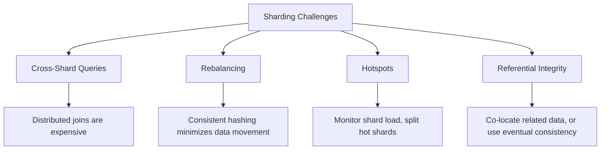

### Load Balancing

| Algorithm | Description | Use Case |
|-----------|-------------|----------|
| **Round Robin** | Rotate requests evenly | Homogeneous servers, simple setup |
| **Weighted Round Robin** | Rotate with weights for server capacity | Heterogeneous servers |
| **Least Connections** | Route to server with fewest active connections | Varying request durations |
| **IP Hash** | Route based on client IP | Session affinity |
| **Least Response Time** | Route to fastest responding server | Latency-sensitive applications |

**Load Balancer Placement:**

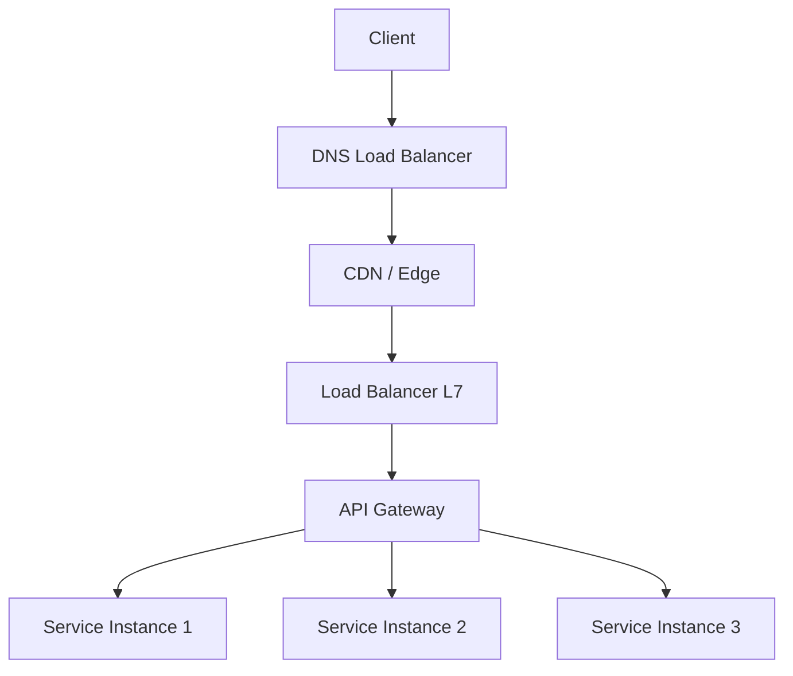

### Auto-Scaling

Auto-scaling adjusts compute capacity based on demand, optimizing cost while maintaining performance.

**Auto-Scaling Metrics:**

| Metric | Threshold Example | Scaling Action |
|--------|------------------|---------------|
| CPU utilization | > 70% for 5 minutes | Scale out |
| Memory utilization | > 80% for 5 minutes | Scale out |
| Request queue depth | > 100 pending requests | Scale out |
| Response latency | p95 > 500ms | Scale out |
| CPU utilization | < 30% for 15 minutes | Scale in |

**Auto-Scaling Considerations:**

- **Warm-up time**: New instances need time to become ready (health checks, cache warming).
- **Cooldown periods**: Prevent thrashing by waiting between scaling actions.
- **Stateful services**: Scaling stateful services requires careful data management (sharding, replication).
- **Cost optimization**: Right-size instances and use spot/preemptible instances for non-critical workloads.

---

## Interoperability Design

Interoperability design addresses how different systems, services, and components communicate and exchange data.

### API Design Styles

| Style | Protocol | Data Format | Strengths | Weaknesses |
|-------|----------|-------------|-----------|------------|
| **REST** | HTTP | JSON, XML | Cacheable, widely understood, mature tooling | Over-fetching, under-fetching, no real-time |
| **GraphQL** | HTTP | JSON | Flexible queries, type system, introspection | Complexity, N+1 queries, caching harder |
| **gRPC** | HTTP/2 | Protocol Buffers | High performance, streaming, code generation | Browser support limited, harder to debug |
| **WebSocket** | WebSocket | Any | Real-time bidirectional | More complex than request-response |

**REST API Design Principles:**

| Principle | Description | Example |
|-----------|-------------|---------|
| **Resource-Oriented** | Model as nouns, not verbs | `GET /orders/{id}` not `GET /getOrder` |
| **HTTP Methods** | Use standard methods | GET (read), POST (create), PUT (replace), PATCH (update), DELETE |
| **Status Codes** | Use appropriate HTTP status codes | 200 OK, 201 Created, 404 Not Found, 409 Conflict |
| **HATEOAS** | Include links to related resources | `{"self": "/orders/1", "customer": "/customers/5"}` |
| **Versioning** | Version your API | URL path `/v1/orders` or header `Accept: application/vnd.api.v1+json` |

**GraphQL Schema Example:**

```graphql
type Query {
  order(id: ID!): Order
  orders(status: OrderStatus, limit: Int): [Order!]!
}

type Order {
  id: ID!
  status: OrderStatus!
  items: [OrderItem!]!
  customer: Customer!
  total: Money!
}

type Mutation {
  createOrder(input: CreateOrderInput!): Order!
  updateOrderStatus(id: ID!, status: OrderStatus!): Order!
}
```

**gRPC Service Definition:**

```protobuf
service OrderService {
  rpc GetOrder(GetOrderRequest) returns (Order);
  rpc ListOrders(ListOrdersRequest) returns (stream Order);
  rpc CreateOrder(CreateOrderRequest) returns (Order);
  rpc WatchOrderStatus(WatchRequest) returns (stream OrderStatus);
}
```

### Message Formats

| Format | Type | Schema | Size | Speed | Use Case |
|--------|------|--------|------|-------|----------|
| **JSON** | Text | Optional (JSON Schema) | Large | Moderate | APIs, configuration, human-readable |
| **Protocol Buffers** | Binary | Required (.proto) | Small | Fast | gRPC, high-performance services |
| **Avro** | Binary | Required (.avsc) | Small | Fast | Big data, Kafka, schema evolution |
| **MessagePack** | Binary | Optional | Small | Fast | Compact JSON alternative |
| **XML** | Text | Required (XSD) | Very large | Slow | Legacy systems, SOAP |

**Format Selection Guide:**

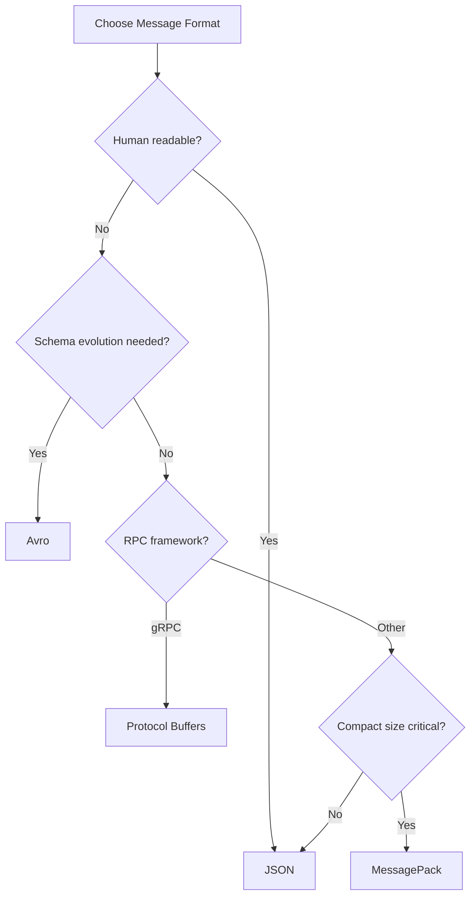

### Protocol Buffers

Protocol Buffers (protobuf) are Google's language-neutral, platform-neutral extensible mechanism for serializing structured data.

**Protobuf Features:**

- **Compact**: Binary format is 3-10x smaller than JSON.
- **Fast**: Serialization/deserialization is 20-100x faster than JSON.
- **Strongly Typed**: Schema defined in `.proto` files, code generated for multiple languages.
- **Backward Compatible**: Field numbers allow schema evolution without breaking compatibility.

**Schema Evolution Rules:**

| Change | Compatibility | Rule |
|--------|--------------|------|
| Add new field | Backward compatible | Use new field number |
| Remove field | Forward compatible | Reserve field number, mark as deprecated |
| Change field type | Breaking | Never change field types |
| Rename field | Compatible | Field numbers are what matter, not names |

### Interoperability Patterns

| Pattern | Description | Use Case |
|---------|-------------|----------|
| **API Gateway** | Single entry point for all client requests | Cross-cutting concerns: auth, rate limiting, routing |
| **Anti-Corruption Layer** | Translate between different models | Legacy system integration |
| **Adapter** | Convert one interface to another | Third-party service integration |
| **Facade** | Simplify complex subsystem interface | Microservice aggregation |
| **Event-Driven** | Communicate via events on message broker | Loose coupling, async processing |

**Anti-Corruption Layer:**

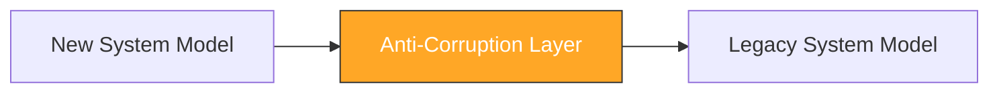

The ACL translates between the new system's clean domain model and the legacy system's messy model, preventing legacy design decisions from contaminating the new system.

---

## Design Issue Interaction Matrix

Design issues do not exist in isolation. They interact and sometimes conflict:

| | Concurrency | Persistence | Distribution | Security | Performance | Scalability |
|---|---|---|---|---|---|---|
| **Concurrency** | -- | Lock contention on shared data | Distributed locking, consensus | Thread-safe auth | Parallelism vs. overhead | Thread pool sizing |
| **Persistence** | Lock contention | -- | Distributed transactions, CQRS | Encryption at rest | Connection pooling, caching | Sharding, read replicas |
| **Distribution** | Distributed locking | Distributed transactions | -- | mTLS, JWT propagation | Network latency | Horizontal scaling |
| **Security** | Thread-safe auth | Encrypted storage | Secure communication | -- | Crypto overhead | Distributed auth |
| **Performance** | Parallelism | Caching, connection pooling | CDN, edge computing | Crypto overhead | -- | Auto-scaling |
| **Scalability** | Thread pools | Sharding | Load balancing | Distributed auth | Caching hierarchy | -- |

---

## Relationships to Other Notes

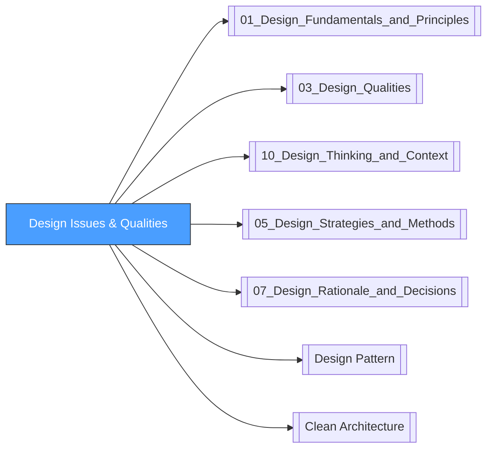

- [[01_Design_Fundamentals_and_Principles]]: Foundational principles underpin all design issues.
- [[03_Design_Qualities]]: Quality attributes (performance, security, scalability) are the measurable outcomes of design decisions.
- [[10_Design_Thinking_and_Context]]: Design context frames which issues are most critical for a given system.
- [[05_Design_Strategies_and_Methods]]: Design strategies provide systematic approaches to addressing design issues.
- [[07_Design_Rationale_and_Decisions]]: Design rationale documents why specific trade-offs were made.
- [[Design Pattern]]: Patterns provide proven solutions for recurring design issues.
- [[Clean Architecture]]: Architectural patterns address cross-cutting concerns through layering and dependency management.

---

## References

- SWEBOK v4, Chapter 3: Software Design
- Nygard, M. (2007). *Release It!*
- Hohpe, G. & Woolf, B. (2003). *Enterprise Integration Patterns*
- Richardson, C. (2018). *Microservices Patterns*
- Vernon, V. (2013). *Implementing Domain-Driven Design*
- Hoare, C.A.R. (1978). *Communicating Sequential Processes*
- Hewitt, C. et al. (1973). "A Universal Modular ACTOR Formalism for Artificial Intelligence"
