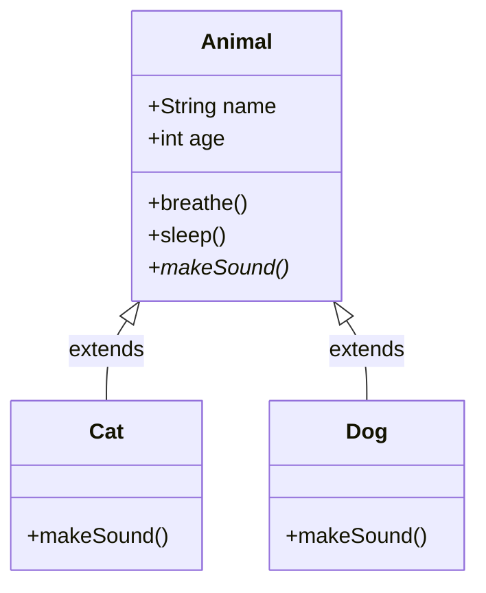
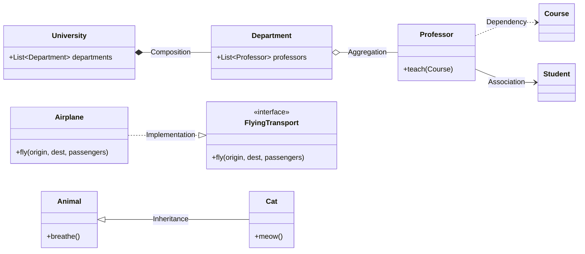

---
tags:
- design-patterns
- introduction
- oop
- software-design
- software-engineering
---

> *Source: Dive Into Design Patterns by Alexander Shvets, "Introduction to OOP" (pp. 7–25)*

# Introduction to OOP

## Core Concepts

Object-oriented programming (OOP) is a paradigm that wraps **data** and **behavior** into bundles called **objects**, constructed from blueprints called **classes**. Four pillars define OOP: **Abstraction**, **Encapsulation**, **Inheritance**, and **Polymorphism**. Objects relate to each other through six relationship types, from weakest (Dependency) to strongest (Inheritance). Understanding these foundations is prerequisite to applying design patterns effectively.

---

## Basics of OOP

### Classes and Objects

A **class** is a blueprint that defines the structure for objects. An **object** is a concrete instance of a class — the actual entity created at runtime.

**Fields** store data (attributes). **Methods** define behavior. Together, fields and methods are the **members** of a class.

```pseudocode
// ✅ Class definition — the blueprint
class Cat is
  field name: string
  field age: integer
  field color: string
  method meow() is
    // ...
  method sleep() is
    // ...
```

```pseudocode
// ✅ Object instantiation — concrete instances
oscar = new Cat("Oscar", 3, "orange")
luna  = new Cat("Luna", 2, "white")
// Same fields, different values — same class, different state
```

### State and Behavior

- **State** — data stored in an object's fields at any given moment (e.g., `oscar.age = 3`, `luna.age = 2`).
- **Behavior** — defined by the object's methods (e.g., `meow()`, `sleep()`, `eat()`).

### Class Hierarchies

Classes organize into hierarchies using **inheritance**. A **superclass** (parent) defines common state and behavior. **Subclasses** (children) inherit from the parent and add or override only what differs.

```pseudocode
// ✅ Superclass captures shared members
class Animal is
  field name: string
  field age: integer
  method breathe() is
    // common implementation
  method sleep() is
    // common implementation
  abstract method makeSound()

// ✅ Subclasses add only what's unique
class Cat extends Animal is
  method makeSound() is
    print("Meow!")

class Dog extends Animal is
  method makeSound() is
    print("Woof!")
```

```pseudocode
// ❌ Without hierarchy — duplication, no shared contract
class Cat is
  field name: string
  field age: integer
  method breathe() is /* ... */
  method sleep() is /* ... */
  method meow() is /* ... */

class Dog is
  field name: string
  field age: integer
  method breathe() is /* ... */
  method sleep() is /* ... */
  method bark() is /* ... */
// Every class re-declares name, age, breathe, sleep — unmaintainable
```

Hierarchies can extend multiple levels: `Organism → Animal → Cat`. A subclass inherits everything from every ancestor in the chain. Subclasses can **override** methods — either replacing or extending the parent's behavior.



---

## Pillars of OOP

### **Abstraction**

A model of a real-world object or phenomenon, **limited to a specific context**, that represents all details relevant to that context with high accuracy and omits everything else.

> An `Airplane` in a **flight simulator** models altitude, speed, pitch. The same `Airplane` in a **booking app** models only seat maps and availability. Same real-world entity, different abstractions for different contexts.

In code: interfaces and abstract classes expose **what** an object does without exposing **how**.

---

### **Encapsulation**

The ability of an object to **hide parts of its state and behavior** from other objects, exposing only a limited **interface** to the rest of the program.

- `private` — accessible only within the owning class.
- `protected` — accessible within the owning class and its subclasses.
- `public` — the object's interface, accessible by everyone.

```pseudocode
// ✅ Encapsulated — internals hidden behind a simple interface
class Car is
  private field engine: Engine
  private field battery: Battery
  method start() is
    // complex wiring, crankshaft rotation, power cycle — all hidden
    engine.ignite()
    battery.drain()
// Driver only calls start() — doesn't need to know the internals
```

```pseudocode
// ❌ No encapsulation — everything exposed, caller must orchestrate
class Car is
  public field engine: Engine
  public field battery: Battery
  public field crankshaft: Crankshaft

// Caller must:
//   car.crankshaft.rotate()
//   car.engine.initiatePowerCycle()
//   car.battery.connectWires()
// Fragile, coupled, dangerous
```

Interfaces declare **contracts** of interaction. Any class implementing `FlyingTransport` with `fly(origin, destination, passengers)` can be handled by an `Airport` — whether it's an `Airplane`, `Helicopter`, or `DomesticatedGryphon`. The interface guarantees the method exists; implementation details are irrelevant.

---

### **Inheritance**

The ability to **build new classes on top of existing ones**. The main benefit is **code reuse**: instead of duplicating code, extend an existing class and add only what's different.

**Key rule:** Subclasses have the same interface as their parent. You cannot hide a method declared in the superclass. You must implement all abstract methods, even if they don't make sense for your subclass.

- A subclass can extend **only one** superclass (single inheritance).
- A class can implement **multiple** interfaces.
- If a superclass implements an interface, all subclasses must also implement it.

---

### **Polymorphism**

The ability of a program to **detect the real class of an object** and call its implementation even when its real type is unknown in the current context.

```pseudocode
// ✅ Polymorphism in action
interface Animal is
  abstract method makeSound()

class Cat implements Animal is
  method makeSound() is print("Meow!")

class Dog implements Animal is
  method makeSound() is print("Woof!")

bag = [new Cat(), new Dog()]
for each Animal a in bag do
  a.makeSound()
// Output: Meow!
// Output: Woof!
// The program doesn't know the concrete type — polymorphism resolves it
```

```pseudocode
// ❌ Without polymorphism — type-checking nightmare
for each item in bag do
  if item is Cat then
    (item as Cat).meow()
  else if item is Dog then
    (item as Dog).bark()
  else if item is Bird then
    (item as Bird).chirp()
// Every new animal requires another branch — unscalable
```

Think of polymorphism as an object's ability to **pretend** to be something else — usually a class it extends or an interface it implements. The dogs and cats in the bag "pretended" to be generic `Animal` objects.

---

## Relations Between Objects

From **weakest** to **strongest**:

### **Dependency** (Weakest)

Class A can be affected by changes in class B.

Occurs when you use concrete class names in method signatures, instantiate objects via constructor calls, or reference a class anywhere in your code. If B's signature changes, A breaks.

```pseudocode
class Professor is
  method teach(Course c) is
    // Professor depends on Course — if getKnowledge() changes, this breaks
    this.student.remember(c.getKnowledge())
```

**UML:** Dashed arrow with open arrowhead. Often too numerous to show all; only diagram the important ones.

**Mitigation:** Depend on interfaces or abstract classes instead of concrete classes to weaken the coupling.

---

### **Association**

Object A **knows about** object B. Class A depends on B.

A specialized kind of dependency where an object always has access to the objects it interacts with — typically via a **field** that stores a reference. Unlike simple dependency, association establishes a **permanent link**.

```pseudocode
class Professor is
  field student: Student          // ← Association (permanent link via field)
  method teach(Course c) is
    this.student.remember(c.getKnowledge())
    // student is always accessible → association
    // Course is used only in teach() → mere dependency
```

**UML:** Solid arrow. Can be bi-directional (arrows on both ends). Association can also be represented by a method that returns an object (necessary for interfaces, which have no fields).

---

### **Aggregation**

Object A **knows about** object B, and **consists of** B. Class A depends on B.

A specialized association representing "one-to-many," "many-to-many," or "whole-part" relations. The **component can exist independently** of the container and can belong to multiple containers simultaneously.

```pseudocode
class Department is
  field professors: List<Professor>  // ← Aggregation
  // Professors exist independently of the department
  // A professor can belong to multiple departments
```

**UML:** Solid line with **empty diamond** at the container end, arrow pointing to the component. Cardinality can be noted at both ends (e.g., `1` department has `1..*` professors).

---

### **Composition**

Object A **knows about** object B, **consists of** B, and **manages B's lifecycle**. Class A depends on B.

A specific kind of aggregation where the component **cannot exist** without its container. When the container is destroyed, all its components are destroyed too.

```pseudocode
class University is
  field departments: List<Department>  // ← Composition
  // Departments don't exist outside the university
  // Destroying the university destroys its departments
```

**UML:** Solid line with **filled diamond** at the container end. Same structure as aggregation but diamond is filled.

> ⚠️ Many use "composition" loosely to mean both aggregation and composition (e.g., "prefer composition over inheritance"). This is a linguistic convenience, not ignorance of the distinction.

---

### **Implementation**

Class A defines methods declared in **interface** B. Objects A can be treated as B. Class A depends on B.

```pseudocode
interface FlyingTransport is
  method fly(origin, destination, passengers)

class Airplane implements FlyingTransport is
  method fly(origin, destination, passengers) is
    // concrete implementation
```

**UML:** Dashed line with hollow triangle arrowhead pointing to the interface.

---

### **Inheritance** (Strongest)

Class A **inherits** interface and implementation of class B but can extend it. Objects A can be treated as B. Class A depends on B.

```pseudocode
class Animal is
  method breathe() is /* ... */

class Cat extends Animal is
  method meow() is /* ... */
// Cat inherits breathe(), is treated as an Animal, and extends with meow()
```

**UML:** Solid line with hollow triangle arrowhead pointing to the superclass.

---

### Relationship Summary Table

| Relation | A knows B? | A consists of B? | A manages B's lifecycle? | B is interface? | UML Arrow |
|---|---|---|---|---|---|
| **Dependency** | Temporarily | No | No | No | Dashed → |
| **Association** | Permanently | No | No | No | Solid → |
| **Aggregation** | Yes | Yes | No | No | Empty ◇→ |
| **Composition** | Yes | Yes | Yes | No | Filled ◆→ |
| **Implementation** | Yes | No | No | Yes | Dashed ▷ |
| **Inheritance** | Yes | No | No | No | Solid ▷ |



> The six relationship types on a unified model. Dependency (dashed arrow), Association (solid arrow), Aggregation (empty diamond), Composition (filled diamond), Implementation (dashed hollow triangle), Inheritance (solid hollow triangle).

---

## Summary Checklist

- [ ] Understand that **classes** are blueprints; **objects** are concrete instances
- [ ] Distinguish **state** (fields) from **behavior** (methods)
- [ ] Explain how **class hierarchies** enable code reuse via inheritance
- [ ] Know what **overriding** means and when to use it
- [ ] Define **Abstraction**: modeling only what matters for a specific context
- [ ] Define **Encapsulation**: hiding internals behind a public interface
- [ ] Differentiate `private`, `protected`, and `public` access levels
- [ ] Explain why **interfaces** declare contracts without implementation
- [ ] Define **Inheritance**: extending a class to reuse and specialize behavior
- [ ] Define **Polymorphism**: calling subclass behavior through a superclass/interface reference
- [ ] Rank the six object relations from weakest to strongest
- [ ] Distinguish **Dependency** (temporary, fragile) from **Association** (permanent link via field)
- [ ] Distinguish **Aggregation** (component can exist independently) from **Composition** (component's lifecycle is tied to container)
- [ ] Recognize **Implementation** (class → interface) vs **Inheritance** (class → class) in UML
- [ ] Read and interpret UML class diagrams for all six relationship types

---

## Related

- [[how-to-read-this-book]]
- [[introduction-to-design-patterns]]
- **design-principles**
- **solid-principles**
