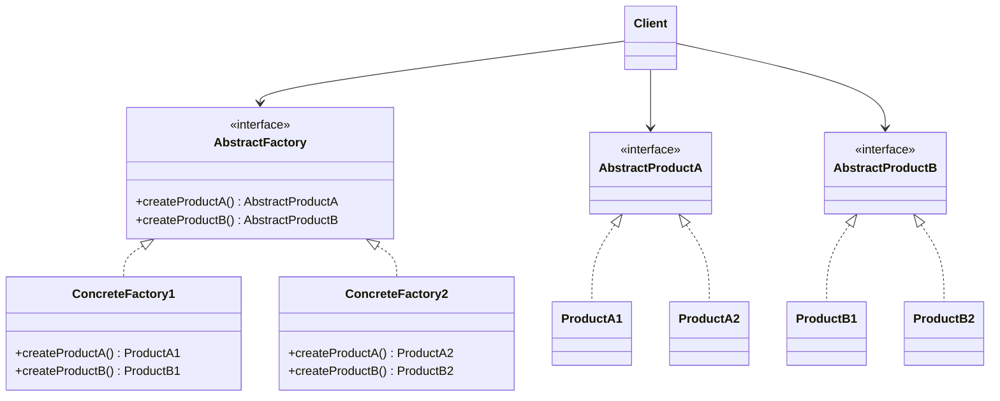

---
tags:
- design-patterns
- oop
- software-design
- software-engineering
---

> *Source: Dive Into Design Patterns by Alexander Shvets, "Abstract Factory" (pp. 90–104)*

## Intent

> Abstract Factory is a creational design pattern that lets you produce families of related objects without specifying their concrete classes.

## Problem

When you need to create objects that belong to **families of related products** — for example, a furniture set consisting of `Chair`, `Sofa`, and `CoffeeTable` — you face two compounding challenges:

1. **Variant explosion.** Each product may come in multiple variants — `Modern`, `Victorian`, `ArtDeco` — and every variant must be internally consistent: a `ModernChair` must pair with a `ModernSofa` and a `ModernCoffeeTable`. Mixing variants (a Victorian chair with an ArtDeco table) produces a broken set.

2. **Extensibility without modification.** Vendors introduce new products and families frequently. Changing the core code every time a new variant appears is unsustainable.

Hard-coding `if (style == "modern")` / `else if (style == "victorian")` chains throughout the client code couples it to every concrete product class and makes the system fragile under change.

## Solution

The Abstract Factory pattern addresses both challenges with two layers of abstraction:

- **Explicit product interfaces.** Declare one interface per product type (`Chair`, `Sofa`, `CoffeeTable`). Every variant implements those interfaces — `ModernChair` implements `Chair`, `VictorianSofa` implements `Sofa`, and so on. The client codes against the interfaces, never against concrete classes.

- **Abstract factory per variant family.** Declare a `FurnitureFactory` interface with creation methods for each product: `createChair()`, `createSofa()`, `createCoffeeTable()`. Each method returns the *abstract* product type. Concrete factories (`ModernFurnitureFactory`, `VictorianFurnitureFactory`) implement this interface and instantiate only the products of their variant. The client receives a factory at initialization time (chosen by configuration or environment) and never knows which concrete factory it holds.

The result: adding a new variant means writing one new concrete factory and its associated concrete product classes. Existing client code remains untouched.

## Structure



1. **Abstract Products**
2. **Concrete Products** — Variant-specific implementations of abstract products, grouped by variant (`ModernChair`, `VictorianChair`, …).
3. **Abstract Factory** — Interface declaring creation methods for every abstract product. Return types are the abstract product interfaces.
4. **Concrete Factories** — One per variant. Each implements the abstract factory interface and instantiates only its variant's concrete products. Method signatures return the *abstract* type, decoupling the client from concrete classes.
5. **Client** — Works exclusively with the `AbstractFactory` and abstract product interfaces. It receives a concrete factory at initialization and never touches a `new ConcreteProduct()` call directly.

## Pseudocode (Cross-Platform GUI)

The classic example: a cross-platform UI toolkit where `Button` and `Checkbox` form a product family, and `Windows` / `macOS` are the variants.

```
// The abstract factory interface declares creation methods for
// each abstract product in the family.
interface GUIFactory is
    method createButton(): Button
    method createCheckbox(): Checkbox

// Concrete factories produce a family of products belonging to
// a single variant. Inside each method, a concrete product is
// instantiated, but the return type is the abstract interface.
class WinFactory implements GUIFactory is
    method createButton(): Button is
        return new WinButton()
    method createCheckbox(): Checkbox is
        return new WinCheckbox()

class MacFactory implements GUIFactory is
    method createButton(): Button is
        return new MacButton()
    method createCheckbox(): Checkbox is
        return new MacCheckbox()

// Each distinct product type has a base interface.
interface Button is
    method paint()

interface Checkbox is
    method paint()

// Concrete products are created by the corresponding factory.
class WinButton implements Button is
    method paint() is
        // Render a button in Windows style.

class MacButton implements Button is
    method paint() is
        // Render a button in macOS style.

class WinCheckbox implements Checkbox is
    method paint() is
        // Render a checkbox in Windows style.

class MacCheckbox implements Checkbox is
    method paint() is
        // Render a checkbox in macOS style.

// The client works with factories and products only through
// abstract types. Any factory or product subclass can be passed
// without breaking the client.
class Application is
    private field factory: GUIFactory
    private field button: Button

    constructor Application(factory: GUIFactory) is
        this.factory = factory

    method createUI() is
        this.button = factory.createButton()

    method paint() is
        button.paint()

// The application picks the factory type at initialization based
// on configuration or environment.
class ApplicationConfigurator is
    method main() is
        config = readApplicationConfigFile()

        if (config.OS == "Windows") then
            factory = new WinFactory()
        else if (config.OS == "Mac") then
            factory = new MacFactory()
        else
            throw new Exception("Error! Unknown operating system.")

        Application app = new Application(factory)
```

✅ Pseudocode faithfully reproduced from the source (pp. 98–101).

## Applicability

- **Working with families of related products.** Use Abstract Factory when the system must support multiple product families and you want to avoid coupling the client to any concrete product class. The pattern guarantees that every product the client receives belongs to the same family.

- **Extracting factory methods from a class with multiple responsibilities.** When a class contains several Factory Methods whose creation logic blurs the class's primary purpose, extracting them into a standalone Abstract Factory restores single responsibility.

- **The variants are known at design time but the active one is chosen at runtime.** The pattern is ideal when you know what the families are, but the decision of *which* family to use happens when the application starts (from a config file, environment variable, or platform check).

## Pros and Cons

### ✅ Pros

- **Guaranteed product compatibility.** Every object produced by a single factory belongs to the same family — no mismatched variants.
- **Loose coupling.** Client code depends only on abstract interfaces, not on concrete product classes.
- **Single Responsibility Principle.** Product creation logic is centralized in factory classes, separate from business logic.
- **Open/Closed Principle.** New product variants can be introduced by adding a new concrete factory and its concrete products — existing code remains unchanged.

### ❌ Cons

- **Increased complexity.** The pattern introduces many new interfaces and classes. For simple cases with few variants, the overhead may outweigh the benefit.

## Relations with Other Patterns

| Pattern | Relationship |
|---|---|
| **Factory Method** | Many designs start with Factory Method (simpler, subclass-customizable) and evolve toward Abstract Factory as the number of product families grows. Abstract Factory classes are often built on a set of Factory Methods. |
| **Builder** | Builder constructs complex objects step by step; Abstract Factory returns a product immediately. Builder lets you run additional construction steps before fetching the result. |
| **Prototype** | Instead of composing Abstract Factory methods with Factory Methods, you can use Prototype — each factory method clones a prototype object and configures it. |
| **Singleton** | Abstract Factories, Builders, and Prototypes can all be implemented as Singletons when only one instance of each factory is needed. |
| **Bridge** | Use Abstract Factory together with Bridge when Bridge-defined abstractions can only work with specific implementations. Abstract Factory encapsulates these constraints and hides the coupling from client code. |
| **Facade** | Abstract Factory can serve as an alternative to Facade when the goal is to hide *how* subsystem objects are created, not just how they are used. |

## Summary Checklist

- [ ] Mapped the **product-type × variant matrix** (e.g., `{Chair, Sofa, Table} × {Modern, Victorian, ArtDeco}`).
- [ ] Declared an **abstract product interface** for every product type.
- [ ] Implemented **concrete product classes** for every variant of every product type.
- [ ] Declared the **abstract factory interface** with one creation method per product type.
- [ ] Implemented a **concrete factory class** for each variant.
- [ ] Wired **factory selection logic** at initialization — reads config/environment and instantiates the correct concrete factory.
- [ ] Scanned all **direct product constructor calls** (`new Chair(…)`) and replaced them with factory creation methods.
- [ ] Verified the client depends **only on abstract interfaces** (`AbstractFactory` and abstract products), not on concrete classes.

## Related

- [[factory-method]]
- [[builder]]
- [[prototype]]
- [[singleton]]
- [[bridge]]
- **solid-principles**
