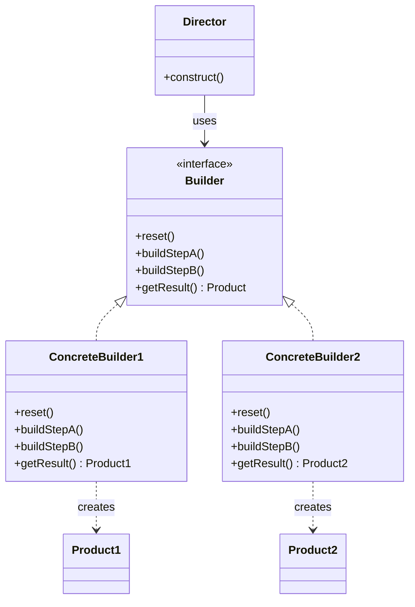

---
tags:
- design-patterns
- oop
- software-design
- software-engineering
---

> *Source: Dive Into Design Patterns by Alexander Shvets, "Builder" (pp. 105–123)*

## Intent

> Builder is a creational design pattern that lets you construct complex objects step by step. The pattern allows you to produce different types and representations of an object using the same construction code.

---

## Problem

Complex objects often require laborious, step-by-step initialization of many fields and nested objects. Two naive approaches both fail:

**Subclass explosion.** Extend the base class and create a subclass for every possible configuration. Each new parameter forces the hierarchy to grow combinatorially — unmaintainable.

**Telescoping constructor.** Put all possible parameters into a single giant constructor in the base class. This eliminates subclasses but creates another mess: most parameters are unused in any given call, making constructor invocations ugly and error-prone. Only a fraction of objects need any given optional parameter, yet every caller must wade through the noise.

> The core problem: construction logic is either scattered across subclasses or crammed into a monolithic constructor.

---

## Solution

Extract object construction code into separate objects called **builders**. The pattern organizes construction into a set of discrete steps (`buildWalls`, `buildDoor`, `setEngine`, …). The important part: you don't need to call all the steps — only the ones necessary for a particular configuration.

Key ideas:

- **Multiple builder implementations** for the same set of steps produce different representations. E.g., a `WoodBuilder` builds wooden houses, a `StoneBuilder` builds stone houses — same steps, different materials.
- **Director (optional).** A separate class that defines the *order* of construction steps. It knows the sequence to produce a working product. The director encapsulates reusable construction routines and hides product-construction details from the client.
- **The client** associates a builder with a director, launches construction, and retrieves the result from the builder (not the director — the director doesn't know concrete product types).

---

## Structure

| Role | Responsibility |
|------|----------------|
| **Builder** (interface) | Declares construction steps common to all builder types. |
| **Concrete Builders** | Provide different implementations of each step. May produce products that don't share a common interface. |
| **Products** | Resulting objects. Products from different builders need not belong to the same hierarchy. |
| **Director** | Defines the order in which to call construction steps. Reusable across configurations. |
| **Client** | Creates a concrete builder, passes it to the director, triggers construction, and fetches the product from the builder. |



---

## Pseudocode (from source)

The example reuses the same construction code to build both a **Car** and its corresponding **Car Manual** — two products with no common interface.

```
// Products — related but no common interface
class Car is
    // seats, engine, tripComputer, GPS…

class Manual is
    // documented features matching car configuration

// Builder interface
interface Builder is
    method reset()
    method setSeats(n)
    method setEngine(engine)
    method setTripComputer(flag)
    method setGPS(flag)

// Concrete Builder: assembles real car parts
class CarBuilder implements Builder is
    private field car: Car

    constructor CarBuilder() is
        this.reset()

    method reset() is
        this.car = new Car()

    method setSeats(n) is
        // Set number of seats in the car.
    method setEngine(e) is
        // Install given engine.
    method setTripComputer(f) is
        // Install trip computer.
    method setGPS(f) is
        // Install GPS.

    method getProduct(): Car is
        product = this.car
        this.reset()
        return product

// Concrete Builder: composes manual text
class CarManualBuilder implements Builder is
    private field manual: Manual

    constructor CarManualBuilder() is
        this.reset()

    method reset() is
        this.manual = new Manual()

    method setSeats(n) is
        // Document car seat features.
    method setEngine(e) is
        // Add engine instructions.
    method setTripComputer(f) is
        // Add trip computer instructions.
    method setGPS(f) is
        // Add GPS instructions.

    method getProduct(): Manual is
        // Return manual and reset builder.

// Director — knows the recipe, not the ingredients
class Director is
    method constructSportsCar(builder: Builder) is
        builder.reset()
        builder.setSeats(2)
        builder.setEngine(new SportEngine())
        builder.setTripComputer(true)
        builder.setGPS(true)

    method constructSUV(builder: Builder) is
        // ...

// Client
class Application is
    method makeCar() is
        director = new Director()

        CarBuilder carBuilder = new CarBuilder()
        director.constructSportsCar(carBuilder)
        Car car = carBuilder.getProduct()

        CarManualBuilder manualBuilder = new CarManualBuilder()
        director.constructSportsCar(manualBuilder)
        Manual manual = manualBuilder.getProduct()
```

> ✅ Pseudocode reproduced directly from source.

---

## Applicability

- **To get rid of a telescoping constructor.** When a constructor has many optional parameters, Builder lets you build step by step, calling only the steps you need.
- **To create different representations of the same product.** When construction of various representations involves the same steps that differ only in details (e.g., wooden vs. stone houses).
- **To construct Composite trees or other complex objects.** Builder supports recursive and deferred construction steps — ideal for building object trees without exposing unfinished products.

---

## Pros and Cons

### ✅ Pros
- Construct objects step-by-step; defer or run steps recursively.
- Reuse the same construction code for different product representations.
- **Single Responsibility Principle.** Isolate complex construction code from the product's business logic.

### ❌ Cons
- Overall code complexity increases — the pattern introduces multiple new classes.

---

## Relations with Other Patterns

- Many designs start with **Factory Method** (simpler, subclass-customizable) and evolve toward **Builder** or **Abstract Factory** as complexity grows.
- **Builder** focuses on step-by-step construction of *one* complex object. **Abstract Factory** specializes in creating *families* of related objects — and returns products *immediately*, whereas Builder allows additional steps before retrieval.
- Builder can construct complex **Composite** trees because its steps work recursively.
- Combine Builder with **Bridge**: the director acts as the abstraction, while different builders act as implementations.
- **Abstract Factories**, **Builders**, and **Prototypes** can all be implemented as **Singletons**.

---

## Summary Checklist

- [ ] Common construction steps are clearly definable for all product representations.
- [ ] Builder interface declares those steps.
- [ ] One Concrete Builder per product representation, each implementing the steps.
- [ ] A `getProduct()` method on each Concrete Builder (return type may differ — cannot live on the base interface in statically-typed languages).
- [ ] **Director (optional)** encapsulates reusable construction sequences.
- [ ] Client creates builder + director, passes builder to director, triggers construction, fetches result from builder.
- [ ] After `getProduct()`, builder resets itself (or waits for an explicit reset call).

---

## Related

[[factory-method]], [[abstract-factory]], [[prototype]], [[singleton]], [[composite]], **solid-principles**, [[bridge]]
