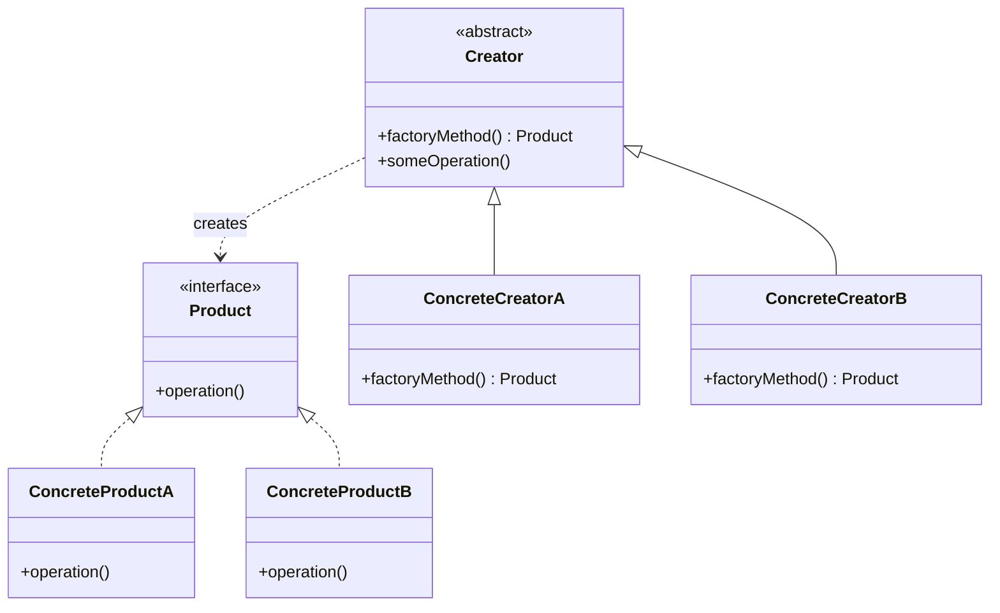

---
tags:
- design-patterns
- oop
- software-design
- software-engineering
---

> *Source: Dive Into Design Patterns by Alexander Shvets, "Factory Method" (pp. 74–89)*

# Factory Method (Virtual Constructor)

## Intent

> Factory Method is a creational design pattern that provides an interface for creating objects in a superclass, but allows subclasses to alter the type of objects that will be created.

---

## Problem

You build a logistics management application. Version 1 handles only **trucks** — the `Truck` class is woven through the entire codebase. Then sea shipping companies want in. Adding `Ship` means touching nearly every file because the code is **tightly coupled to concrete classes**.

Worse, every time you add another transport type (air, rail), the same cascade of changes repeats. The codebase degrades into a mess of **conditional switches** that branch on the transport class:

```java
// ❌ Naive approach — tight coupling + conditionals everywhere
if (transportType == "truck") {
    Truck t = new Truck();
    t.deliver();
} else if (transportType == "ship") {
    Ship s = new Ship();
    s.deliver();
}
```

The root cause: the client code knows exactly *which* concrete class it needs and constructs it directly via `new`.

---

## Solution

The Factory Method pattern replaces **direct constructor calls** (`new`) with calls to a special **factory method**. Objects are still created with `new`, but the call lives *inside* the factory method — not scattered through client code.

```java
// ✅ Factory Method — client calls createTransport() without knowing the concrete class
Transport t = logistics.createTransport();
t.deliver();
```

The key insight: **subclasses override the factory method** to change the class of product returned.

### Constraint

Subclasses can return different product types **only if** those products share a **common base class or interface**. The factory method's return type is declared as that interface.

### Logistics Example

| Creator | Factory Method | Product Returned |
|---------|---------------|------------------|
| `RoadLogistics` | `createTransport()` | `Truck` |
| `SeaLogistics` | `createTransport()` | `Ship` |

Both `Truck` and `Ship` implement `Transport` (with a `deliver()` method). The client code works exclusively against the `Transport` interface — it neither knows nor cares which concrete product it receives.

---

## Structure



1. **Product** — Interface common to all objects the creator and its subclasses can produce.
2. **Concrete Products** — Different implementations of the Product interface.
3. **Creator** — Declares the factory method (abstract or with a default). Its return type matches the Product interface. **Note:** product creation is *not* the Creator's primary responsibility; the Creator has core business logic that *uses* products. The factory method decouples that logic from concrete product classes.
4. **Concrete Creators** — Override the factory method to return a specific Concrete Product.

The factory method doesn't have to create *new* instances every time — it can return **cached objects, pooled objects, or objects from another source**.

---

## Pseudocode

Cross-platform UI dialog example. The base `Dialog` class uses buttons, but button appearance varies by OS. The factory method keeps the `Dialog` logic platform-agnostic.

### Product Interface & Concrete Products

```java
// ✅ Product interface
interface Button {
    void render();
    void onClick(Action f);
}

// ✅ Concrete products
class WindowsButton implements Button {
    void render() { /* Render Windows-style button */ }
    void onClick(Action f) { /* Bind native OS click event */ }
}

class HTMLButton implements Button {
    void render() { /* Return HTML button markup */ }
    void onClick(Action f) { /* Bind browser click event */ }
}
```

### Creator & Concrete Creators

```java
// ✅ Creator — business logic lives here, not in product creation
abstract class Dialog {
    // Factory method
    abstract Button createButton();

    // Core business logic — calls factory method, uses the product
    void render() {
        Button okButton = createButton();
        okButton.onClick(closeDialog);
        okButton.render();
    }
}

// ✅ Concrete creators — override factory method to return specific product
class WindowsDialog extends Dialog {
    Button createButton() { return new WindowsButton(); }
}

class WebDialog extends Dialog {
    Button createButton() { return new HTMLButton(); }
}
```

### Client Code

```java
// ✅ Client — picks creator based on config, works through base interface
class Application {
    Dialog dialog;

    void initialize() {
        Config config = readApplicationConfigFile();
        if (config.OS == "Windows") {
            dialog = new WindowsDialog();
        } else if (config.OS == "Web") {
            dialog = new WebDialog();
        } else {
            throw new Exception("Error! Unknown operating system.");
        }
    }

    void main() {
        this.initialize();
        dialog.render();
    }
}
```

> The `render()` method inside `Dialog` never changes regardless of how many button types you add. You just create a new `ConcreteCreator` subclass.

---

## Applicability

### ✅ Use Factory Method when:

1. **You don't know the exact types and dependencies of objects your code should work with ahead of time.**
   - The pattern separates *construction* from *usage*. Adding a new product type means creating one new creator subclass — the rest of the codebase is untouched.

2. **You want to provide users of your library or framework a way to extend its internal components.**
   - Example: an open-source UI framework provides square buttons. User extends `Button` → `RoundButton`, then overrides `UIFramework.createButton()` in a subclass to return `RoundButton`. The framework uses the subclass without any internal changes.

3. **You want to save system resources by reusing existing objects instead of rebuilding them each time.**
   - Typical for database connections, file handles, network resources. A constructor **must** return a new object by definition. A factory method can return an existing object from a pool or cache.

### ❌ Avoid Factory Method when:

- The object graph is simple and unlikely to change — direct `new` is simpler.
- You only have one product type — the pattern adds unnecessary abstraction.

---

## Pros and Cons

| Pros | Cons |
|------|------|
| ✅ **Avoids tight coupling** between creator and concrete products. | ❌ **Adds complexity** — requires many new subclasses to implement the pattern. Best when introduced into an *existing* hierarchy of creator classes. |
| ✅ **Single Responsibility Principle.** Product creation code is centralized in one place, making the codebase easier to maintain. | |
| ✅ **Open/Closed Principle.** New product types can be introduced without breaking existing client code. | |

---

## Relations with Other Patterns

- **Abstract Factory, Prototype, Builder** — Many designs start with Factory Method (simpler, subclass-driven) and evolve toward these more flexible (but more complex) patterns as requirements grow.
- **Abstract Factory** classes are often built from a *set* of Factory Methods. Prototype can also be used to compose methods on Abstract Factory classes.
- **Iterator** — Use Factory Method with Iterator to let collection subclasses return different iterator types compatible with the collections.
- **Prototype** — Not based on inheritance (no subclass explosion), but requires a complicated initialization step for cloned objects. Factory Method is inheritance-based but needs no initialization step.
- **Template Method** — Factory Method is a **specialization** of Template Method. A Factory Method may also serve as a single **step** within a larger Template Method.

---

## Summary Checklist

- [ ] All products implement a common interface
- [ ] Creator declares abstract (or default) factory method returning the product interface
- [ ] Concrete creators override factory method to return specific product types
- [ ] Client code works only against the product interface and creator base class
- [ ] Product construction is centralized — no `new` scattered across client code
- [ ] Adding a new product type requires **only** a new Concrete Creator subclass

---

## Related

- [[abstract-factory]]
- [[builder]]
- [[prototype]]
- [[singleton]]
- [[template-method]]
- **solid-principles**
