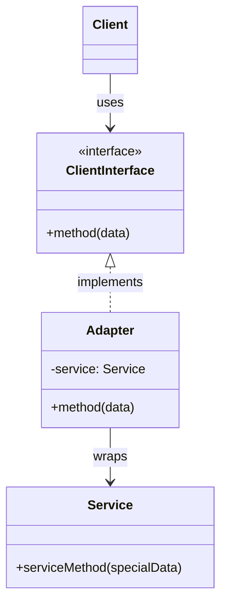

---
tags:
- design-patterns
- oop
- software-design
- software-engineering
---

> *Source: Dive Into Design Patterns by Alexander Shvets, "Adapter" (pp. 150–163)*

## Intent

> Adapter is a structural design pattern that allows objects with incompatible interfaces to collaborate.

Also known as: **Wrapper**.

---

## Problem

You have a working system that expects data or calls through a specific interface. Now you need to integrate a third-party library, legacy module, or external service — but its interface is incompatible with yours.

**Example (from source):** A stock market monitoring app downloads data from multiple sources in XML and renders charts. You want to plug in a smart third-party analytics library, but the library only accepts JSON. You cannot modify the library — you might not have its source code, and even if you did, changing it could break other consumers.

The pattern addresses **three classic incompatibility triggers**:
- Legacy code with interfaces you cannot change.
- Third-party libraries you don't control.
- Subclasses that lack common functionality you can't add to the superclass.

---

## Solution

Create an **adapter** — a middle-layer object that wraps the incompatible class and translates calls between the two interfaces.

**How it works (3 steps):**
1. The adapter exposes an interface compatible with the **client**.
2. The client calls adapter methods through that interface.
3. The adapter translates each call into the format and order the **wrapped service** expects.

The wrapped object never knows the adapter exists. Adapters can convert data formats, method signatures, or protocol semantics. A **two-way adapter** can translate calls in both directions when both systems need to initiate communication.

**Back to the example:** Create `XmlToJsonAdapter` classes for each analytics-library class your code touches directly. Your app communicates only through the adapters; each adapter receives XML, converts it to JSON, and delegates to the wrapped analytics object.

> **Real-world analogy:** A US power plug won't fit a European socket. A travel adapter provides the American-style socket on one side and the European-style plug on the other.

---

## Structure

### Object Adapter (Composition)


| Role | Responsibility |
|------|---------------|
| **Client** | Existing business logic; depends only on the client interface. |
| **Client Interface** | Protocol that collaborating classes must follow. |
| **Service** | Useful class (3rd-party/legacy) with an incompatible interface. |
| **Adapter** | Implements the client interface and wraps the service object. Translates calls. |

The client never couples to the concrete adapter — you can introduce new adapter types without changing client code.

### Class Adapter (Inheritance)

Uses **multiple inheritance**: the adapter inherits from both the client interface and the service class. Adaptation happens inside overridden methods. Only possible in languages that support multiple inheritance (e.g., C++). No wrapping needed — the adapter _is_ both.



---

## Pseudocode

### Example 1: Square Peg in Round Hole ✅ (from source)

```
// Compatible classes
class RoundHole {
  constructor RoundHole(radius) { ... }
  method getRadius() { /* return hole radius */ }
  method fits(peg: RoundPeg) {
    return this.getRadius() >= peg.getRadius()
  }
}

class RoundPeg {
  constructor RoundPeg(radius) { ... }
  method getRadius() { /* return peg radius */ }
}

// Incompatible class
class SquarePeg {
  constructor SquarePeg(width) { ... }
  method getWidth() { /* return square peg width */ }
}

// Adapter
class SquarePegAdapter extends RoundPeg {
  private field peg: SquarePeg

  constructor SquarePegAdapter(peg: SquarePeg) {
    this.peg = peg
  }

  method getRadius() {
    // Pretend to be a round peg: return radius of smallest circle
    // that fits the square peg (half the diagonal)
    return peg.getWidth() * Math.sqrt(2) / 2
  }
}

// Client code
hole = new RoundHole(5)
rpeg = new RoundPeg(5)
hole.fits(rpeg)  // true

small_sqpeg = new SquarePeg(5)
large_sqpeg = new SquarePeg(10)
hole.fits(small_sqpeg)  // ❌ won't compile — incompatible types

small_adapter = new SquarePegAdapter(small_sqpeg)
large_adapter = new SquarePegAdapter(large_sqpeg)
hole.fits(small_adapter)  // true  (5 * √2/2 ≈ 3.54 ≤ 5)
hole.fits(large_adapter)  // false (10 * √2/2 ≈ 7.07 > 5)
```

### Example 2: Stock Market XML Analytics ❌ (narrative from source)

The app's data pipeline produces XML; a third-party analytics library consumes only JSON. Create `XmlToJsonAnalyticsAdapter` classes that implement the app's existing data-feed interface, internally convert XML payloads to JSON, and call the wrapped analytics library. The app never touches the library directly — all calls flow through adapters.

---

## How to Implement

1. **Identify incompatible interfaces** — a service class you can't change, and client classes that would benefit from it.
2. **Declare the client interface** — describe how clients communicate with the service.
3. **Create the adapter class** — make it follow the client interface (stub methods first).
4. **Add a service reference field** — initialize via constructor (common) or pass as method parameter.
5. **Implement each client-interface method** — delegate real work to the service object, handling only interface/data-format conversion.
6. **Clients use the adapter through the client interface only** — enables swapping adapters without touching client code.

---

## Applicability

| When | Rationale |
|------|-----------|
| An existing class has an interface incompatible with your code. | The adapter acts as a translator between your code and legacy, third-party, or oddly-shaped classes. |
| You need to reuse several subclasses that lack common functionality you can't add to the superclass. | Extending each subclass duplicates code. Wrap them in an adapter that adds the missing behavior dynamically. (Target classes must share a common interface.) |

---

## Pros and Cons

### ✅ Pros
- **Single Responsibility Principle.** Interface/data conversion is isolated from core business logic.
- **Open/Closed Principle.** New adapter types can be introduced without modifying existing client code — as long as clients depend on the interface.

### ❌ Cons
- **Increased complexity.** Requires a new set of interfaces and classes. Sometimes it's simpler to change the service class directly (when you own it).

---

## Relations with Other Patterns

| Pattern | Relationship |
|---------|-------------|
| **Bridge** | Bridge is designed **up-front** to decouple abstraction from implementation. Adapter is applied **after the fact** to make incompatible classes work together. |
| **Decorator** | Decorator **preserves or extends** the interface; Adapter **provides a completely different** interface. Decorator supports recursive composition; Adapter does not. |
| **Proxy** | Proxy keeps the **same** interface; Adapter provides a **different** one. |
| **Facade** | Facade defines a **new** simplified interface for a whole subsystem. Adapter makes an **existing** interface usable — usually wrapping just one object, not an entire subsystem. |
| **State / Strategy / Bridge** | All share similar structures (composition, delegation), but solve **different problems**. The pattern name communicates intent, not just structure. |

---

## Summary Checklist

- [ ] Adapter solves **interface incompatibility** without modifying either side.
- [ ] Prefer **object adapter** (composition) — works in all languages, wraps the service.
- [ ] **Class adapter** (multiple inheritance) is C++-only; no wrapping needed.
- [ ] Client code depends on the **client interface**, never the concrete adapter.
- [ ] Use when you **can't** (or shouldn't) change the service class.
- [ ] Don't over-engineer — if you own the service, sometimes just refactor it.

## Related

- [[bridge]]
- [[decorator]]
- [[proxy]]
- [[facade]]
- **solid-principles**
